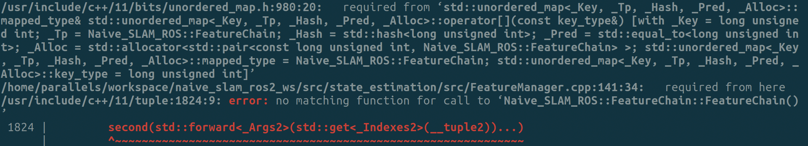
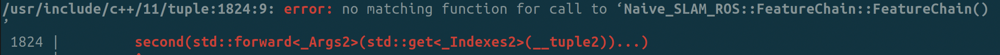

源码

```
class FeatureChain{
public:
    FeatureChain(unsigned long chainId, int windowSize, int startId);
    FeatureChain(const FeatureChain& featureChain);
std::vector<int> vFeatures;
};

std::unordered_map<int, FeatureChain> mmChains;
// mmChains中插入一些值
FeatureChain FC1(1, 10, 2);
FeatureChain FC2(2, 10, 4);
mmChains.insert({1, FC1});
mmChains.insert({2, FC2});

//现在希望对mmChains中的FC1的vFeatures进行插入一些值
mmChains[1].vFeatures.emplace_back(3);
```

上面的代码再执行最后一行的时候，就会报上图的bug。

从这里直接提示了问题的原因：FeatureChain这个类没有默认构造函数，代码中默认构造函数被自定义的带参数的构造函数覆盖了，但是又没有提供自定义的默认构造函数。
但为什么没有默认构造函数就会报错呢？
从最上面的图中，看出错误出现的位置是操作符\[\]，所以问题出在mmChains\[1\]这里。看一下unordered_map的说明文档可知，值的类型必须是可以默认构造的，即包含默认构造函数，文档链接：https://en.cppreference.com/w/cpp/container/unordered_map/operator_at

修改建议：
1. 提供一个默认构造函数
2. 使用find方法，首先判断这个key是否存在，如果存在就进行后续操作：
	```
	if(mmChains.find(1) != mmChains.end()){
		mmChains.find(1)->vFeatures.emplace_back(3);
	}
	```

参考链接：https://stackoverflow.com/questions/60776989/parsing-compilation-error-no-matching-function-for-call-to-stdpair-pair 这个链接一步一步的说明应该如何定位问题。