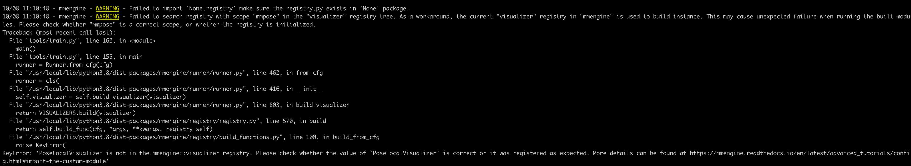

# 1\. KeyError: 'Cannot find None in registry under scope name mmengine'

```python
@MODELS.register_module()
class InterpConv(nn.Module):
    """Interpolation upsample module in decoder for UNet.

    This module uses interpolation to upsample feature map in the decoder
    of UNet. It consists of one interpolation upsample layer and one
    convolutional layer. It can be one interpolation upsample layer followed
    by one convolutional layer (conv_first=False) or one convolutional layer
    followed by one interpolation upsample layer (conv_first=True).

    Args:
        in_channels (int): Number of input channels.
        out_channels (int): Number of output channels.
        with_cp (bool): Use checkpoint or not. Using checkpoint will save some
            memory while slowing down the training speed. Default: False.
        norm_cfg (dict | None): Config dict for normalization layer.
            Default: dict(type='BN').
        act_cfg (dict | None): Config dict for activation layer in ConvModule.
            Default: dict(type='ReLU').
        conv_cfg (dict | None): Config dict for convolution layer.
            Default: None.
        conv_first (bool): Whether convolutional layer or interpolation
            upsample layer first. Default: False. It means interpolation
            upsample layer followed by one convolutional layer.
        kernel_size (int): Kernel size of the convolutional layer. Default: 1.
        stride (int): Stride of the convolutional layer. Default: 1.
        padding (int): Padding of the convolutional layer. Default: 1.
        upsample_cfg (dict): Interpolation config of the upsample layer.
            Default: dict(
                scale_factor=2, mode='bilinear', align_corners=False).
    """

    def __init__(self,
                 in_channels,
                 out_channels,
                 with_cp=False,
                 norm_cfg=dict(type='BN'),
                 act_cfg=dict(type='ReLU'),
                 *,
                 conv_cfg=None,
                 conv_first=False,
                 kernel_size=1,
                 stride=1,
                 padding=0,
                 upsample_cfg=dict(
                     scale_factor=2, mode='bilinear', align_corners=False)):
        super().__init__()

        self.with_cp = with_cp
        conv = ConvModule(
            in_channels,
            out_channels,
            kernel_size=kernel_size,
            stride=stride,
            padding=padding,
            conv_cfg=conv_cfg,
            norm_cfg=norm_cfg,
            act_cfg=act_cfg)
        upsample = Upsample(**upsample_cfg)
        if conv_first:
            self.interp_upsample = nn.Sequential(conv, upsample)
        else:
            self.interp_upsample = nn.Sequential(upsample, conv)

    def forward(self, x):
        """Forward function."""

        if self.with_cp and x.requires_grad:
            out = cp.checkpoint(self.interp_upsample, x)
        else:
            out = self.interp_upsample(x)
        return out


@MODELS.register_module()
class EfficientNetV2_UNet(BaseModule):
    '''
    Args:
        model_encoder_config (list): [[repeat_num, kernel_size, stride, mid_channels, in_channels, out_channels, block_type, se_cfg]]
            block_type:  0:FusedMBConvBlock, 1: MBConvBlock
    '''
    def __init__(self,
                 model_encoder_config: list,
                 model_decoder_config: list,
                 in_channels=3,
                 num_features=1280,
                 num_classes=1000,
                 norm_cfg=dict(type='BN'),
                 act_cfg=dict(type='ReLU'), 
                 conv_cfg=None,
                 drop_path_rate=0.,
                 with_cp=False,
                 upsample_cfg=dict(type='InterpConv'),
                #  upsample_cfg=dict(type=InterpConv),
                 init_cfg=[
                     dict(type='Kaiming', layer=['Conv2d']),
                     dict(
                         type='Constant',
                         val=1,
                         layer=['_BatchNorm', 'GroupNorm'])
                     ],
                 ):
```

**说明**：在运行test_model_size.py文件时，提示自定义模块InterpConv作为配置项时，无法使用。  
**解决方法**：  
InterpConv是在mmpose中定义的，其对应的scope为mmpose。Bug中提示mmengine中没有None模块，所以需要把scope切换到mmpose。切换方式如下：在test_model_size.py文件中添加

```python
from mmengine.registry import init_default_scope
init_default_scope('mmpose')
```

# 2. KeyError
> KeyError: 'GazeProjectionSelfLoss is not in the mmpose::model registry. Please check whether the value of `GazeProjectionSelfLoss` is correct or it was registered as expected. More details can be found at https://mmengine.readthedocs.io/en/latest/advanced_tutorials/config.html#import-the-custom-module'

**原因**：GazeProjectionSelfLoss这个类没有在对应package的__init__.py中导入

# 3. 使用pip install -e . 安装mmpose后，使用pip list却无法显示mmpose，而且运行训练脚本出现下列问题：

**说明**：pip install -e . 会把包以”editable"模式安装，会创建一个指向源代码的链接，而不是将代码复制到 site-package目录中。但是使用pip list时，正常情况下仍然会显示出刚刚安装过的包。
**解决方法**：
把项目目录添加到PYTHONPATH环境变量中
~~~
export PYTHONPATH=$PYTHONPATH:/data_10T/hanfy/workspace/openmmlab/mmpose
~~~

**PYTHONPATH说明**：
PYTHONPATH 是一个环境变量，用于在 Python 中指定额外的搜索路径，以便 Python 解释器可以找到要导入的模块和包。在 Unix-like 系统（如 Linux 和 macOS）以及 Windows 系统上，都可以设置和使用 PYTHONPATH。
当你在 Python 程序中尝试导入一个模块或包时，Python 解释器会按照特定的顺序在多个目录中查找该模块或包。这些目录包括当前工作目录、Python 的标准库目录，以及 PYTHONPATH 环境变量指定的目录。
PYTHONPATH 的作用主要体现在以下几个方面：
1. 扩展 Python 的搜索路径：通过 PYTHONPATH，你可以指定额外的目录，让 Python 解释器在这些目录中查找模块和包。这对于那些没有安装在标准库目录或当前工作目录下的自定义模块和包特别有用。
2. 组织项目结构：在大型项目中，你可能希望将不同的模块和包组织在不同的目录中。通过设置 PYTHONPATH，你可以确保 Python 解释器能够找到这些模块和包，而无需将它们全部放在同一个目录中。
3. 简化开发过程：在开发过程中，你可能需要频繁地修改和测试你的代码。通过将项目目录添加到 PYTHONPATH 中，你可以简化开发过程，无需每次更改代码时都更改 Python 解释器的启动路径。
4. 跨平台开发：如果你在不同的操作系统上开发 Python 项目，并且希望在不同的环境中使用相同的项目结构，那么 PYTHONPATH 可以帮助你实现这一目标。只需在不同的操作系统上设置相同的 PYTHONPATH 值，Python 解释器就可以在不同的环境中找到相同的模块和包。

# 4. mmpose中使用CombinedDataset加载多个数据集时，提示数据的‘img_path’找不到
bug：
~~~
KeyError: Caught KeyError in DataLoader worker process 0.
Original Traceback (most recent call last):
  File "/data_10T/hanfy/workspace/openmmlab/mmpose/mmpose/datasets/transforms/loading.py", line 54, in transform
    results = super().transform(results)
  File "/usr/local/lib/python3.8/dist-packages/mmcv/transforms/loading.py", line 92, in transform
    filename = results['img_path']
KeyError: 'img_path'

During handling of the above exception, another exception occurred:

Traceback (most recent call last):
  File "/usr/local/lib/python3.8/dist-packages/torch/utils/data/_utils/worker.py", line 308, in _worker_loop
    data = fetcher.fetch(index)
  File "/usr/local/lib/python3.8/dist-packages/torch/utils/data/_utils/fetch.py", line 51, in fetch
    data = [self.dataset[idx] for idx in possibly_batched_index]
  File "/usr/local/lib/python3.8/dist-packages/torch/utils/data/_utils/fetch.py", line 51, in <listcomp>
    data = [self.dataset[idx] for idx in possibly_batched_index]
  File "/usr/local/lib/python3.8/dist-packages/mmengine/dataset/base_dataset.py", line 410, in __getitem__
    data = self.prepare_data(idx)
  File "/data_10T/hanfy/workspace/openmmlab/mmpose/mmpose/datasets/dataset_wrappers.py", line 122, in prepare_data
    return self.pipeline(data_info)
  File "/usr/local/lib/python3.8/dist-packages/mmengine/dataset/base_dataset.py", line 60, in __call__
    data = t(data)
  File "/usr/local/lib/python3.8/dist-packages/mmcv/transforms/base.py", line 12, in __call__
    return self.transform(results)
  File "/data_10T/hanfy/workspace/openmmlab/mmpose/mmpose/datasets/transforms/loading.py", line 67, in transform
    f'`{str(e)}` occurs when loading `{results["img_path"]}`.'
KeyError: 'img_path'
~~~
## 3.1 原因
原因是由于每个dataset中都单独设置了全流程的pipeline参数，导致CombinedDataset取出来的数据已经是模型的输入数据了，而CombineDataset中也设置了全流程的pipeline参数。比如：
~~~ python
gaze_20230913 = dict(
        type=dataset_type,
        data_root=data_root,
        data_mode=data_mode,
        ann_file='gaze_20230913_train.json',
        # data_prefix=dict(img=''),
        metainfo=dict(from_file='configs/_base_/datasets/gaze.py'),
        pipeline=train_pipeline
        )

# data loaders
train_dataloader = dict(
    batch_size=128,
    num_workers=1,
    persistent_workers=True,
    sampler=dict(type='DefaultSampler', shuffle=True),
    dataset=dict(
        type='CombinedDataset',
        metainfo=dict(from_file='configs/_base_/datasets/gaze.py'),
        datasets=[
            gaze_20231013,
            gaze_20230920_m116, gaze_20230919_m116,
            gaze_20230913
        ],
        pipeline=train_pipeline,
        test_mode=False,
    )
)
~~~

## 3.2 解决方法
使用CombineDataset时，每个独立的数据集就不需要设置全流程的pipeline，只需要设置数据转换的操作。全流程的pipeline在CombinedDataset中进行配置。对于上面例子中的改正方法是把 ‘’‘pipeline=train_pipeline’‘’删掉。
