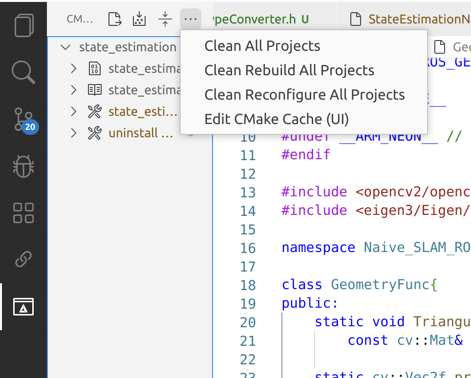

# VSCode中的使用问题
## 1. 无法解析Eigen::Vector3d解决方法：

在用到Eigen::Vector3d的头文件中，添加下列代码

```
#if __INTELLISENSE__
#undef __ARM_NEON
#undef __ARM_NEON__ // 与上一行一样，但是不能删除
#endif
```

然后清除cmake的配置，重新构建，如下：  


解释链接：https://github.com/microsoft/vscode-cpptools/issues/7413#issuecomment-827172897.   

## 2. VSCode使用vim插件，normal模式下，中文输入会直接上屏
版本：VSCode：1.101.2
vim插件版本：1.30.1
### 解决方法
参考vscode的github issue：https://github.com/VSCodeVim/Vim/issues/9678
这个问题是vscode版本问题，引入实验功能导致。通过下面配置可以解决
```
"editor.experimentalEditContextEnabled": false
```
另一种解决方式为把VSCode版本降级