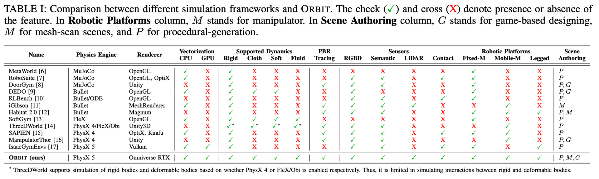
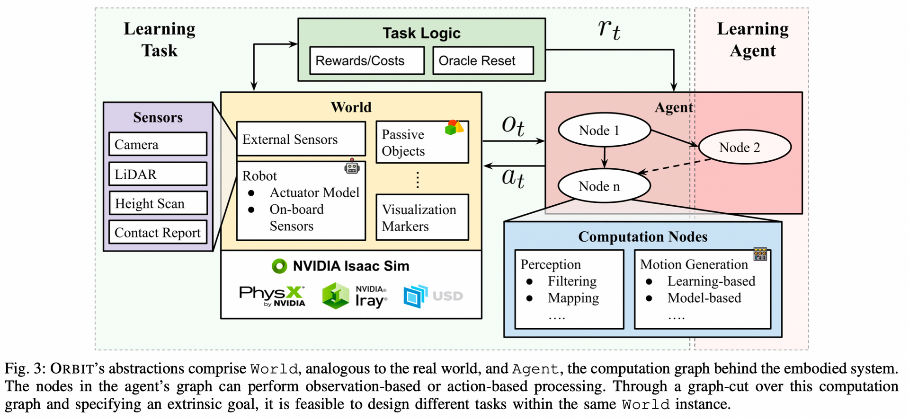

**ORBIT: A Unified Simulation Framework for Interactive Robot Learning Environments**

# 1\. 优势

1.  模块化设计
2.  可以简单且高效创建机器人环境
3.  照片级别的逼真场景
4.  快速且精确的rigid body和deformable body的仿真
5.  提供了不同难度的任务：从single-stage任务如简单柜子的开闭门、叠衣服到multi-stage的任务如房间整理。
6.  提供固定机械臂和移动机械手、基于物理的sensors和运动生成器
7.  利用GPU的并行化，在几分钟内训练训练强化学习策略，并从手工制作或者专家解决方案中收集大型演示数据集
8.  总结起来：开源，包含16个机器人平台、4中传感器模式、10中运动生成器、20多个基准任务和对4个学习库的封装。
9.  目标是支持表示学习、强化学习、模仿学习、任务和运动规划

# 2\. 对比

  
理想机器人仿真框架：快速和精准的物理特性、高保真的传感器仿真、多样化的资产处理、易用的界面用来集成新任务和环境

| 名称  | 特点  | 缺点  |
| --- | --- | --- |
| Habitat | 主要为了vision任务、提供了比较好的渲染 | 但是在低级交互（如抓取）的复杂性上做了简化 |
| ManipulaTHOR | 同上  | 同上  |
| IsaacGym | 机器人物理仿真，提供快速和相当准确的刚体接触动力学 | 不包含基于物理的渲染、可变形物体、ROS的支持 |
| Sapien | 同上  | 同上  |
| Orbit | 开源、直观的环境设计、具有图片级保真场景的学习任务、SOTA的物理模拟器   模块化设计，支持清华学习、模仿学习、运动规划 |     |

Orbit继承了NVIDIA Omniverse和Isaac Sim平台的很多实用工具：高质量渲染、多种格式资产导入、ROS支持、域随机化(DR)工具。

# 3\. Orbit接口设计

  
在上层接口中，Orbit框架由**world** 和 **agent**组成，类似于真实世界和在机器人上运行的软件。**agent**从**world**中接收原始观测，然后计算出指令应用到embodiment(robot)上。  
通常在学习中，它假设感知和运动生成都以相同频率产生。但是在真实世界中：1）不同的传感器有不同频率；2）控制架构不同，actions的应用时间尺度不同；3）真实世界中有各种无法建模的延迟和噪声。Orbit在设计上支持（1）和（2），对于（3），实现了不同的actuator和噪声模型。

## 3.1 World

类似于真实世界，在world中定义robots，sensors，objects（可以是静态的，也可以是动态的），处于同一个stage。  
**world**可以通过scanned meshes、Isaac Sim 或者两者的结合进行设计。

### 3.1.1 robots

robots由铰接系统、传感器、低级控制器组成。通过USD文件进行加载，在同一个USD文件中可以添加板载传感器，也可以通过配置文件添加。  
低级控制器通过配置的actuator模型处理输入的actions，并把期望的关节位置、速度、扭转力命令应用到仿真器。

### 3.1.2 sensor

传感器可以存在于关节上，或者外部（作为第三视角）。  
为了对传感器和actuation进行异步仿真，每个传感器都有一个内部计时器。

### 3.1.3 object

object是world中的被动实体。  
object的主要特性包括：视觉、碰撞网格、纹理、物理材料。

## 3.2 Agent

Agent是指指导具身系统的做决定的进程。  
Agent由不同的nodes组成，nodes形成了一个计算图，可以交换之间的信息。  
nodes有两种类型：

1.  perception-based：把输入处理成其他类型的表示（比如RGB-D image转成point-cloud/TSDF）
2.  action-based：把输入处理成动作指令（比如任务层的指令转成关节指令）

目前，节点之间的信息流是同步的，通过python。避免了服务-客户端协议之间数据交换的开销。

## 3.3 Learning task and agent

RL等一些范例需要指定具体的任务、world和agent中的一些节点。  
**task logic**帮助指定代理的目标、计算指标以评估代理的性能，并管理情节重置。把其作为单独模块，就可以方便地把相同的World应用到不同的task上。

# 4\. 特征支持

| 类型  | 数量  | 说明  |
| --- | --- | --- |
| Robots | 4种移动平台（一个全向底盘、3个四足机器人）   7种机械臂（2个6 DOF，5个7 DOF）   6中终端执行器（4个平行抓手、2个机器人手） | 可以自由组合 |
| I/O devices | Keyboard, Gamepad(xbod controller), Spacemouse from 3D connexion |     |
| Motion Generators | IK(inverse Kinematics)，operational-space control， and joint-level control | 通过把输入动作当做参考追踪信号，来把高级动作转换成低级指令，有助于机器人动作策略模拟到真实的转换 |
| Rigid-body Environments |     | accurate contact physics, fast collision checking, and articulate joints simulation |
| Deformable-body Environments |     |     |

