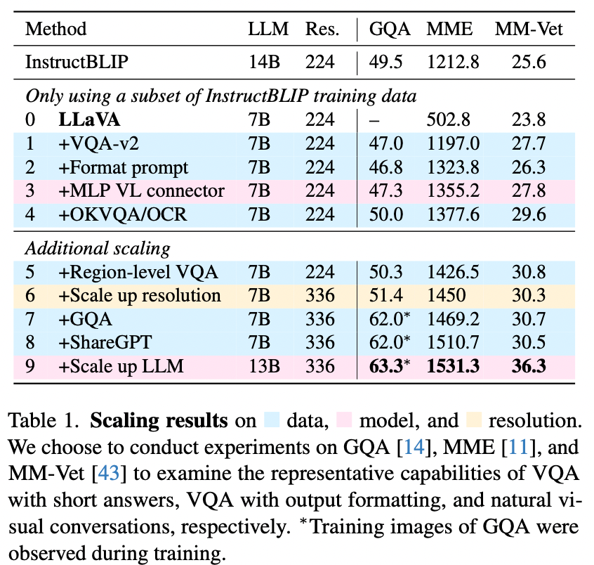
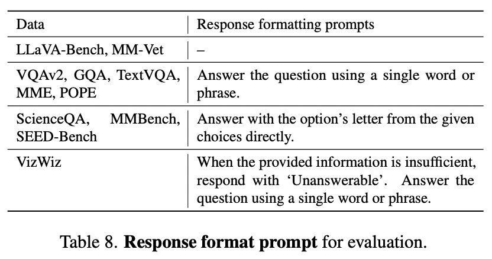
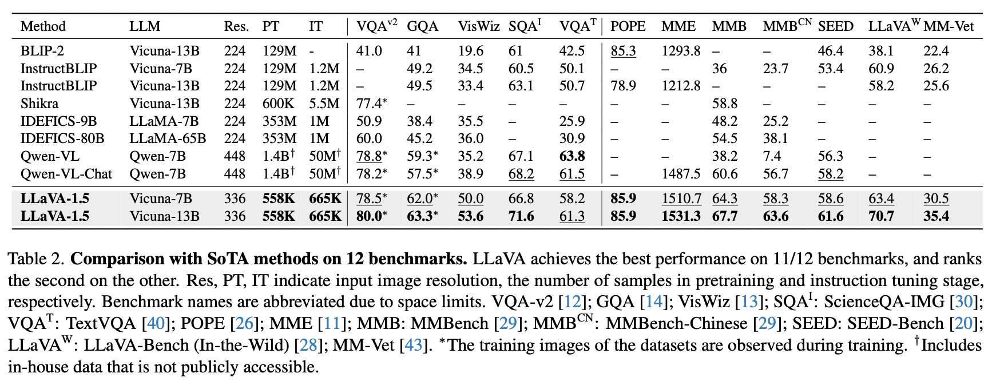

# 1、Motivation

LLaVA的改进版，增大了图像分辨率到336、使用MLP projection替换Linear Projection、增加面向学术的VQA数据、增加简单的响应格式的提示。  
在11个Benchmark上取得SOTA，13B的模型只使用1.2M的公开数据，在8-A100上总共只需要训练26个小时。

# 2、方法对比

| 模型  | more pretrain data | more instruction-following data | stronger visual encoder | more powerful langauge model |
| --- | --- | --- | --- | --- |
| LLaVA-1.5 | N   | Y   | Y   | N   |
| InstructBLIP | Y   | Y   | N   | N   |
| Qwen-VL | Y   | N   | Y   | N   |
| Mimic-it | N   | Y   | N   | N   |
| Llavar | N   | Y   | N   | N   |
| Svit | N   | Y   | N   | N   |

# 3、LLaVA存在的问题

LLaVA在需要简短的答案的任务上表现不好。原因是没有在大规模数据上进行预训练，而其他方法都做过预训练。

# 4、优化方法

增加训练数据、增大模型、增大输入图像分辨率

## 4.1 响应格式提示：Response formatting prompts

其他方法在平衡short- and long-form VQA场景时，效果不好，比如InstructBLIP。主要原因：

1.  响应格式的提示是模棱两可的，不明确。比如：Q:{question} A:{answer}。这种格式不能明确指出期望的输出格式，可能会让LLM的行为匹配到short-form答案上。
2.  没有finetune LLM模型。InstructBLIP只为instruction-tuning任务对Qformer进行了finetune，要求Qformer的视觉输出token来控制LLM输出的长度。但是由于Qformer有限的容量，导致其没有能力做这件事。  
    **解决方法**：使用单独的响应格式的提示来明确指出期望的输出形式，使用这种方式finetune LLM模型：在VQA的问题之后，添加：“Answer the question using a single word or phrase”  
    增加数据集之后的结果：  
    

## 4.2 MLP vision-language connector

**使用两层MLP替换linear projection。**

## 4.3 Academic task oriented data

**增加VQA, OCR, region-level感知等面向学术的数据集，提升模型能力**

## 其他方面：

1.  增大输入图像分辨率
2.  加入GQA数据
3.  融合ShareGPT数据
4.  把LLM模型从7B扩大到13B。

# 5、总结

LLaVA-1.5使用最简单的结构、学术计算和公共数据集（相对更少的预训练和instructin tuning 数据），得到了完全可复现和成本可接受的模型，可以作为后续研究的baseline。

1.  最终结果说明**visual instruction tuning的作用比预训练更重要**，而且对于传统观点“当vision encoder已经在大规模image-text数据集上训好的基础上，LMM仍然需要大量的视觉语言对齐预训练”提出了质疑。
2.  零样本格式指令泛化，可以泛化到不同的指令格式上。  
    
3.  零样本的多语言能力
4.  训练成本：需要26小时训练，大概是LLaVA的2倍时间：6个小时做预训练，20个小时做视觉指令调优。计算资源：$8 \times A100s$
5.  限制：
    1.  LLaVA使用full image patches，潜在的增加了训练时间。可以考虑更加高效的visual resampler方法。
    2.  不能处理多图任务，缺少相应的instructin-following 数据
    3.  其能力还是不能泛化到所有任务。
    4.  仍然会产生错误信息，所在在医学等领域的使用需要谨慎。

