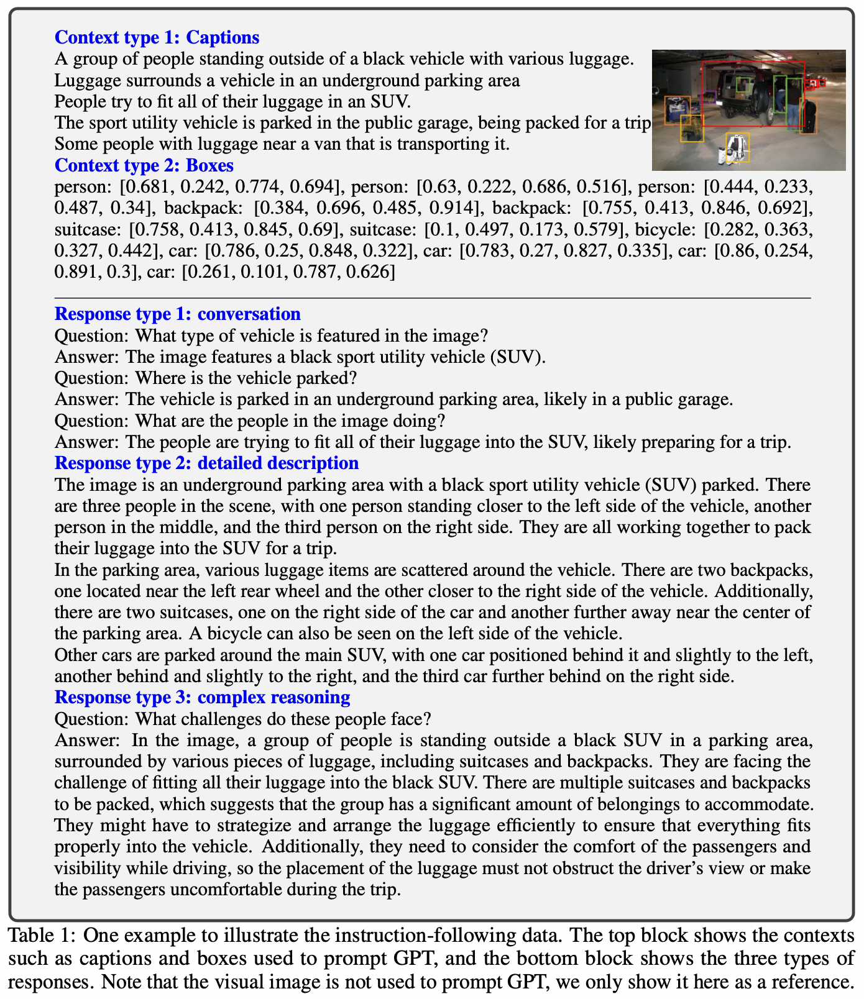
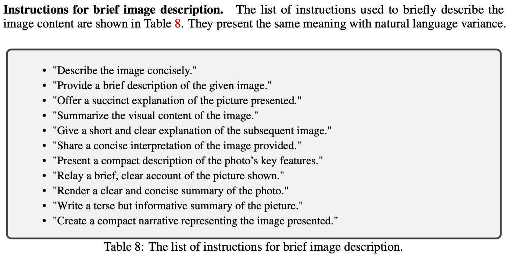
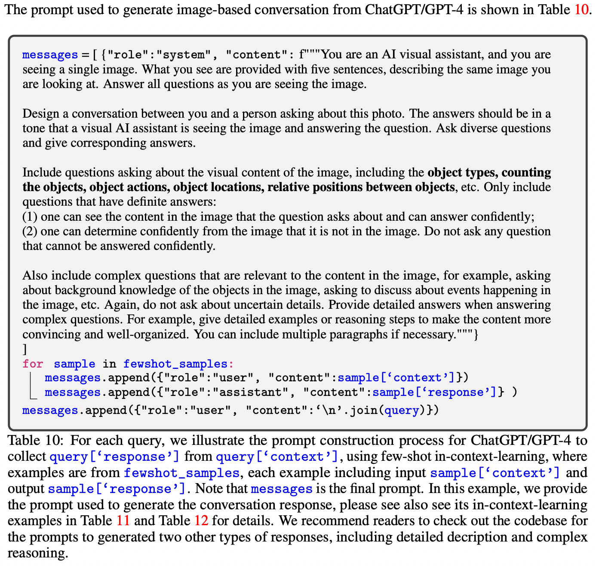
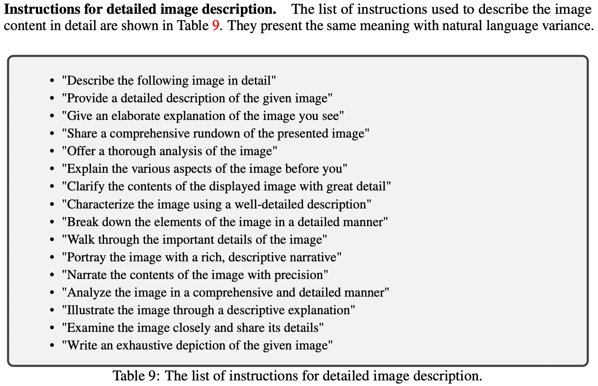
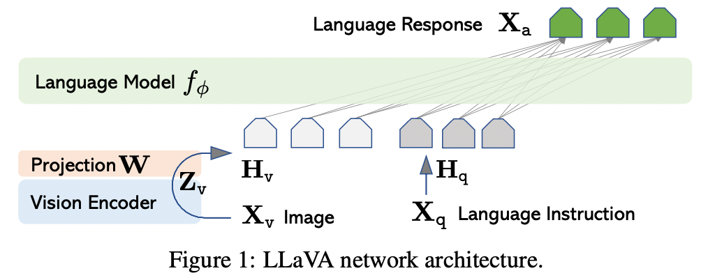
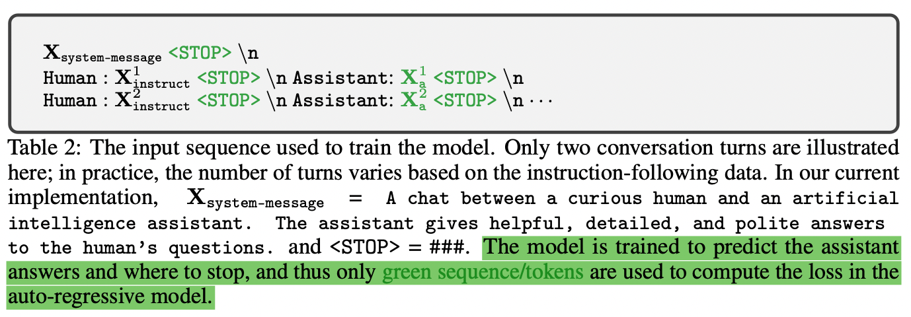
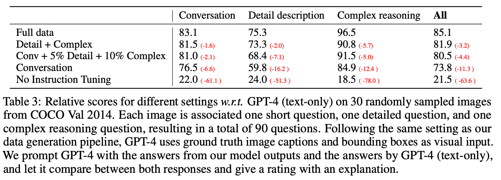
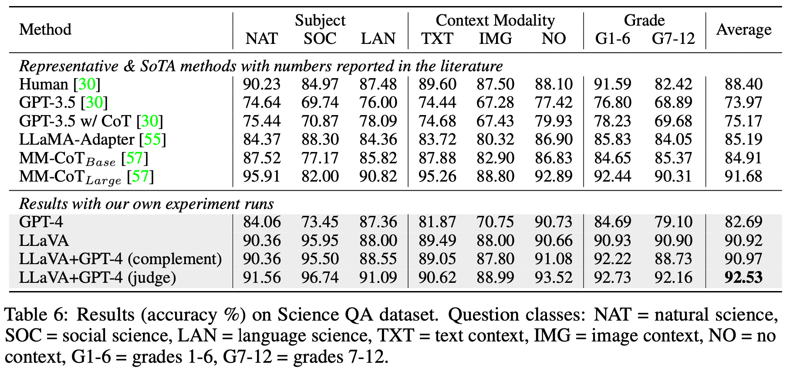
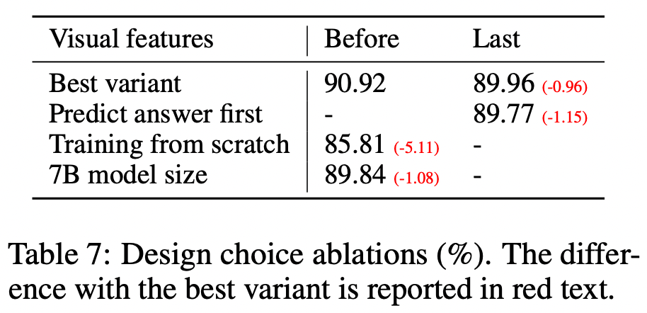

# 1\. 动机

使用机器生成的指令遵循数据来对大语言模型进行指令调优已经能够在新任务上提升zero-shot的能力，但是这个想法在多模态领域很少探索。  
人类对人工智能的一个主要期望是开发一个能够有效遵循多模态的视觉语言指令的通用助手，对齐人类的意图来完成现实世界中各种各样的真实任务。为此，社区见证了对开发语言增强（language-augmented）基础视觉模型的浓厚兴趣，这种模型具有很强的对于开放世界视觉理解能力：比如分类、检测、分割和字幕，以及视觉生成和编辑。在这些工作中，每个任务都是由一个单独的大视觉模型独立解决，任务指令是在模型设计时被隐式考虑的。同时，语言只用来描述图像内容。虽然这允许语言在把视觉信号映射到语言语义（人类沟通的常见渠道）时发挥重要作用，但是它导致模型通常具有固定的界面，限制了交互性，和对用户指令的适应性。

# 2\. 贡献

1.  首次尝试使用语言GPT-4来生成多模态语言图像的指令遵循数据
2.  引入LLaVA（Large Language and Vision Assistant）：一个端到端训练的多模态模型，来连接视觉编码器和LLM，用于通用目的的视觉和语言理解。
3.  实验中LLaVA展示出了出色的多模态对话能力，在合成的多模态指令遵循数据集上，与GPT-4相比，达到了85.1%的相对分数。当在科学问答上进行调优后，LLaVA和GPT-4可以协同增效，达到了92.53%的SOTA精度。
4.  开源了GPT-4生成的视觉指令调优数据、生成数据的方式、模型和代码

# 3\. 数据生成



简单的把图像-文本对扩展到指令遵循版本的方法：  
$image：X_v$  
$caption: X_c$  
$questions: X_q$：questions的目的是指导助手来描述图片内容

```
Human: X_q X_v<STOP>
Assistant: X_c<STOP>
```

上面的构建方式很容易，但是这种简单的展开方式在指令和应答方面缺少了多样性和深度推理  
为了弥补上面的问题，**本文的方式为：**

1.  编码视觉特征：  
	**Table 1中caption是怎么获取的？**
	**LLaVA使用的数据是从COCO上筛选出来的，COCO数据对每张图片都有5条captions**
    利用language-only GPT-4或CharGPT作为teacher，来创建包含视觉内容的指令遵循数据。  
    具体地，使用两种类型的符号表示方法来把一张图片编码到其视觉特征来，来提示text-only GPT：
    1.1   **文本说明(caption)**：从多种角度描述视觉场景，关于图片简洁描述的问题列表：
        
    1.2 **包围框（bounding box）**：在场景中定位出对象，每个框对对象的概念和空间位置进行编码。  
        这种表示方式允许我们把图像编码为LLM可识别的序列。
2.  创建指令遵循数据：  
    使用COCO图像然后生成三种类型的指令遵循数据：**Conversation、Detailed description、Complex reasoning**  
    对于每种类型，首先人工设计一些示例，这些示例是在数据收集时唯一需要人工标注的，在上下文学习中用作种子示例来查询GPT-4。
    - **Conversation**：设计一个助手和人关于这张图片的对话，回答的口吻是助手正在看着这张图片来回答问题。只有有明确答案的问题才会被考虑。  
        
    - **Detailed description**：关于图片详细描述的提问方式示例，随机从下图中选择一个对GPT-4进行提问  
        
    - **Complex reasoning**：上面两种聚焦于视觉内容本身，基于此创建深度推理的问题。

总共收集了158K的唯一的语言-图像指令遵循数据，包括58K conversation、23K detailed description、77K complex reasoning。  
**早期的实验中消除了ChatGPT和GPT-4的使用，并且发现GPT-4可以持续提供更高质量的指令遵循数据，比如空间推理。** 什么意思？说明GPT-4比ChatGPT更有效吗？

# 4\. Visual Instruction Tuning

## 4.1 结构



首要目标是有效地利用预训练LLM和visual 模型的能力。使用LLaMA作为LLM，表示为$\phi$。视觉编码模型为预训练的CLIP ViT-L/14，视觉特征表示为$Z_v = g(X_v)$。实验中使用最后一个Transformer层的前后两个grid features。  
使用简单的线性层把图像特征连接到word embedding space。应用一个可学习的投影矩阵$W$把$Z_v$转换成language embedding tokens $H_q$（这个地方论文中是否写错了，应该为$H_v$吧），与word embedding space 的维度相同：

$$
H_v = W * Z_v, \  with Z_v = g(X_v)
$$

这种投影方案可以允许我们以数据为中心快速迭代实验。

## 4.2 训练

每张图片$X_v$，会生成多轮对话数据$(X_q^1, X_a^1, ..., X_q^T, X_a^T)$, 其中 T 是总的轮数。把他们整理成一个sequence：把所有answers作为助理的回答，则第t轮的指令$X_{instruct}^T$表示为：

$$
X_{instruct}^t = \begin{cases}
Random \ choose [X_q^1, X_v] or [X_v, X_1^1], \quad the\ first\ turn t = 1 \\
X_q^t, \quad 剩下轮数 t > 1
\end{cases} \tag{2}
$$

这样就把多模态指令遵循序列的格式统一了，如下图：  


使用自回归训练目标在预测tokens上对LLM进行指令调优。  
具体地，对于长度为L的序列，通过下列公式计算生成目标答案$X_a$的概率：

$$
p(X_a | X_v, X_{instruct}) = \prod_{i=1}^L {p_{\theta}(x_i | X_v, X_{instruct, <i}, X_{a, <i})}, \tag{3}
$$

其中，$\theta$是可训练参数，$X_{instruct, <i}, X_{a, <i}$是当前预测token $x_i$之前的所有指令和答案token。  
公式（3）中的$X_v$是为了强调图像是所有答案的基础。并且为了方便阅读，省略了$X_{system-message}, 前置<STOP>$，它们实际是存在于条件中的。

### 4.2.1 使用两阶段指令调优来训练LLaVA模型

### Stage1：特征对齐的预训练

为了训练收敛和效率，把CC3M过滤到595K个图片-文本对。把这些数据转换到指令遵循数据，每个样本当做单独一轮对话。在构建$X_{instruct}$时，对于图片$X_v$，从Table 8中随机选择一个问题作为$X_q$, 使用原始caption作为$X_a$。  
在训练时，**冻结视觉编码器和LLM的权重，优化可训练参数$\theta=W（投影矩阵）$，来最大化公式（3）**。通过这种方式，把图像特征$H_v$和预训练的LLM word embedding进行对齐。

### Stage2：端到端fine-tune

只冻结视觉编码器的权重，优化投影层的权重和LLM的权重，即可训练参数为：$\theta = \{W, \phi\}$.

# 5\. 实验

## 5.1 多模态对话机器人

### 5.1.1 量化评估方法

利用GPT-4来评估模型生成回答的质量：  
随机从COCO验证集中选择30张图片，使用上面提出的数据生成策略生成三种类型的question。  
LLaVA基于question和输入图像来预测answers，GPT-4基于question、bbox gt和captions 来生成参考的预测，作为teacher model的上限。  
当从两个模型获得response后，把question、视觉信息（captions和bboxes）、两个模型生成的responses输入GPT-4。GPT-4评估助理回复的有用性、相关性、准确性和细节水平，并给出总体评分（1-10）。同时要求GPT-4提供对于评估的全面性解释，已帮助更好的理解模型。  
实验结果如下图：  


结论：

1.  使用指令调优，模型遵循用户指令的能力提升了50个点。（第一行 vs 第五行）
2.  增加少量的详细描述和复杂推理问题，就可以对模型的总体能力有很大的提升，7个点（第三行 vs 第四行）
3.  增加少量的详细描述和复杂推理问题同样在对话问题上有提升，说明推理能力的整体提升与对话能力是相辅相成的。（第三行 vs 第四行）
4.  使用所有三种数据的效果最好，达到GPT-4的85.1%。

## 5.2 科学问答

ScienceQA 包含21K个多模态多选题，具有丰富的域多样性，包含3个学科、26个主题、127个类别、379个技能。  
考虑两种有代表性的方法：

1.  带和不带思考链（chain-of-thoughts，CoT）的GPT-3.5、LLaMA-Adapter
2.  多模态思考链（MM-CoT），这个数据集上的SOTA

LLaVA在ScienceQA上的评测方法：使用倒数第二层视觉特征，要求模型先预测reasons，然后再预测答案，训练12个epochs。最后的精度是90.92%，与SOTA的91.68%很接近。  
为了探索LLMs的限制，使用2-shot in-context-learning提示GPT-4，得到82.69%的精度，比GPT-3.5的75.17%提升了7.53%。对于问题中的很大一部分，GPT-4失败的原因是缺少类似image或plot之类的上下文。  
考虑使用两种策略来结合LLaVA和GPT-4两者的结果：

1.  作为GPT-4的补充，当GPT-4无法提供答案时，使用LLaVA模型的预测。这种策略的精度是90.97%，与单独使用LLaVA的精度基本一样
2.  GPT-4作为judge。当GPT-4和LLaVA的答案不同时，基于问题和两者的结果作为提示，让GPT-4给出最终的答案。这样，GPT-4在所有问题类别上可以提供持续的提升，得到了92.53%的SOTA精度。如下图  
    

### 5.2.1 烧蚀实验



1.  **视觉特征**：CLIP编码器的最后一层特征不如倒数第二层特征。猜测是因为最后一层特征更关注全局图片特征（global image properties），倒数第二层更关注局部特性，对理解特定图像细节更有用
2.  **Chain-of-thoughts**：为了确定模型预测时answer和reasoning process的顺序，运行了两种变体，发现先answer时，在12个epochs达到最好的精度89.77%；而先reasoning，可以在6个epochs达到89.77%，但是训练更长时间不会再有提升。结论：CoT-like的reasoning-first策略可以大幅提升收敛，但是对最终的效果几乎没有提升。
3.  **Pre-training**：如果不用预训练，精度下降为85.81%，5.11%的绝对退化表明了我们的预训练阶段的重要性，在调整多模态特征的同时，保留了大量的预训练知识
4.  **模型尺寸**：使用与13B模型完全相同的配置训练7B模型。7B模型的精度为89.84%，相比13B模型90.92%下降了1.08%。说明模型尺寸很重要。

# 6\. 结论

说明了使用language-only GPT-4进行视觉指令调优的有效性。  
未来的工作：

1.  **Data Scale**：预训练数据限制为CC3M的一个子集，fine-tuning数据是COCO的一个子集。认为在更大数据上进行预训练和fine-tuning来增加概念的覆盖范围是值得的（例如entities和OCR)。把本文的数据生成流程应用在更大的语言-图像数据上，来产生更多指令遵循数据来fine-tune多模态对话助理很令人期待。
2.  **Connecting with more visual models**：实验结果在一些case上展示出了近似GPT-4效果。除了使用更大数据或模型，使用更强的视觉模型如SAM来产生GPT-4不具备的新能力更加有吸引力。