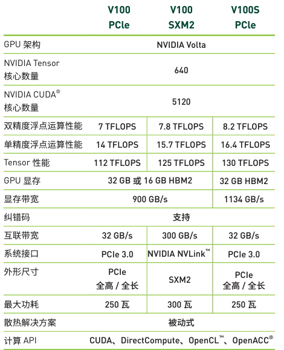
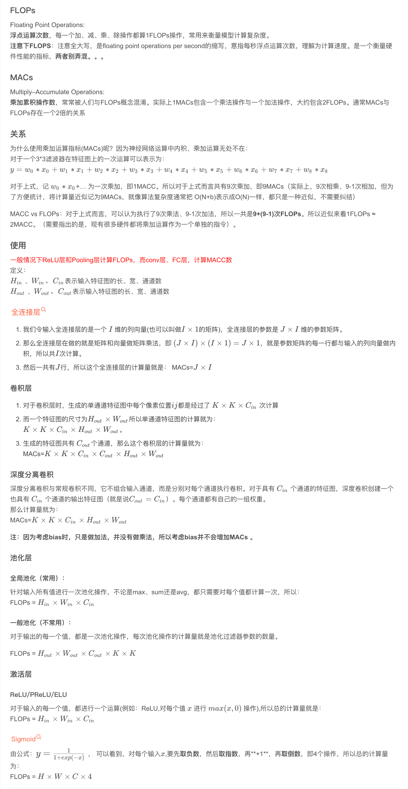

# 1\. 计算能力的不同指标FLOPS、TOPs、DMIPS

## 1.1 FLOPS

FLOPS ( Floating Point Operations Per Second): 表示计算设备每秒执行浮点运算的能力。如60GFLOPS：每秒可以执行$60 \times 10^9$次浮点运算。  
TFLOPS主要用于评价GPU和CPU这类通用计算单元的浮点运算能力，多应用于需要大量浮点计算的领域，尤其是在科学计算和传统深度学习模型的训练中，**专注于浮点运算的性能**

* * *

注：  
**MAC/FMA**的全称为Fused Multiply–accumulate operation, 也就是乘积累加指令，这种指令集融合了加法和乘法，使得处理器能够在一个指令中同时完成乘法和加法操作，从而提高了计算效率。

**SIMD**的全称叫做，单指令集多数据（Single Instruction Multiple Data）。最直观的理解就是，向量计算。比如一个加法指令周期只能算一组数（一维向量相加），使用SIMD的话，一个加法指令周期可以同时算多组数（n维向量相加），二者用时基本相等，极大地提高了运算效率。

* * *

### 1.1.1 CPU

单个CPU的算力与CPU核心个数、频率、单时钟周期浮点算力 3个因素有关

$$
单CPU算力=CPU核数 \times 单核主频 \times 单周期浮点计算能力
$$

以Intel Cascade Lake架构的Xeon Platinum 8280为例，该CPU有 28个核心、主频为2.7GHz，支持AVX512指令集，可以算出该CPU的双精度浮点运算能力（FP64）

1.  计算单个核心的单周期浮点计算能力：（除以64bit是因为双精度浮点数是64位；如果是单精度浮点数，则除以32bit）

$$
	单核心单周期算力=512bit \times 2FMA \times 2M/A / 64bit = 32 FLOPS/Cycle
$$

2.  计算单个CPU核心的峰值浮点计算能力：

$$
单CPU核心的峰值浮点算力=单周期浮点算力 \times 主频=32 FLOPS/Cycle \times 2.7 GHz = 86.4 GFLOPS
$$

3.  计算整个CPU的峰值浮点算力：

$$
单CPU算力= CPU核数 \times 单个CPU核心峰值浮点算力 = 28 cores * 86.4 GFLOPS=2.4192TFLOPS
$$

所以其理论峰值双精度浮点算力为2.4192TFLOPS。  
**注意**：此是理论值，实际性能可能受到多种因素（比如指令集并行性、内存访问延迟等）的影响。

### 1.1.2 GPU

GPU算力的计算方法与CPU类似。  
以NVIDIA Volta 架构的 V100为例，V100有2560个双精度浮点核心（FP64 cores），主频为1.53GHz  

$$
V100算力=2560 cores \times (64 bit * 1FMA * 2M/A / 64bit) \times 1.53GHz = 7833 GFLOPS = 7.833 TFLOPS
$$

**注意**：以上同样为理论算力

### 1.1.3 注意与FlOPs的区别

FLOPs：s为小写，指floating point operatioins的缩写（s代表复数），意思是浮点运算数，可以理解为计算量，用来**衡量算法/模型的复杂度**

## 1.2 TOPs

TOPs（Tera Operations Per Second）：表示计算设备每秒执行操作的能力，指每秒处理器可以执行的万亿次($10^12$)操作，可以是**整数、浮点数或其他类型的计算**。例如 16 TOPs表示每秒可以执行$16 \times 10^12$ 次操作。  
通常用于衡量硬件在人工智能、机器学习和特别是设计大量整数或定点运算的任务中的表现。通常用于NPU和其他一些定制AI芯片，这些硬件更多进行整数和定点运算，适用于对精度要求不如浮点运算高的场景。

### 1.2.1 计算方法

$$
TOPS=MAC矩阵行 \times MAC矩阵列 \times 主频 \times 2
$$

比如：特斯拉的FSD芯片，96x96 MAC，主频2GHz  
TOPS = 96 \* 96 \* 2000000000 \* 2 = 36.864 TOPS

### 1.2.2 与FLOPS的转换关系

与FLOPS没有直接的转换关系，但是在某些情况下可以用公式：

$$
1 TFLOPS = 2 TOPS
$$

进行近似计算，因为一次浮点运算大势至相当于两次整数运算。

## 1.3 DMIPS

DMIPS(Dhrystone MIPS)：测量处理器的**整数运算和逻辑运算**的性能。  
MIPS（Million Instructions Per Second）：每秒处理的百万级的机器语言指令数。  
DMIPS中的D是Dhrystone的缩写，表示在Dhrystone标准的测试方法下的MIPS。

Dhrystone标准的测试方法：单位时间内跑了多少次Dhrystone程序，指标单位：DMIPS/MHz。  
**注意**：因为历史原因我们把在VAX-11/780机器上的测试结果1757 Dhrystones/s定义为1 DMIPS，因此在其他平台测试到的每秒Dhrystones数应除以1757，才是真正的DMIPS数值，故DMIPS其实表示的是一个相对值。（所以说官方给出的DMIPS值是没有除以1757 的数值？）

### 1.3.1 计算方法

$$
CPU的DMIPS算力=内核的数量 \times 主频 \times DMIPS/MHz
$$

例如，六核A55架构，主频为1.6GHz，性能为2.7DMIPS/MHz，算力DMIPS = 6 \* 1660MHz \* 2.7DMIPS/MHz = 31374 DMIPS

### 1.3.1 与FLOPS的换算

DMIPS与FLOPS之间没有直接的转换关系，因为它们测量的是不同类型的运算性能。通常，假设1 DMIPS ≈ 1 FLOPS 或1 DMIPS ≈ 0.5 FLOPS是简化计算的常见方法，但实际情况依赖于具体CPU架构。

&nbsp;

# 2\. MACs和FLOPs

# 参考链接：

CPU、GPU算力计算：https://blog.csdn.net/weixin_44577224/article/details/136356075  
深入了解浮点运算——CPU 和 GPU 算力是如何计算的：https://www.cnblogs.com/upyun/p/17969963  
端侧大模型推理在NPU和CPU的对比：https://www.53ai.com/news/zhinengyingjian/2024080378491.html  
痞子衡嵌入式：微处理器CPU性能测试基准(Dhrystone)：https://www.cnblogs.com/henjay724/p/10856831.html  
算力单位TOPS和TFLOPS的区别：https://blog.csdn.net/WSonGG/article/details/140638095  
原文链接：https://blog.csdn.net/weixin_44577224/article/details/136356075