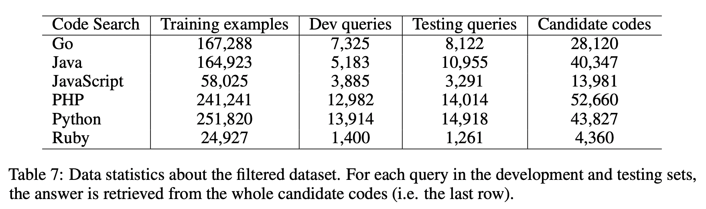

# 1\. 数据说明

1.  包含 2M（comment, code）对。来源：github。
2.  包含的语言：Go， Java， Javascript， PHP， Python， Ruby
3.  数据格式：
    
    ```
    {
      'id': '0',
      'repository_name': 'organisation/repository',
      'func_path_in_repository': 'src/path/to/file.py',
      'func_name': 'func',
      'whole_func_string': 'def func(args):\n"""Docstring"""\n [...]',
      'language': 'python', 
      'func_code_string': '[...]',
      'func_code_tokens': ['def', 'func', '(', 'args', ')', ...],
      'func_documentation_string': 'Docstring',
      'func_documentation_string_tokens': ['Docstring'],
      'split_name': 'train',
      'func_code_url': 'https://github.com/<org>/<repo>/blob/<hash>/src/path/to/file.py#L111-L150'
    }
    ```
    
    数据说明：  
    id: Arbitrary number  
    repository_name: name of the GitHub repository  
    func_path_in_repository: tl;dr: path to the file which holds the function in the repository  
    func_name: name of the function in the file  
    whole_func_string: Code + documentation of the function  
    language: Programming language in whoch the function is written  
    func_code_string: Function code  
    func_code_tokens: Tokens yielded by Treesitter  
    func_documentation_string: Function documentation  
    func_documentation_string_tokens: Tokens yielded by Treesitter  
    split_name: Name of the split to which the example belongs (one of train, test or valid)  
    func_code_url: URL to the function code on Github
4.  数据收集
    1.  non-fork，
    2.  至少被一个其他项目使用
    3.  根据stars和forks进行排序
    4.  剔除：没有license或者license没有明确允许分发的项目
    5.  使用Treesitter（github的通用解析器）对函数进行分词，函数对应的文档用启发式正则表达式进行分词
5.  语料库过滤
    1.  剔除没有文档说明的函数
    2.  代码文本对（$c_i$, $d_i$）:$c_i$ 表示代码，$d_i$ 表示对应的文档，用下列预处理流程进行处理
        1.  $d_i$ ：截断为第一个完整的段落，移除对函数参数和返回值的讨论说明
        2.  删除 $d_i$ 少于3个token的文本
        3.  删除$c_i$ 少于3行的代码
        4.  删除名字中包含“test”的函数
        5.  删除构造函数和带有标准扩展的方法（eg **str** in Python or toString in Java）
        6.  删除重复和近似重复的函数，每个函数只保留一个版本（how to deduplicate）
6.  分数设置：
    1.  0分表示完全不相关；
    2.  1分表示弱相关，但包含有用的信息用于再次检索；
    3.  2分表示强相关，可以作为代码实现的参考；
    4.  3分表示可以copy-paste稍微修改就直接用

# 2、评价指标：NDCG

NDCG的详细说明参考：https://blog.csdn.net/HOMEGREAT/article/details/100037630  
NDCG：Normalized Discounted cumulative gain，翻译为归一化折损累计增益，通常用来衡量和评价搜索结果的方法。  
DCG的两个思想：1. 高关联度的结果比一般关联度的结果更影响最终的指标得分；2. 高关联度的结果出现在更靠前的位置，指标得分会更高。

## 2.1 累计增益CG：cumulative gain

只考虑了相关性的关联程度，没有考虑到位置前后顺序的因素。所以是一个与搜索结果或者分类结果相关分数的总和，与排序无关。  
指定位置P上的CG为：其中$rel_i$代表i这个位置上的相关度

$$
CG_P = \sum_{i=1}^p{rel_i}
$$

例如：假设搜索”篮球“，最理想的结果顺序是：B1、B2、B3。如果出现的结果顺序是B3、B1、B2的话，CG的值是没有变化的。

## 2.2 折损累计增益（DCG）：discounted

在每一个CG的结果上除以一个折损值discount。目的是为了让排名越靠前的结果在最后得分上占的比重越大。排序越靠后，对最终结果的影响价值就越低。  
指定位置P上的DCG：

$$
DCG_P = \sum_{i=1}^p{\frac{rel_i}{log_2{(i+1)}}} = rel_1 + \sum_{i=2}^p{\frac{rel_i}{log_2{(i+1)}}}
$$

其中，第 i 个位置的价值为$\frac{1}{log_2(i+1)}$，第 i 个结果产生的收益就是$\frac{rel_i}{log_2{(i+1)}}$  
另外一种计算公式如下，它增加了相关度影响的比重：

$$
DCG_P = \sum_{i=1}^p{\frac{2^{rel_i}-1}{log_2(i+1)}}
$$

## 2.3 归一化折损累计增益（NDCG）

即normalized的DCG，由于搜索结果随着检索词的不同，返回的数量是不一致的，而DCG是一个累加的值，不能针对两个不同的搜索结果进行比较，因此需要归一化处理，这里除数是 IDCG。

$$
NDCG_P = \frac{DCG_p}{IDCG_p}
$$

其中，IDCG为理想情况下最大的DCG的值：

$$
IDCG_p = \sum_{i=1}^{|REL|}{\frac{2^{rel_i}-1}{log_2(i+1)}}
$$

其中，|REL| 表示：结果按照相关性从大到小排序，取前p个结果组成的集合，也就是按照最优的方式对结果进行排序。

# 3、GraphCodeBERT对CodeSearchNet的优化



1.  把候选数据库扩展到整个code corpus（原始为1000个candidates），更贴近实际场景
2.  使用Mean Reciprocal Rank(MRR) 作为评价指标
3.  使用人工设定的规则把低质量的querie剔除。原始数据的query中存在于code无关的内容，比如“http://...”等。被过滤的数据：
    1.  Examples whose code could not be parsed into abstract syntax tree.
    2.  Examples whose query tokens number is shorter than 3 or larger than 256.
    3.  Examples whose query contains special tokens such as “http://”
    4.  Examples whose query is empty or not written in English