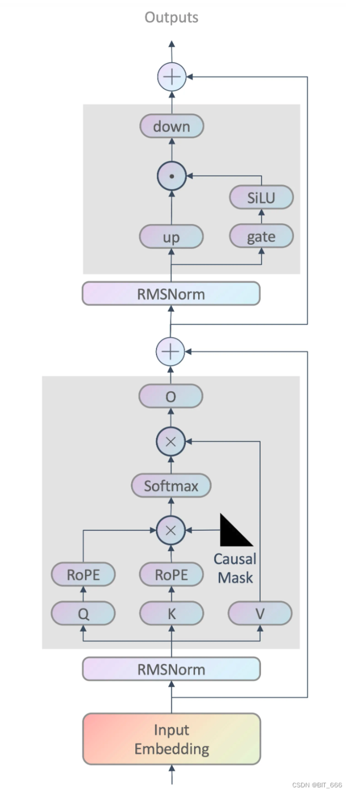

| 标题  | 链接  |
| --- | --- |
| LLM - Transformer && LLaMA2 结构分析与 LoRA 详解 | https://blog.csdn.net/BIT_666/article/details/132161203 |
| Transformer各层网络结构详解| https://www.cnblogs.com/mantch/p/11591937.html| 

llama2结构：  
