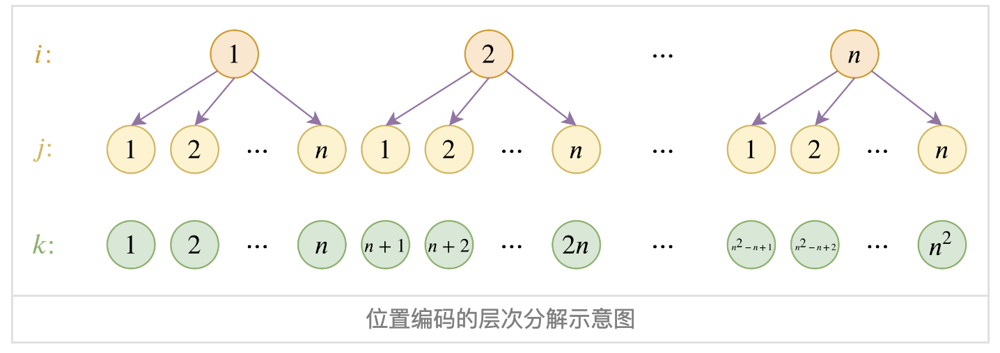
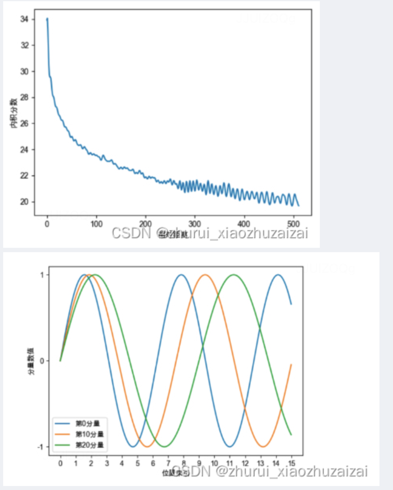

# 1\. 绝对位置编码

在输入的第k个向量xk中加入位置向量pk变为xk+pk，其中pk只依赖于位置编号k

## 1.1 可训练的绝对位置编码

将位置编码当做可训练的参数，比如序列的最大长度为512，编码维度为768，那么就初始化一个512 \* 768的矩阵作为位置向量，让它随着训练过程更新。  
缺点：没有外推性。即如果训练时的序列最大长度为512，那么推理时，最大只能处理512长度的句子，再长的句子就无法处理了。  
解决方法：

1.  把超过512的位置向量随机初始化，然后进行微调。
2.  通过层次分解，可以使绝对位置编码能外推到足够长的位置$0~n^2$，同时保持不错的效果。

### 1.1.1 层次分解：https://kexue.fm/archives/7947

假设训练好的位置编码为$p_1, p_2, ..., p_n$，希望在此基础上构造一套新的位置编码$q_1, q_2, ..., q_m$，其中 m > n, 为此，假设：

$$
q_{(i-1) * n + j} = \alpha u_i + (1 - \alpha) u_j \tag{1}
$$

其中，$\alpha \in (0, 1) ,\ \alpha \neq 0.5$, $u_1, u_2, ..., u_n$是新的位置编码的基底，即各个$u_i$之间是线性无关的。如下图。每一个$i$可以看做是一层。  
  
我们希望在位置不超过n时，与原来的位置编码是一样的，这样就能与已经训练好的模型兼容。那么，需要：$q_1 = p_1, q_2 = p_2, ..., q_n = p_n$, 这样可以反推出各个$u_i$:

$$
u_i = \frac{p_i - \alpha p_1}{1-\alpha}, \ i = 1, 2, ..., n
$$

从图中可以看出，新的位置编码最多可以表示$n^2$个位置：因为从公式（1）中可以看出，新的位置向量是任意两个$u$组合而来，最多有$n^2$个组合方式。  
假设训练时，序列长度为512，推理时，希望能外推到2048的序列长度，那么可知：$i = 1, 2, 3, 4$, 而 $j = 1, ..., 512$，在这种情况下使用时，建议$0 < \alpha < 0.5$。因为当$\alpha > 0.5$时，起主导作用的是$\alpha u_i$，而$u_i$只能取$u_1, u_2, u_3, u_4$，选择范围少，导致位置编码之间的差异变小，模型不容易把各个位置区分开来，会导致收敛变慢

## 1.2 三角式（Sinusoidal）

$$
p_{k, 2i} = sin(\frac{k}{10000^{\frac{2i}{d_{model}}}}) \\
p_{k, 2i+1} = cos(\frac{k}{10000^{\frac{2i}{d_{model}}}})
$$

Sinusoidal位置编码的每个分量都是正弦或余弦函数，所以每个分量的数值都具有周期性。如下图所示，每个分量都具有周期性，并且越靠后的分量，波长越长，频率越低。这是一个非常重要的性质，基于RoPE的大模型的长度外推工作，与该性质有着千丝万缕的关联，后续我们会进行分享。  
Sinusoidal位置编码还具有远程衰减的性质，具体表现为：对于两个相同词的位置向量，如果它们之间的距离越近，则他们的内积分数越高，反之则越低。如下图所示，我们随机初始化两个向量q和k，将q固定在位置0上，k的位置从0开始逐步变大，依次计算q和k之间的内积。我们发现随着q和k的相对距离的增加，它们之间的内积分数震荡衰减。  
  
因为Sinusoidal位置编码中的正弦余弦函数具备周期性，并且具备远程衰减的特性，所以理论上也具备一定长度外推的能力。

另外一个使用它的理由是：由于sin(α+β)=sinαcosβ+cosαsinβ以及cos(α+β)=cosαcosβ−sinαsinβ，这表明位置α+β的向量可以表示成位置α和位置β的向量组合，这提供了表达相对位置信息的可能性。