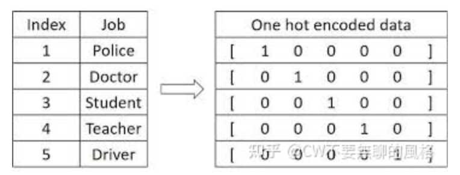
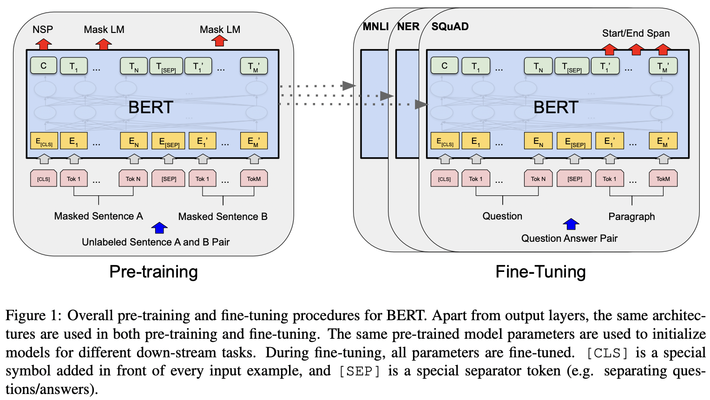
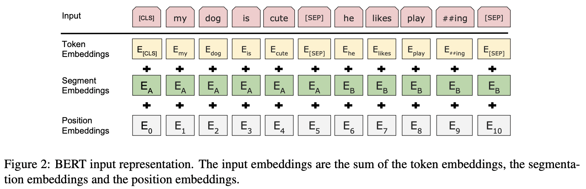

# BERT: Pre-training of Deep Bidirectional Transformers for Language Understanding

## 1\. BERT的motivation

BERT的目的是使用**无标签的文本**联合文本**左右的信息**来**预训练**一个双向表示。预训练的BERT模型加上一个输出层进行**fine-tune训练**，就可以在广泛的任务上得到SOTA的效果。
所以BERT是一个预训练模型，通过自监督的方式训练，可以使用更广泛的数据，得到一个广泛适用的表示。有了这个表示后，在具体的下游任务中，只需要进行简单的微调即可。

## 2\. 引言

在下游任务上应用预训练模型的方式有两种：1、feature-based；2、fine-tuning
**feature-based的方法**是把一个输入以及这个输入在预训练模型上得到的表示一同放入一个任务相关的模型中，来训练这个模型相关的任务。比如 ELMo
**fine-tuning方法**通过在预训练模型中引入最少得任务相关的参数，在下游任务fine-tune所有参数。比如GPT。
ELMo和GPT在预训练模型时，使用相同的目标函数，用单向语言模型训练通用的语言表示。而BERT使用的是双向的。
作者认为现在的技术限制了预训练模型的表示能力，尤其是对于fine-tuning的方法。而这个限制主要表现在标准的语言模型都是单向的，它限制了用于预训练时的架构的选择。
BERT通过掩码语言模型（MLM）的预训练目标缓解了单向模型带来的限制。掩码语言模型在输入的token中随机mask掉一些token，预训练的目标就是通过上下文信息预测被mask掉的word的原始词汇id。不同于从左到右的语言模型，MLM的目标使得这个representation可以融合左边和右边的上下文信息，这就允许我们训练一个很深的双向Transformer。
除了使用MLM目标，还使用了next sentence prediction来使用文本对的表示。

## 3\. BERT方法

BERT包括两部分：预训练和fine-tuning

### 3.1 BERT的模型结构

结构是多层双向的Transformer 编码器。
L：Transformer blocks的数量
H：hidden size，一个token向量的长度
A：自注意力头的数量
BERT-base的配置如下：
L= 12，H=768，A=12，参数量=110M
BERT-large配置：
L=12， H=1024， A=16，参数量=340M

### 3.2 自然语言中对单词的编码方式有两种：
参考链接：https://zhuanlan.zhihu.com/p/372279569
1.  **one-hot 编码**：把需要解析的单词组成一个词典（词汇表），把每一个单词表示成one-hot形式，一个单词对应一个one-hot向量，向量的长度是词典中单词的数量。这种编码很稀疏，很长，而且无法表示出word与word之间的关系。比如“love”和“like”的含义相近，但是one-hot编码距离可能很远。
    
2.  **word embedding**：把word的one-hot向量通过一个**参数可学习的矩阵**转换成一个embedding向量，就是把one-hot向量点乘这个矩阵。通过学习，可以使得“love”和“like”的embedding向量接近。pytorch中使用torch.nn.Embedding来实现。代码：

```python
class Embeddings(nn.Module):
    def __init__(self, d_model, vocab):
        super(Embeddings, self).__init__()

        self.lut = nn.Embedding(vocab, d_model)
        self.d_model = d_model

    def forward(self, x):
        return self.lut(x) * math.sqrt(self.d_model)
```

### 3.3 Transformer参数量的计算方式

1.  嵌入层：把字典中的word转换成embedding，参数量来自一个可学习的矩阵。输入的大小是词典的长度30k，输出的大小是embedding向量的长度H，那么$$嵌入层参数量为：30k * H$$
2.  Transformer块的参数量：包括self-attention部分和MLP部分
    1.  self-attention部分的参数量来自对Q、K、V分别的投影矩阵以及对于输出的投影矩阵，所以$$self-attention部分的参数量为：3* H * H + H * H = 4H^2$$
    2.  MLP部分是对self-attention的输出做两次投影，第一次把向量扩大4倍，第二次恢复原向量的长度，所以$$MLP的参数量为：H * 4H + 4H * H = 8H^2$$
        一共有L个Transformer块，所以$$Transformer部分的参数量为：12H^2 * L$$
        综上得出$$整个网络的参数量为：30k * H + 12H^2 * L$$

### 3.4 输入和输出的表示

为了使BERT能够处理不同的下游任务，输入的表示需要能够在一个token序列中明确的表示单独的句子或者句子对。这一个token序列可能是一个单独的句子，也可能是两个句子的组合。
每个序列的第一个token是\[CLS\] token，最后一个隐层的这个token用于分类任务。
一个序列表示一个句子对时，通过一个\[SEP\] token来分割，并且增加给每个token加上一个可学习的embedding，来表示这个token属于哪个句子。

BERT中输入表示如下图：


### 3.5 BERT的预训练

BERT使用两个无监督的任务进行预训练

#### Task 1：Masked LM

如果用标准的单向语言模型来训练双向表示，那么每个word将会间接的看到自己，模型会从多层的上下文信息中简单的预测目标word。
为了解决上面的问题，作者随机mask掉一定比例的输入token，然后预测这些被mask掉的token。被mask掉的token的最后的隐藏层向量会输入到一个相对整个词典的softmax，然后进行cross entropy loss的训练。
在一个序列中随机选择15%的token进行mask，最后只预测这些被mask掉的token。（denoising auto-encoders是预测整个输入）
<span style="color: red;">这样做存在一个问题：pre-training和fine-tuning两个过程的输入有差异，因为fine-tuning过程的输入是不需要mask的。</span>
解决方法：对每一个被选出来进行mask的token，有80%的概率被替换为\[MASK\]，10%的概率被替换为随机的token，10%的概率保持不变。

#### Task 2：Next Sentence Prediction (NSP)

在一些下游任务中如：Question Answering (QA)和Natural Language Inference (NLI)，需要理解两个句子的关系。
解决方法是：当在选择两个句子A和B时，50%的概率是句子B真的是句子A的下一个句子；50%的概率是随机的非下一个句子。在图1中，输出隐层中的C就是用来预测是否为下一个句子。

### 3.6 下游任务上Fine-tuning BERT

主要是根据实际需求构建输入，以及添加一个输出层。