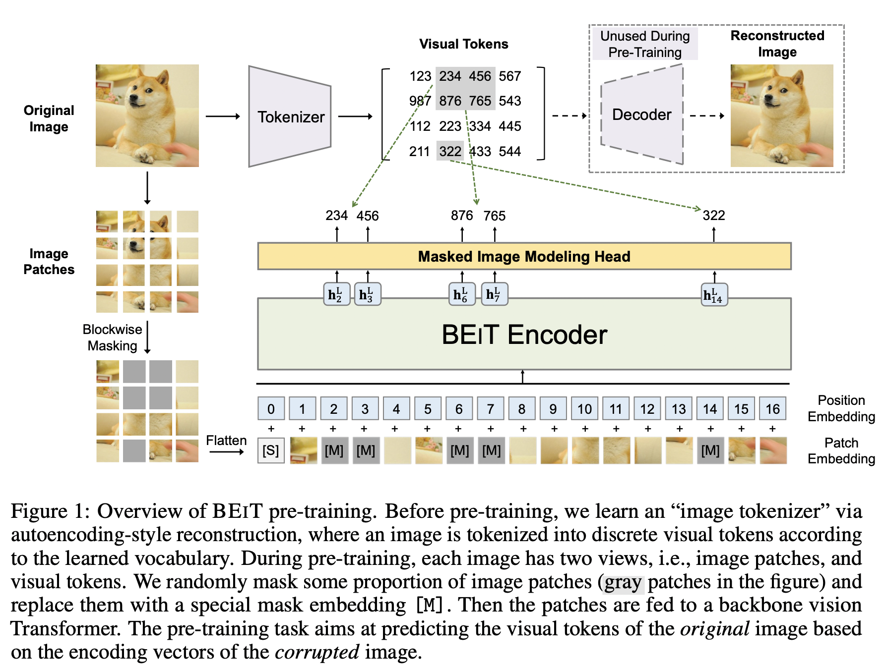

参考链接：https://zhuanlan.zhihu.com/p/381345343
https://spaces.ac.cn/archives/5253

BERT特性：

1.  双向
2.  transformer
3.  掩码mask
4.  无标签预训练+有标签微调

## transformer参数量的计算

参数来源分为两部分：嵌入层和transformer blocks
其中嵌入层就是把token映射成embedding（token是patch展成一维的形式）

1.  嵌入层部分参数计算：假设把patch转换成token后，一个token的维度为T，经过嵌入层后的输出embedding的维度为H，那么嵌入层的参数量为：T * H
2.  transformer blocks部分：
    1.  假设一共有M个attention head，那么一个embedding会被划分成 M个 H / M维的向量，每个向量经过投影得到长度一样的向量。一个embedding有Q K V三种表示，每个都会进行上面的投影，所以这个投影层中的参数量为：3 * H* H；
    2.  每一个块还需要进行一次输出的投影，参数量为：H* H
    3.  最后还需要一个MLP，里面有两个全连接层：第一个输入是H，输出是4H；第二个输入是4H，输出是H，那么一共有8 * H* H
    4.  所以一个transformer block有 $3* H* H + H * H + 8 * H * H=12H^2$，假设有L个block，那么参数量一共有$12H^2 * L$
3.  总的参数量为：$T * H + 12*H^2*L$

## 1\. BEIT中图像的表示方法

作者的想法是把BERT的方法用到图像中。BERT主要是通过掩码的方式，对输入序列随机mask掉一些token，然后让模型学习去预测这些被mask掉的token。
要模仿BERT的方法，首先要考虑图像的表示方法，本文中一张图像可以从两个角度来表示：image patch和visual tokens，其中image patch作为输入的表示形式，visual tokens作为输出的表示形式。

### 1.1 Image patch

把图像$x \in R^{H*W*C}$切分为$N = HW/P^2$个patches：$x^p \in R^{N*P^2C}$，patch的分辨率为P * P。然后对patch进行展平并做线性映射。
本文把224 * 224 的图像拆分成14 * 14个patches，每个patch大小为 16 * 16.

### 1.2 Visual token

NLP中是把一个句子表示成离散token组成的序列。所以本文也要把图片表示成离散token组成的序列，使用的方法是"image tokenizer"。具体是把图像$x \in R^{H*W*C}$ 通过**dVAE**的方法变成$z = [z1, . . . , z_N ] \in V^{h×w}$，其中V是词典$V = \{1, ..., |V|\}$包含离散token的索引。
本文把224 * 224 的图像变成 14 * 14 个tokens（与patches的数量一样），词典长度|V| = 8192。直接使用DALL-E中训练好的 image tokenizer。

## 2\. 网络结构

网络结构使用Vit。
网络的输入是image patches 序列$\{x_i^p\}_{i=1}^N$，然后patches通过线性映射得到patch embeddings $Ex_i^p，E \in R^{(P^2C)*D}$。然后对embeddings序列添加一个特殊token【S】。再加上可学习的1D位置embeddings $E_{pos} \in R^{N*D}$。所以，Transformer的输入向量为$H_0 = [e_{[S]}, Ex_i^p, ..., Ex_N^p] + E_{pos}$。编码器包含L个Transformer blocks，最后一层的输出为$H^L = [h_{[S]}^L, h_1^L, ..., h_N^L]$。

## 3\. BEIT预训练：Masked Image Modeling（MIM）

随机mask掉一定比例的patches，然后预测与mask掉的patches相对应的visual token。上图1是方法的总览图。随机mask掉接近40%的image patches，将其替换成可以学习的embeddings $e_{[M]} \in R^D$，输入Transformer的patches为：$x_M = \{x_i^p: i \notin M \}_{i=1}^N \cup \{e_{[M]}: i \in M \}_{i=1}^N$。最后的hidden vectors $\{h_i^L\}_{i=1}^N$作为输入patches的编码表示。对于每一个被mask掉的位置$\{h_i^L: i \in M\}_{i=1}^N$ 使用softmax分类器预测相应的visual tokens：$p_{MIM}(z' | x^M) = softmax_{z'}(W_c h_i^L + b_c)$。预训练的目标是最大化给定corrupted image得到正确visual tokens $z_i$ 的对数似然：
$$
max \sum_{x\in D}E_M[\sum_{i \in M}log p_{MIM}(z_i | x^M)]
$$
where D is the training corpus, M represents randomly masked positions, and xM is the corrupted image that is masked according to M.
对于具体的mask方法，论文中一次对一个图像块进行mask，一个block中最少包含16个patches，然后选择block的长宽比，重复选择block直到40%的patches被mask掉。
使用block的mask方式的好处：比起像素层面的mask方式，使得模型关注短距离的相关性和高频细节。