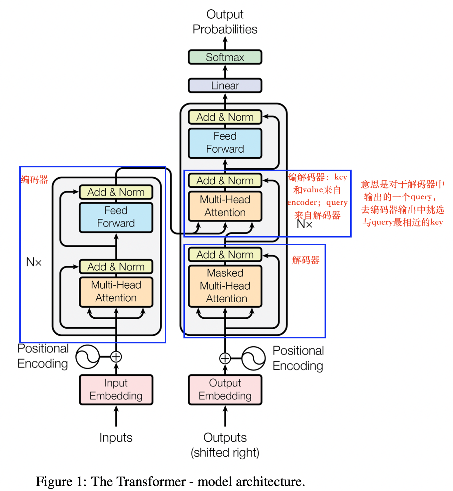
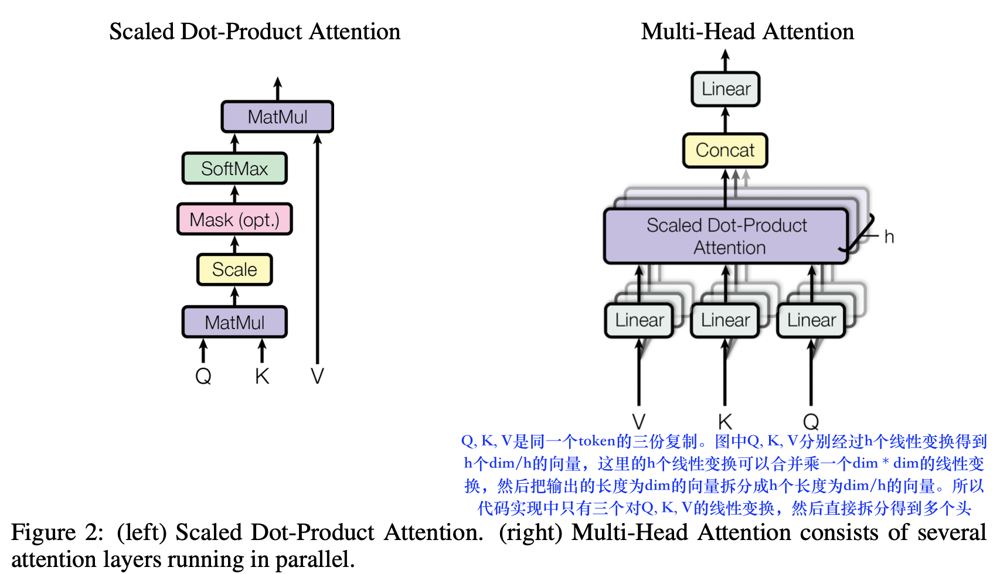

链接：https://luweikxy.github.io/machine-learning-notes/#/natural-language-processing/self-attention-and-transformer/attention-is-all-you-need/attention-is-all-you-need

# Transformer的motivation

1.  **RNN结构难以并行**：之前的工作基于RNN模型，RNN是时序模型，根据给定的序列从左到右计算，对于一个句子，则是一个词一个词的看，第t个词的隐藏状态是由第t-1个词的隐藏状态和当前单词决定，把前面学到的历史信息传递到当前隐藏状态$h_t$下，因为要使用前一时刻的状态，所以无法并行。
2.  **RNN信息丢失**：如果时序比较长，则早起的信息可能丢失掉。
3.  **CNN对较长的序列难以建模**，如果两个像素块距离较远，则需要很多层卷积才能把两个距离较远的像素联系起来。**Transformer的注意力机制可以一次看到所有的像素，一层就可以把所有序列看到**。
4.  CNN可以输出多个通道，每个通道对应一个不同的模式。所以Transformer使用了multi-head的结构来实现。

# Transformer的结构

1.  layer-norm :时序中每个样本长度可能发生变化，用BN时，如果长度变化较大，则均值和方差可能变化较大，在最后算全局均值和方差时，可能不具有代表性。而layer-norm是对每个样本计算均值和方差，所有对于长度不敏感。
    
2.  注意力函数是将一个query和一系列key-value对映射成一个输出的结构。output是value的一个加权和。value的权重是value的key和query的相似度算出。query和key的长度相等$d_k$，value的长度是$d_v$。query和所有key做内积计算相似度，除以$\sqrt{d_k}$，然后计算softmax后，作为权重，作用到value上得到输出。实际中是通过矩阵乘法计算：
    假设$Q=n*d_k,K=m*d_k,V=m*d_v$，由于每个query需要计算与所有key的权重，所以一个query的权重向量的长度为m，n个query得到的权重矩阵为$n*m$。每个query的权重向量对m个value进行加权得到这个query的输出。
    
    $$
    Attention(Q,K,V)=softmax(\frac{QK^T}{\sqrt{d_k}})V
    
    $$
    
    论文中说，attention操作有两种：一种是additive attention，另一种是dot-product。理论上加性attention和dot-product attention的复杂度一样，但是由于可以使用高度优化的矩阵相乘代码，所以实际点乘更快。这就是本文用dot-product的原因。
    对点乘的结果乘以$\frac{1}{\sqrt d_k}$的原因：对于dk比较小时，两个attention效果相似，但是当dk很大且没有进行缩放时，加法attention的效果好。我们猜测对于dk很大时，点乘的结果也很大，将softmax函数推向其梯度很小的区域，为了克服这个问题，对点乘的结果乘以缩放系数$\frac{1}{\sqrt d_k}$
    
3.  multi-head：模拟CNN中的多通道
    
    使用multi-head的原因：多头注意力可以让模型同时关注到不同位置上来自不同子空间的信息，如果有8个头，那么就有8个子空间
    
4.  Position-wise Feed-Forward Networks（语义信息的转换）
	实际就是MLP层。
    attention的作用是把序列中的感兴趣信息抓取出来，做一次汇聚，每个attention的输出中都包含序列的信息，所以Feed-forward network(FFN)只需要对每个输出做语义的转换就可以。
	
# 本文的Transformer有编码器和解码器
本文的Transformer有编码器和解码器，主要是因为其应用场景是机器翻译，对于机器翻译任务，需要对输入的句子进行编码，得到特征，然后再进行解码，得到另一个语言的输出。
而对于其他NLP任务，可能就不需要解码操作，所以后续有些论文就只有编码器，没有解码器，比如BERT。