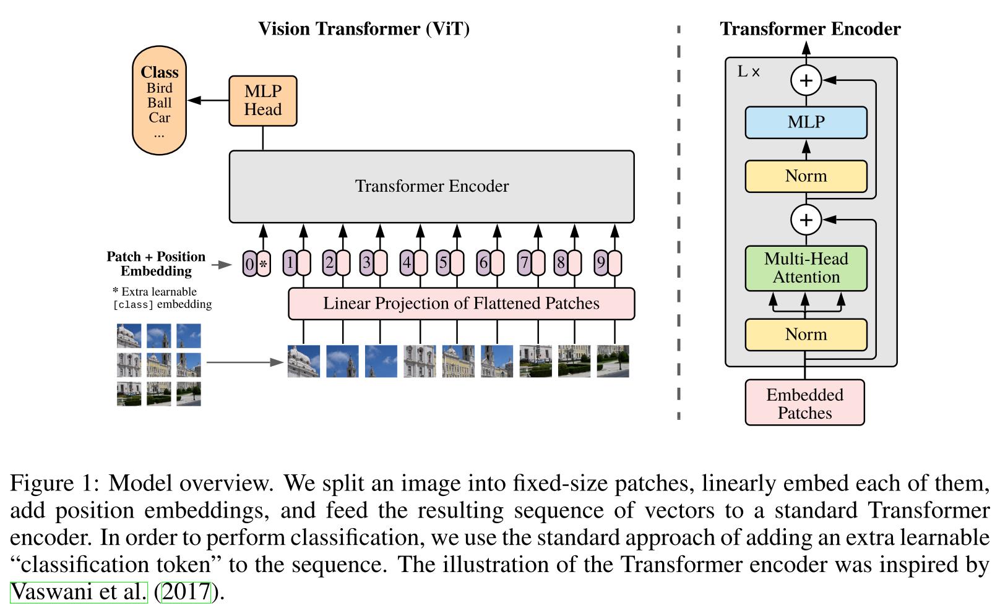

把Transformer原封不动的应用到视觉任务中
把图像切成一个个$16*16$ 大小的图像块，每个图像块看成一个单词，展开成一个token，然后通过fc层得到一个个的patch embeddings。自注意力就是patch embeddings之间两两做交互，不存在位置信息，所以人为给每个patch embedding加上位置编码。每个patch embedding都会返回一个输出，那么最后需要**用哪个去做最后的分类呢** 借鉴BERT，增加一个特殊字符*作为class embedding，其位置编码为0。因为所有的embedding都是相互交互的，所以认为这个embedding可以从其他的embedding中学到有用的信息，然后用class embedding的输出用来做分类。

## CNN网络的归纳偏置

1.  locality：CNN是以滑动窗口的形式一个个进行卷积，假设相邻区域具有相似特征。
2.  平移同变性：$f(g(x)) = g(f(x))$。可以把$f(x)$理解成卷积，$g(x)$是平移操作，无论先平移还是先卷积，得到的结果是一致的。（对于一个目标物体，无论是先对其进行卷积然后再移动这个物体的位置，还是先移动这个物体的位置然后再对物体进行卷积，最后输出的结果是一样的）

**而Transformer没有这两个先验的假设，所以需要更大的数据来学习这两个性质。**

## 模型结构
输入：224×224×3，patch size=16。所以得到$\frac{224*224}{16*16}=196$个patches，每个patch展开成一维，得到token的维度为16×16×3=768。对196个token做fc得到196个embedding。fc的大小为768 × 768，所以输出的embedding 的维度为196 × 768。还需要加上一个分类的embedding，得到197个768维的embedding。
然后给每个token添加位置编码，每个位置编码的长度也是768，直接加到embedding上，得到带位置编码的embedding。
**multi-head**： 一共有12个head，所以每个head对应的embedding的维度为768/12=64。每个head中的q、k、v的大小为197 × 64。最后把所有head的结果concat起来，在经过一个MLP得到197 × 768的输出。