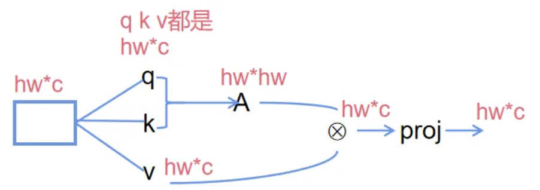
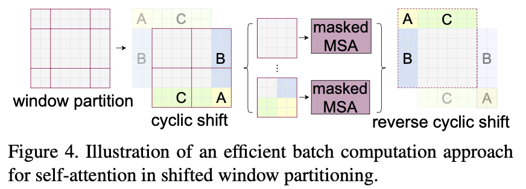
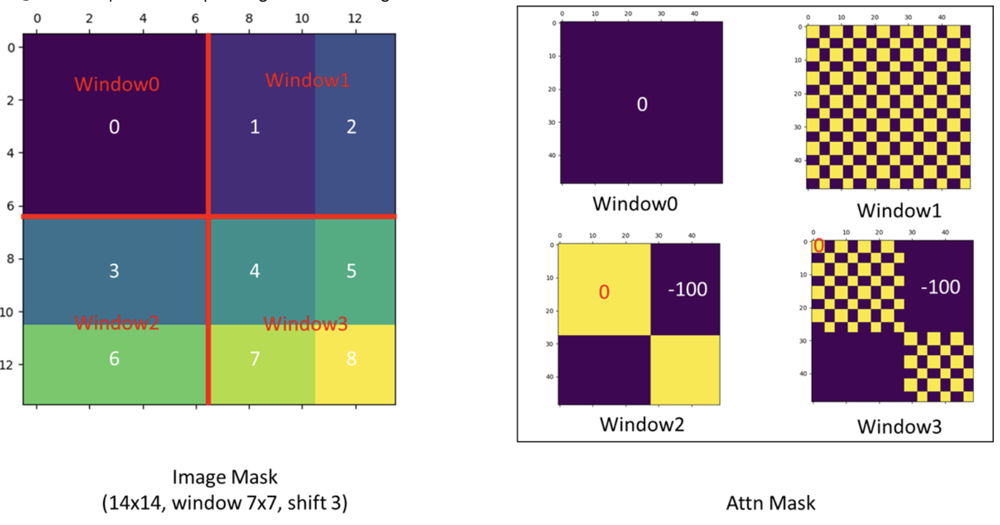
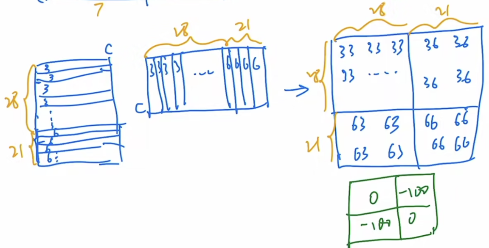
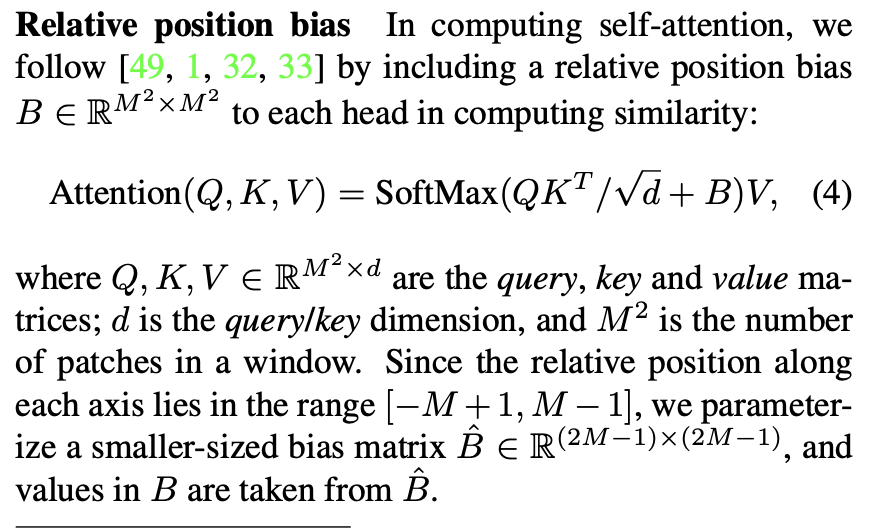
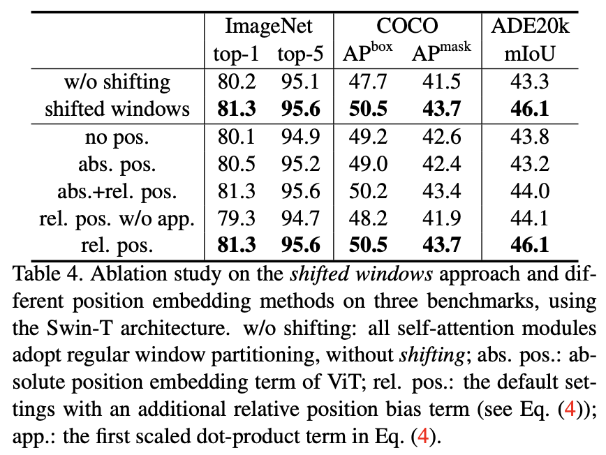
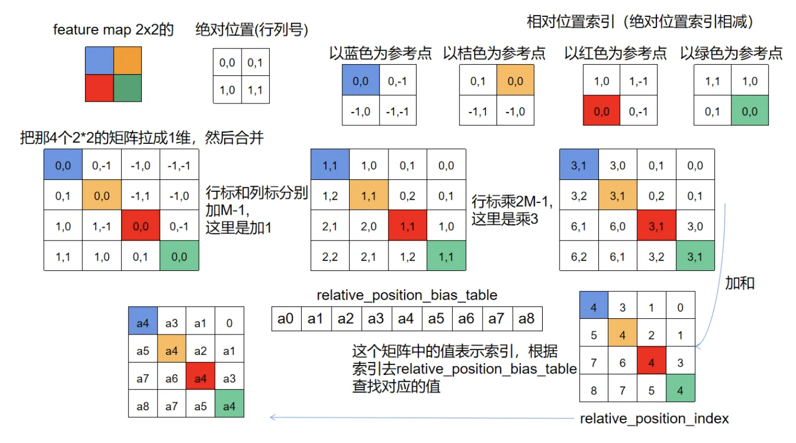

参考博客：https://zhuanlan.zhihu.com/p/507105020

## 流程

是对每个窗口中的token进行合并。把整个的feature map划分成4个windows。
假设输入是224 * 224 * 3的图像。
注意：论文中没有token，都用patch表示。

### 1\. patch partition和linear embedding

把图像按照patchsize=4 * 4划分成 $\frac{224}{4} * \frac{224}{4} = 56 * 56$个patches。代码中通过大小为4 * 4，步长为4，输出channel为C的卷积代替patch partition和linear embedding。经过这个操作后，得到 56 * 56 * C的feature map，feature map中的每个位置1 * 1 * C就相当于一个patch。

### 2\. patch merging

每2 * 2个相邻patch作为一组，一共有28 * 28组，把这些组中相同位置的元素拿出来放到一起，会得到4个 28 * 28 * C 的feature map。把这4个feature map按照在channnel层拼接起来得到 28 * 28 * 4C，然后用线性映射，变成28 * 28 * 2C

### 3\. shifted window based self-attention

不同于Vit，对所有的patch进行self attention操作，Swin的self-attention只对一个窗口中的token进行计算。
一个窗口中包含 M * M个长度为C的patches（第一个stage）
对于一个h * w的feature map，一共有 h * w个长度为C的patches

#### 3.1 全局MSA的计算量：

1.  每个patch分别需要经过线性投影，最后得到q、k、v。线性投影层的参数矩阵为C * C，一个patch需要计算3次，所以一个patch的计算量为 3 * C * C（矩阵向量相乘），一共有h * w个patches，总的计算量为 $3 * h * w * C * C$
2.  q和k的转置相乘，得到注意力矩阵，一个q和一个k相乘的计算量为C，h * w个q和h * w个k相乘 $hwC * Chw = hw * hw$的总计算量为：$(hw)*(hw)*C$
3.  注意力矩阵和v相乘：$hw * hw * hwC = hwC$，计算量是$(hw)*(hw)*C$
4.  MLP层$hwC * CC = hwc$，计算量是$h*w*C*C$
    所以总的计算量为：$4hwC^2 + 2(hw)^2C$

#### 3.2 基于窗口的MSA计算量

根据上面的计算方式，可以类比出:
一个窗口内的计算量为：$4*M*M*C^2+2M^4*C$。
一共有$\frac{h}{M}*\frac{w}{M}$，所以总的计算量为：
$$
\frac{h}{M}*\frac{w}{M} * (4*M*M*C^2+2M^4*C) = 4hwC^2 + 2M^2hwC
$$

#### 3.3 信息交互

如果只在窗口中进行自注意力的计算，那么就把信息限制在了局部区域，造成了相邻窗口之间的信息隔离。所以还需要让相邻窗口之间的信息实现交互，这就需要shifted window，每次做完window MSA后，在做一个shifted window MSA。
window MSA是采用常规的窗口划分方式，把特征图划分成 8 * 8 的窗口，每个窗口包含 7 * 7 个patches（每个窗口包含7 * 7个patches）。每次进行 shift 的时候，偏移的距离是$(⌊\frac{M}{2}⌋, ⌊\frac{M}{2}⌋)$，即（3， 3）。下面按照论文中的例子进行说明
注意：论文中在举例说明窗口划分的时候，假设的feature map size是 8 * 8，每个窗口包含 4 * 4个patches，目的是方便说明。

如图所示，在进行shifted window partition后，原来的4个windows变成了9个windows，翻倍了，如果直接在9个window上计算，计算量也变大了，而且有些window的尺寸很小，可能导致self attention的不充分。解决方法就是:在window partition之后，又对划分的window进行了循环移位，先把上面的 A|C 移到最下面，然后对移动后的feature map，再把 B|A 移动到最右边，这样又可以把feature map当做 2 * 2 的window了。
在这些window中进行自监督时，还有一个问题，就是循环移位之后，原本不相邻的区域变得相邻了，如果直接进行self attention，还是会出问题（原本不相关的，变成相关了）。解决的方法：使用masked MSA。
github上关于循环移位之后的图如下：

1.  window0中的元素本来就是相邻的，不需要掩码
2.  window1中的元素分为1和2两部分，1和2本来是不相邻的，所以在自注意力时需要掩码处理
3.  window2中的元素分为3和6两部分，这两部分原本不相邻，需要掩码处理
4.  window3中的元素分为4、5、7、8，其中4原本是右下角，5原本是左下角，7原本是右上角，8原本是左上角。做自注意力时需要掩码。
    以3、6为例，看看如何掩码：

首先3和6分别经过FC映射，得到$q_3|q_6，k_3|k_6$，q 和 k 的转置相乘。如果window为7 * 7，shift=3，那么$q_3$为4 * 7，$q_6$为3 * 7。拉平相乘的形式如下图：

相乘之后的自注意力矩阵，包含36和63的部分表示3和6进行了self-attention计算，所以这部分需要mask掉。mask矩阵的形式就是绿色表示的，36和63对应部分值为-100，其他部分值为0，把mask矩阵加到自注意力矩阵上。由于自注意力矩阵中的值都是小数，所以加完之后，在进行softmax处理，那么36和63部分的值就变成了0。
最后，当shifted window MSA之后，需要还原回原来的feature map，同样是通过循环移位的方式进行。

### 4 relative position bias

作者通过实验发现，绝对位置编码的效果不好，所以在位置编码这块使用了relative positin bias：

相对位置编码的流程图：
