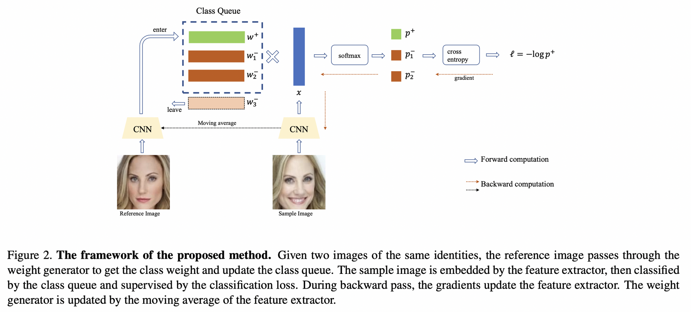
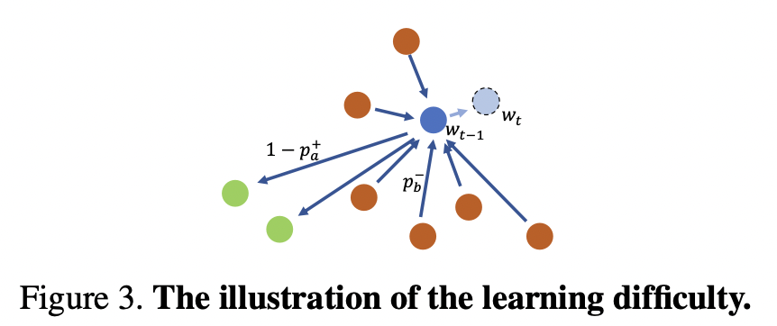

# Motivation

人脸识别任务容易受到计算资源和数据长尾效应的影响。
按照分类任务训练人脸识别，使用的显存随着类别数的增加而增加，而且对于tail data分类效果不好。
针对这两个问题，提出DCQ：动态的选择用于训练的类别，组成全部类别的一个子集，这些类别的权重是实时生成，然后存储在一个队列中。这里的类别权重相当于分类任务中FC层的权重参数W，权重参数W中的每一列相当于一个类别的类心。
**优点：** 1\. 由于每次训练只使用了一个子集，则计算资源降低了；2. 每次选择一个子集，对于这个子集在线生成权重，相当于一个few-shot任务，这样可以减少长尾效应的影响。
动态体现在两方面：

1.  用于分类的子集是动态随机选择的
2.  类别的权重是动态的在线生成的，而不是通过SGD方法得到的。

# 方法

权重队列w\_queue，类别队列c\_queue 网络结构采用moco v1，包括q编码器encoder\_q和k编码器encoder\_k，其中encoder\_q用SGD更新，encoder\_k根据encoder_q用动量更新。
**encoder\_k可以看做是权重生成器，encoder\_k提取的特征作为权重；而在分类任务中，权重是FC层的参数。**

训练时，一个batch包括（im\_q, im\_k, id),
im\_k经过encoder\_k得到的特征作为权重k
im\_q经过encoder\_q得到特征q
q和k相乘得到的作为正样本logit\_pos，q和w\_queue相乘得到的作为负样本logit\_neg，logit=\[logit\_pos, logit_neg\]
然后从w\_queue删除最老的特征，并把k插入到w\_queue中，同样更新c_queue.
最后对logit和label进行交叉熵loss计算。

# 解释

在SGD的训练方法中，一个类别的权重更新的方法为：

$$
w = w_0 + \sum_{a \in C^+}(1-p_a^+)f_a - \sum_{b \in C^-}p_b^-f_b

$$

其中$w_0$为随机初始化的权重，$C^+$是正样本实例。
这个公式可以看做：负样本把权重推离正确中心，正样本把权重拉近正确中心。
如果训练集的每个类别实例个数比较平衡，则没问题，但是在真实环境中，数据是长尾的。对于只有几个实例的类别，权重的更新被负样本的推离更新所主导，不能正确表示此类别。如下图

# 基于DCQ的蒸馏

首先，teacher模型也是根据DCQ进行训练的，所以也有两个编码器：encoder\_qt, encoder\_kt。在蒸馏训练时，这两个编码器都不进行梯度回传。

1.  通过这两个编码器，im\_q通过encoder\_qt得到teacher特征q\_t，im\_k通过encoder\_kt得到teacher的类别权重k\_t。
2.  同时，再维护一个teacher的权重队列w\_queue\_t。
3.  最后，q\_t与k\_t计算的到正样本logit\_pos，q\_t与w\_queue\_t计算得到负样本logit\_neg。最后teacher的logit\_t = \[logit\_pos, logit\_neg\].

# DCQ中的损失函数和label的确定

## 在分类任务中，label的作用是啥？

参考：https://blog.csdn.net/lgzlgz3102/article/details/124642336
CEloss：

$$
L = \frac{1}{N}\sum_{i=1}^N(-\sum_{j=1}^K y_jlog(p_j)) ，\\
N是batch_size，K是类别数。\\
y是one-hot，y_j是y中的一项，如果当前样本的id是5，那么y_5=1，其他都为0. \\
所以最后起作用的就是 -1*log(p_j) = -log(p_j)。所以只要能确定logits中正样本 \\
的位置，那么就不需要label了。\\

$$

label其实是表示在logits中，对应类别的位置。
在分类任务中，由于最后分类FC层的原因，样本的feature和FC权重的每一列相乘得到对应每个类别的logits。所以同一个id的样本，其正样本在logits中的位置是一致的，不能把logits的顺序打乱。

但是在对比学习中，由于没有了最后的分类FC层，所以logits中正样本的可以人为调整，只要能把这个正样本找到就行。所以moco中把正样本都放到的logits的第一个。

## DCQ模块代码实现
~~~python
from __future__ import absolute_import
from __future__ import division
from __future__ import print_function

import paddle
import paddle.fluid as fluid
from paddle.nn.functional import normalize

__all__ = ['DCQ']

@paddle.no_grad()
def concat_all_gather(tensor):
    """
    Performs all_gather operation on the provided tensors.
    """
    if paddle.distributed.get_world_size() < 2:
        return tensor
    tensors_gather = []
    paddle.distributed.all_gather(tensors_gather, tensor)

    output = paddle.concat(tensors_gather, axis=0)
    return output

class DCQ(fluid.dygraph.Layer):
    def __init__(self, base_encoder, dim=128, queue_size=65536,
                 momentum=0.999, scale=50, margin=0.3):
        super(DCQ, self).__init__()

        self.queue_size = queue_size
        self.momentum = momentum
        self.scale = scale
        self.margin = margin

        # create the encoders
        # num_classes is the output fc dimension
        self.encoder_q = base_encoder(num_classes=dim, name_prefix='q')
        self.encoder_k = base_encoder(num_classes=dim, name_prefix='k')

        for param_q, param_k in zip(self.encoder_q.parameters(include_sublayers=True),
                                    self.encoder_k.parameters(include_sublayers=True)):
            param_k.stop_gradient = True
            param_q.set_value(param_k)

        self.register_buffer("weight_queue", paddle.randn([dim, queue_size]))
        self.weight_queue = normalize(self.weight_queue, axis=0)

        self.register_buffer("label_queue", paddle.randn([1, queue_size]))
        self.register_buffer("queue_ptr", paddle.zeros([1, ], dtype='int64'))

    @paddle.no_grad()
    def _momentum_update_key_encoder(self):
        """
        Momentum update of the key encoder
        """
        for param_q, param_k in zip(self.encoder_q.parameters(), self.encoder_k.parameters()):
            paddle.assign(param_k * self.momentum + param_q * (1. - self.momentum), param_k)
            param_k.stop_gradient = True

    @paddle.no_grad()
    def _dequeue_and_enqueue(self, keys, labels):
        # gather keys before updating queue
        keys = concat_all_gather(keys)
        labels = concat_all_gather(labels)
        batch_size = keys.shape[0]

        ptr = int(self.queue_ptr)
        assert self.queue_size % batch_size == 0  # for simplicity

        # replace the keys at ptr (dequeue and enqueue)
        self.weight_queue[:, ptr:ptr + batch_size] = keys.transpose([1, 0])
        self.label_queue[:, ptr:ptr + batch_size] = labels.transpose([1, 0])

        ptr = (ptr + batch_size) % self.queue_size  # move pointer
        self.queue_ptr[0] = ptr

    @paddle.no_grad()
    def _batch_shuffle_ddp(self, x):
        """
        Batch shuffle, for making use of BatchNorm.
        """
        # gather from all gpus
        batch_size_this = x.shape[0]
        x_gather = concat_all_gather(x)
        batch_size_all = x_gather.shape[0]

        num_gpus = batch_size_all // batch_size_this
        idx_shuffle = paddle.randperm(batch_size_all)

        if paddle.distributed.get_world_size() > 1:
            paddle.distributed.broadcast(idx_shuffle, src=0)

        # index for restoring
        idx_unshuffle = paddle.argsort(idx_shuffle)

        # shuffled index for this gpu
        gpu_idx = paddle.distributed.get_rank()
        idx_this = idx_shuffle.reshape([num_gpus, -1])[gpu_idx]

        x = paddle.gather(x_gather, idx_this, axis=0)

        return x, idx_unshuffle

    @paddle.no_grad()
    def _batch_unshuffle_ddp(self, x, idx_unshuffle):
        """
        Undo batch shuffle.
        """
        # gather from all gpus
        batch_size_this = x.shape[0]
        x_gather = concat_all_gather(x)
        batch_size_all = x_gather.shape[0]

        num_gpus = batch_size_all // batch_size_this

        # restored index for this gpu
        gpu_idx = paddle.distributed.get_rank()
        idx_this = idx_unshuffle.reshape([num_gpus, -1])[gpu_idx]

        x = paddle.gather(x_gather, idx_this, axis=0)

        return x

    def forward(self, im_q, im_k=None, im_label=None, use_flip=False, is_train=True):
        if not is_train:
            q = self.encoder_k(im_q)
            if use_flip:
                im_q_flip = paddle.flip(im_q, axis=[3])
                q_flip = self.encoder_k(im_q_flip)
                q = q + q_flip  # no need to divide by 2, which is achieved by normalize
            q = paddle.nn.functional.normalize(q, axis=1)
            return q

        # compute query features
        q = self.encoder_q(im_q)  # queries: NxC
        q = paddle.nn.functional.normalize(q, axis=1)

        # compute key features
        with paddle.no_grad():
            self._momentum_update_key_encoder()  # update the key encoder

            # shuffle for making use of BN
            im_k, idx_unshuffle = self._batch_shuffle_ddp(im_k)

            k = self.encoder_k(im_k)  # keys: NxC
            k = paddle.nn.functional.normalize(k, axis=1)

            # undo shuffle
            k = self._batch_unshuffle_ddp(k, idx_unshuffle)

        # compute logits
        # positive logits: Nx1; q and k shape is N * 256
        l_pos = paddle.sum(q * k, axis=1).unsqueeze(-1)
        l_pos = l_pos - self.margin  # apply margin

        # negative logits: NxK
        # q:N * 256, t_w:256 * k; k是队列的长度
        # l_neg: N*k, 表示batch中每个样本有k个类别概率
        t_w = self.weight_queue.clone()
        t_w.stop_gradient = True
        l_neg = paddle.matmul(q, t_w)

        # mask out samples with the same label in the queue
        # im_label：一个batch的标签，大小为：N * 1
        # self.label_queue: 队列中每个样本的标签，大小为：1 * K
        # label_diff的每一行有K个值，如果第i个值是0，表示队列的第i个样本的类别与
        # 当前图片的类别一样，队列中的这个特征不能当做负样本。
        label_diff = im_label - self.label_queue  # N x 1 - 1 x K -> N x K
        # 不能当做负样本的位置设置为1，乘上-1e9，变成很小的数
        # l_neg * (1 - mask)是按元素相乘
        # 能当做负样本的，保留l_neg的原值，否则变成很小的数
        mask = (label_diff == 0).astype('float32')
        l_neg = l_neg * (1 - mask) + (-1e9 * mask)

        # logits: Nx(1+K)
        logits = paddle.concat([l_pos, l_neg], axis=1)

        # apply scale
        logits *= self.scale

        # labels: positive key indicators
        labels = paddle.zeros([logits.shape[0], 1], dtype='int64')

        # dequeue and enqueue
        self._dequeue_and_enqueue(k, im_label)

        return logits, labels

~~~