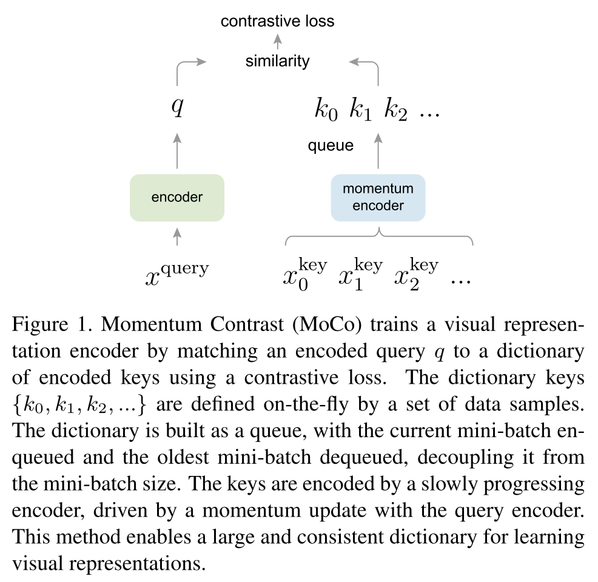

# MoCo v1：Momentum Contrast for Unsupervised Visual Representation Learning

## 动机

对比学习是在高维连续信号（图片）上构建字典的方式，字典是动态的，因为key是随机采样的，而且key的编码器也是随着训练改变的（与之前的方法不一样，之前的方法学习的target都是固定的）。
作者认为要学习到好的特征，需要满足两个条件：

1.  字典要大，这样就可以包含更多语义丰富的负样本，有助于学到更有判别性的模型
2.  一致性：主要是为了模型训练，避免学到一些捷径。

### 核心就是把字典用队列来实现。

encoder\_q通过反传实现更新，encoder\_k通过动量方式来更新。
字典中存储的是encoder_k提取的特征，作为key。
**用动量更新encoder_k的目的**是为了保持字典中特征的一致。
**用队列实现字典的目的**有两个：

1.  把batchsize的大小和字典大小进行分离，这样虽然字典每次更新batchsize个特征，但是每个query会跟字典中所有n-1个特征组成负样本。
2.  保持字典特征的一致性，队列是先进先出的，新来的batchsize个特征入队，最老的batchsize个特征出队。由于encoder_k是逐渐更新的，所以最老的特征的一致性最不好。

## 与其他对比学习方法的比较

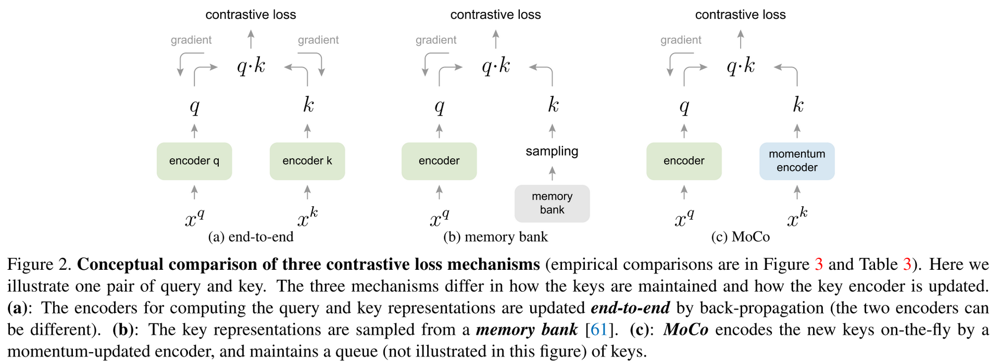

### 1\. end-to-end方式（比如SimCLR）

第一种end-to-end的方式中，两个编码器encoder\_q和encoder\_k分别进行反传更新。encoder\_q和encoder\_k可以是相同模型（即encoder\_q和encoder\_k是一个编码器），也可以不同。
如果用同一个编码器，由于这里的字典是从同一个batch中获得的，所以字典的key的编码是完全一致的（算是个优点）。
但是字典和batch是完全绑定的，想要获得更多被查询的key，就需要更大的batchsize，但是batchsize变大后，显存占用就会增大，而且太大的batchsize对模型收敛也会造成影响。

### 2\. memory bank

memory bank只有一个编码器，用这个编码器对整个数据集提取特征，存到memory bank中。
在每个mini-batch更新中，用encoder对batch中的数据提取特征，然后在memory bank中采样一些key当做字典。当本次优化结束后，用更新的encoder对这些key重新提取特征，替换掉老的特征。
**存在特征一致性问题**：整个数据集遍历一遍，memory bank才能完整更新一次，这期间，memory bank某一部分都是用不同encoder更新，所以特征是不一致的。当进行下一个epoch时，从memory中采样的key可能属于不同阶段encoder提取的特征，与当前encoder对mini-batch数据提取的特征存在很大的不同。

### 3\. MoCo

MoCo通过动量更新和用队列实现的字典这两种方法，既能维护一个很大数量的key，又能保证数据一致性。
由于用了很大的字典，导致没办法通过梯度回传（回传队列中的所有样本的梯度）来更新encoder\_k。那么如何更新encoder\_k呢

1.  直接用encoder\_q的参数更新encoder\_k。但是这样就导致这个快速改变的编码器降低了队列中key的表示的一致性。
2.  用动量的方式 更新$encoder_k = m*encoder\_k + (1-m)*encoder\_q,m=0.999$。由于使用的动量更新，虽然队列中的key使用不同的encoder产生，但是由于这些encoder的差异很小，所有可以保持非常好的一致性。

## InfoNCE

对比学习的目标函数最好满足一下要求：

1.  当q与唯一的正样本$k_+$相似时，loss的值应该比较低
2.  当query q与其他所有负样本$k_-$都不相似时，loss也应该低。

先看交叉熵loss：

$$
-\frac{1}{N}\sum_i^N{log\frac{exp(z_i)}{\sum_j^Kexp(z_j)}}
$$

其中，z指的是logit，$\frac{exp(z_i)}{\sum_j^Kexp(z_j)}$是softmax的输出，K是所有的类别，是固定的数。
理论上对比学习也可以用这个公式计算loss，但是在实例判别的任务中，把每个样本当做一个类别，则K是一个非常大的数。导致softmax工作不了(?)，同时还有个exp操作，计算复杂度很高。

### NCE loss（noise contrastive estimation）

解决类别太多的问题。把问题简化成二分类的问题：一个是数据类别data sample，另一个是噪声类别noise sample，每次只需要拿数据样本和噪声样本作对比。虽然这样解决了类别多的问题，但是计算复杂度还是没降下来。为了解决计算复杂度问题，从数据集中选一些作为负样本，而不是整个数据集，这样作为一个近似，也就是estimation的意思。当选择的noise sample很少时，近似的效果就很差了，这也是MoCo论文强调的希望字典足够大，越大的字典能提供更好的近似。

### InfoNCE

$$
L_q = -log\frac{exp(q*k_+/\tau)}{\sum_{i=0}^Kexp(q*k_i/\tau)}
$$

如果只看成数据样本和噪声样本两类，可能对模型学习不友好，毕竟噪声样本很可能不是同一类。
公式中$q*k$可以看做是logit，K是对比学习中负样本数量。$\tau$控制分布形状，越大，则分布越平坦，对比损失对所有负样本都一视同仁，模型学习没有轻重。如果$\tau$设置的小，导致模型只关注特别困难的样本，这些负样本可能是潜在的正样本。
公式中的分子是从0到K的累加，是（K+1）类，所以从形式上看，就是一个Cross EntropyLoss。目的就是把q分类成$k_+$类。

### 使用动量编码器的原因

因为使用了很大的queue队列作为keys，所以key的编码器没办法通过梯度回传反向传递的方式进行更新了（队列很大，梯度回传很慢），但是又不能不更新这些keys，怎么办？一个直接的方法就是把query的编码器直接复制给key的编码器，但是这种方式导致key编码器变化很快，就降低了queue队列中特征的一致性，队列中老的key和新的key的特征是使用差别很大的编码器计算出来的。怎么让key编码器变化慢一点呢，可以使用动量的更新方式，

$$
\theta_k = m\theta_k + (1-m)\theta_q， m = 0.999
$$

# MoCo v2

Moco v2相对于v1，是参考了SimCLR的方法：

1.  增加projection header
2.  使用更多的数据增强方法，高斯模糊

# MoCo v3：An Empirical Study of Training Self-Supervised Vision Transformers

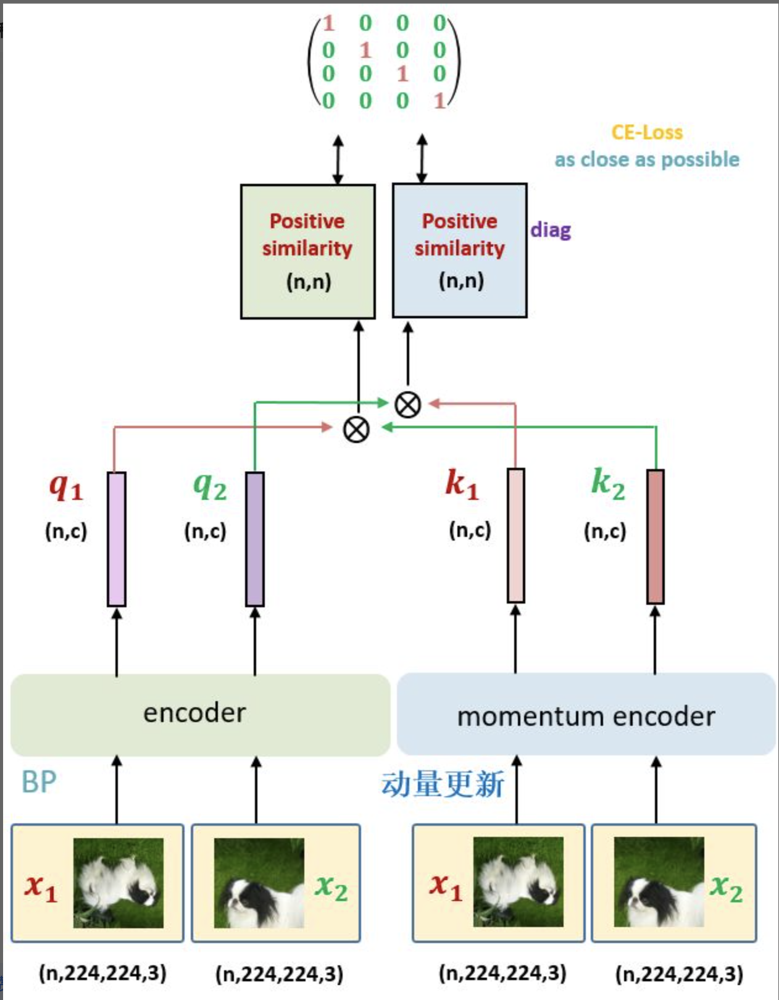 ## 训练方法 
1. 取消了 Memory Queue 的机制：你会发现整套 Framework 里面没有 Memory Queue 了，那这意味着什么呢？这就意味着 MoCo v3 所观察的负样本都来自一个 Batch 的图片，也就是图8里面的 n。换句话讲，只有当 Batch size 足够大时，模型才能看到足够的负样本。那么 MoCo v3 具体是取了4096这样一个巨大的 Batch size。 
2. Encoder $f\_q$除了 Backbone 和预测头 Projection head 以外，还添加了个 Prediction head，是遵循了 BYOL 这篇论文的方法。
3. 对于同一张图片的2个增强版本 $x\_1, x\_2$，分别通过 Encoder $f\_q$和 MomentumEncoder $f\_k$得到 $q\_1, q\_2$和 $k\_1, k\_2$。让 $q\_1, k\_2$通过 Contrastive loss (式 1) 进行优化 Encoder $f\_q$的参数，让 $q\_2, k\_1$通过 Contrastive loss (式 1) 进行优化 Encoder $f\_q$的参数。Momentum Encoder $f\_k$仍然通过动量更新。 
### 伪代码 
~~~python 
# f_q: encoder: backbone + pred mlp + proj mlp
# f_k: momentum encoder: backbone + pred mlp
# m: momentum coefficient
# tau: temperature
for x in loader: # load a minibatch x with N samples
    x1, x2 = aug(x), aug(x) # augmentation
    q1, q2 = f_q(x1), f_q(x2) # queries: [N, C] each
    k1, k2 = f_k(x1), f_k(x2) # keys: [N, C] each
    loss = ctr(q1, k2) + ctr(q2, k1) # symmetrized
    loss.backward()
    update(f_q) # optimizer update: f_q
    f_k = m*f_k + (1-m)*f_q # momentum update: f_k
# contrastive loss
def ctr(q, k):
    logits = mm(q, k.t()) # [N, N] pairs
    labels = range(N) # positives are in diagonal
    loss = CrossEntropyLoss(logits/tau, labels)
    return 2 * tau * loss
~~~

## MoCo v3自监督训练Vit的不稳定性

使用自监督训练ResNet结构的模型时，训练过程是稳定的。但是训练Vit模型的时候，出现了训练不稳定的情况，最终可以收敛，但是收敛的过程中，会出现振动，最终的精度也会下降。
导致Vit训练不稳定的原因：

1.  Batch size过大导致不稳定
    如下图所示是使用 MoCo v3 方法，Encoder 架构换成 ViT-B/16 ，Learning rate=1e-4，在 ImageNet 数据集上训练 100 epochs 的结果。作者使用了4种不同的 Batch size：1024, 2048, 4096, 6144 的结果。可以看到当 bs=4096 时，曲线出现了 dip 现象 (稍稍落下又急速升起)。这种不稳定现象导致了精度出现下降。当 bs=6144 时，曲线的 dip 现象更大了，可能是因为跳出了当前的 local minimum。这种不稳定现象导致了精度出现了更多的下降。
    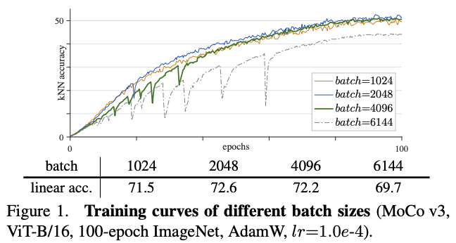
    
2.  Learning rate过大导致训练不稳定
    如下图所示是使用 MoCo v3 方法，Encoder 架构换成 ViT-B/16 ，Batch size=4096，在 ImageNet 数据集上训练 100 epochs 的结果。作者使用了4种不同的 Learning rate：0.5e-4, 1.0e-4, 1.5e-4 的结果。可以看到当Learning rate 较大时，曲线出现了 dip 现象 (稍稍落下又急速升起)。这种不稳定现象导致了精度出现下降。
    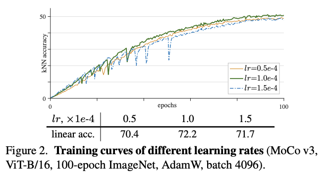
    
3.  LARS optimizer 的不稳定性
    如下图所示是使用 MoCo v3 方法，Encoder 架构换成 ViT-B/16 ，Batch size=4096，在 ImageNet 数据集上训练 100 epochs 的结果，不同的是使用了 LARS 优化器，分别使用了4种不同的 Learning rate：3e-4, 5e-4, 6e-4, 8e-4 的结果。结果发现当给定合适的学习率时，LARS的性能可以超过AdamW，但是当学习率稍微变大时，性能就会显著下降。而且曲线自始至终都是平滑的，没有 dip 现象。所以最终为了使得训练对学习率更鲁棒，作者还是采用 AdamW 作为优化器。因为若采用 LARS，则每换一个网络架构就要重新搜索最合适的 Learning rate。
    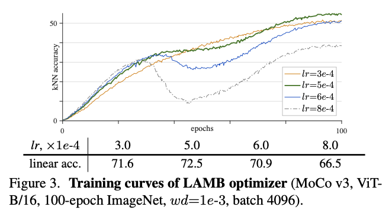
    

## MoCo v3提高自监督训练Vit稳定性的方法

上面的实验表明 Batch size 或者 learning rate 的细微变化都有可能导致 Self-Supervised ViT 的训练不稳定。作者发现导致训练出现不稳定的这些 dip 跟梯度暴涨 (spike) 有关，如下图所示，第1层会先出现梯度暴涨的现象，结果几十次迭代后，会传到到最后1层。
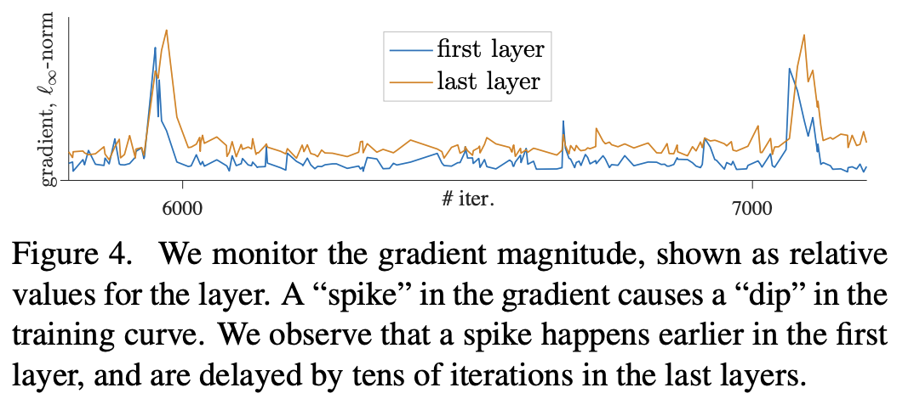
根据这些观察，作者提出了假设：不稳定性发生在较早的浅层。基于此，作者把patch projection layer给冻住，即patch projection layer随机初始化后就固定住，参数不再学习更新。patch projection layer就是把16 * 16的patch映射成token的层。
作者通过实验对是否学习patch projection layer进行了对比，发现不学习（随机初始化并固定住）时，训练稳定性和最终的效果都更好，如下图
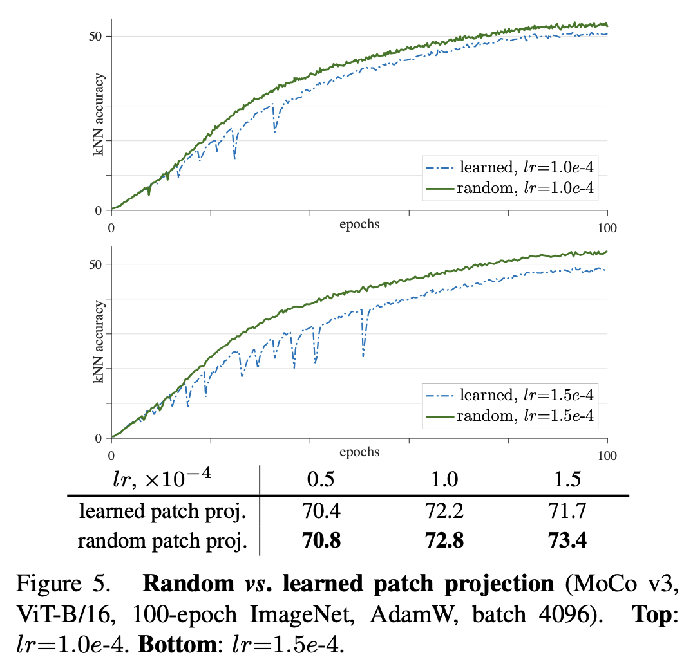
**除了MoCo v3，作者还发现这个方法对于其他的自监督学习框架在训练Vit模型时，同样有效**，如下图：
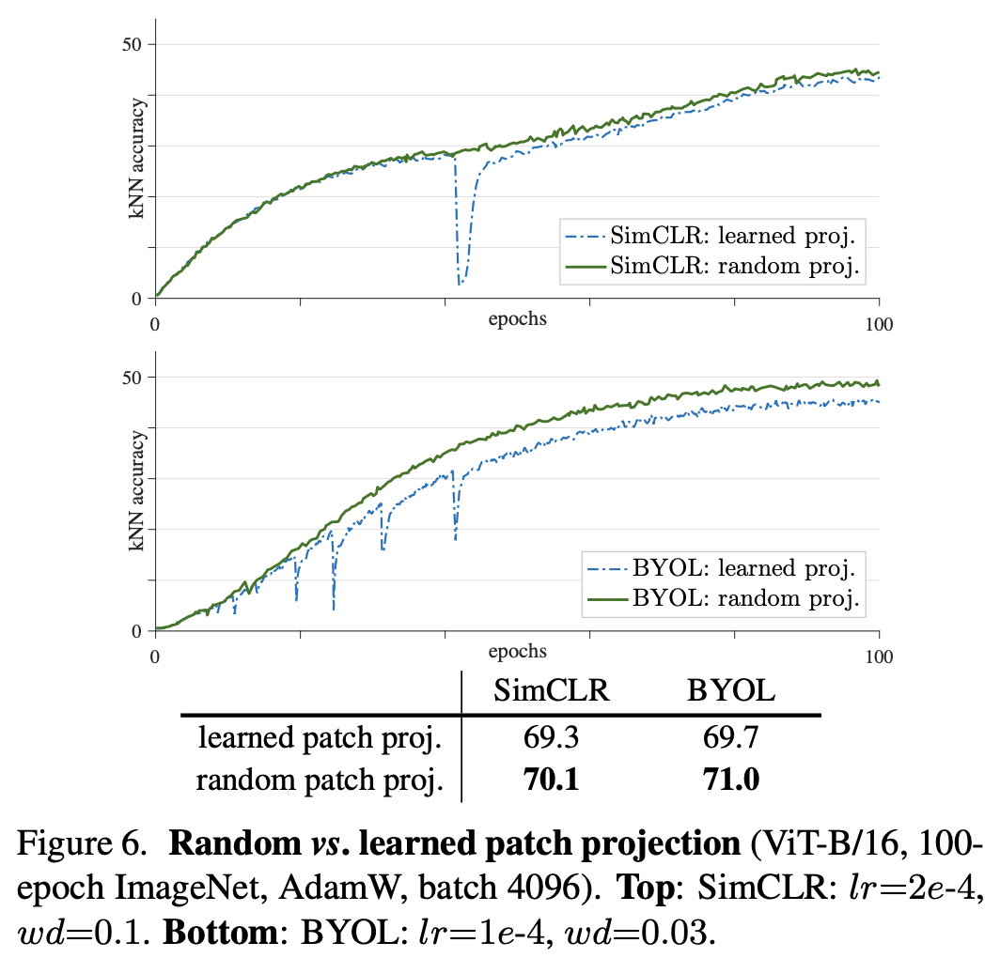

### 其他的尝试

作者还在projection layer上尝试了BatchNorm，WeightNorm和gradient clip。最后发现
**BatchNorm，WeightNorm**对于稳定Vit的训练不起作用。
**gradient clip**：当给定足够小的阈值时（极限情况下，就相当于冻住了这一层），才有效。

### 训练超参细节
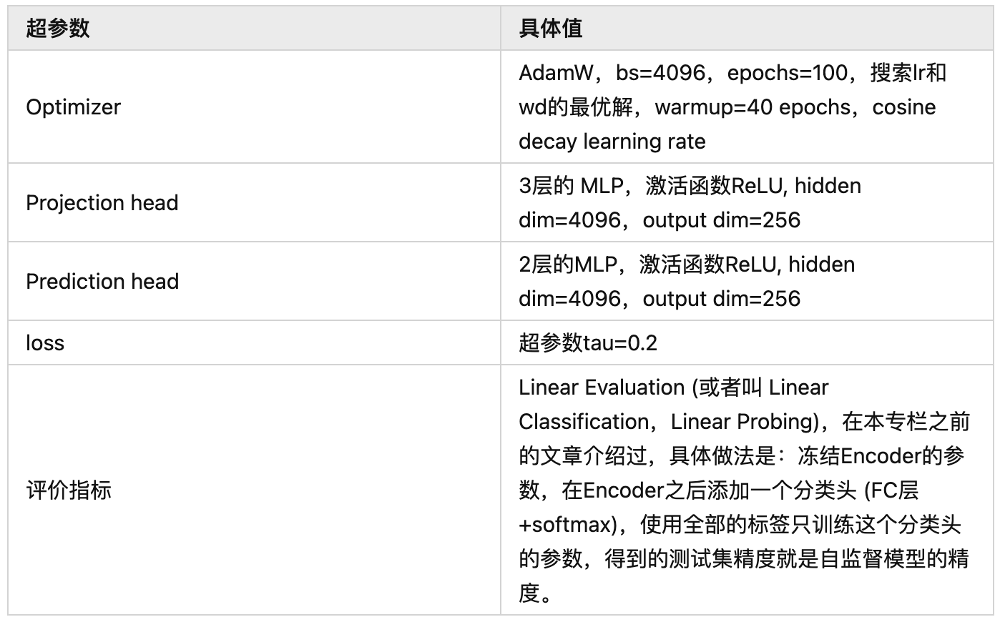

### 与其他框架对比
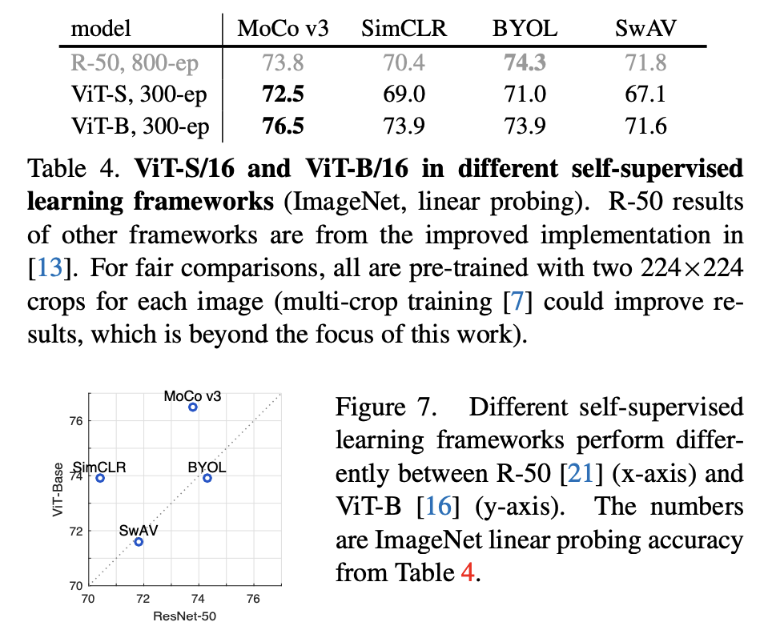

## MoCo v3 + Vit的Ablations
### 1. position embedding
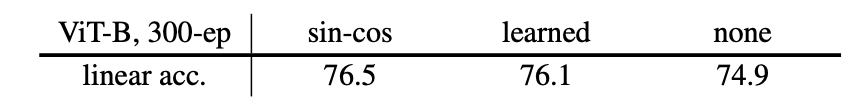
实验说明cos-sin类型的位置编码效果最好。
可以看出，不适用位置编码时，效果也不错。从积极的方面说，即使没有位置编码，此模型也能学到强壮的表示；从消极的方面说，模型并没有很好的利用位置信息，物体的位置对模型的表示效果起到的作用相对较小。

### 2. class token
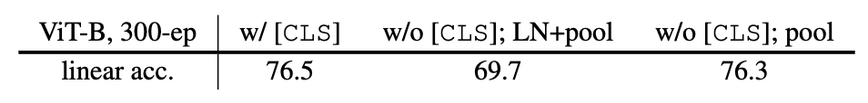
 使用class-token的结果是76.5%；
 直接去掉class token，直接换成global average pooling，结果是69.7%，这里其实包含了最后一层后面的LN层。
 如果去掉class token，并且去掉最后的LN层，那么结果为76.3%。
 这说明class token不是必要的，同时最后一层需要考虑是否使用LN。

### 3. Prediction head
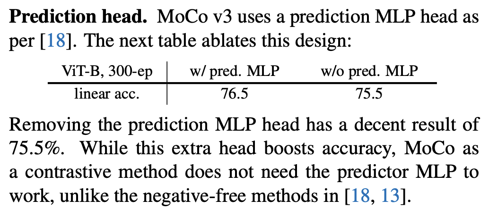
有效果，但对于对比式的方法，不是必需的。但是对于无负样本的方法（如byol，simsiam等），则是必需的。

### 4. Momentum encoder
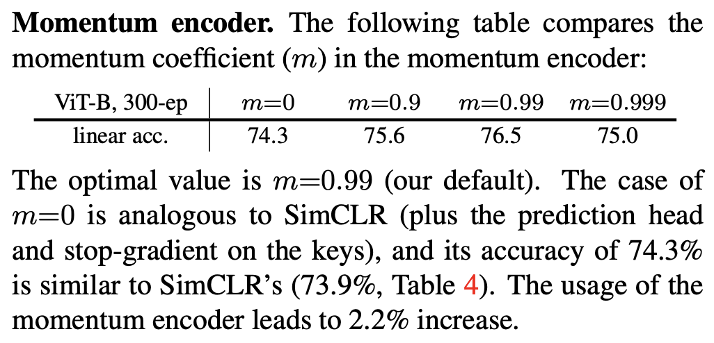