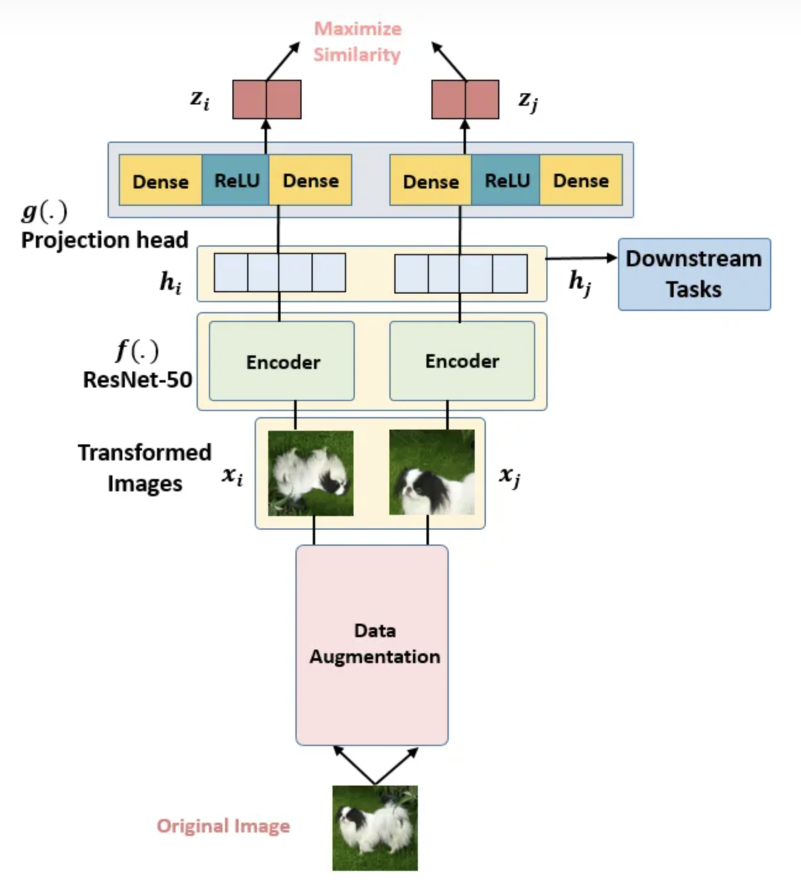
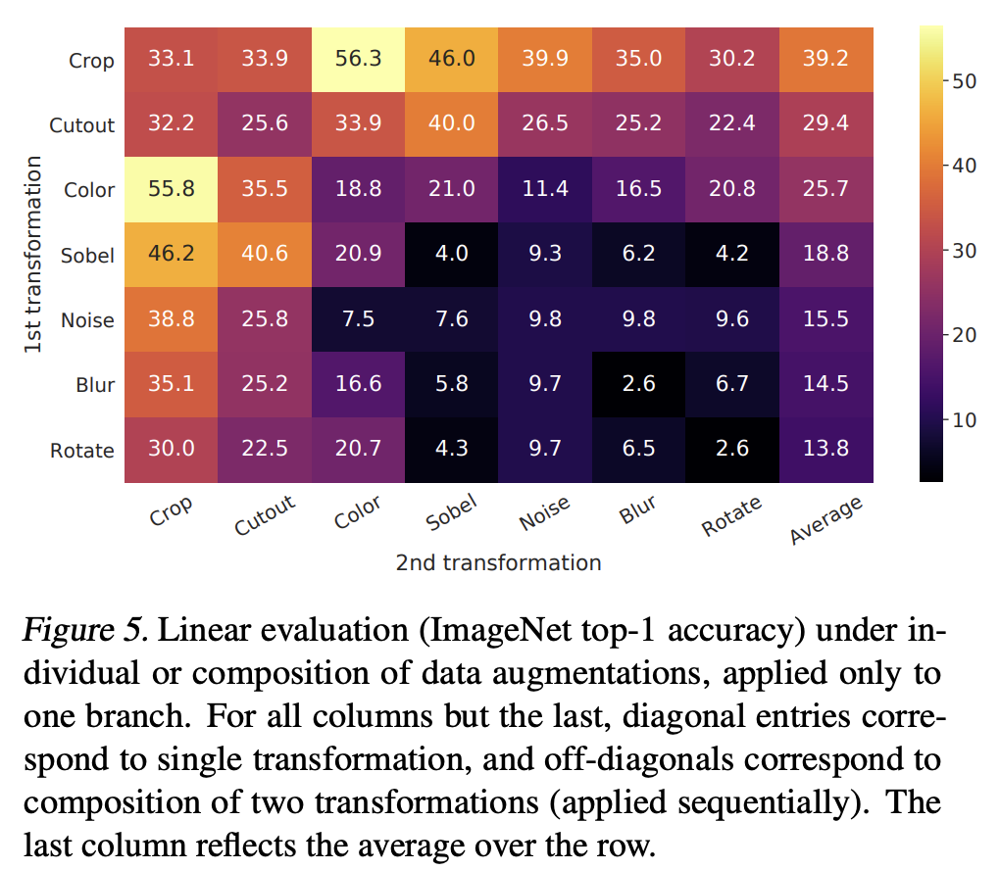
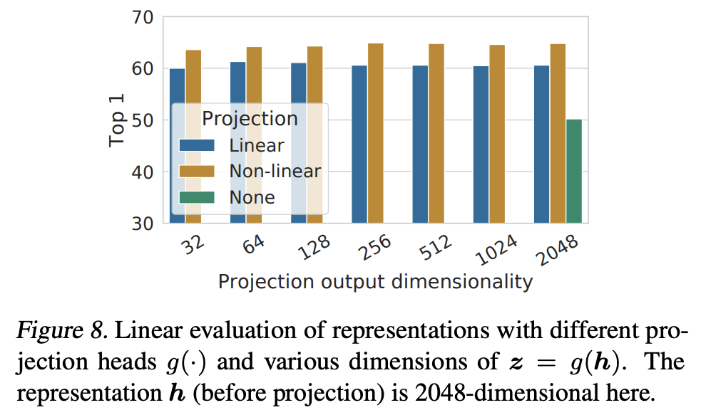
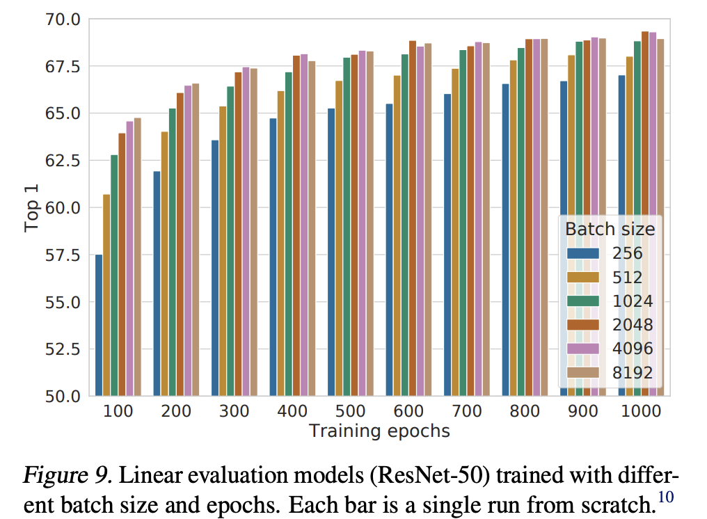

# 1. SimSLR v1（2020）：A Simple Framework for Contrastive Learning of Visual Representations

## 1.1 数据增强
1. 随机裁剪然后resize到固定尺寸
2. 随机色彩失真
3. 随机高斯模糊
数据增强相关实验：

## 1.2 模型结构
一张图像经过两次数据增强，得到两张图片$x_i, x_j$，分别通过两个**共享参数**的编码器，得到两个特征表示$h_i, h_j$，然后分别通过两个**共享参数**的projection header，得到两个代理任务的特征表示$z_i, z_j$，然后这两个特征表示作为损失函数的输入。
### 1.2.1 projection header
由FC+ReLU+FC组成，即两层FC。
为什么不直接用$h_i, h_j$作为损失函数的输入，而是用进行非线性变换后的$z_i, z_j$作为损失函数的输入？
我认为：如果把$h_i, h_j$作为损失函数的输入，那么编码器输出的特征就是针对具体代理任务的一种表示，不具备通用性。所以通过一个非线性变换，对$h_i, h_j$再进行一次转换，让转换后的输出$z_i, z_j$作为代理任务的表示，让$h_i, h_j$作为一种通用的表示。
通过实验说明了projection header使用非线性的方式效果最好：

## 1.3 对batchsize大小的实验
作者发现当使用较小的 training epochs 时，大的 Batch size 的性能显著优于小的 Batch size 的性能。作者发现当使用较大的 training epochs 时，大的 Batch size 的性能和小的 Batch size 的性能越来越接近。这一点其实很好理解：在对比学习中，较大的 Batch size 提供更多的 negative examples，能促进收敛。更长的 training epochs 也提供了更多的 negative examples，改善结果。

# 2. SimCLR v2（2020）：Big Self-Supervised Models are Strong Semi-Supervised Learners
## 2.1 v2的两个发现：
1. 在使用无标签数据集做 Pre-train 的这一步中，模型的尺寸很重要，用 deep and wide 的模型可以帮助提升性能。
2. 对上面的pre-train模型进行fine-tune，然后再蒸馏到需要的小模型上。
## 2.2 v2的三个结论：
1. 对半监督来说，当有标签的数据量极少的情况下，模型越大，收益越大。
2. 预训练模型越大，越能学到通用的表示。然后再针对具体下游任务时，就不再需要大模型了，可以蒸馏到小模型。
3. Projection head很重要，越深的Projection head越能帮助学到更好的表示，下游任务fine-tune之后的效果越好。

根据上面的结论，v2的做法如下：
1. Encoder 变长变大：SimCLR v2 用了更大的ResNet架构，把原来的 ResNet-50 (4×) 拓展成了 ResNet-152 (3×) 和 selective kernels (SK)，记为 ResNet-152 (3×+SK)，变成这样以后，把这个预训练模型用 1%的 ImageNet的标签给 Fine-tune 一下，借助这一点点的有监督信息，获得了29个点的提升。
2. Projection head 变深：使用了更深的 。原来的结构如图5所示是2个FC层+一个激活函数构成。现在的是3个FC层，并且在Fine-tune的时候要从第1层开始。变成这样以后，把这个预训练模型用 1%的 ImageNet的标签给 Fine-tune 一下，借助这一点点的有监督信息，获得了14个点的提升。
3. 加入了MoCo 的内存机制：因为 SimCLR 本身就能通过数据增强得到很多的负样本，所以说这步只获得了1个点的提升。