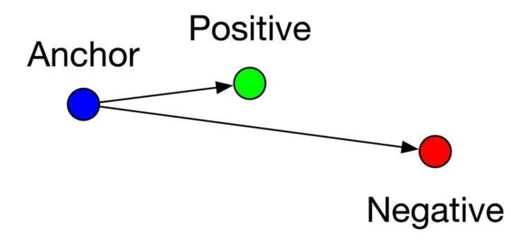
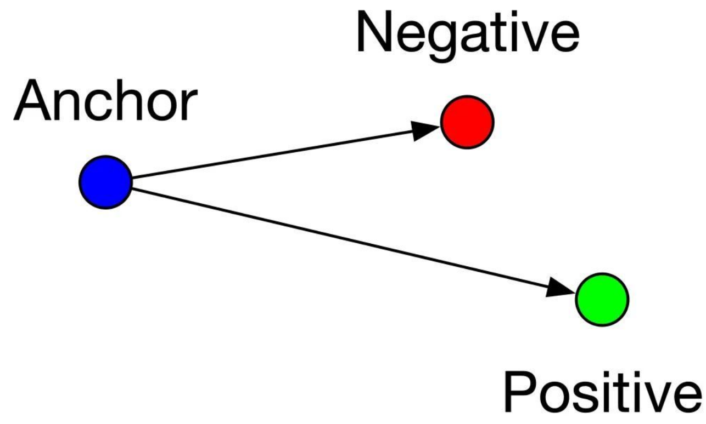
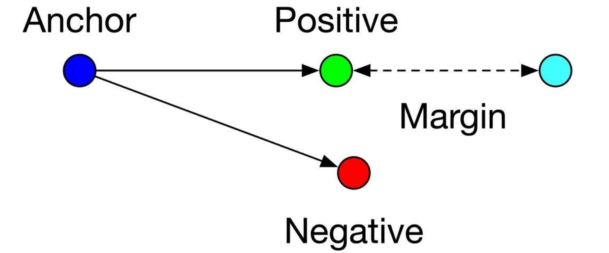

损失函数的形式:

$$
L = max\{dist(a,p) - dist(a, n) + margin, \quad 0\}

$$

输入为一个三元组：（锚a、正例p、负例n）。
通过优化anchor与正例的距离小于锚与负例的距离，实现样本间的相似性计算。

1.  **easy triplets**：
    这种情况下，锚与正例本来就距离很近，锚与负例距离很远，不需要优化
$$
L=0, 即d(a, p) + margin < d(a, n)
$$

2.  **hard triplets**:
    锚与负例距离近，与正例距离远，此时损失函数最大，最需要优化
$$
L > margin, 即d(a, n) > d(a, p)
$$

3.  **semi-hard triplets**:
    锚与正例的距离比与负例的距离近，但是近的不够多，不满足margin，这种情况，损失值比hard triplet小，但是也需要优化
$$
L < margin, 即d(a, p) < d(a, n) < d(a, p) + margin
$$
 
	
**margin**的作用
1. 避免模型走捷径，将negative和positive的embedding训练成很接近。如果没有margin，则loss变为：
$$
L = max\{d(a, p) - d(a, n), \quad 0\}
$$
只要$d(a, p) = d(a, n)$，就满足上式，即锚与正例和负例的距离一样即可，导致模型无法区分正例和负例

## triplet loss的缺点：
1. 每次只能看到一个负例，导致在随机产生的数据对中，每一个数据不能有效保证当前优化方向能够拉远与所有负例的距离，导致训练过程中的收敛不稳定或者陷入局部最优。
2. 需要大量时间构建三元组。挖掘hard triplet方式复杂：不能选太简单的三元组（包含的判别信息较少）；不能选太难的三元组（往往是噪声）。