哔哩哔哩链接：[https://www.bilibili.com/video/BV19S4y1M7hm?spm\_id\_from=333.999.0.0&vd_source=d5e7a7f2c9d4901c3128ee7eef2f68d5](https://www.bilibili.com/video/BV19S4y1M7hm?spm_id_from=333.999.0.0&vd_source=d5e7a7f2c9d4901c3128ee7eef2f68d5)
知乎笔记：https://zhuanlan.zhihu.com/p/452087382

# 第一阶段

## 1\. InstDisc：[Unsupervised Feature Learning via Non-Parametric Instance Discrimination](https://arxiv.org/pdf/1805.01978.pdf)

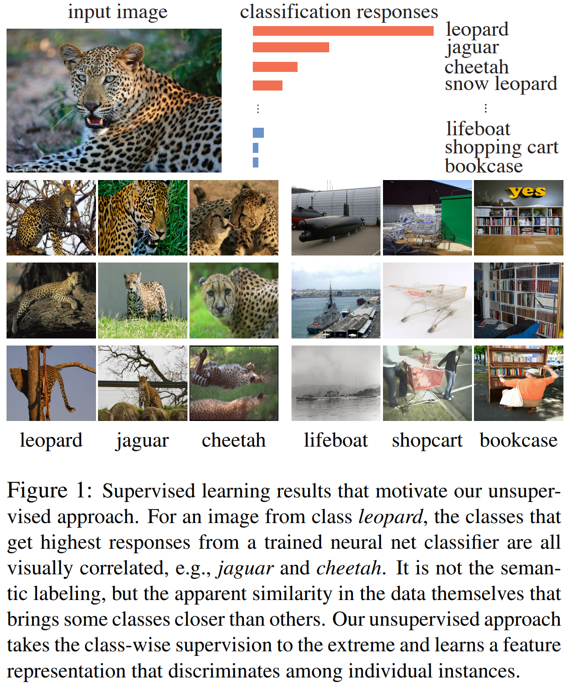

### motivation

作者发现，把一张豹子的图片输入有监督数据分类的分类器中，与其相似度较高的图片都是美洲虎或者猎豹。这不是因为他们有相同的语义标签，而是因为他们的图片之间长得太像了。因此作者将这种有监督任务推向极致：提出**个体判别**任务，将每张图片看做一类，希望模型可以学习图片的表征，从而把各个图片都区分出来。

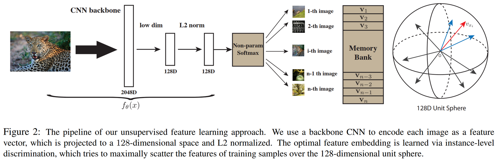

### 方法

作者的方式是通过卷积神经网络提取图片的特征（128维），希望这些特征在特征空间中能尽可能分开（因为每张图片都是一类，所以向量的表征应该尽可能的分散开）
使用对比学习的方法进行训练，需要正样本和负样本。正样本就是图片本身，可以通过各种数据增强。负样本就是数据集中所有其余图片。文章使用**memory bank**存储这些负样本。imagenet中有128w图片，所以memory bank有128w行，因为负样本太多，如果使用较高特征维度，则存储代价太大，所以作者使用128维特征。
整个前向传播的流程：假设模型的batchsize是256，将256张图像分别编码为128维向量，正样本数量为256。负样本来自memory bank，每次从memory bank中随机采样4096个负样本，利用infoNCE loss更新CNN参数。本次更新结束后，会将CNN编码得到的向量替换掉memory bank中原有的存储。一直训练直到模型收敛。
InstDisc提出了个体判别代理任务，而且用这个代理任务和NCE loss去做对比学习取得了不错的无监督表征学习的结果，同时，提出了用其他结构存储大量的负样本，以及如何对memory bank中的特征进行动量的更新，为后续对比学习的工作产生了推进作用。

### 贡献

1.  首先提出**个体判别(Instance Discrimination)**的代理任务
2.  提出**memory bank**存放负样本，以及用动量的方式更新memory bank中的特征
3.  损失函数从softmax转换成NCE：softmax中的权重向量w作为一个类的代理，阻止了实例之间的显示比较，所以换成NCE，让实例特征之间进行比较。

$$
softmax: P(i|\pmb v) = \frac{exp(\pmb w_i^T \pmb v)}{\sum_{j=1}^n exp(\pmb w_j^T \pmb v)} \\
 \Rightarrow NCE: P(i|\pmb v) = \frac{exp(\pmb v_i^T \pmb v /\tau)}{\sum_{j=1}^n exp(\pmb v_j^T \pmb v/\tau)} 
$$

## 2\. InvaSpread: [Unsupervised Embedding Learning via Invariant and Spreading Instance Feature](https://arxiv.org/pdf/1904.03436.pdf)

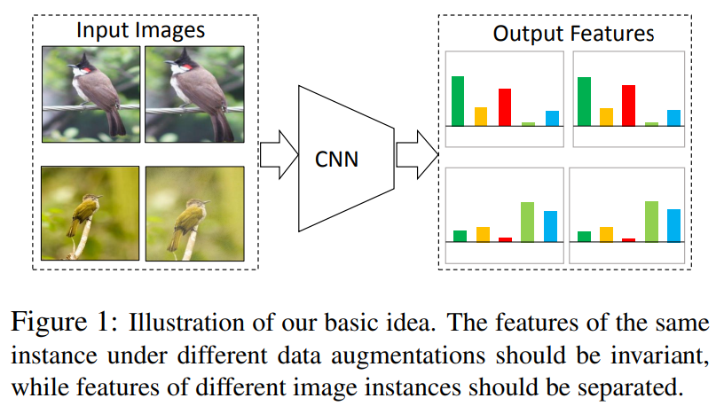

### motivation

该工作的思路就是对比学习：同样的图片经过不同的数据增强后，其特征应该保持不变，不同图片的特征应该可以区分。
这篇文章可以看做是SimCLR的前身，InvaSpread并没有用额外的数据结构存储大量的负样本，就是用mini batch中的数据作为负样本，然后使用一个编码器进行端到端学习。

### 方法

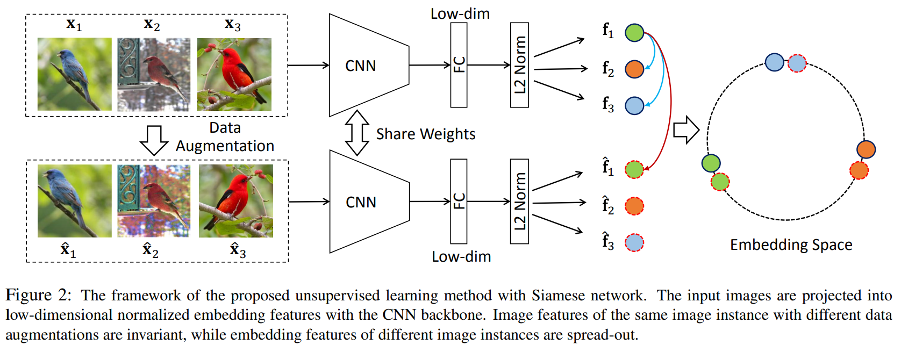

该文章的代理任务也是个体判别任务，重点在正负样本的选择上。
设置batchsize为256。首先利用数据增强，将每个图片增广一次，变成512张图片，然后通过CNN编码为向量，并用fc层将特征降低。正样本：将图片$x_i$和其增广之后的图片$\hat x_i$作为正样本，其余的（256-1）× 2张图片都认为是负样本。所以总共有512个正例，512-2个负例，之后让正例间距离拉近，正例与负例之间的距离拉远。
该文章的思路与SimCLR差不多，都是用batch中的数据作为正例和负例，但是没有SimCLR效果炸裂。主要是因为：

1.  batchsize不够大，即字典长度不够大
2.  没有设计SimCLR中的投影函数
3.  没有SimCLR中多样的数据增强方法。

## 3. CPC：[Representation Learning with Contrastive Predictive Coding](https://arxiv.org/pdf/1807.03748.pdf)

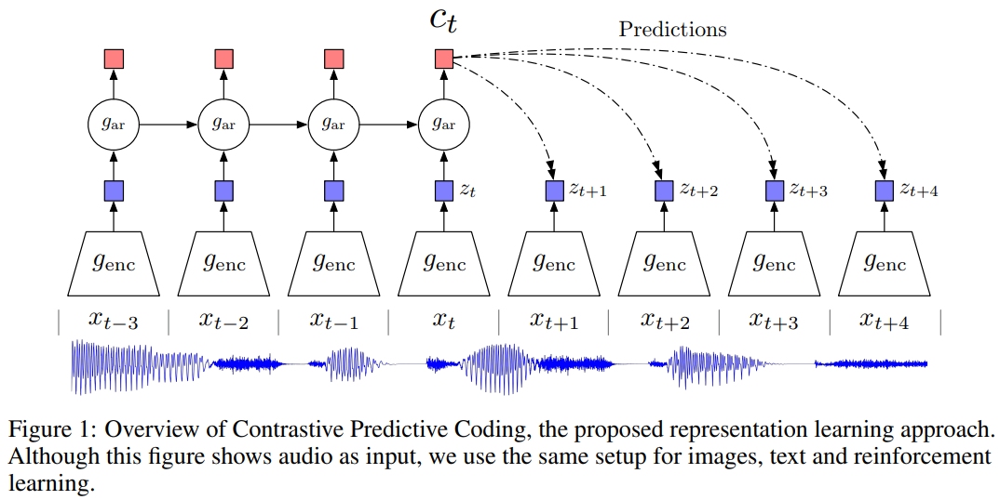

### motivation
用预测任务作为对比学习的代理任务
有一个序列，把之前时刻的输入$x_{t-3}...x_t$放到编码器，得到一些特征$z_{t-3}...z_t$，然后喂给自回归模型$g_{ar}$，得到上下文特征$C_t$，如果上下文特征足够好，真包含了当前和之前的所有信息，那么他应该可以做出一些合理的预测，用$C_t$预测未来时刻的$z_{t+1}...z_{t+4}$。对比学习的**正样本**是未来时刻的输入$x_{t+1}...x_{t+4}$得到的未来时刻的特征输出，即预测得到的特征作为query，真正未来时刻的输出特征是由实际的输入决定的；**负样本**可以把任意的输入作为query的负样本，与预测的特征应该不相似。

## 4. CMC：[Contrastive Multiview Coding](https://arxiv.org/pdf/1906.05849.pdf)
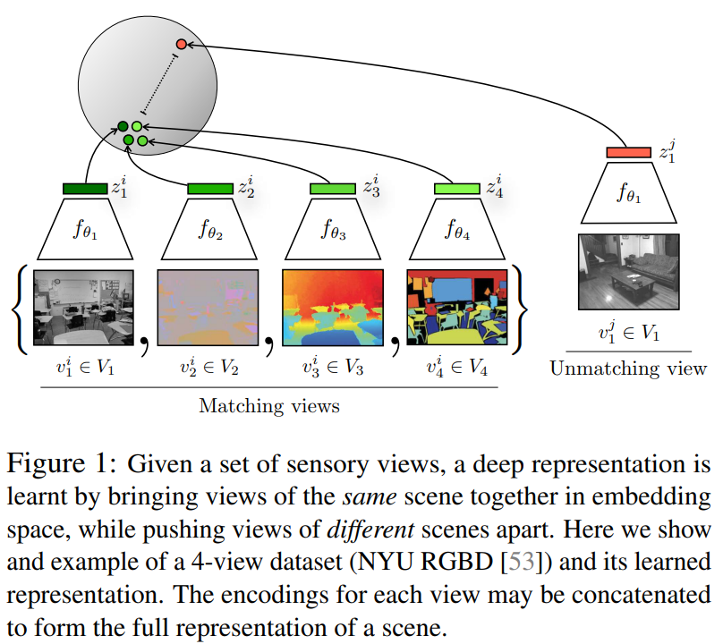

在CPC利用预测的部分作为对比学习后，CMC使用更为广泛的负例产生机制进行学习。
### motivation
人观察世界是通过很多传感器，眼睛、耳朵。每个视角都带有噪声，但是语义实在多个视角下共享。如果要学习一个强大的特征，其应该具有视角不变性，增大所有视角之间的互信息。
### 方法
正负样本的产生，如上图。
例如NYU rgbd数据集。一张图包含rgb、depth等四张图。这些view的数据作为正例，将其他图片以及其他图片的views作为负例，进行训练。
### 贡献
CMC的成功说明，对比学习可以很灵活，比如OpenAI团队的CLIP将图片-文本作为输入，将互相匹配的图像-文本作为正例，将不匹配的作为负例。同时，CMC原班人马利用对比学习做知识蒸馏，认为相同的样本在不同的编码器下得到的结果应该尽可能的相似，因此设计的teacher和student编码得到的相同图片的向量互为正例，不同图片的到的输出作为负例，利用对比学习的思路进行知识蒸馏。
### 不足
multi-view的工作可能需要多个编码器进行编码，训练代价较高。比如CLIP用大型的语言编码器BERT对语言进行编码，用视觉模型VIT对视觉信息进行编码。

***
### 5. 第一阶段总结
第一阶段介绍以上四篇工作，可以看到以上的工作代理任务不尽相同，其中有个体判别，有预测未来，还有多视角多模态。使用的目标函数也不尽相同，有NCE，infoNCE以及其变体。使用的模型也可以是不同的，比如InvaSpread使用的是相同的编码器对key和query进行编码，CMC对key和query使用的是不同的编码，是百花齐放的。

# 第二阶段
## 1. MOCO v1: Momentum Contrast for Unsupervised Visual Representation Learning
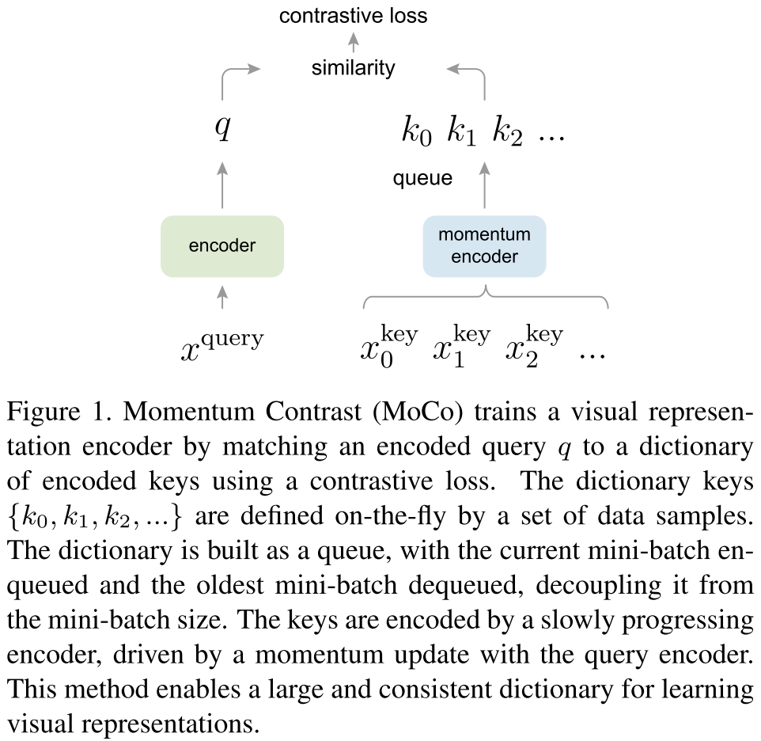

### 贡献
把之前对比学习的一些方法归纳为一个字典查询的问题。提出一个队列保存负样本，一个动量更新的编码器，从而形成一个又大又一致的字典，帮助更好的进行对比学习。

MoCo与InstDist有很多相似的地方，但是MoCo对InstDist的改进既简单又有效，其提出的用队列替换memory bank以及提出了用动量更新编码器而不是memory bank，对效果有显著的提升，同时对后续工作也产生了深远的影响。

## 2. SimCLR：A Simple Framework For Contrastive Learning of Visual Representations
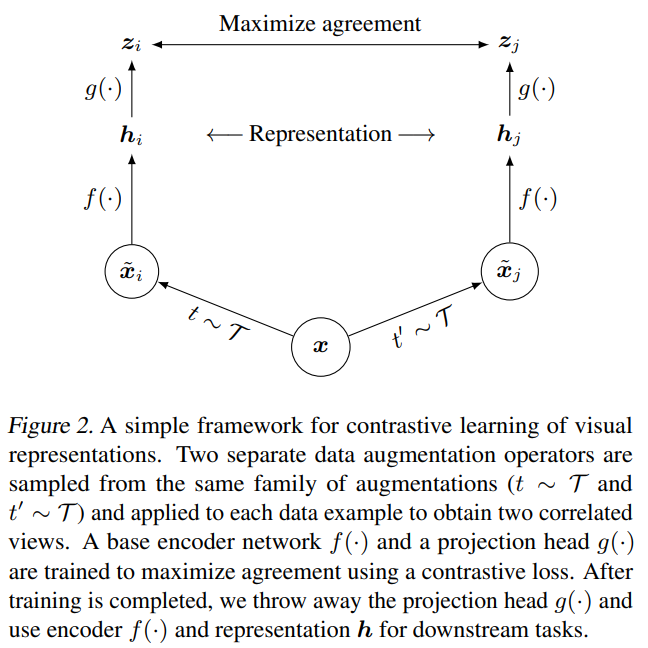 
### motivation
简化对比学习的框架，不在需要具体的结构保存负样本。
为了理解到底是哪些特性是能够让对比学习得到好的表示，研究了以下的方面：
1. 数据增强组合
2. 一个可学习的非线性投影层
3. 对比学习的损失函数
4. batchsize的大小
### 方法
1. 对一个minibatch做两种数据增强，一个图片得到两个增广的图片作为正样本，负样本即其余的增强前后的图片，与InvaSpread一样。先用一个编码器对两张图片编码，提取特征$h_i、h_j$。SimCLR的改进点：在提取特征之后，又加了一个**projector**，即$g()函数$，用一个mlp层实现(fc层+relu)，得到两个特征$z_i、z_j$，用这两个特征进行对比学习，拉近正例之间的距离，拉远负例之间的距离。
**注意**：这里的projector层只在训练时候用，在测试的时候不用，测试时只用编码器$f(.)$，加上投影函数的目的是想让模型训练的更好。
2. 数据增强方式
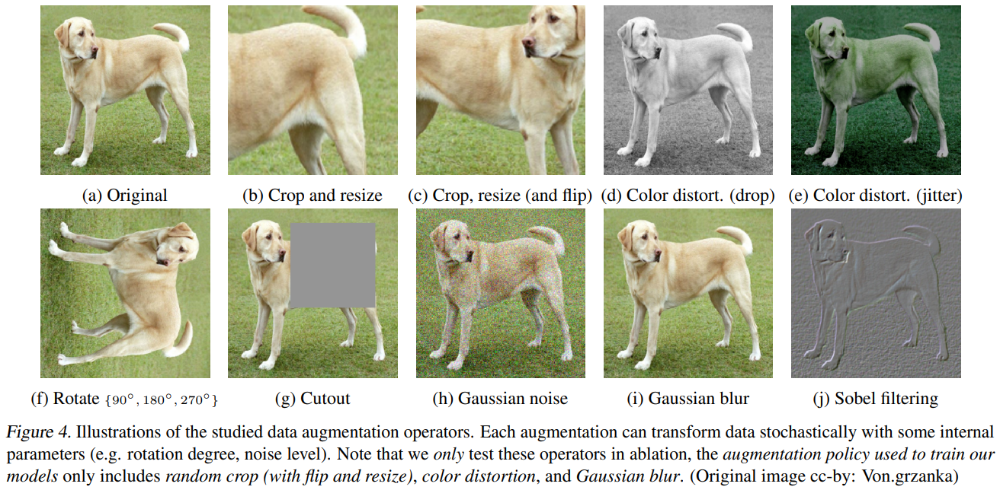
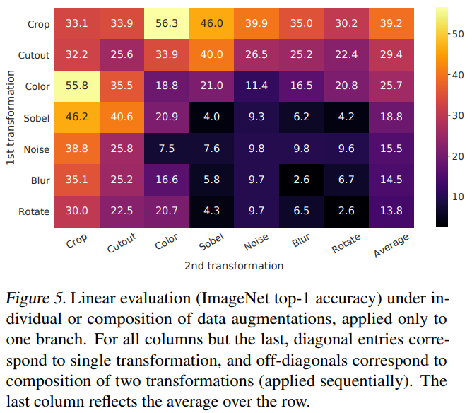

上面两图说明了使用的不同增强方式，以及不同组合的消融实验，可以看出，crop和color两种增强组合的效果最好，最主要。
3. 投影层的实验
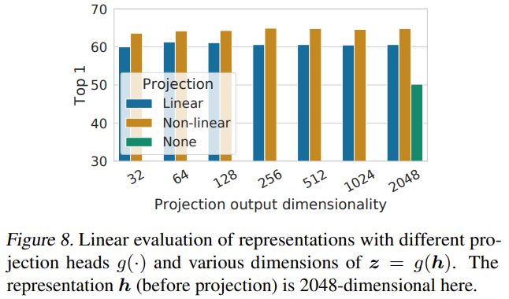

通过实验，说明投影后的特征的维度大小的影响不大，比不使用投影层的效果提升很大。
### 贡献
SimCLR与InvaSpread非常接近，不同之处：
1. SimCLR使用并对比了不同的数据增强的组合策略
2. 加入了投影函数$g()$
3. SimCLR使用了更大的batchsize，且训练的时间更长。
4. 其成功不是由于单一的设计决定，而是把所有技术结合起来得出的结果。
5. 使用lar优化器进行大batchsize的优化训练。

## 3. MoCo v2：Improved Baselines with Momentum Contrastive Learning
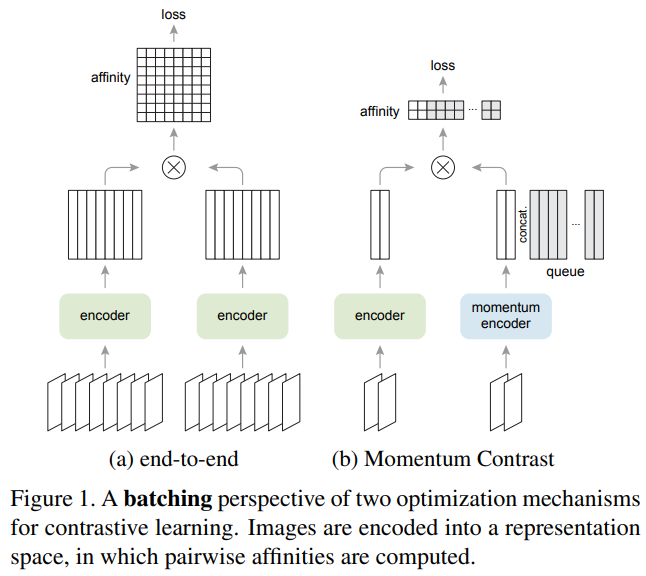

### motivation
在看到SimCLR的工作后，发现其使用的模块都是即插即用型的，把MLP projection head和更多的数据增强用到MoCo中，结果刷新了ImageNet上的最好成绩。
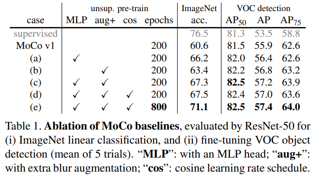

### 方法
1. ImageNet上，(1)加上MLP投影层后，结果有大幅提升；(2)增加数据增强，提升也很多；(3)训练更多epoch，效果提升也很明显。
2. 如下图，相同epoch下，MoCo v2的效果好于SimCLR，说明其能够更好的利用数据，更短时间内取得更好效果。
 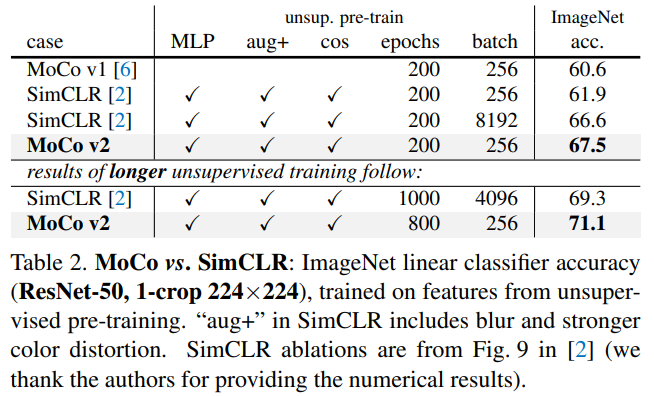

3. 对比了MoCo v2和SimCLR的训练时长和显存占用，说明MoCo v2是一个对于计算资源要求不高，但是却很有效的模型。
一个8张v100的卡。
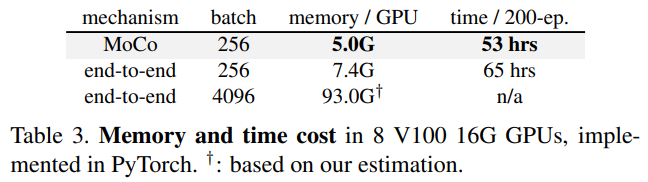

## 4. SimCLR v2：Big Self-Supervised Models are Strong Semi-Supervised Learners
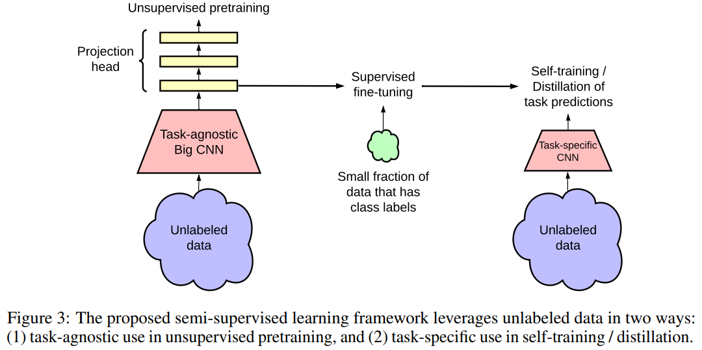

### motivation
主要说明通过自监督对比学习得到的大模型更适合用于半监督学习
文章提出一套用自监督网络做半监督训练的流程，
1. 该流程用大网络（SimCLR v2）做自监督预训练，预训练部分没有特定下游任务，不具备下游任务知识；
2. 之后用少部分有标注数据对模型进行微调，从而让模型学习下游任务的特定知识；
3. 让微调的模型作为teacher模型，为更多的数据打伪标签，从而实现自学习。

### 方法
相比v1：
1. 使用更大的模型，无监督训练会训练的更好，v2使用ResNet-152，并用selective kernels，让backbone更加强悍。
2. 探索更深的非线性层。发现用2层的非线性层（fc+relu+fc+relu）的效果最好
3. 尝试MoCo的动量编码器，发现有效果，但不显著，大概1%，原因是SimCLR v2已经有很大的batchsize了，所以不需要太多的动量以及队列的负样本。

## 5. SwAV：Unsupervised Learning of Visual Features by Contrasting Cluster Assignments
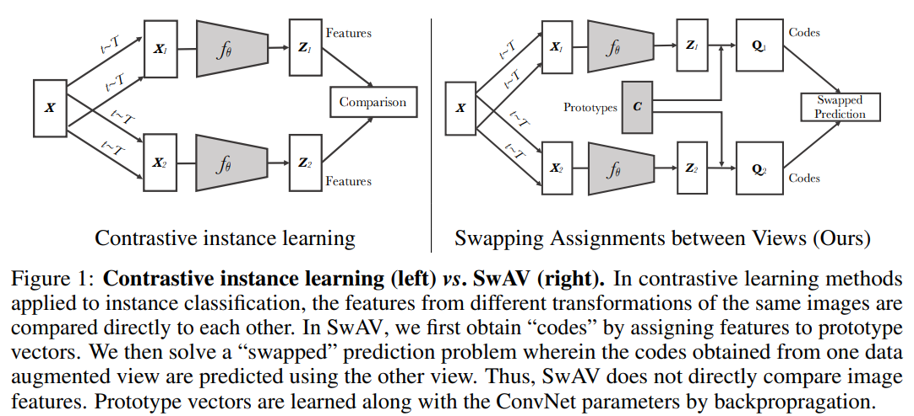

### motivation
以往的对比学习方法都是将一个实例通过两次数据增强变为x1和x2，之后利用编码器对其进行编码，从而得到嵌入向量z1和z2，之后使用对比学习loss更新encoder。尽管非常简洁有效，但是因为负样本太多，从而造成资源的浪费，即使是MoCo这样用近似的方式用6w个负样本近似总共128w个负样本。所以SwAV作者想，能否做个近似，使用先验信息，不去和大量的负样本对比，而是和一些更简洁的东西去比较：即和聚类的中心进行对比，这个聚类中心是C，维度是3000 × 向量维度，3000表示类的数量。

### 方法
输入图片经过两个数据增强得到x1和x2两张，经过编码器得到z1和z2，让z1和z2分别和聚类中心C进行聚类，生成目标q1和q2，可以看成是z1和z2的标签。
代理任务：如果x1和x2是通过增强得到，那么他们的z1和z2应该很相似，这样应该可以互相去做预测，比如z1和C进行点乘，应该可以去预测z2，反之亦然。
**聚类的好处**：
1. 聚类中心的数量相对与负样本数量，小了很多
2. 聚类中心有明确的语义含义。随机抽出来的负样本可能存在正样本，而且样本也不均衡。

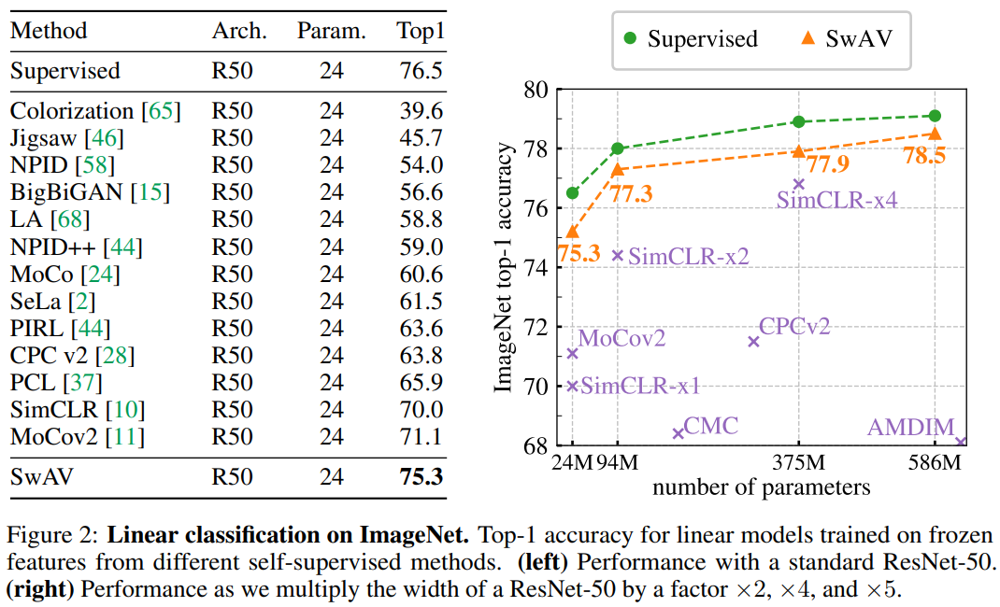

#### multi crop
获得上面效果的一个重要的trick是multi crop。
以前的对比学习只用两个crop。
multi crop：在图片中多crop一些区域，可以关注到更多局部物体，即增加了更多的正样本。为了降低由此造成模型计算复杂度的升高，用两个160的crop和4个96的crop。
其下图实验结果可以看出，**multi crop**不仅对SwAV有效，而且对其他对比学习和深度学习聚类方法也有用
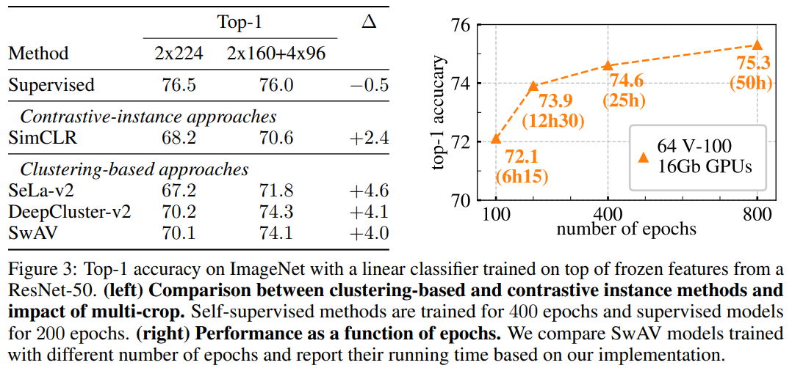

***
## 6. 第二阶段总结
很多细节趋于统一，比如1. 目标函数都是用InfoNCE，2. 模型都用encoder+projection head的框架，3. 采用更强的数据增强，4. 都想到用一个动量编码器，5. 尝试训练更久。

# 第三阶段：不用负样本的对比学习
## 1. BYOL：Bootstrap Your Own Latent A New Approach to Self-Supervised Learning
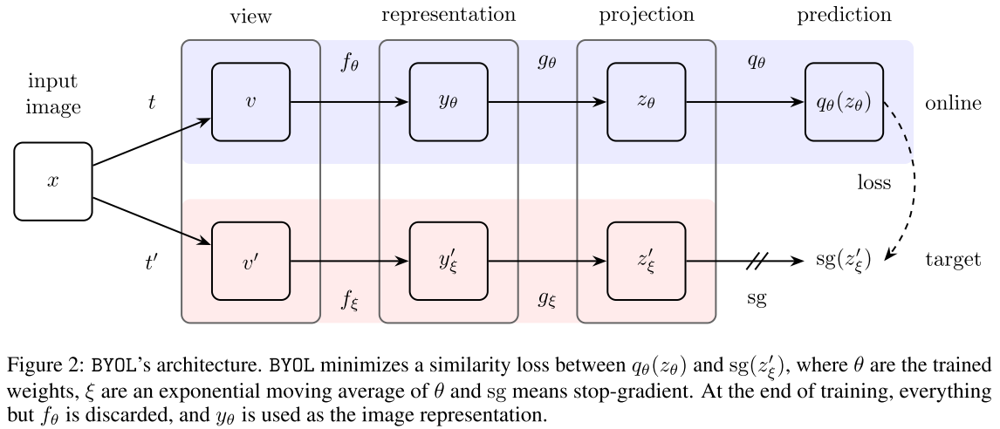
使用负样本的学习方法相当于给模型提供一个约束。如果模型的输入只有正样本，那么模型需要让正样本之间的距离尽量的缩小，那么模型可能会想到一个捷径从而很好的解决这个问题，就是模型直接对所有样本的数据都是一致的，这样所有正样本之间的距离无限接近，但是模型这样躺平是学习不到实例的特征的，是无效的。因此添加了负样本对模型造成一个约束，就是让正样本之间的距离接近，让负样本之间的距离拉远，这样可以对模型进行约束，不让模型躺平，所以负样本在模型中是一个必须的东西，可以防止模型躺平，学到这个捷径解。但是BYOL的神奇之处在于模型没有使用负样本，仅仅是模型自己和自己去学，但是也实现了很不错的效果。
### 方法
BYOL的前向过程：一个实例x经过两次数据增强得到v和v'，之后经过两个编码器$f_\theta、f_\xi$，得到两个向量$y_\theta、y_\xi$，两个编码器的结构一样，参数不同，$f_\xi$通过动量更新。得到的向量再经过两个投影层$g_\theta、g_\xi$，结构相同，参数不同，前者通过梯度更新，后者通过动量更新，得到两个嵌入向量$z_\theta、z_\xi$。然后将$z_\theta$输入到一个predictor预测层$q_\theta$中，得到$q_\theta(z_\theta)$，让$q_\theta(z_\theta)$和$z_\theta$无限接近，使用MSE进行参数更新，利用正样本对正样本的预测，实现模型的学习。

### 讨论BYOL的有效性原因
https://generallyintelligent.ai/blog/2020-08-24-understanding-self-supervised-contrastive-learning/ 这个博客认为BYOL有效的原因是使用了BN，BN把minibatch的信息融合了起来，使得BYOL虽然没有显式的用负样本，但是由于BN融合信息的原因，每个特征中都有其他特征的信息，隐式的引入了负样本信息。
但是BYOL作者通过一些实验说明，BN很关键，但是还有些特例。说明BN的主要作用是帮助模型稳定训练，使得模型不会坍塌。如果一开始就能让BYOL模型初始化的很好，后面的训练不用BN也可以很好的收敛。

## 2. SimSiam：Exploring Simple Siamese Representation Learning
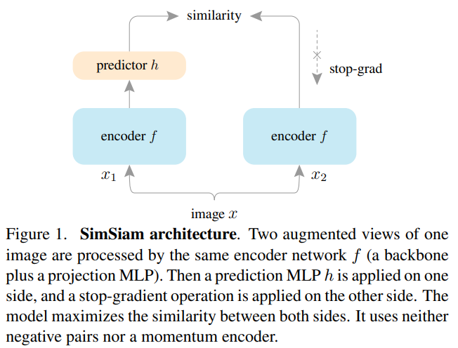
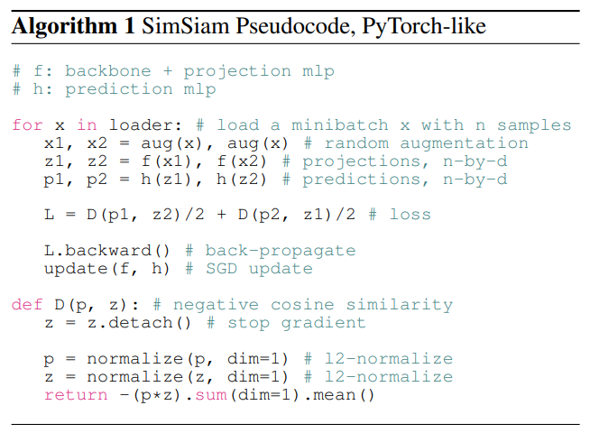

SimSiam是对对比学习工作的一个总结分析，把前面工作用到的一些有用的点归纳起来，包括：不用负样本、不用大batchsize、不用动量编码器，使用一个投影层，即使这样，SimSiam仍然取得了很好的效果。

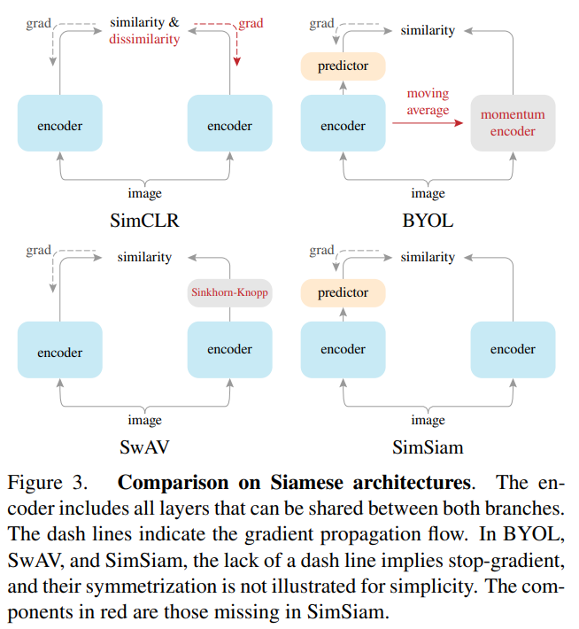

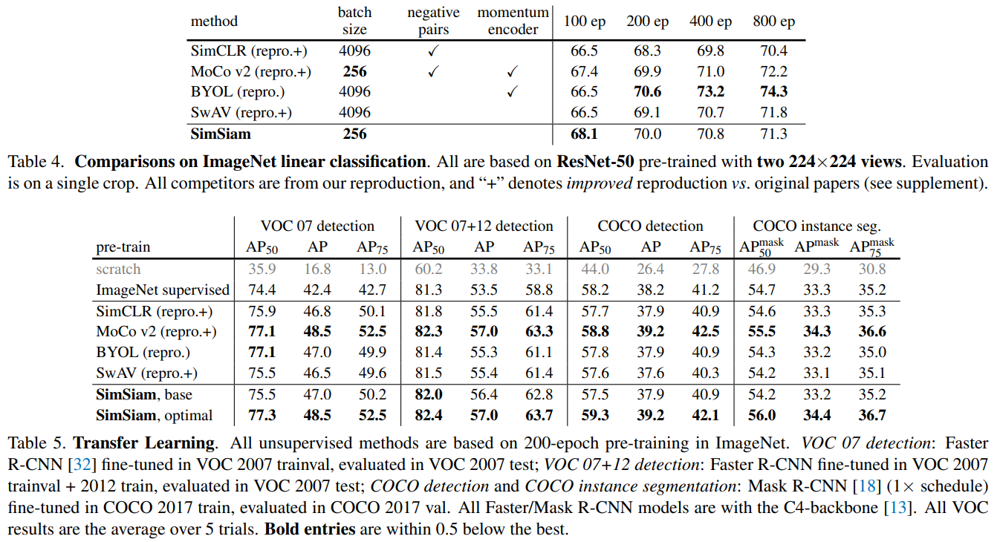

### 有效性原因
模型没有坍塌的主要原始是有stop gradient操作

# 第四阶段：对比学习+transformer
## 1. MoCo v3：An Empirical Study of Training Self-Supervised Vision Transformers
### motivation
自监督训练vit不稳定，如何用一个小改进解决

### 方法
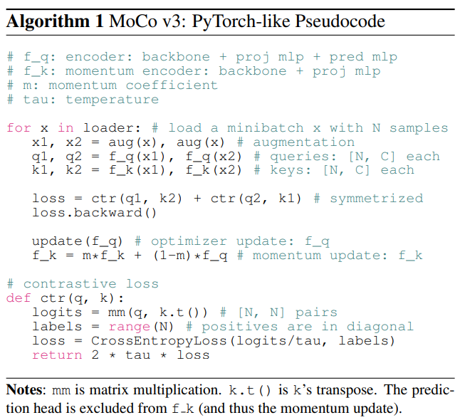

MoCo v2和SimSiam的合体：使用对比学习和对称的loss
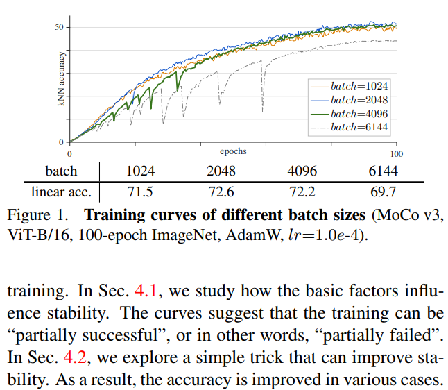

根据上图，作者发现，当把backbone从ResNet换成Vit后，用小的batchsize效果还可以，但是一旦batchsize变大，模型就出现了不稳定的情况。
作者通过分析反传的梯度发现，当每次loss有大幅的震动，导致准确度大幅下降的时候，梯度也会有一个波峰，波峰发生在第一层，即把展平的图像patch经过fc映射成patch embedding的时候。因为这一层经常出现问题，所以作者通过将这一层fix住，在进行训练，得到了很平滑的loss曲线。

## 2. DINO：Emerging Properties in Self-Supervised Vision Transformer
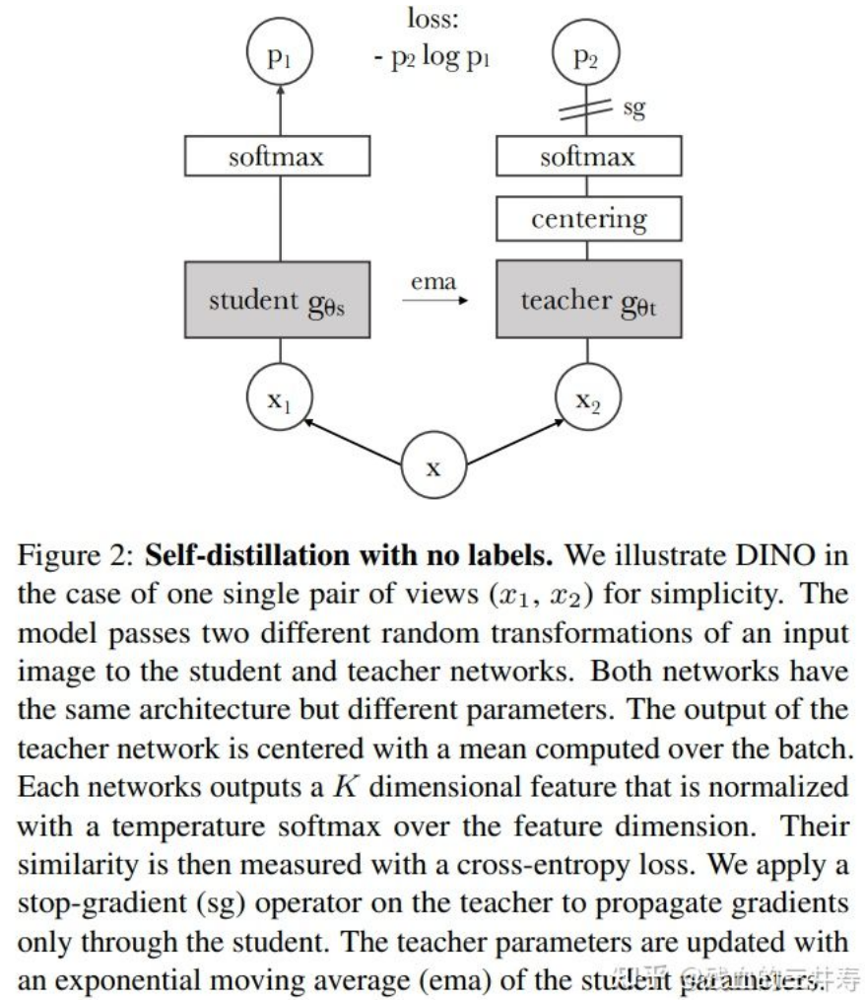

### motivation
用vit训练的时候，发现一些有趣的特性。vit的注意力图可视化，可以非常完美的抓住物体的轮廓。
如上图：其实左边就是query编码器，右边就是key编码器。

### 方法
为了避免模型坍塌，使用了**centering**，就是把整个batch中的样本算一个均值，然后减去这个均值。

# 对比学习方法的发展过程
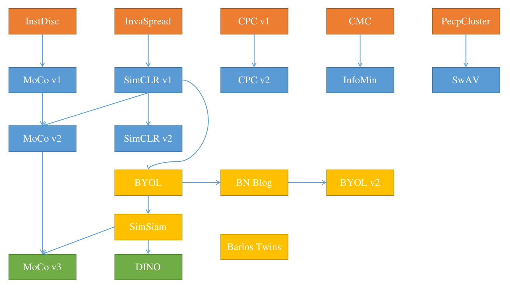