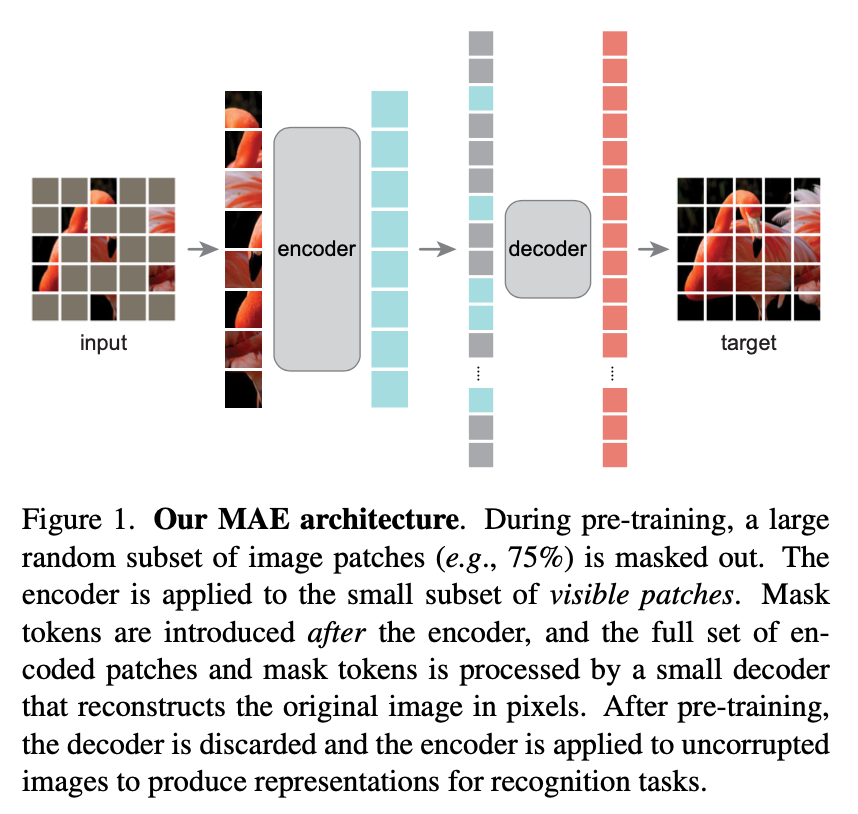
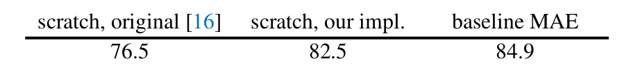
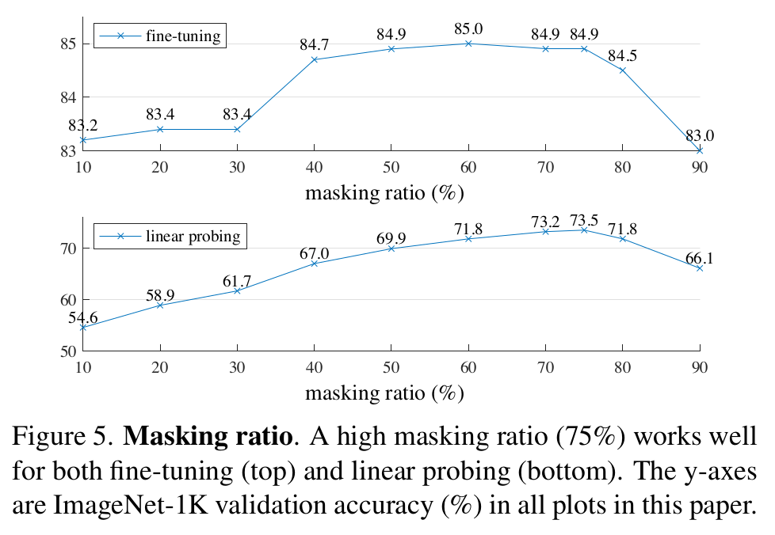
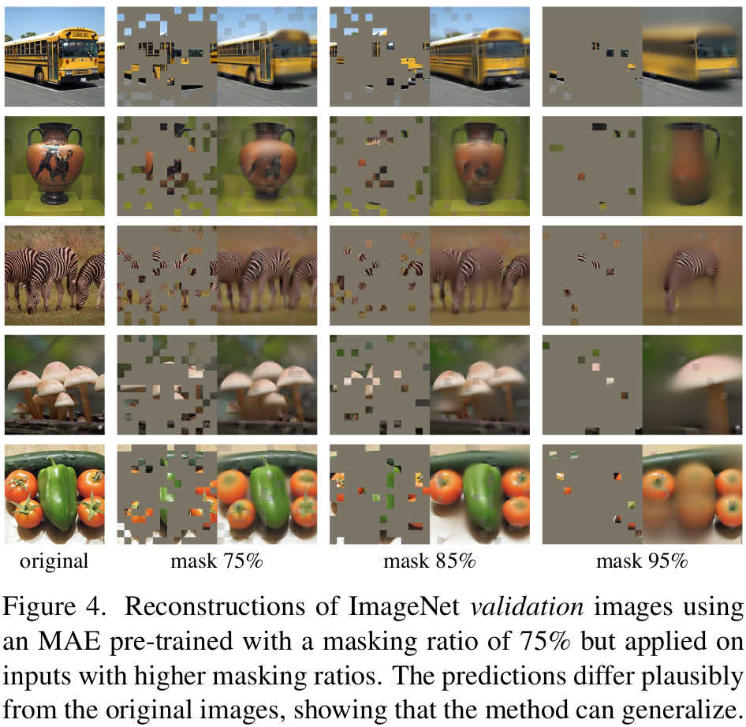
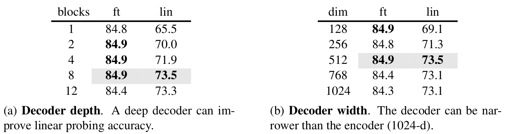
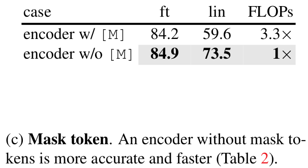
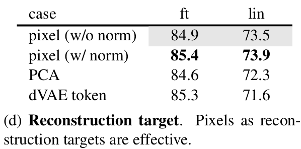
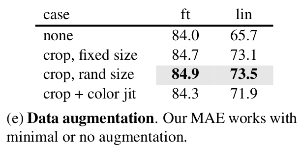
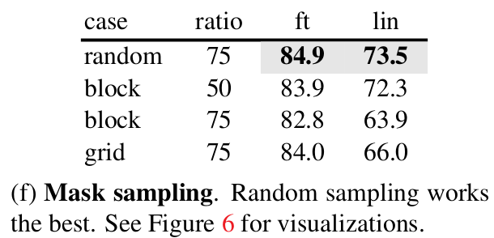
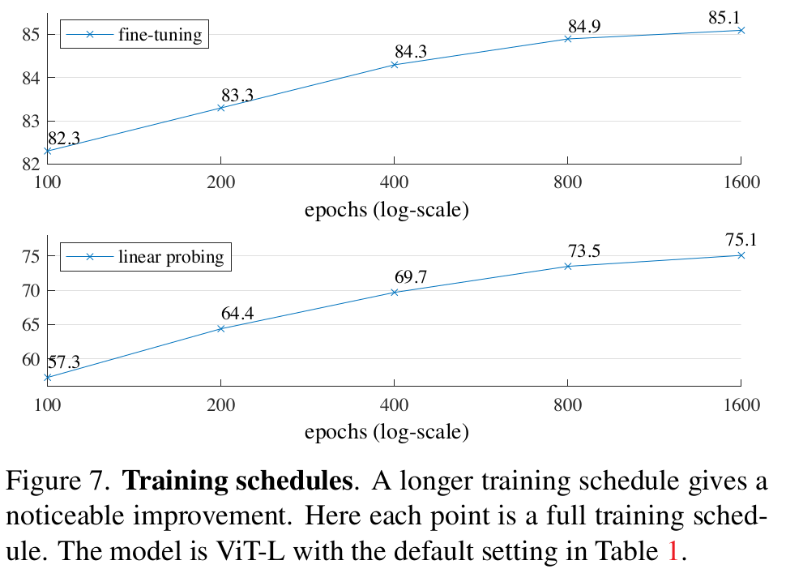

# 摘要

方法：随机mask掉一些输入图像的patches，然后重建丢失的像素。

**两个核心设计**：

1.  不对称的encoder-decoder结构，其中encoder只对可见的patches进行计算，decoder从latent representation和mask tokens来重建原始图像。
2.  作者发现掩盖掉很高的比例（比如75%）有助于nontrival 和 meaningful 的自监督任务。
    通过这两个设计，可以加速训练（3倍以上），并且提高精度。在学习高容量模型的同时，泛化性很好。

# introduction

1.  NLP领域的GPT和BERT也是通过删除一定比例的数据，然后学习预测被删除的内容，这种方法使得NLP模型可以包含千亿参数。
2.  为什么masked autoencoding方法在视觉和NLP中有什么不同：
    1.  所哟哦哦那个的网络结构不同，在视觉中，常用CNN结构。卷积操作一般不能直接集成mask token或者位置嵌入信息。但是随着transformer引入视觉，这种结构上的区别逐渐不是障碍了
    2.  语言和视觉的信息密度（information density）是不同的。语言是人类产生的信号，具有很高的语义信息和信息密度。如果一句话中只有几个字丢失了，当训练这样的模型时，会诱发网络学习复杂的语言理解能力。但是正好相反，图像信号具有高度的空间冗余，一个丢失的图像块可以通过周围的像素恢复出来，只需要有一些对parts，object，和scenes的理解。为了消除这些不同，作者通过随机mask掉很高比例的图像块，来消除空间信息冗余，并可以创造一个很有挑战性的自监督任务，这要求启发式的理解，而不是低层次的图像信息统计。
    3.  autoencoder中的decoder模块，用来把latent表示映射到输入上。在视觉中表现为重建像素，所以相比与识别任务，它的输出在一个较低的语义层次。这与语言正好相反。
        MAE会把输入图片随机mask掉一些图像块，然后在像素空间重建丢失的patch。MAE用的是非对称的encoder-decoder方式。其中encoder只处理可见的图像块，decoder是轻量级设计，通过latent表示和mask tokens来重建输入图像。把mask tokens移到decoder中会降低大量计算量，是的可以扩展MAE到一个很大的模型。
        MAE在学习高容量的模型的同时，还会保证模型的泛化性。

# 方法

1.  把图像划分成不重叠的patches，然后随机采样一部分，并把其余的mask掉。越稀疏的输入越能产生有效的encoder。
2.  MAE encoder：只对可见、unmasked patches进行操作。因为mask掉了很大比例的patch（75%），所以可以训练很大的encoder
3.  MAE decoder：输入包括编码的可见patches和mask tokens。tokens中包括位置编码。默认decoder的计算量不到encoder的10%.
4.  Reconstruction target：decoder的输出是像素值的向量，表示一个patch。decoder的最后一层是linear projection，其channel的数量与一个patch的像素数量相等，decoder的输出会被reshape形成一个重建的image。loss function是重建图像与原图的MSE。只对masked patches计算loss。实验中，对一个patch进行归一化，然后使用归一化的像素作为重建的目标会提高重建质量。
5.  实现：1）产生tokens，2）对tokens进行随机shuffle，然后根据比例去掉后面的部分。3）编码完成后，再把去掉的tokens加到编码后的patchs后面，再unshuffle回去，保持原来的顺序。4）decoder作用于整个list。

# ImageNet上的实验

在ImageNet-1K上进行自监督预训练，然后再监督训练，两种方法监督：1）端到端的fine-tuning；2）linear probing
**Baseline：ViT-Large**：容易过拟合，可以验证方法的泛化性。

## 消融实验

1.  **Masking ratio**:
    
    最有的masking ratio是75%。通过重建的图可以看出，模型推理出的missing patch虽然不同，但是合理。
    
2.  **Decoder design**
    
    默认MAE decoder有8个blocks，width是512-d
3.  **Mask token**
    
    encoder中加入masked token会降低14%的精度，因为训练和部署会有差别。
    FLOPs降低3.3倍，加速2.8倍。
4.  **Reconstruction target**
    
5.  **Data augmentation**
    
    只用到了fixed-size或random-size的cropping。即使不用增强，MAE表现也不错，这跟contrustive learning非常不同。**In MAE, the role of data augmentation is mainly performed by random masking (ablated next). The masks are different for each iteration and so they generate new training samples regardless of data augmentation. The pretext task is made difficult by masking and requires less augmentation to regularize training.**
6.  **Mask sampling stragegy**
    
7.  **Training Schedule**
    
    训练到1600轮时，精度仍然没有饱和。
	
	
优秀链接：https://www.zhihu.com/collection/698546968