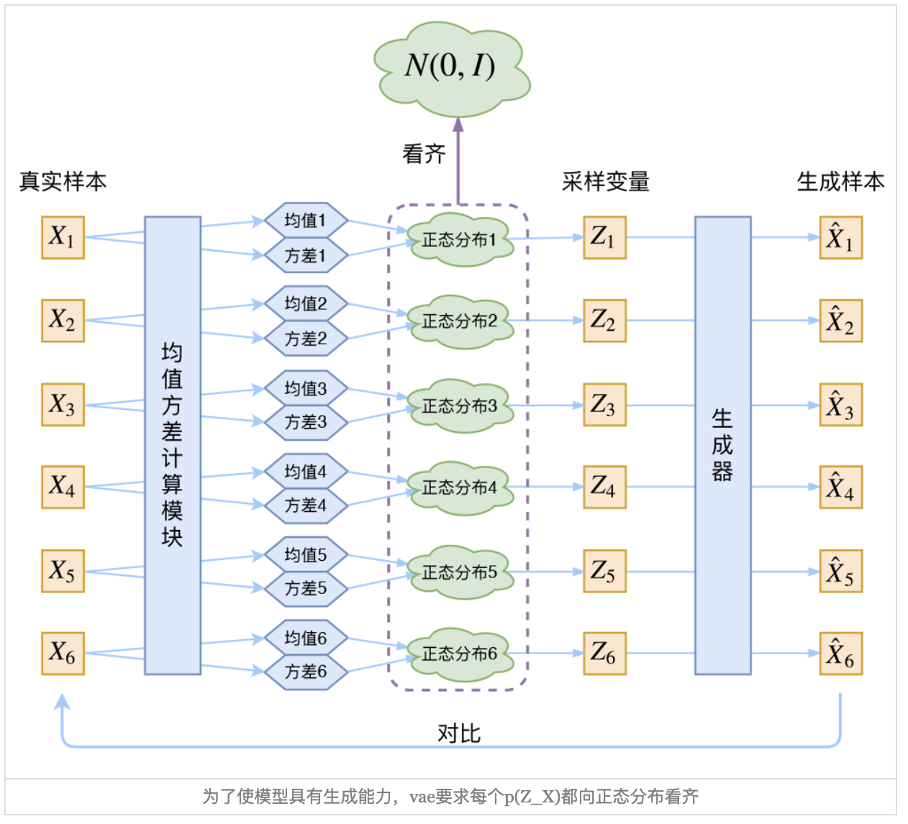
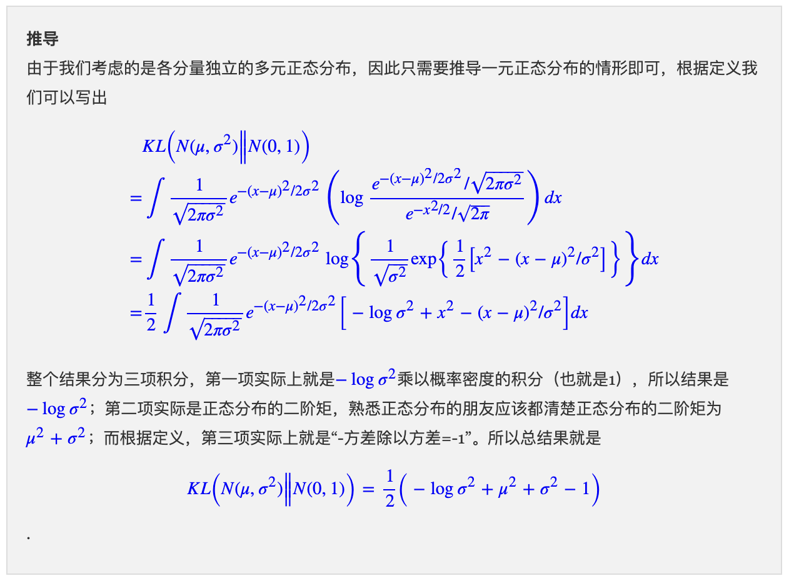
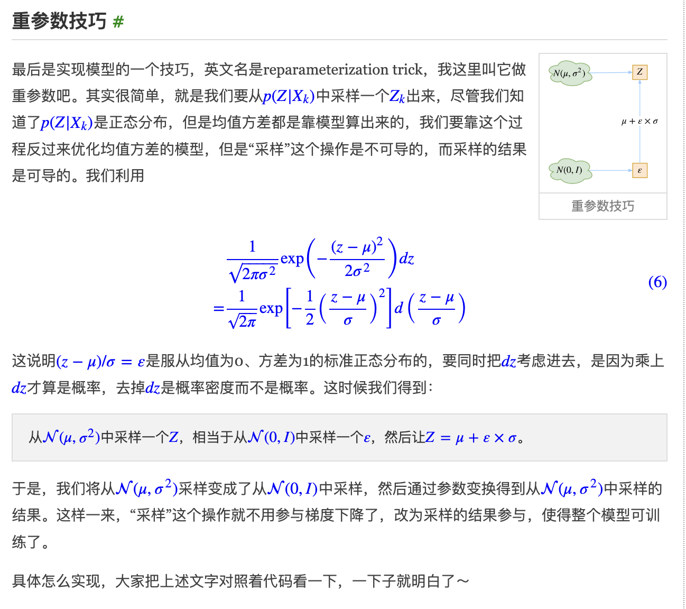

参考链接：https://spaces.ac.cn/archives/5253
代码：https://github.com/bojone/vae/blob/master/vae_keras.py

# VAE：Auto-Encoding Variational Bayes

## VAE的实际过程

假设真实样本为$X_k$，隐变量空间为Z，VAE假设$p(Z|X_k)$服从高斯分布。需要注意的是，分布$p(Z|X_k)$是针对$X_k$这个样本的，意思是对每一个样本都建立一个这样的分布。VAE模型会训练一个生成器$X = g(Z)$，希望从分布$p(Z|X_k)$采样出一个$Z_k$，然后还原$X_k$。所以需要的分布一定是每个$X_k$条件下的分布，这样采样出的$Z_k$才能和$X_k$对应起来。如果直接从分布$p(Z)$采样，那么没办法和需要还原的样本$X_k$进行对应。
如果计算出专属于$X_k$的正态分布$p(Z|X_k)$的均值$\mu$和方差$\sigma^2$呢？方法就是用网络去拟合。构建两个网络：
**均值网络**：$\mu_k = f_1(X_k)$
**方差网路**：$log \sigma_k^2 = f_2(X_k)$，不直接拟合$\sigma^2$，因为它是非负的，需要加上激活函数进行处理成可正可负。
这两个网络的输入是样本$X_k$，然后在损失函数的约束下，拟合出$p(Z|X_k)$的均值和方差。有了均值和方差之后，就可以采样出$Z_k$，经过生成器得到$\hat X_k = g(Z_k)$，这样就可以最小化$\hat X_k和X_k$之间的距离了$D(\hat X_k, X_k)$。因为$Z_k$是从专属于$X_k$的分布中采样的，所以这个生成器就应该把原始的$X_k$还原回来。
**网络$f_1和f_2$就相当于编码器，这个编码器不是直接算出$Z_k$，而是算出$Z_k$的分布，还需要从分布中进行采样才能得到$Z_k$
生成器$g$就相当于解码器。**

## VAE分布标准化

我们希望通过最小化$D(\hat X_k, X_k)$来重构X，这个目标函数最小化的过程会受到$p(Z|X_k)$的方差（也就是噪声）的影响。模型为了重构的更好，肯定会把噪声朝着0的方向进行优化，这样就导致没有随机性了，方差为0，每次采样的结果都是均值。这就退化成了普通的autoencoder了。
为了避免退化，VAE让$p(Z|X_k)$的分布趋向于标准正态分布$N(0, I)$，这样就可以得出

$$
p(Z) = \sum_{X} p(Z|X)P(X) = \sum_{X}N(0, I)P(X) = N(0, I) \sum_{X}P(X) = N(0, I)

$$

这说明如果$p(Z|X_k)$如果符合标准正态分布，那么$p(Z)$也是标准正态分布，用$p(Z|X_k)$中采样的$Z_k$来生成图像重建$X_k$时，不会把方差优化为0。（？解释对不对）
如何使得$p(Z|X_k)$符合标准正态分布，直接计算最小化$p(Z|X_k)$的分布和$N(0, I)$之间的KL散度$KL(N(\mu, \sigma^2) || N(0, I))$。loss的形式如下：

$$
L_{\mu, \sigma^2} = \frac{1}{2} \sum_{i=1}^d(\mu_i^2 + \sigma_i^2-log\sigma_i^2 -1)

$$

d是隐变量Z的维度，$\mu_i，\sigma_i^2$分表表示一般正态分布均值和方差的第 i 个分量。
推导过程：

## 重参数化

