参考：[https://www.bilibili.com/video/BV1af4y1m7iL?p=3&spm\_id\_from=pageDriver&vd_source=d5e7a7f2c9d4901c3128ee7eef2f68d5](https://www.bilibili.com/video/BV1af4y1m7iL?p=3&spm_id_from=pageDriver&vd_source=d5e7a7f2c9d4901c3128ee7eef2f68d5)

# 1\. RCNN--Region with CNN feature（2014）

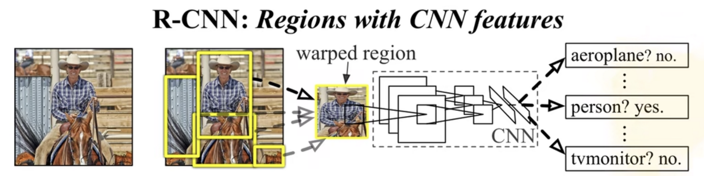

## RCNN的框架

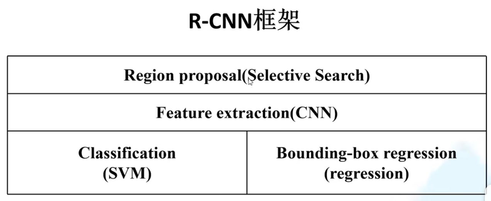

## 1\. 算法流程

RCNN的算法流程分为4步：

1.  一张图生成1K~2K个候选区域（使用selective search算法）
2.  对每个候选区域，使用CNN网络提取特征
3.  把特征送入每一类的SVM分类器，判别是否属于该类
4.  使用回归器精细修正候选框位置

## 1.1 selective search算法

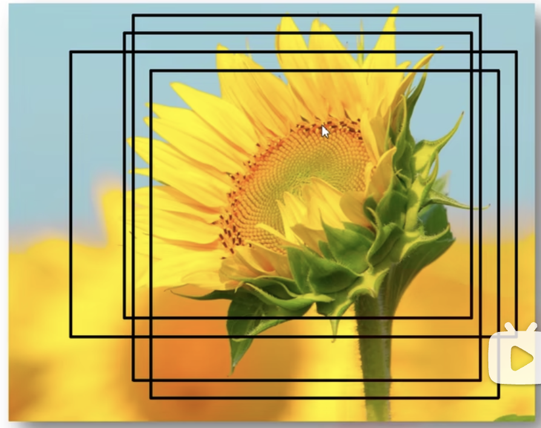

通过图像分割的方法得到一些原始区域，然后通过一些合并策略进行合并，得到一些层次化的区域结构，在这些结构中，可能就含有需要检测的目标。例如，图中的向日葵周围有一些的矩形框，

## 1.2 对候选区域提取特征

首先对所有2000个候选区域缩放到227\*227 pixel，然后把候选区域输入事先训练好的AlexNet网络，获取4096维的特征得到2000 \* 4096 维的矩阵。

## 1.3 对特征进行分类

把特征分别输入各自的svm分类器。因为VOC数据集有20类，所以有20个svm分类器。把20个svm分类器的权值组合，得到4096 * 20 的矩阵。所以这里的分类可以用矩阵相乘$F_{2000*4096}*W_{4096*20} = C_{2000*20}$。这里C的每一行可以当做一个候选框的logits，每一列代表所有候选框在某个类别上的置信度。行表示样本，列表示类别。然后对每一列（即每一类）进行非极大值抑制，剔除重叠候选框，得到该列（即该类）中得分最高的一些建议框。

### 1.3.1 非极大值抑制

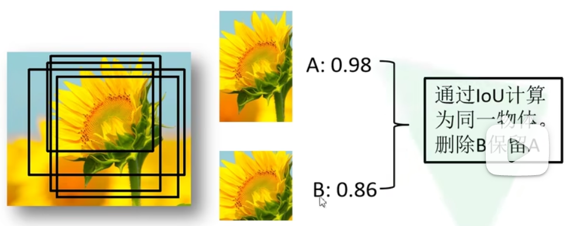

A的置信度为0.98，B的置信度为0.86，所以选择A为最高候选框。B与A的IoU大于阈值了，所以需要把B剔除，最终只留下一个最准确的框。

1.  对于每个类别，首先寻找得分最高的候选框
2.  计算其他候选框与该候选框的IoU。
3.  删除所有IoU值大于给定阈值的目标。

## 1.4 使用回归器精细修正候选框位置

由于通过Selective Search方法得到的候选框位置，对于检测目标来说，并不是十分准确。所以需要对第三步中NMS处理之后的剩余建议框进一步筛选，保留与gt框有相交且IoU大于阈值的框，然后用20个回归器对上述20个类别中剩余的建议框进行回归操作，最终得到每个类别的修正后的得分最高的BBox。
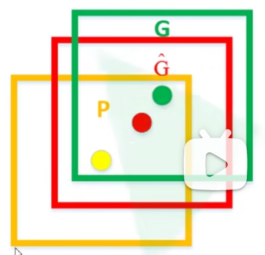

如图，黄色框P代表建议框，绿色框G代表gt，红色框$\hat G$代表修正后的预测框。
回归分类器输出四个值：目标建议框（中心点的x偏移量、y偏移量、框高度缩放因子、框宽度缩放因子），通过这四个值对建议框进行调整得到红色框。

## 1.5 RCNN的问题

1.  测试速度慢
    一张图片大约53s(GPU)，SS算法提取候选框用时2s，一张图片中候选框有大量重叠。
2.  训练速度慢，过程繁琐
3.  训练所需空间大。因为每个阶段都需要把结果保存下来供下个阶段使用。

* * *

# 2\. Fast R-CNN（2015年）

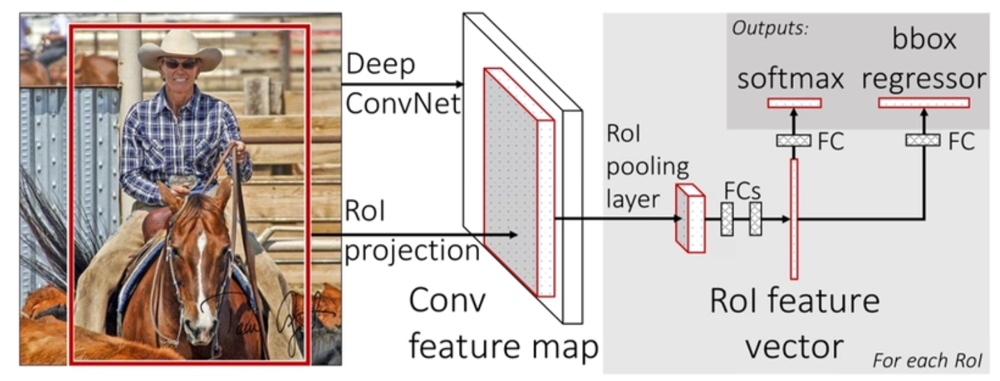 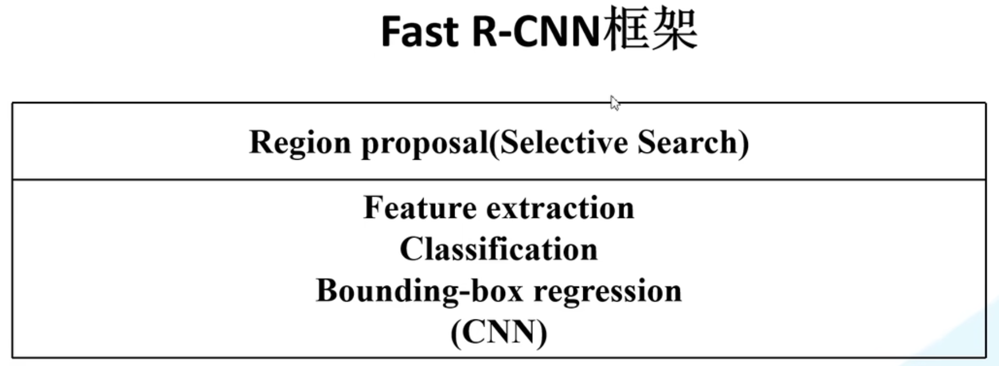

相同backbone（VGG16）下，训练时间快9倍，测试推理时间快213倍，准确率从62%提升到66%（Pascal VOC）

## Fast R-CNN算法流程，分为3步：

1.  一张图片生成1k~2k个候选区域（selective search算法）
2.  将原始图像输入网络得到特征图，将SS算法生成的候选框投影到特征图上获得相应的特征矩阵。
3.  将每个特征矩阵通过ROI pooling层缩放到7 * 7大小的特征图，然后把特征图展平，经过两个FC层得到特征，对这个特征采用两个分支处理：类别分支和bbox位置回归分支
    ROI pooling其实就是一个pooling层，只不过不是对整个特征图做poolig，而是对候选区域在特征图上投影的位置内做pooling。

## 2.1 特征提取的区别

R-CNN是依次将候选区域输入网络，分别提取。对于重叠的候选区域，重叠部分会重复计算特征。
fast R-CNN是将整张原图输入网络，然后从特征图上提取相应的候选区域。避免了候选区域特征的重复计算。而且不限制输入图像的尺寸。大幅提升速度。

## 2.2 候选区域的选择

对于每张图片，从2000个候选区域中选择64个作为RoIs，这里面包括正样本和负样本。
正样本：与gt框的IoU大于0.5的候选区域作为正样本，从这样的正样本中采样25%用于训练。
负样本：与gt框的IoU在【0.1, 0.5】之间的作为负样本。

## 2.3 RoI Pooling layer

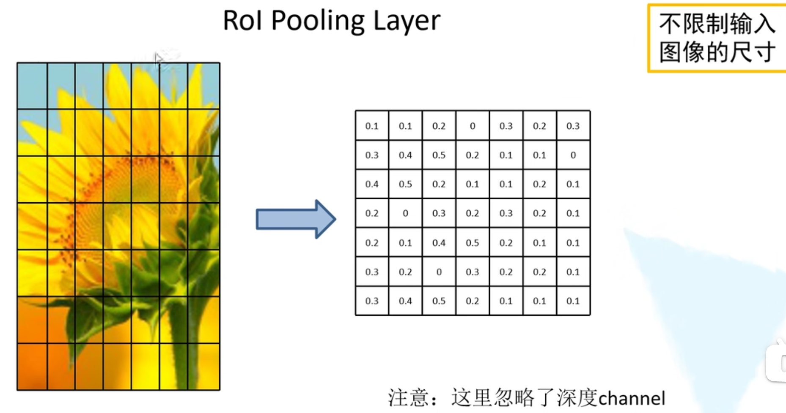

假设一个候选区域的特征图是左边这样，把这个特征图划分成7 * 7个部分，对每个小区域进行最大池化下采样，得到右边的图。这样无论特征图的尺寸是多少，池化后，都是7*7 的特征图。从而不用限制输入图像的尺寸。

## 2.4 分类器

输出N+1个类别的概率（N为检测目标的种类，1为背景）
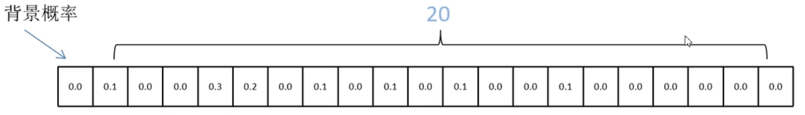

## 2.5 回归器

输出对应N+1个类别的候选边界框回归参数$(d_x, d_y, d_w, d_h)$，共$(N+1)*4$
注意，每个anchor box需要回归（N+1）个类别的参数。
如果有k个anchor box，那么一共要回归（N+1）* 4 * K个位置参数。
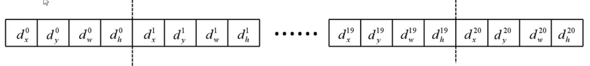
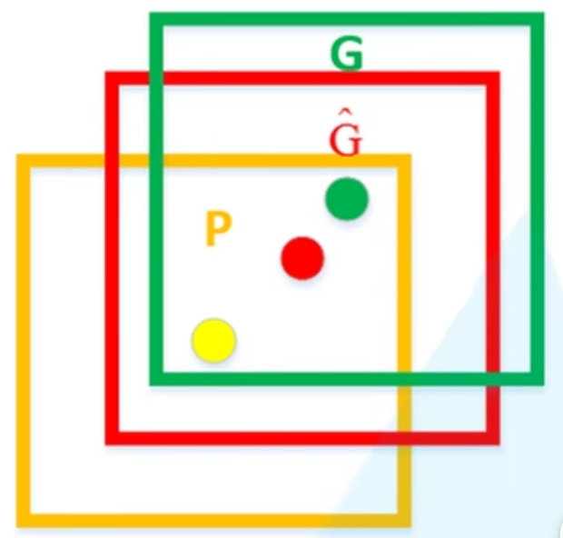

得到$(d_x, d_y, d_w, d_h)$，对候选框位置的更新方法：

$$
\hat G_x = P_w d_x(P) + P_x \\
\hat G_y = P_h d_y(P) + P_y \\
\hat G_w = P_w exp(d_w(P)) \\
\hat G_h = P_h exp(d_h(P)) 

$$

其中$P_x, P_y, P_w, P_h$分别为候选框的中心坐标和宽高。
$\hat G_x, \hat G_y, \hat G_w, \hat G_h$分别为预测的边界框的中心坐标和宽高。

## 2.6 Multi-task loss

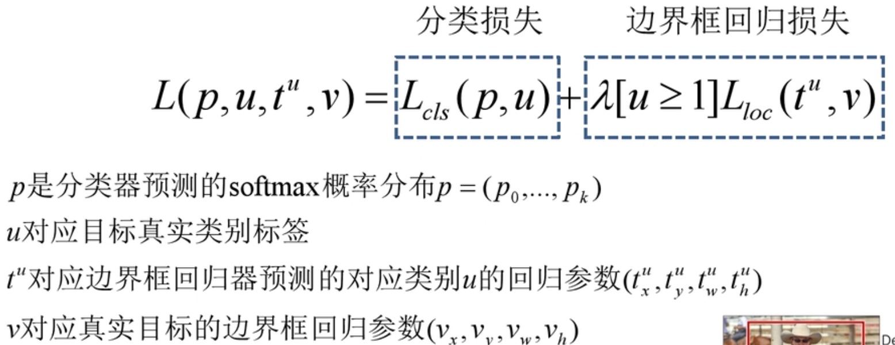

## 2.7 相比R-CNN

Fast-RCNN最后变成了两部分：SS和CNN分类回归。

* * *

# 3\. Faster R-CNN

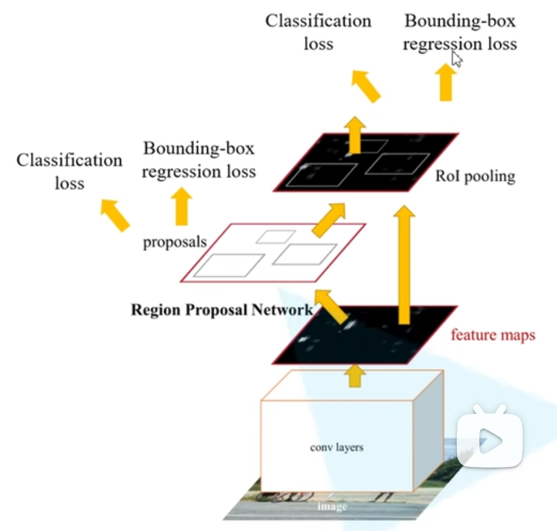 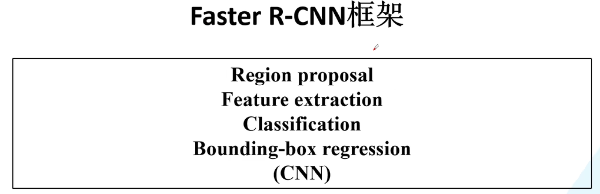

推理速度在GPU上达到5fps（包括候选框生成）。

## 3.1 Faster R-CNN的算法流程分为3个步骤：

1.  将图像输入网络得到相应的特征图
2.  使用RPN结构生成候选框，将RPN生成的候选框投影到特征图上获得相应的感兴趣区域ROI
3.  将每个感兴趣区域特征通过ROI pooling层缩放到7 * 7 大小的特征图，然后将特征图展平进行FC操作。
    所以，Faster R-CNN = RPN + Fast R-CNN

## 3.2 RPN

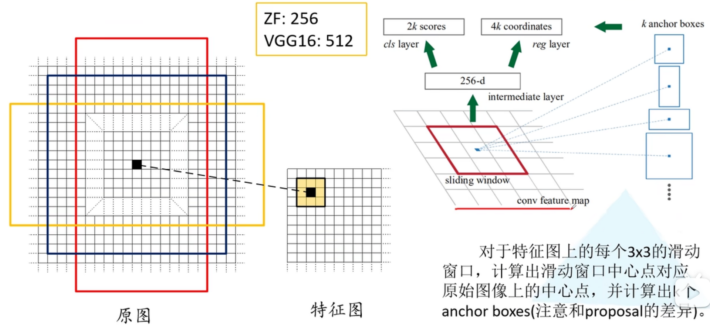

使用3 * 3 的窗口在特征图上进行滑动，每个位置生成一个256维（特征图的channel数）的特征向量，对这个特征向量，分别经过FC层，输出2K个目标概率和4K个边界框参数，其中K是anchor boxes的数量。
anchor box是相对于原图的：

1.  首先，对于特征图上的每个滑窗中心点，计算出对应原图的位置 $x = f_x * im_w / f_w$
2.  在原图上的对应位置，生成长宽比例不同的anchor box

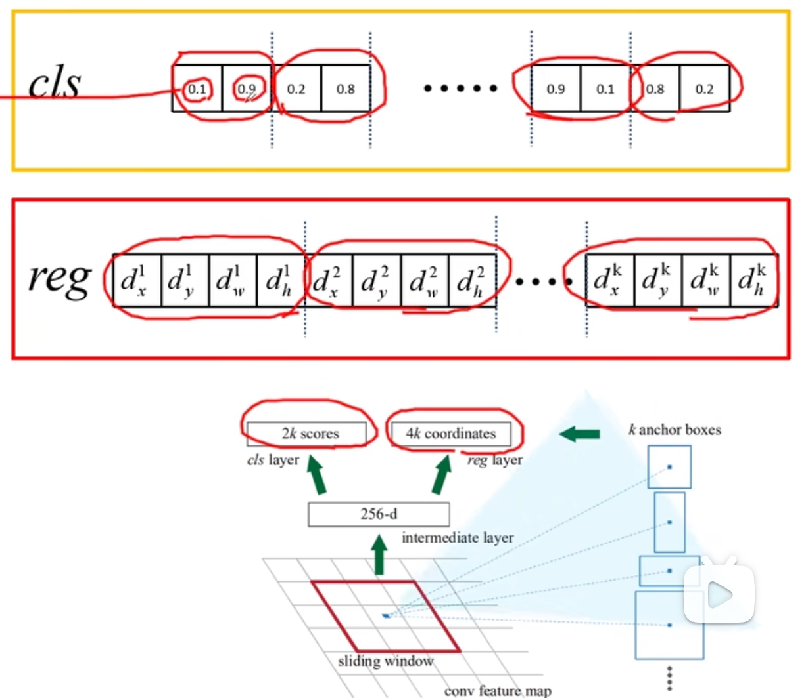

注意，这里的参数个数说的是RPN
对于K个anchor，会产生2K个类别：如上图，每两个类别是一组（背景概率，前景概率）。前景不区分具体的类别，只要不是背景，都为前景。所以这里都是二分类。
K个anchor会产生4K个边界框位置参数。

### 3.2.1 anchor的类型

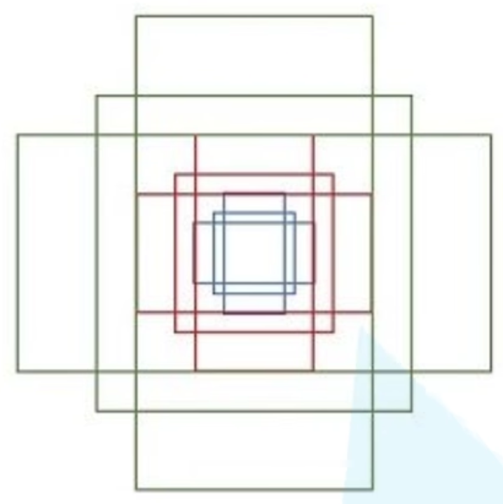

有三种尺度：$128^2, 256^2, 512^2$
三种比例：$1:1, 1:2, 2:1$
所以每个滑窗位置在原图上都对应 3 * 3 = 9 个anchor

## 3.3 感受野计算

ZF网络感受野为171， VGG感受野为228

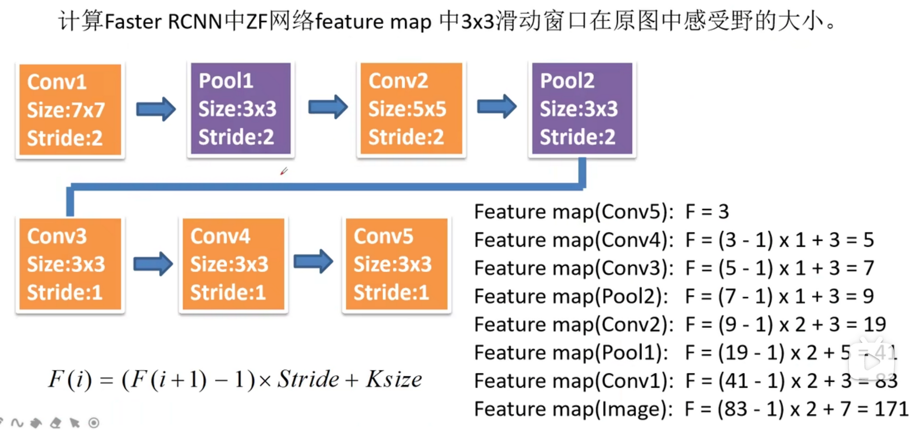

## 3.4 候选框的处理

对于一张1000 * 600 * 3 的图像，大约有 60 * 40 * 9（20K）个anchors，忽略跨越边界的anchor后，剩下约6K个anchors。然后利用RPN候选框回归参数，把6K个anchors计算得到6K个候选框，然后通过NMS剔除掉重叠的候选框，IoU设置0.7，这样每张图片剩下2K个候选框。

## 3.5 正负样本产生

正样本：与gt的IoU大于0.7的box作为正样本，如果都小于0.7，那么选择与gt的IoU最大的box作为正样本
负样本：与gt的IoU小于0.3的box作为负样本。

## 3.6 RPN的 loss

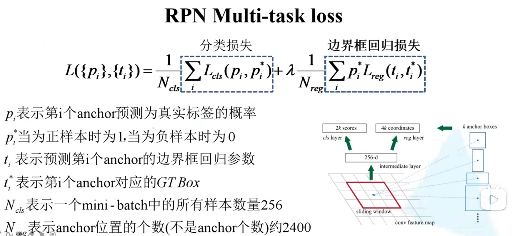

## 3.7 Faster R-CNN 的loss

与Fast R-CNN一样。
对于Faster R-CNN的预测输出，与Fast R-CNN相同：一个候选框要预测（N+1）个类别得分，同时预测（N+1）* 4 个位置参数

## 3.8 Faster R-CNN的训练

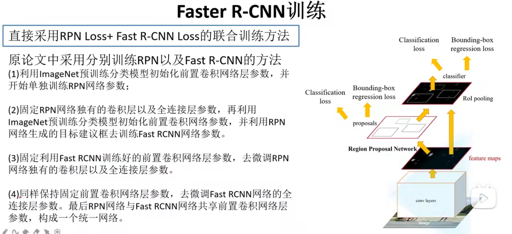