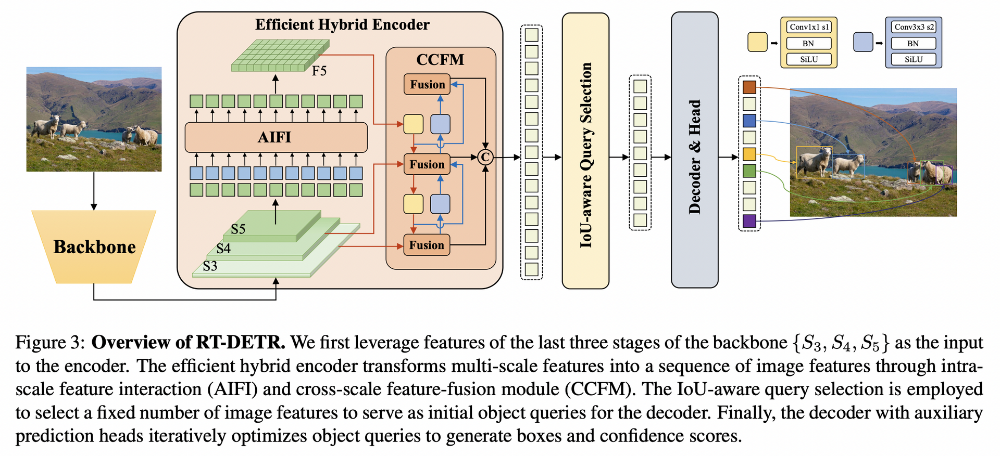
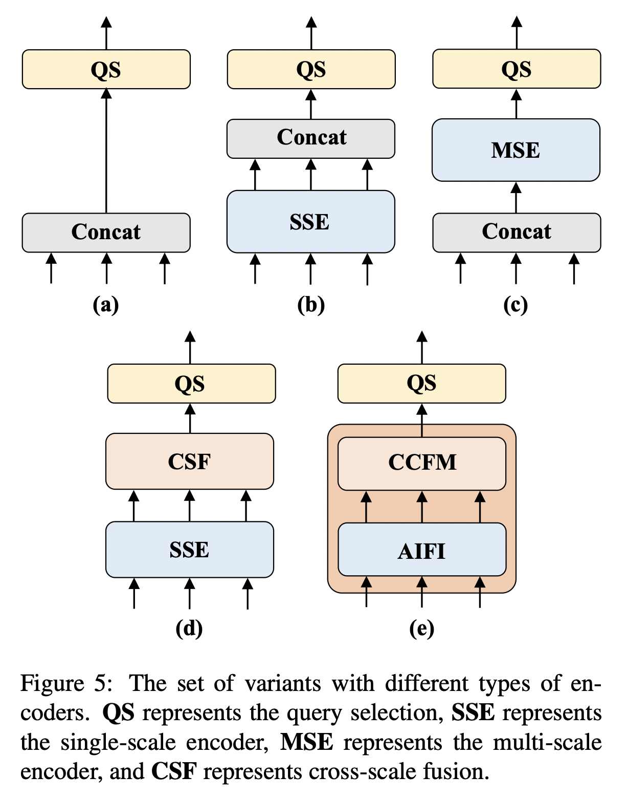
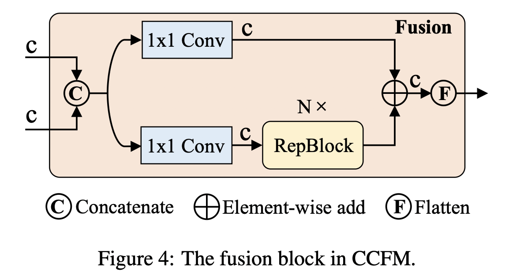
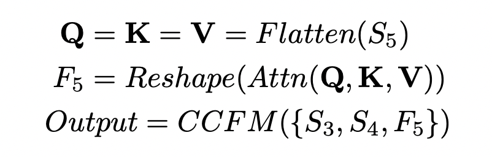
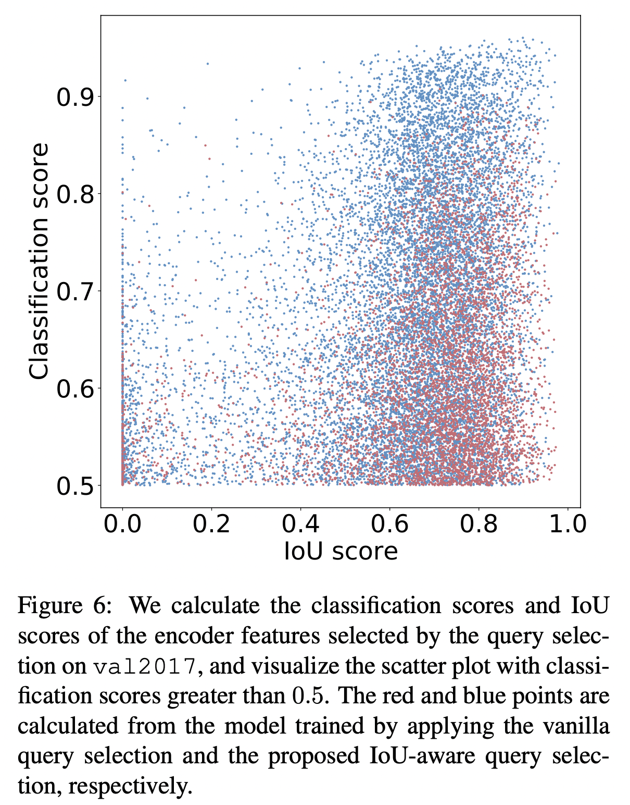
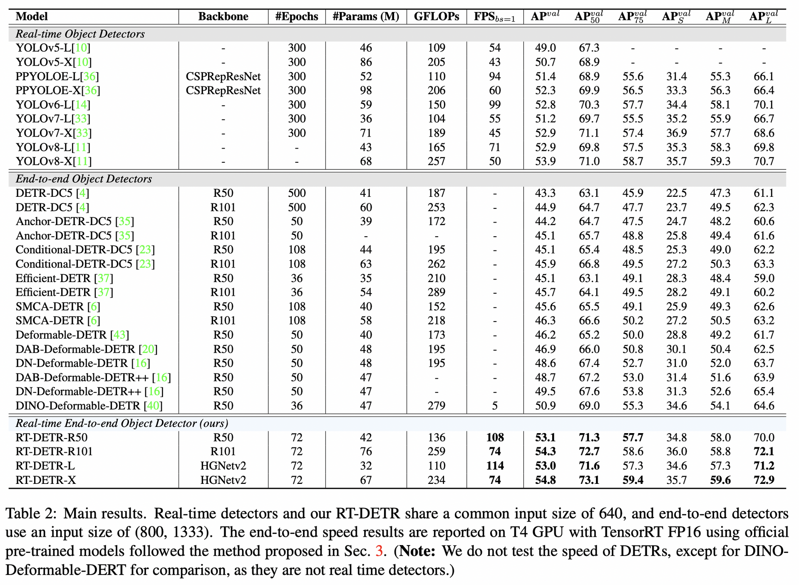
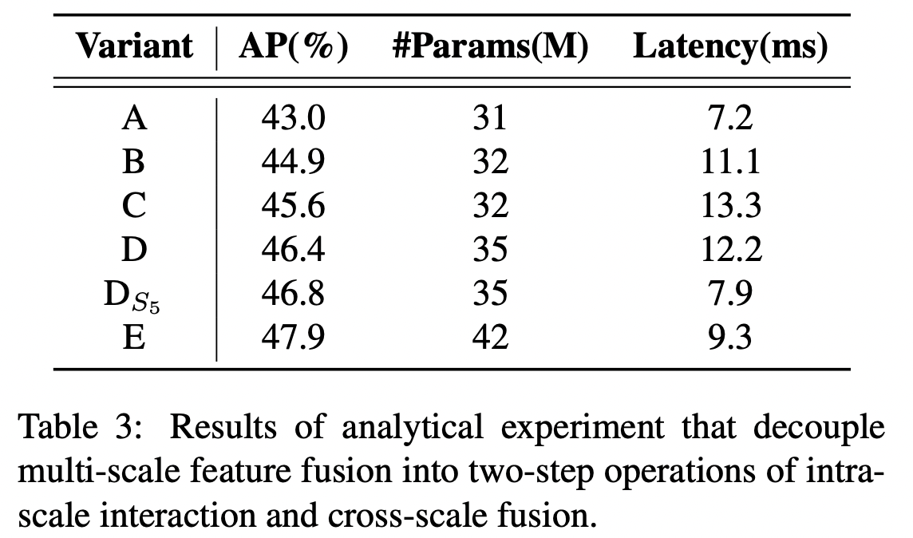
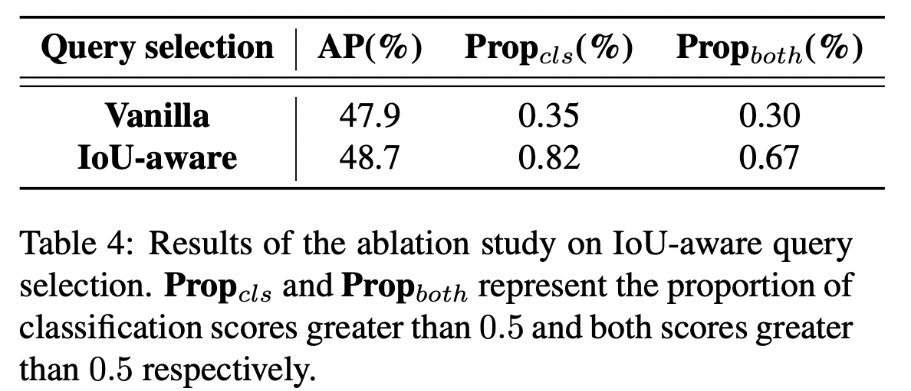
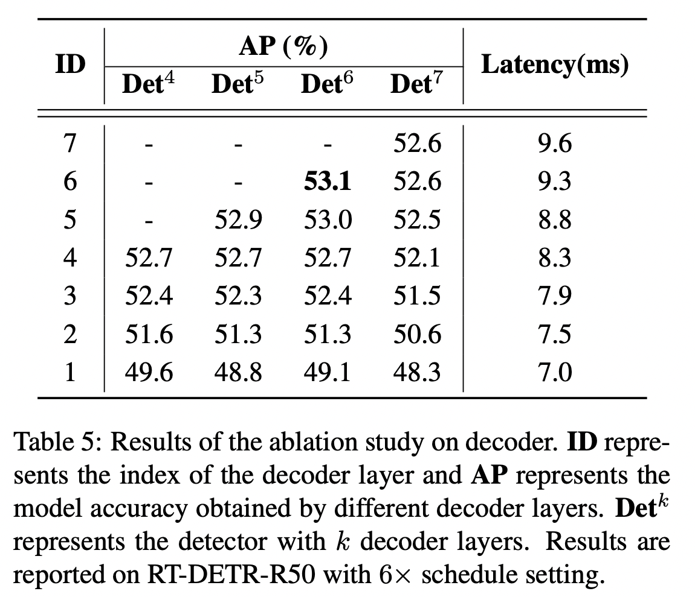

# DETRs Beat YOLOs on Real-time Object Detection

## 1 Motivation

1.  虽然DETRs提出了基于Transformer的端到端的目标检测训练框架，并且取得了显著的效果，但是高计算量限制了DETRs的应用，并阻止了充分利用无后处理的好处。

## 2 contributions

### 2.1 本文主要通过对之前方法两方面的不足进行分析并改进：

1.  多尺度特征虽然提升了精度，加快了收敛，但是却显著增加了encoder的输入序列长度，导致encoder成了计算瓶颈
2.  object query的选择方法：在DETRs中是可学习的embeddings，由于缺少明确的物理含义难以解释和优化；其他改进方法的一个共同点是：使用分类得分从encoder中选择top-K个特征初始化object query，但是由于分类得分和位置置信度的分布的不一致，导致预测的bbox具有高分类得分，低IoU，或者低分类得分，高IoU。

### 2.2 基于上面两方面，论文的主要贡献：

1.  本文分析了NMS在实时目标检测任务中的影响，并建立了end-to-end速度评估基准。（略）
2.  设计了高效的混合编码器，通过把尺度内特征交互和多尺度融合进行解耦，来处理多尺度特征
3.  提出面向IoU的query选择，来提升object query的初始化效果
4.  提出的检测器可以在不重新训练的情况下，通过使用不同解码层来灵活的调整推理速度

## 3 RT-DETR方法

### 3.1 Efficient Hybrid Encoder

对DETR的改进方法：Deformable-DETR通过引入多尺度特征和可变形的attention机制加速了收敛，提高了效果，但是多尺度显著增加了encoder的输入序列长度。”the encoder accounts for 49% of the GFLOPs but contributes only 11% of the AP in Deformable-DETR“
本文认为：高层特征是从低层特征提取，包含了关于目标的丰富语义信息。直觉上，在合并的多尺度特征上执行信息交互是冗余的。
为了验证，作者设计了一系列改进实验：

A：多尺度特征之间的attention
B：去掉multi-scale attention，引入一层Transformer block，每个尺度的特征共享encoder来进行尺度内的特征交互，并对多尺度输出的特征进行合并
C：基于B把合并的多尺度特征送到encoder中进行特征交互。
D：把尺度内交互和跨尺度融合进行了解耦
E：作者采用混合编码器对D进行的优化
Efficient Hybrid Encoder包括两部分：

1.  AIFI：Attention-based Intra- scale Feature Interaction module
2.  CCFM：CNN- based Cross-scale Feature-fusion Module

#### 3.1.1 AIFI：只在$S_5$上执行尺度内

作者认为在具有更丰富语义概念的高层执行自注意力能够抓住概念实体间的联系，可以促进后续模块对物体的检测和识别；同时低层特征的尺度内交互是没有必要的，因为缺少语义概念，而且与高层特征交互具有冗余和混淆的风险。实验证明，减少了35%的时间，并提高了0.4% AP的精度。这个结论对实时检测器很重要。

#### 3.1.2 CCFM：

把卷积层构成的融合模块插入到融合过程中，其目的是把相邻特征融合到一个新特征中，结构如下：

AIFI和CCFM的过程如下：

### 3.2 IoU-aware Query Selection

面相IoU的query选择策略：通过约束模型对高IoU的特征产生高的分类得分，低IoU的特征产生低的分类得分。这样，模型根据分类得分选择的对应于top-K个encoder特征的预测框就同时具有了高分类得分和高IoU得分。

#### 这种选择方式的有效性分析：

作者通过IoU-aware选择方法和普通的query选择方法得到的上面的图，点越靠近右上角说明效果越好。
分布特性如下：

1.  图中，蓝色比红色多138%，有更多红色点的分类得分小于0.5
2.  图中，IoU得分大于0.5的点中，蓝色比红色多120%
    定量分析结果说明：面向IoU的query selection方法，能够给object query提供更多精确分类得分和精确位置的encoder 特征。

### 3.3 Scaled RT-DETR

BackBone使用HGNetv2。
通过depth multiplier和width multiplier来同时伸缩BackBone和混合编码器

## 4 ablation study

### 4.1 Hybrid Encoder

### 4.2 IoU-aware Query Selection

### 4.3 Decoder

表中显示了不同解码层数的精度和速度
