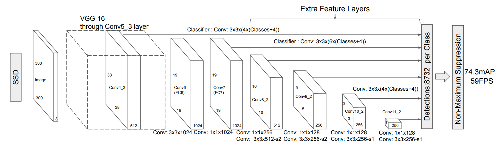
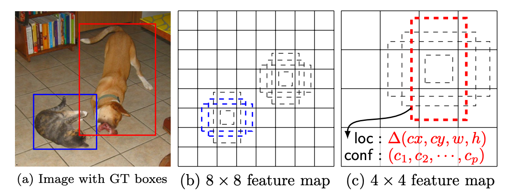
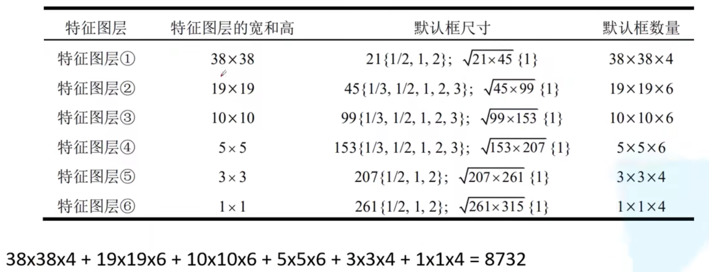
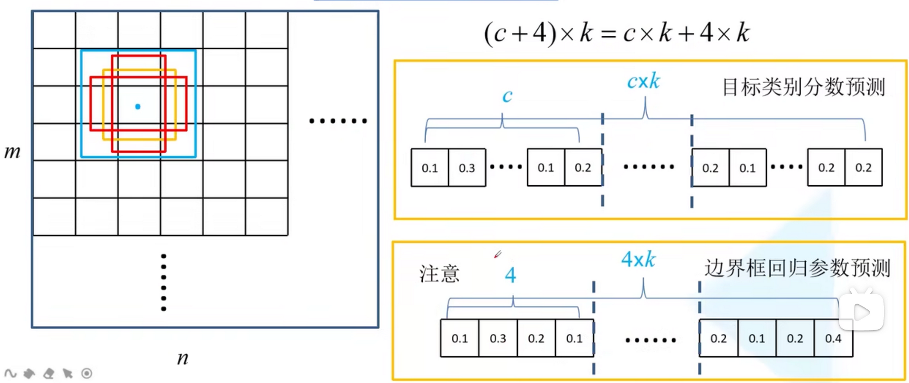

参考链接：[https://www.bilibili.com/video/BV1fT4y1L7Gi/?spm\_id\_from=333.999.0.0&vd_source=d5e7a7f2c9d4901c3128ee7eef2f68d5](https://www.bilibili.com/video/BV1fT4y1L7Gi/?spm_id_from=333.999.0.0&vd_source=d5e7a7f2c9d4901c3128ee7eef2f68d5)

Faster R-CNN存在的问题：

1.  对于小目标检测效果差（只在一个特征层进行预测，feature map的抽象很高，细节信息缺失，所以小目标在这种特征层上对应的特征也很少。检测小目标需要比较高层的信息，或者说检测这个任务就需要浅层的信息，因为检测主要面对的是轮廓、边缘等信息，而浅层特征很好的保留了这些。）
2.  模型大，检测速度比较慢。（主要原因是两阶段预测：RPN的预测和CNN的预测）

# SSD 检测算法

在6个feature map上进行预测输出。

在上图可以看出，较大的8 * 8 特征图适合预测猫的位置，较小的4 * 4 特征图适合预测狗的位置。

## 1\. default box

6个特征层会产生8732个default box
每一层上都有不同尺寸和不同比例的default box。其中都有两个1：1比例的框，分别是原始尺寸和开根号的尺寸。对于特征层1、5、6有四个default box，特征层2、3、4有6个default box，这些对应的都是原始尺寸。

## 2\. 预测的实现

特征图上的每一个位置会生成 k 个default box，根据上面的说明，这里的k与对应的特征层有关。对于每一个default box计算 c 个类别得分 和 4 个相对原始default box的偏移量，这里的 c 是包括背景类的，比如pascal voc有20个目标类，加上一个背景类后，c=21.
对于一个m * n 的特征图，总共需要预测 $(c+4)*k*m*n$个参数。如下图，一个default box 的预测：

注意，这里与Faster R-CNN有不同：
在预测类别得分时：一个default box预测c 个类别得分（这与Faster R-CNN相同）
在预测位置参数时：一个default box只预测 4 个位置参数，不对位置区分类别（与Faster R-CNN不同）

## 3. 正负样本
### 1. 正样本选择
与Faster R-CNN类似，只是阈值不同：
1. gt与default box 的IoU最大的
2. 与gt的IoU大于0.5 的。
### 2. 负样本
对于剩下的default box都可以认为是负样本，如果全都用，会导致样本不均衡。
根据confidence loss来排序，选择排在前面的，使得负样本与正样本的比例为3：1.