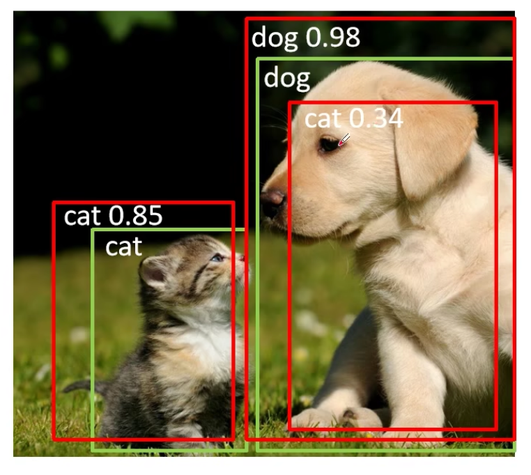
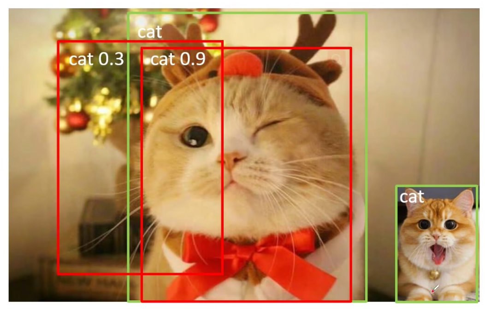
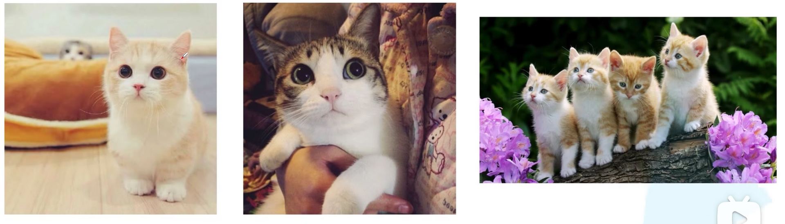
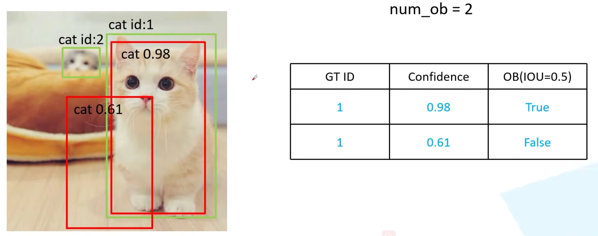
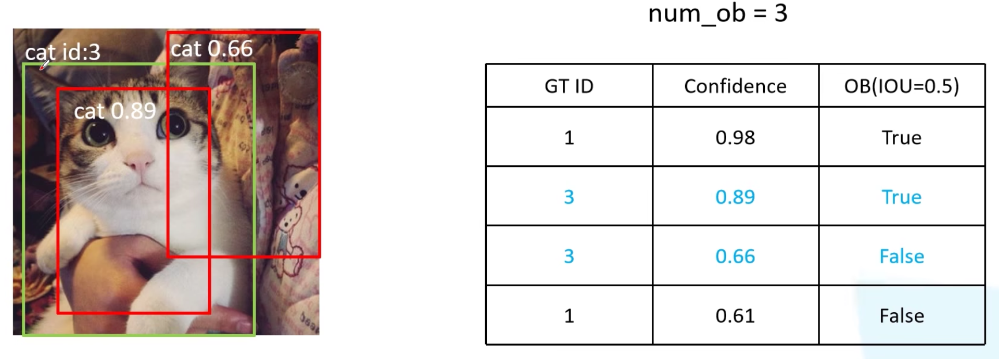
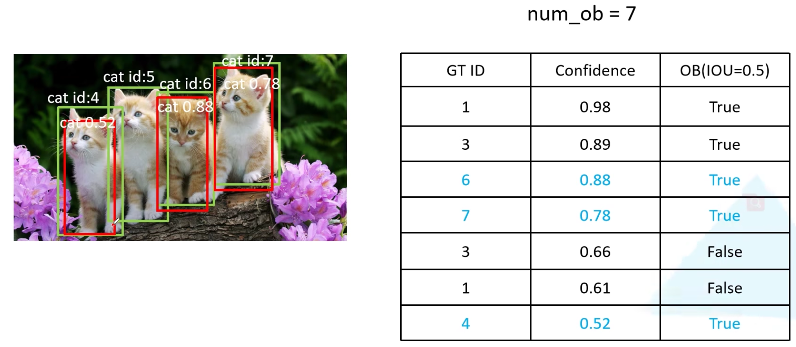
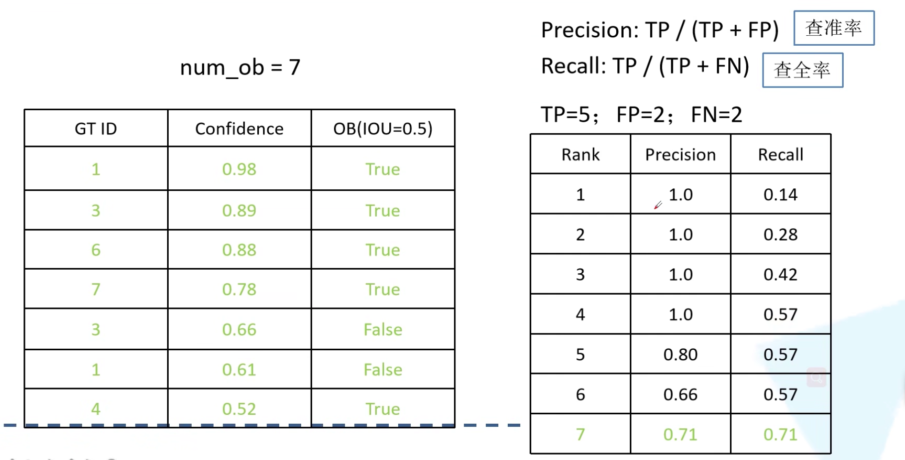
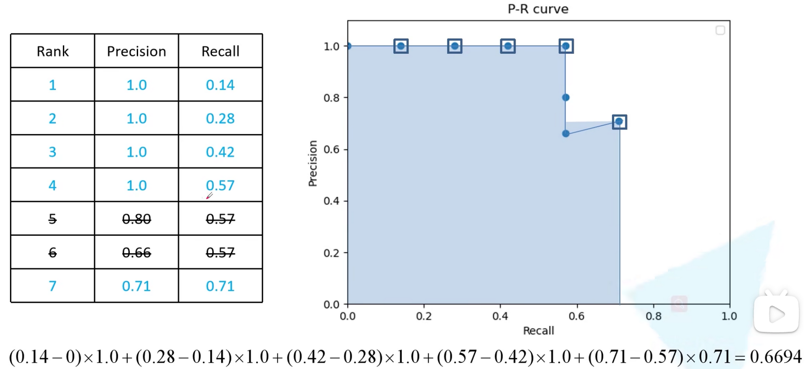
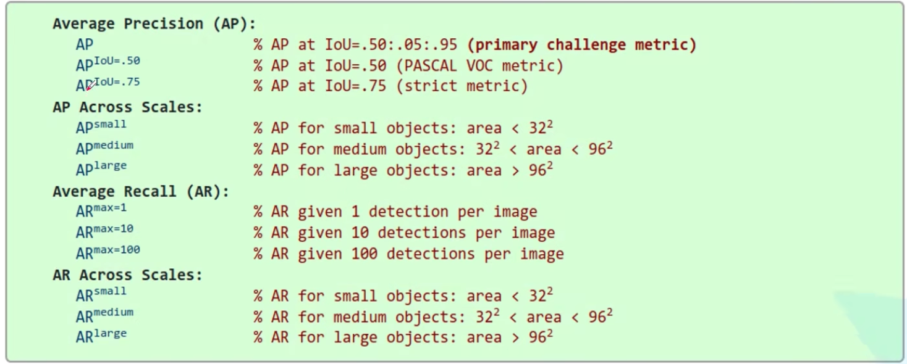
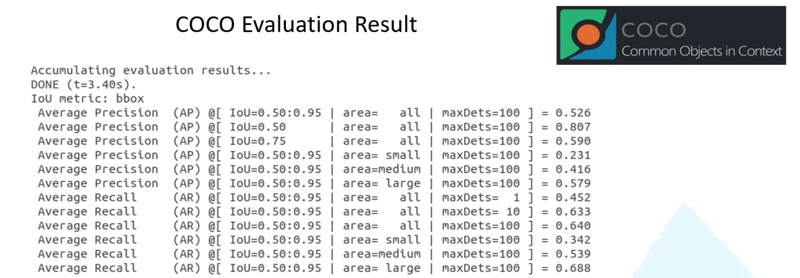

## 1\. 如何算检测正确，需要综合考虑下面三点：

1.  IoU大于指定阈值
2.  类别正确
3.  confidence 大于指定阈值

## 2\. 目标检测中的常见指标：

**TP**：$IoU>0.5$的检测框数量
**FP**：$IoU <= 0.5$的检测框数量
**FN**：没有检测到的GT的数量
**Precision**：$TP / (TP+FP)$模型预测的所有目标中，预测正确的比例
**Recall**：$TP/(TP + FN)$所有真实目标中，模型预测正确的目标比例
**AP**：P-R曲线下面积，每个类别都要计算一个AP
P-R曲线：precision-recall曲线，横坐标是recall，纵坐标是precision
**mAP**：mean Average Precision，即各类别AP的平均值。

图中两只猫，绿色是gt box，红色是预测box。
首先要从所有检测框中挑出类别为猫的框。
cat 0.9这个框，是一个TP
cat 0.3这个框，是一个FP
对于右下角的小猫，没有对应的检测框，所以是一个FN。

## 3\. AP计算示例

对于下图的三张图片，绿框是gt，红框是检测框。首先需要累加gt 目标数，得到num_ob，对于分类为猫的检测框，按照confidence从大到小排序，并记录每个检测框是否为TP

对于上面的表格，按照confidence设置不同的阈值，计算每个confidence阈值下的Precision和recall。
在判断一个检测框为TP时，其confidence和IoU都要大于阈值。

- confidence_th=0.98：
    TP=1：只有一个box的confidence和IoU都大于阈值
    FP=0：没有检测错的
    FN=6：num_gt - TP = 7-1 = 6。confidence和IoU至少有一个小于阈值，则是FN。
    Precision=1 / (1 + 0) = 1
    Recall = 1 / 7 = 0.14
- confidence_th=0.89
    TP=2
    FP=0
    FN=5

全部的计算结果如下：

然后把recall当做横坐标，precision当做纵坐标可以画出一条P-R曲线。
这里所有的检测框都是经过NMS处理之后的
对于相同的recall值，只画出最大的precisioin点。

## 4\. COCO评价指标中每条数据的含义

### COCO评价指标说明

注意，图中的AP其实都是mAP

**Average Precision(AP)：**
1.  $AP$：IoU从0.5到0.95，每隔0.05的10个IoU阈值下的mAP的平均值，COCO的指标
2.  $AP^{IoU=.50}$：是IoU=0.5时的mAP，Pascal VOC的指标
3.  $AP^{IoU=.75}$：更严格的标准。

**AP Across Scales：**
针对不同尺寸的目标分别进行评测的结果。根据实际任务中目标的大小来选择自己的关注重点。

**Average Recall**：
$AR^{max=100}$：一张图片最多只预测100个目标，即NMS之后，最多有100个预测框时，recall的结果
$AR^{max=10}$：一张图片最多只预测10个目标，即NMS之后，最多有10个预测框时，recall的结果
$AR^{max=1}$：一张图片最多只预测1个目标，即NMS之后，最多有1个预测框时，recall的结果

**AR Across Scales:**
不同目标尺度下，recall的值。

COCO评测结果示例：
