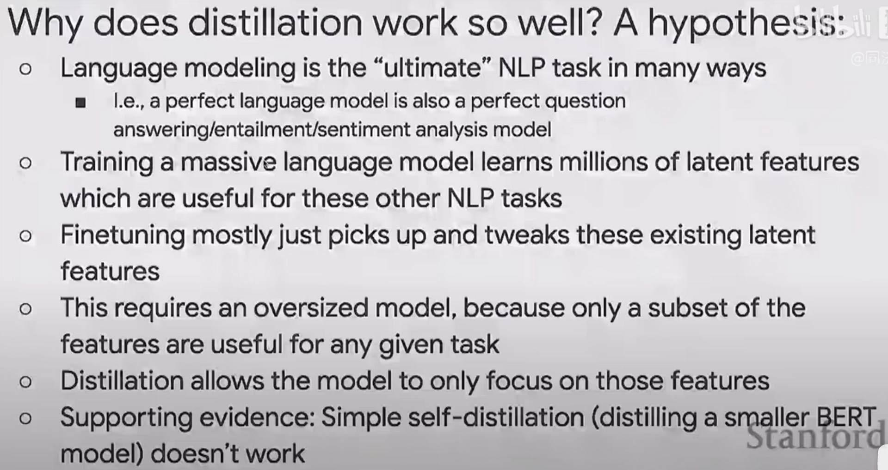

知识蒸馏为什么有用？可以从以下几个方面理解。

### 1\. 数据层面

一个相同的很大的数据集中，肯定会包含各种噪声。
假设teacher网络和student网络参数都足够。单独训练student，肯定会受到更多的噪声的影响；使用蒸馏的方法，teacher模型已经对数据进行了一次数据过滤，信息提取，可以认为降低了噪声的影响。
当student网络容量不够时，teacher可以把重要的信息提供给student，使得student不用太关注噪声的影响，让student有限的容量装进更多有用的信息。
teacher网络较大，表达能力比较强；student网络小，表达能力小。对于一批大数据，单独训练的话，teacher网络能够收敛到正确的位置，但是student收敛到的位置会有偏差。用蒸馏的方式，teacher的结果可以作为一个监督，把student的结果朝着正确的位置拉近。

#### 使用大数据训练teacher模型，在小数据上蒸馏student模型。

根据KD论文中的实验，用全量MNIST数据训练teacher模型。在student蒸馏训练时，把数字3从MNIST数据中去除，这样训练好的student模型对于数字3也有识别能力。这说明，**teacher模型可以把数据中一些没有的信息传递给student。**
现在兴起的预训练大模型也是基于上面的理论。用大量的数据训练超大网络，然后在一个小的业务数据集上，蒸馏训练业务模型。

### 2\. target层面

直接训练student使用的是hard target，是正例的标记为1，负例都标记为0。这样把所有负例同等看待，切断的正例和负例之间更加细节的联系。例如，训练马、驴、车三个类别，马被标记为1，驴和车都标记为0，但是实际上，马和驴是有相似性的，把驴和车都标记成0，一方面切断了马和驴的联系，另一方面相对于马，把驴和车看做同等价值的负样本。
而用蒸馏的方法，teacher网络可以提供更多样本之间的信息，比如，teacher模型可以得出一张图片是马的概率为0.7，驴的概率是0.25，车的概率是0.05，这样就提供了各个类别之间的一种联系：马和驴很像，但是跟车不像。
所以teacher模型可以提供一种soft target，包含了类别之间的一些关系。这样使得student更容易学习，在特征空间中，student就不需要非得把马、驴、车划分到距离相等的位置。

### 3\. 从交叉墒计算层面

例如：对于一张图片，其label转成one-hot形式为y=\[0, 1, 0, 0, 0\]，teacher的logit=\[0.1, 0.6, 0.15, 0.1, 0.05\]，student网络经过softmax输出的结果logit = \[0.3, 0.4, 0.15, 0.1, 0.05\]，
**对于hard target**，loss的计算为：
loss=-(0×log(0.3) + 1×log(0.4) + 0×log(0.15) + 0×log(0.1) + 0×log(0.05)) = -1×log(0.6)，仅仅使用了logit中类别相关的值。
**对于soft target**，loss的计算为：
loss=-(0.1×log(0.3) + 0.6×log(0.4) + 0.15×log(0.15) + 0.1×log(0.1) + 0.05×log(0.05))，使用了所有的值。
在不考虑softmax的操作时，上面根据交叉熵计算loss的过程中，由于负类的hard target都为0，所以loss只和本类别相关。而使用soft target，所有类别信息在loss中都有贡献。

## BERT对于蒸馏为什么有用的解释：

