论文链接：https://export.arxiv.org/pdf/2203.08679.pdf

<div align="center">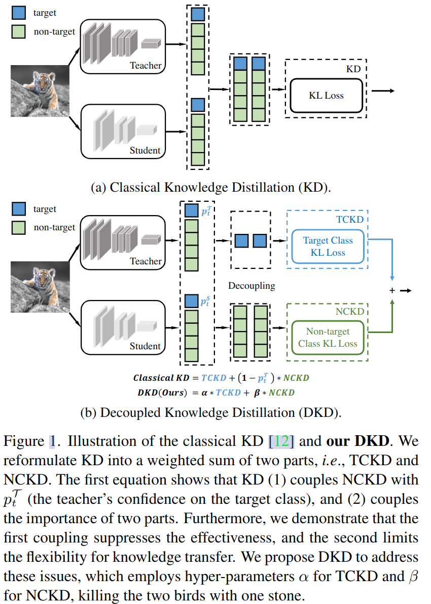</div>

## motivation

1.  什么限制了knowledge distilling（KD) 的性能
2.  reformulation可以帮助更好的理解KD
3.  如何让KD获得最好的表现

作者对比发现，KD的结果不如后来出现的feature map蒸馏的表现效果。理论上最后的logit的结果具有更加抽象、更高级、更直接、更准确的语义信息，但是结果却不如用之前的feature蒸馏的结果。作者猜测是什么东西限制了KD的性能。

## KL散度

$$
KL[P(X)||Q(X)] = \sum_{x\in X}[P(x)log\frac{P(x)}{Q(x)}] \\
=\sum_{i=1}^nP(x_i)log\frac{P(x_i)}{Q(x_i)}

$$

在优化中，P(X)是真实分布，Q(X)是一个用于拟合P(X)的近似分布，通过更新Q(X)使得二者的KL散度尽可能小，来实现用Q(X)拟合P(X)。
在蒸馏中，teacher模型输出的logit看做是P(X)，student模型输出的logit看做是Q(X)。

## 方法

### Reformulatioin

1.  重写分类预测：
    
    <div align="center">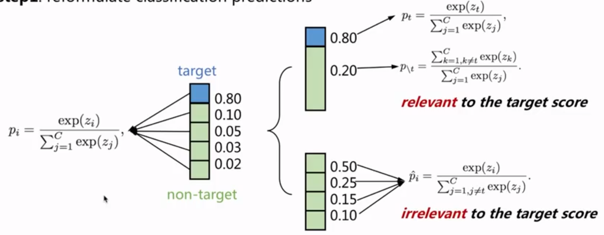</div>
    
    把左边原始的softmax拆成两部分softmax：target相关的softmax和target无关softmax。
    target相关部分做target类和非target类的二分类；target无关部分做非target的多分类。最后把两部分加起来。
    
2.  重写KD
    
    <div align="center">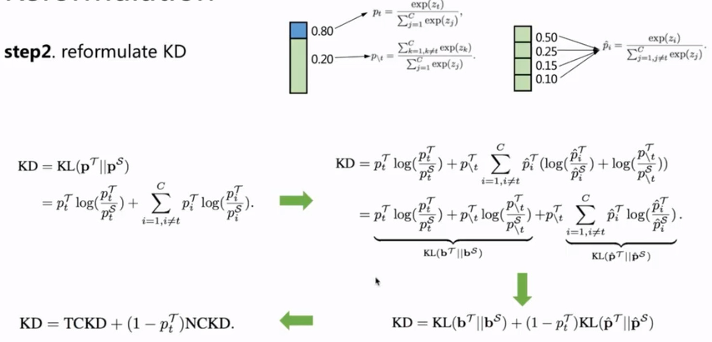</div>
    
    根据图中的箭头表示的转换方式，最后把KD转换成了TCKD(target class knowledge distillation)和NCKD(non-target class knowledge distillation)的组合。$T$代表teacher，$S$代表student。$p_t^T$表示teacher在target这个类别上的置信度。
    
	**KL loss分解公式的分析：**
	**从KL loss分解后的公式可以看出：如果一个样本的teacher输出的置信度很高，那么公式后面$(1-p_t^T)KL(p^\tau || p^S)$部分的值会很小。当teacher对于一个样本的置信度$p_t^T$很高时，说明这个样本是一个简单样本。对于简单样本，二分类很容易能学好，而第二部分的值很小，对学习产生的作用很小，所以这个简单样本在后续训练中起到的作用也很小。而分解公式中的第二部分是其他类别之间的一个N-1分类，这一部分本来可以用来学习一个负样本之间的关系，但是却被$(1-p_t^T)$给抑制住了。**

<div align="center">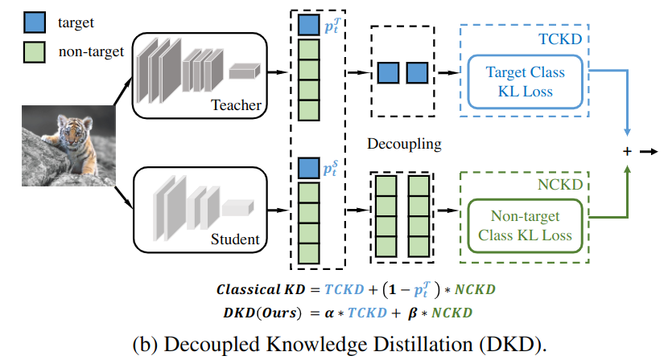</div>

```
根据上面的拆分，分别对TCKD和NCKD做实验分析： 
```

<div align="center">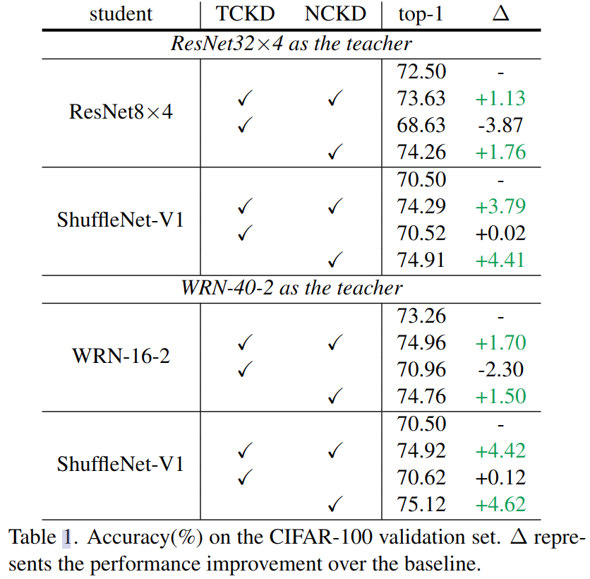</div>

表中第一行代表单独训练一个student作为baseline。可以看出，单独使用TCKD蒸馏时，精度下降严重。而只是用NCKD时，相比于baseline有明显提升，相比KD也有少量提升，而且异构网络提升更明显。
说明在CIFAR-100数据集上，TCKD起了反向作用，NCKD是效果提升的主要原因。

### TCKD传递样本难易程度相关的知识

<div align="center">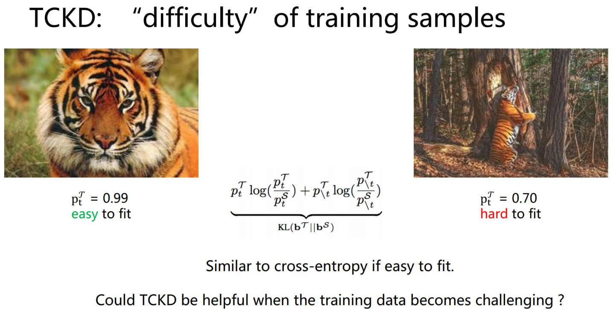</div>

根据TCKD的公式可以看出，就是一个二分类的KL公式。
上图说明对于简单样本，teacher模型的置信度高，TCKD也希望student能把这个样本拟合的好一点；当遇到难样本时，teacher的置信度比较低，TCKD也不需要student拟合的特别好。所以认为TCKD在传递样本的难度（？）为什么在CIFAR上没用，猜测因为这个数据集太简单。那么提高数据集的难度，TCKD是否会涨点，如果涨点，则说明TCKD确实是传递样本难度。

<div align="center">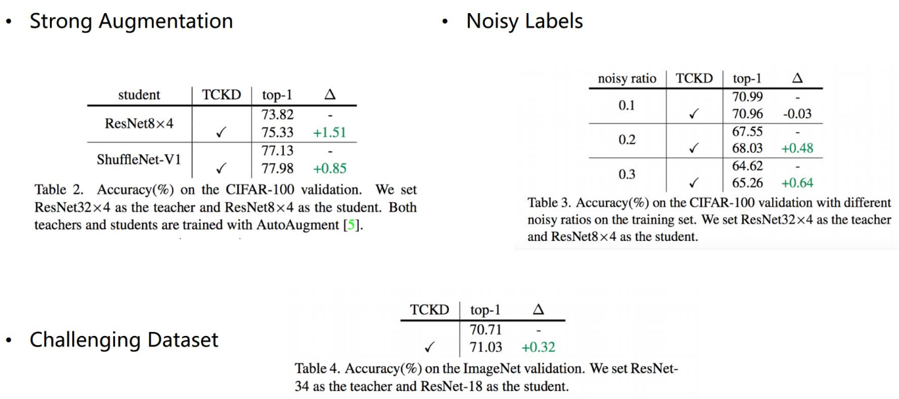</div>

通过三组实验来说明数据集难度增加确实可以涨点，验证了TCKD传递样本难度的猜想。说明，数据集比较难的时候，teacher模型更加有用。

### NCKD：涨点的主要原因，但是被抑制了，传递样本间relation相关的知识

<div align="center">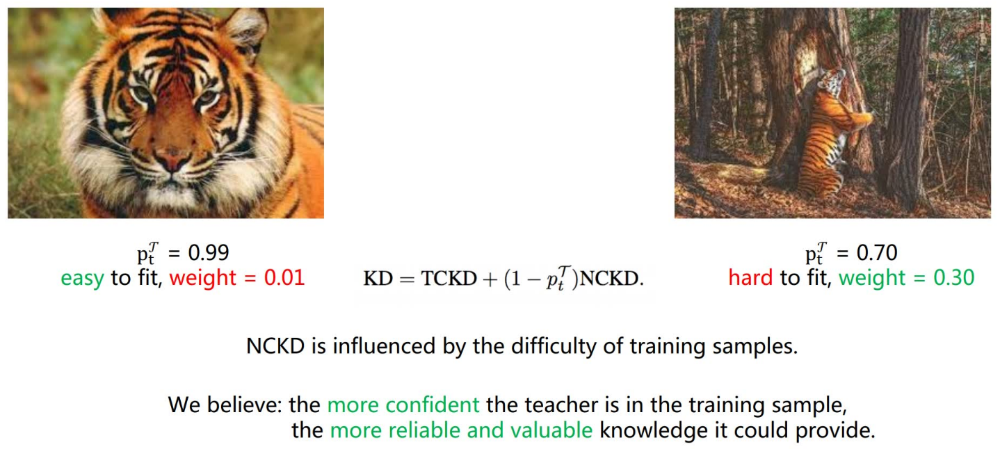</div>

当teacher对样本置信度高时比如0.99，那么NCKD的贡献度才0.01，很小。NCKD被样本的难易程度限制了。teacher模型的置信度越高，NCKD贡献度越小，这与我们的直觉相反：teacher模型的置信度越高，它就能传递更可靠和有价值的信息。
实验：
1.  训练样本按照teacher的置信度排序$p_t^T$
2.  把训练数据拆分为简单样本和困难样本两个子集
3.  在每个子集上应用NCKD
    最后说明: **学的很好的样本上知识更加有价值，但是被$1-p_t^T$ 给抑制了**
	
	<div align="center">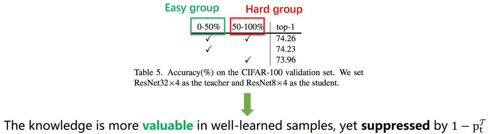</div>

### 限制KD的性能的原因：TCKD和NCKD高度耦合

1.  NCKD与$p_t^T$绑定，导致那些被预测较好的样本的作用被限制，好的知识传播受限
2.  TCKD与NCKD绑定，导致平衡样本难易程度的灵活性被限制。固有知识的传播机制是不同的。
    基于上面的分析，提出**解耦的知识蒸馏**，用两个超参数$\alpha、\beta$平衡TCKD和NCKD，NCKD不会被teacher的置信度抑制。

### 解耦蒸馏实验

#### CIFAR-100实验

1.  分别对比$\alpha、\beta$的设置相比于$1-p_t^T$的效果。
    
    1.  把NCKD与$p_t^T$解耦，从73.64%->74.79%
    2.  NCKD与TCKD解耦，从74.79%->76.32%<div align="center">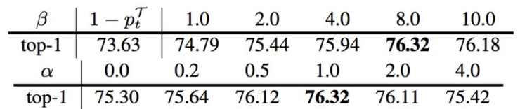</div>
2.  teacher和student采用同种架构的模型，与其他蒸馏方法的对比
    
    <div align="center">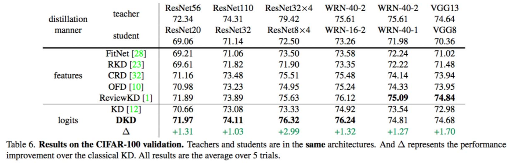</div>
3.  teacher和student采用不同架构的模型，与其他蒸馏方法的对比
    
    <div align="center">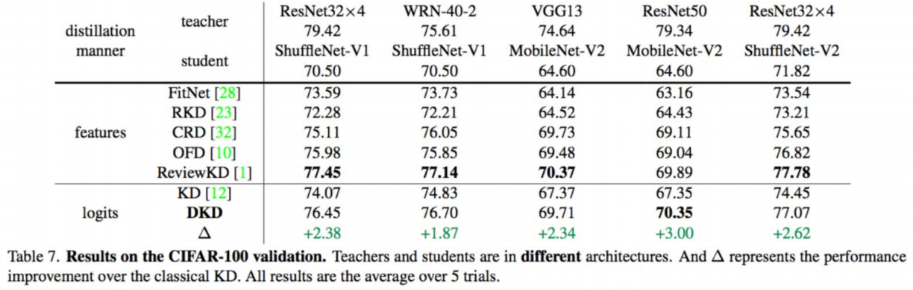</div>

#### ImageNet上的实验

<div align="center">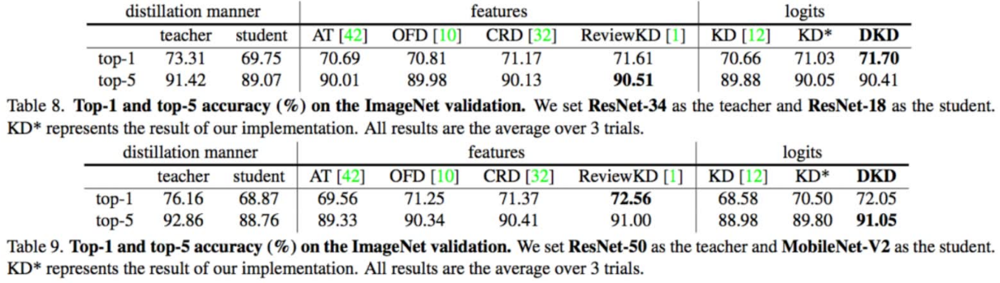</div>

#### MS-COCO 检测实验

<div align="center">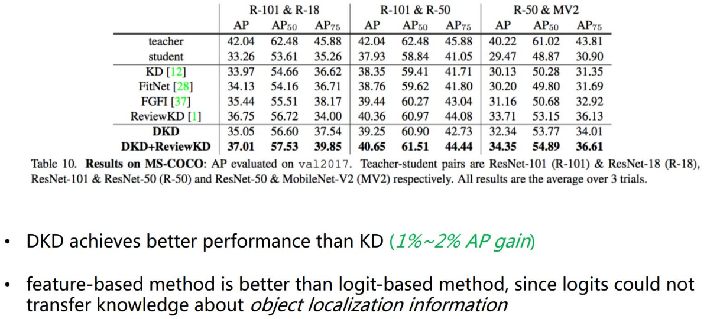</div>

#### 训练效率：更低的训练成本，更高的效果

<div align="center">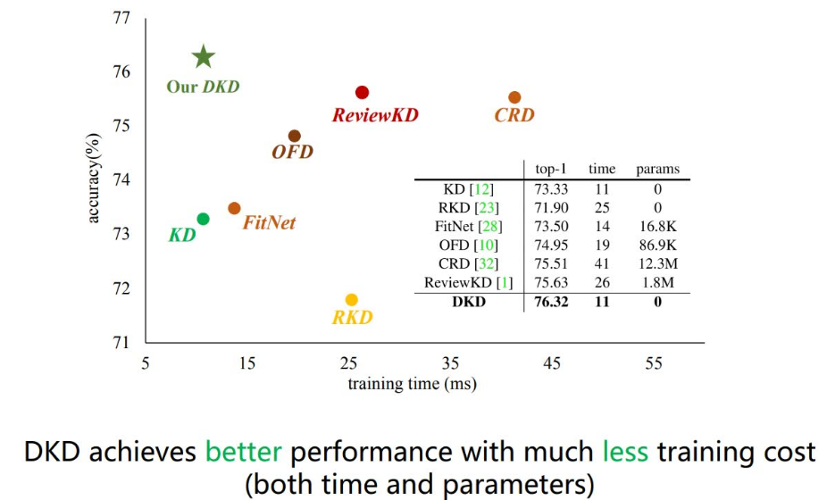</div>

#### 用DKD可以实现更大的teacher网络，更好的蒸馏效果。

<div align="center">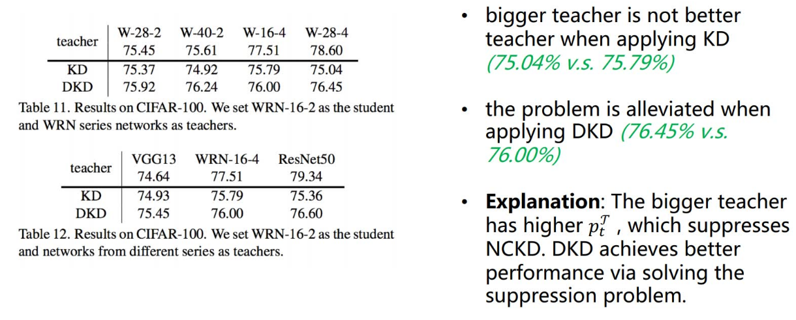</div>