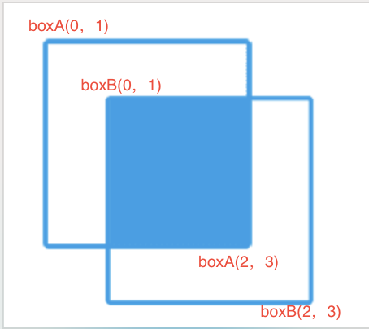

目标检测任务中，判断检测框是否正确的指标：预测框和真值框之间的交集面积 除以 并集面积。

一个box用左上角和右下角的四个值表示box=\[a0, a1, a2, a3\]，分别表示左上角(x, y)和右下角(x, y)。
如果两个框有交集，那么应该是两个框的左上角点的最大值（x靠右和y靠下）和两个框的右下角点的最小值（x靠左和y靠上）之间有重叠的部分。
代码

```python
def IoU(boxA, boxB):
    # 两个框左上角的最大值
    xA = max(boxA[0], boxB[0])
    yA = max(boxA[1], boxB[1])
    
    # 两个框右下角的最小值
    xB = min(boxA[2], boxB[2])
    yB = min(boxA[3], boxB[3])
    
    # 计算交集的面积:xB-xA+1 和 yB-yA+1 大于0，表示有交集。
    inter_area = max(0, xB - xA + 1) * max(0, yB - yA + 1)
    
    boxA_area = (boxA[2]-boxA[0]+1) * (boxA[3]-boxA[1]+1)
    boxB_area = (boxB[2]-boxB[0]+1) * (boxB[3]-boxB[1]+1)
    # 计算并集面积:两个框的面积之和 - 交集面积
    union_area = boxA_area + boxB_area - inter_area
    
    iou = inter_area / union_area
    return iou
```