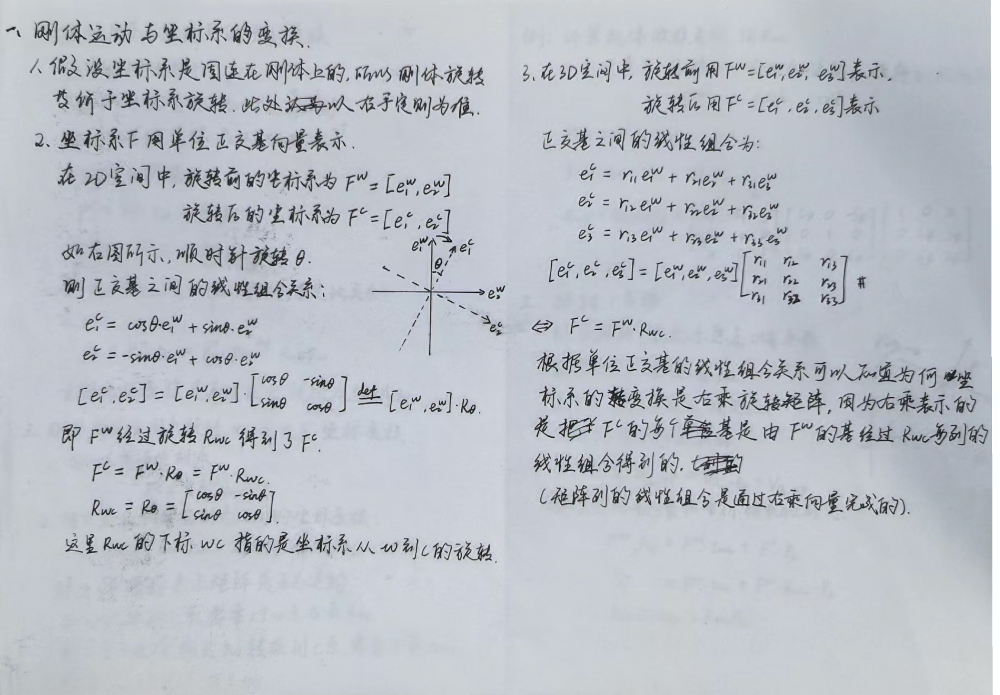
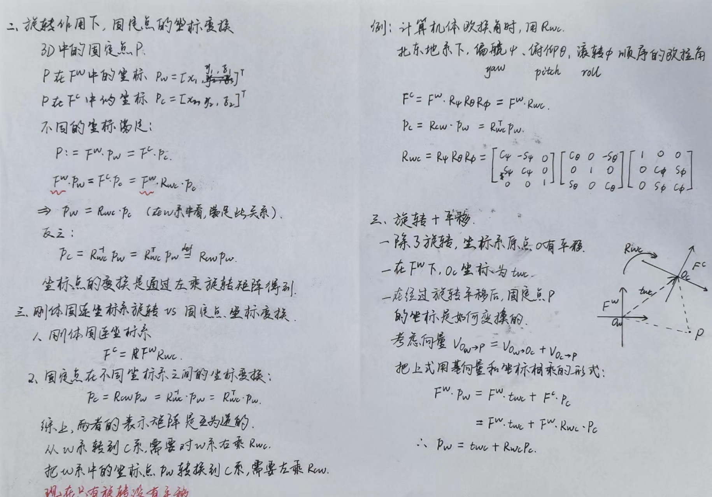
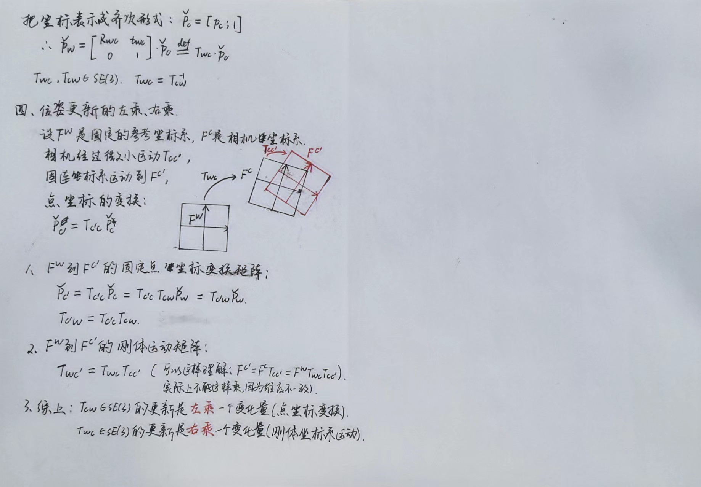

根据坐标系的变换可知，如果变换前的坐标系是基准坐标系，那么旋转矩阵R的每一列与旋转后坐标系的基向量是相等的，即R的第一列代表新坐标系的X轴，第二列代表新的Y轴，第三列代表新的Z轴

把坐标点$P=(x, y, z)^T$看作是向量的终点就容易理解了，因为向量是坐标系基向量（所有的向量都是列向量）的线性组合，线性组合的系数是x/y/z，对矩阵的列向量进行线性组合，肯定是右乘一个列向量$(x, y, z)^T$。
$R_{wc}$表示坐标系W经过旋转$R_{wc}$ 变换到了坐标系C；
$t_{wc}$ 表示坐标系W的原点平移$t_{wc}$到了坐标系C的原点，所以$t_{wc}$的值是坐标系C的原点在坐标系W中的坐标。

# 位姿的意思
视觉中，相机C在世界坐标系W中的位姿R、t。
R就是相机在世界坐标系的朝向、从世界坐标系转换到相机坐标系的旋转矩阵$R_{wc}$;
t就是相机原点在世界坐标系的位置，即$t_{wc}$
空间中一个点P，在世界坐标系中表示为$P_w$，在相机坐标系表示为$P_c$。相机系在世界坐标系中的位姿为R、t（或者表示为$R_{wc}、t_{wc}$），则把$P_c$转换到世界坐标系$P_w$为：
$$
P_w = R_{wc}P_c + t_{wc}
$$
把$P_w$转换到相机坐标系$P_c$为：
$$
P_c = R_{wc}^T(P_w -t_{wc}) \\
=R_{cw}P_w - R_{cw}t_{wc}
=R_{cw}P_w + t_{cw}, \\
其中, t_{cw} = -R_{cw}t_{wc}
$$
所以$R_{cw}、t_{cw}$表示的是世界坐标系在相机坐标系的位姿。

[视觉SLAM中的矩阵李群基础-泡泡机器人0724.pdf](../../../_resources/视觉SLAM中的矩阵李群基础-泡泡机器人0724.pdf)

