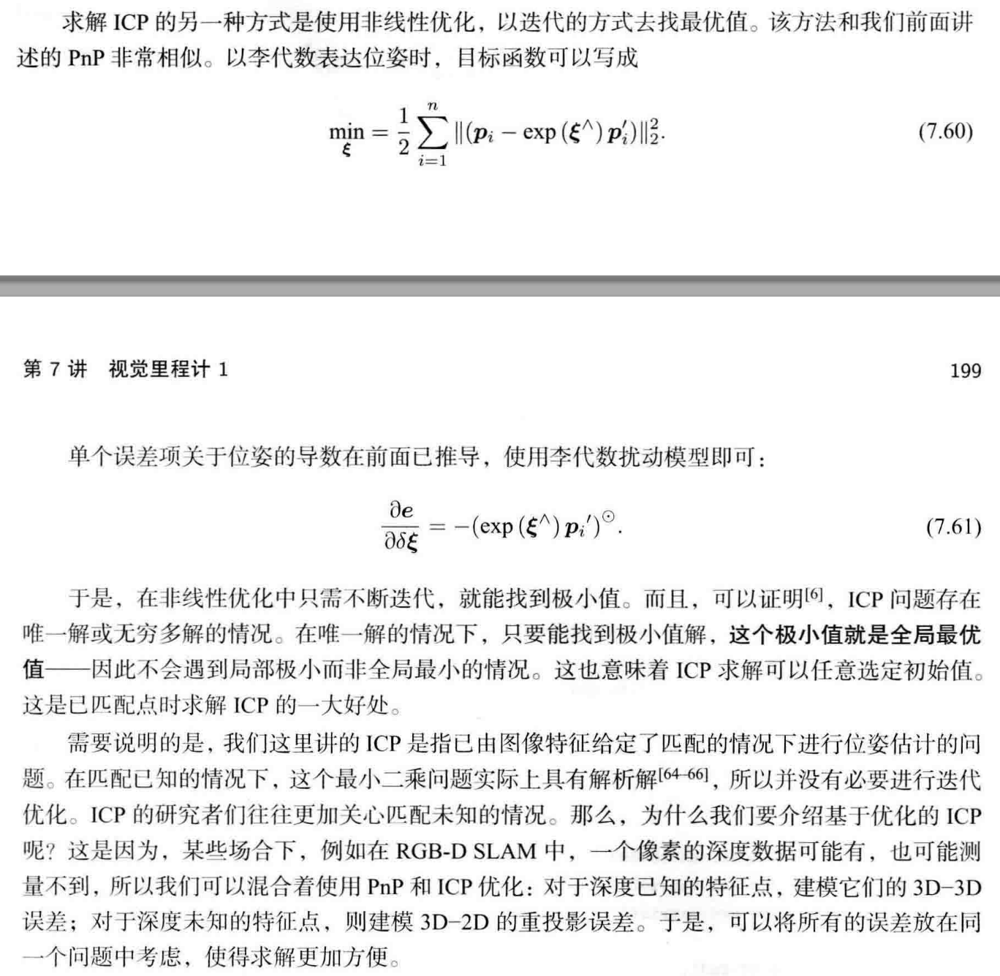

# 用ICP求解相机坐标系和世界坐标系之间的R、t

已知：3D点在世界坐标系的坐标和相机坐标系的坐标分别为$p_i^w, \ p_i^c$，i=1 ,..., n

## SVD求解方法：

求解步骤：

1.  首先构建误差项：

$$
e_i = p_i^c - (R_{cw}p_i^w + t_{cw})

$$

2.  构建最小二乘问题，求使误差平方和达到极小的R、t：

$$
\underset{R,t}{min} \frac{1}{2}\sum_{i=1}^n||p_i^c - (R_{cw}p_i^w + t_{cw})||_2^2

$$

3.  分别计算质心：

$$
p_0^w = \frac{1}{n}\sum_{i=1}^{n}p_i^w \\
p_0^c = \frac{1}{n}\sum_{i=1}^{n}p_i^c

$$

4.  对目标函数做如下处理：

$$
\frac{1}{2}\sum_{i=1}^n{||p_i^c - (R_{cw}p_i^w + t_{cw})||^2} \\
=\frac{1}{2}\sum_{i=1}^n{||p_i^c - R_{cw}p_i^w - t_{cw} - p_0^c + R_{cw}p_0^w + p_0^c - R_{cw}p_0^w||^2} \\
=\frac{1}{2}\sum_{i=1}^n {||p_i^c - p_0^c - R_{cw}(p_i^w - p_0^w) + (p_0^c - R_{cw}p_0^w - t_{cw})||^2} \\
=\frac{1}{2}\sum_{i=1}^n (||p_i^c - p_0^c - R_{cw}(p_i^w - p_0^w)||^2 + ||p_0^c - R_{cw}p_0^w - t_{cw}||^2 + \\
2(p_i^c - p_0^c - R_{cw}(p_i^w - p_0^w))^T(p_0^c - R_{cw}p_0^w - t_{cw}))

$$

上式的交叉项$p_i^c - p_0^c - R_{cw}(p_i^w - p_0^w)$在求和之后为0，所以优化的目标函数可以化简为：

$$
\underset{R,t}{min}( \frac{1}{2}\sum_{i=1}^n {||p_i^c - p_0^c - R_{cw}(p_i^w - p_0^w)||^2 + ||p_0^c - R_{cw}p_0^w - t_{cw}||^2})

$$

第一项之和旋转矩阵R有关，第二项既有R也有t，但是只和质心相关，所以只要求得了R，然后令第二项为0，就可以求出t。
第一项是分别对相机系中的点和世界系中的点分别去除质心后，再进行操作。

5.  计算$\{p_i^w\}_{i=1,...,n}$去掉质心$p_0^w$后，记作$q_i^w$，排列起来的矩阵A：

$$
A = 
\left[
\begin{matrix}
p_1^{wT} - p_0^{wT} \\
... \\
p_n^{wT} - p_0^{wT}
\end{matrix}
\right
]

$$

6.  计算$\{p_i^c\}_{i=1,...,n}$去掉质心$p_0^c$后，记作$q_i^c$，排列起来的矩阵B：

$$
B = 
\left[
\begin{matrix}
p_1^{cT} - p_0^{cT} \\
... \\
p_n^{cT} - p_0^{cT}
\end{matrix}
\right
]

$$

7.  目标函数的第一项可以表示为：

$$
\frac{1}{2}\sum_{i=1}^{n}||q_i^c - R_{cw}q_i^w||^2 = \frac{1}{2}\sum_{i=1}^{n}(q_i^{cT}q_i^c + q_i^{wT}R_{cw}^TR_{cw}q_i^w - 2q_i^{cT}R_{cw}q_i^w)

$$

注意第一项与R无关，第二项$R^TR=I$仍然与R无关，因此优化目标变为：

$$
\sum_{i=1}^{n}-q_i^{cT}R_{cw}q_i^w = \sum_{i=1}^{n}-tr(R_{cw}q_i^wq_i^{cT}) = -tr(R_{cw}\sum_{i=1}^nq_i^wq_i^{cT})

$$

8.  定义矩阵W：

$$
W = \sum_{i=1}^{n}q_i^wq_i^{cT}

$$

9.  计算W的svd分解：

$$
W = U\Sigma V^T

$$

10. 计算旋转R，当W为满秩时，R为：

$$
R = UV^T

$$

11. 计算平移t

$$
t_{cw} = p_0^c - Rp_0^w

$$

12. 如果R的行列式为负，则取-R为最优值

## 非线性优化的求解方法

