# IMU初始化

根据orbslam3，通过IMU初始化应该获得：

1.  尺度s
2.  重力方向到世界系的变换$R_{WB}$
3.  加速度计和陀螺仪的零偏$\vec b = (\vec b_a, \vec b_w)$
4.  IMU的在每一帧时刻的速度$\vec v_{0:k}$
    惯导状态向量$Y = (s, R_{WB}, \vec b, \vec v_{0:k})$

把第0帧到第k帧之间的IMU测量数据积分起来，得到$I_{0:k} = (I_{01}, I_{12}, ..., I_{k-1k})$
根据上面的表示，构造一个最大后验估计问题：
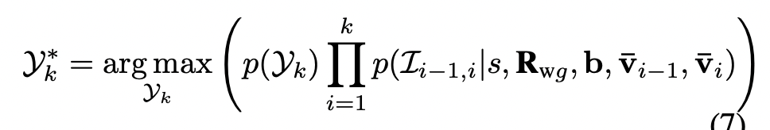
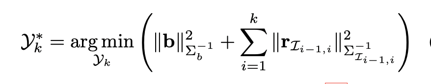

## IMU预积分形式推出

IMU初始化过程中，真实值是通过camera得到的第j帧相对第i帧的变化：包括旋转变化、速度变化、位置变化，通过这三种变化，构造出预积分的真实值（真实值是假设没有噪声的）
IMU的积分形式如下：
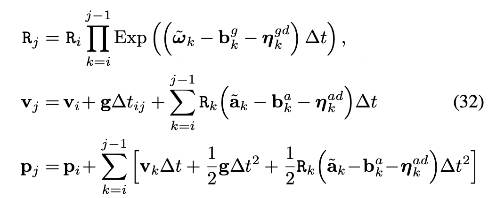
上面的形式包含了i时刻的状态。每次经过优化，$i$ 时刻的状态会发生变化，那么就不能再使用旧的i时刻的状态来推导 $j$ 时刻的状态了，需要根据新的i时刻的状态重新积分得到新的j时刻的状态。为了避免重新积分，推出下面的预积分形式：

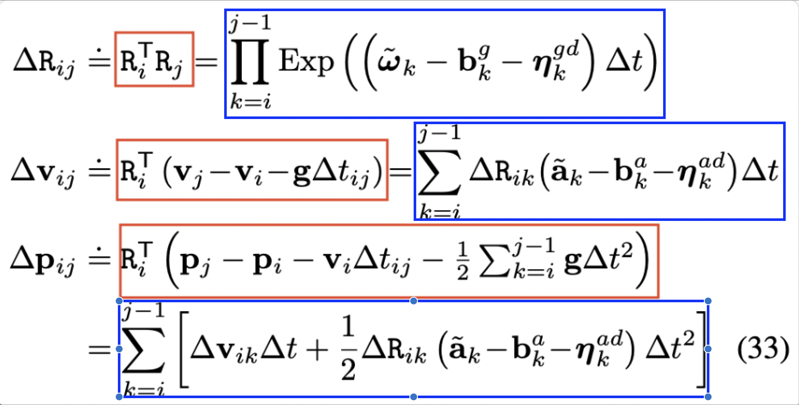

上面预积分形式中的$\Delta R_{ij}, \Delta v_{ij}, \Delta p_{ij}$都没有实际物理意义。
**红框中的部分告诉我们在IMU初始化过程中，如何从视觉帧中得到预积分的真实值。**
**蓝色中的部分告诉我们如何通过IMU的测量值计算预积分**
可以看出，每一个等式都是把所有与 $i$ 时刻相关的状态都剔除了。

## 噪声分离

上面的公式与IMU噪声的关系比较复杂，导致使用MAP估计得时候也很复杂。把噪声项从上面的(33)中分离出来，得到下面的式子：
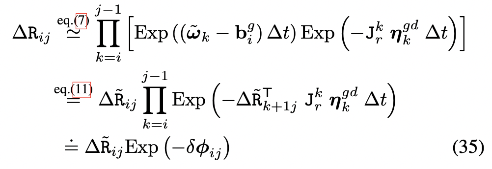
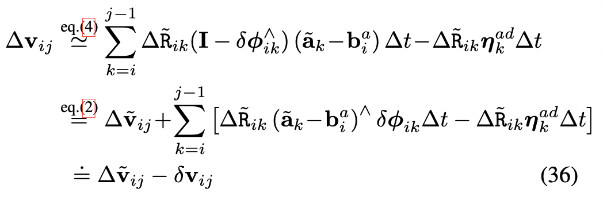
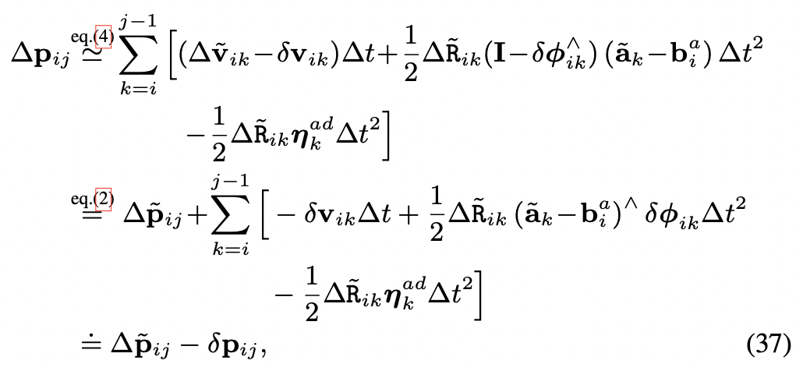
上面的三个式子说明与噪声相关的项都可以提出来，而且其形式类似”$真实值=测量值-噪声$“，把上面三个式子带入(33)中，得到预积分的测量模型：
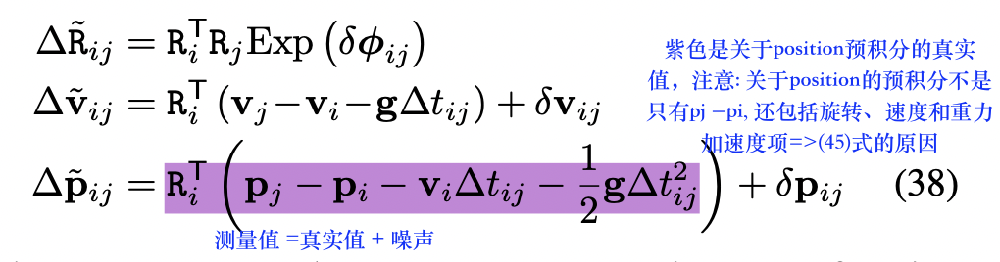
其中$（\delta \phi_{ij}, \delta v_{ij}, \delta p_{ij}）$组成了预积分的噪声向量.
从(35)(36)(37)可以看出，预积分噪声是关于IMU测量噪声的线性变换，所以也是零均值的正态分布，这对准确建模噪声的协方差很重要，用协方差的逆对下面的优化方程中的优化项进行加权：
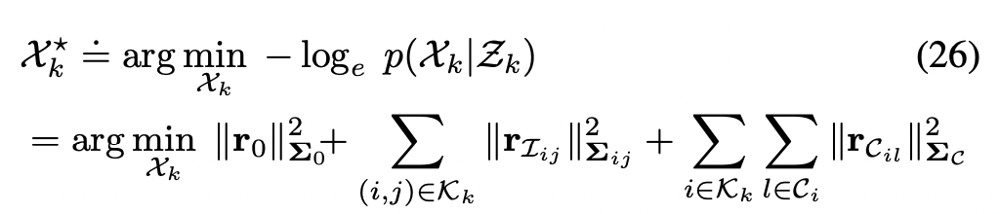

## IMU噪声递推

### 1\. 关于旋转预积分的噪声递推

从（35）中得出旋转的噪声表示：
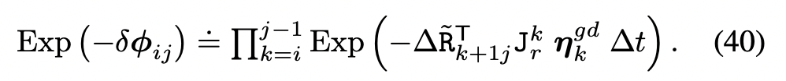
等式两边取负对数：
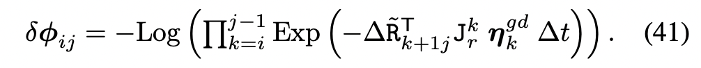
重复泰勒一阶近似：
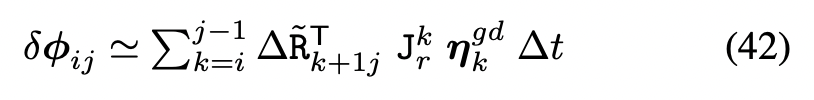

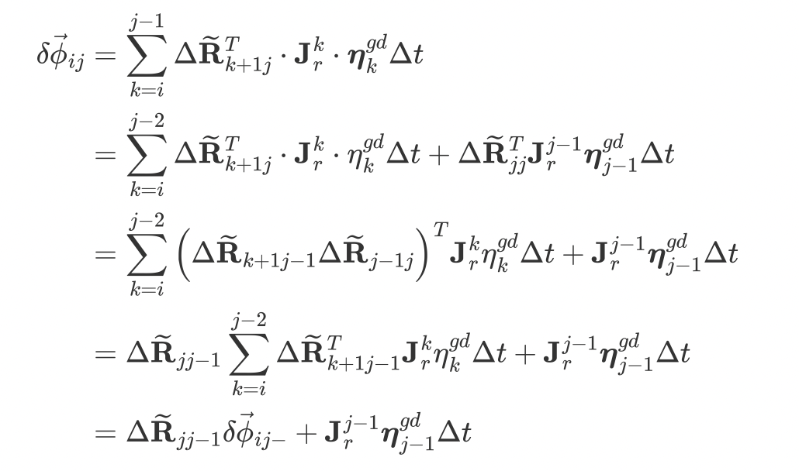

### 2.关于速度/位置预积分的噪声递推

从(36)(37)中得出，噪声$\delta v_{ij}, \delta p_{ij}$是关于加速度计噪声$\eta_k^{ad}$和关于旋转预积分噪声的线性组合，所以其递推形式如下：
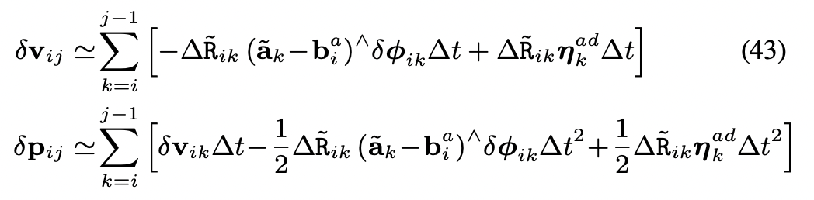

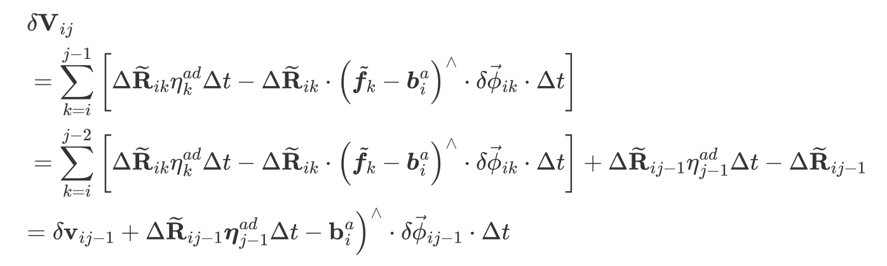 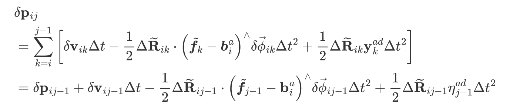

从上面的递推公式可以看出，预积分的噪声是关于IMU测量噪声的线性变换，而IMU测量噪声在IMU的规格书中有说明。所以可以通过递推的方式，从IMU测量噪声递推的计算出ij的预积分噪声。

### 写成矩阵形式

定义：预积分观测噪声：（把预积分的值当做观测）
$$
\eta_{ij}^{\Delta} = [\delta \phi_{ij}^T, \delta v_{ij}^T, \delta p_{ij}^T]^T \in R^9
$$

令IMU测量噪声
$$
\eta_k^d = [(\eta_k^{gd})^T, (\eta_k^{ad})^T]^T
$$
有：
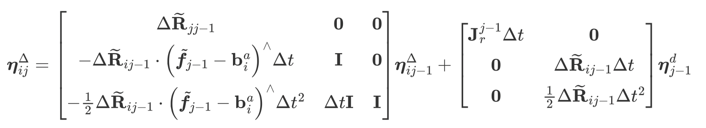
即：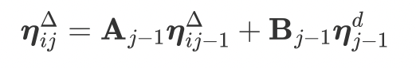
其中，A表示预积分观测噪声递推的雅可比，B是预积分观测噪声关于IMU测量噪声的雅可比
**协方差矩阵的表示：（此协方差指的是三个预积分之间的协方差）**
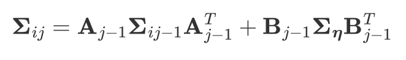

* * *

在此之前的推导都假设IMU的零偏在相邻两个关键帧之间是固定的，给出零偏更新后，预积分的更新方法

* * *

## bias更新

当给定一个零偏的更新$b \leftarrow \bar b + \delta b$，可以通过泰勒一阶展开来更新预积分：
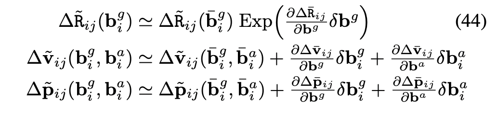
其中的Jacobian矩阵说明了预积分如何随零偏的变化而变化。在预积分过程中，Jacobian矩阵是固定的，而且可以提前计算。Jacobian矩阵的表示如下：
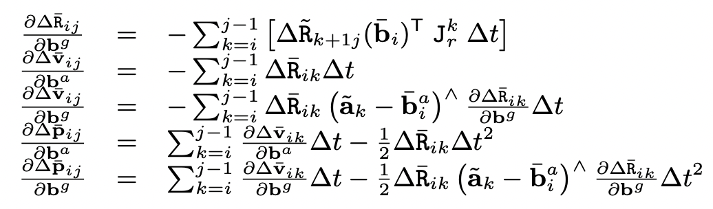
上面的Jacobian可以进一步推出其递推形式，这样雅可比就不需要每次从头计算了。
### 1. 旋转预积分关于$b^g$的雅可比递推：( https://github.com/UZ-SLAMLab/ORB_SLAM3/issues/212 )
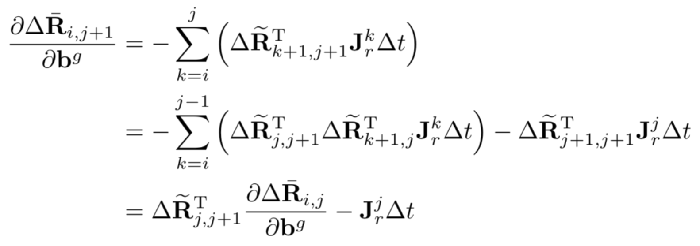

### 2. 速度预积分关于$b^a$的雅可比递推：
$$
\frac{\partial \Delta \bar v_{i,j}}{\partial b^a} = \frac{\partial \Delta \bar v_{i,j-1}}{\partial b^a} - \Delta \bar R_{i, j-1}\Delta t
$$
### 3. 速度预积分关于$b^g$的雅可比递推：
$$
\frac{\partial \Delta \bar v_{i,j}}{\partial b^g} = \frac{\partial \Delta \bar v_{i,j-1}}{\partial b^a} - \Delta \bar R_{i,j-1}(\tilde a_{j-1} - \bar b_i^a)^{\wedge} \frac{\partial \bar R_{i,j-1}}{\partial b^g}\Delta t
$$
### 4. 位置预积分关于$b^a$的雅可比递推：
$$
\frac{\partial \Delta \bar p_{i,j}}{\partial b^a} = \frac{\partial \Delta \bar p_{i,j-1}}{\partial b^a} + \frac{\partial \Delta \bar v_{i, j-1}}{\partial b^a}\Delta t - \frac{1}{2}\Delta \bar R_{i,j-1}\Delta t^2 
$$
### 5. 位置预积分关于$b^g$的雅可比递推：
$$
\frac{\partial \Delta \bar p_{i,j}}{\partial b^g} = \frac{\partial \Delta \bar p_{i,j-1}}{\partial b^g} + \frac{\partial \Delta \bar v_{i,j-1}}{\partial b^g}\Delta t - \frac{1}{2}\Delta \bar R_{i,j-1}(\tilde a_{j-1}- \bar b_i^a)^{\wedge}\frac{\partial \Delta \bar R_{i,j-1}}{\partial b^g}\Delta t^2
$$

## 预积分的残差

根据预积分的测量模型(38)以及零均值正态分布的噪声，残差可以表示为：$r_{I_{ij}} = [r_{\Delta R_{ij}}^T, r_{\Delta v_{ij}}^T, r_{\Delta p_{ij}}^T]^T \in R^9$:
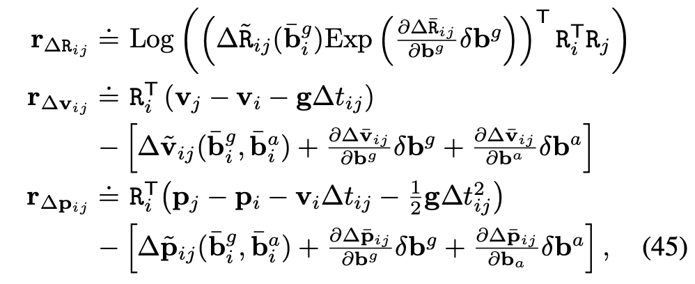