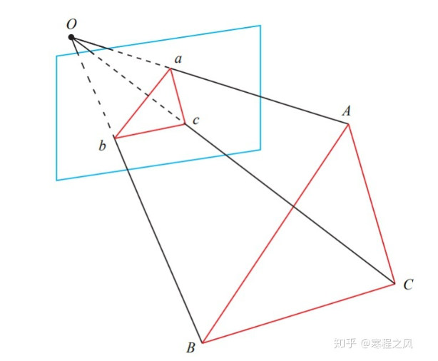
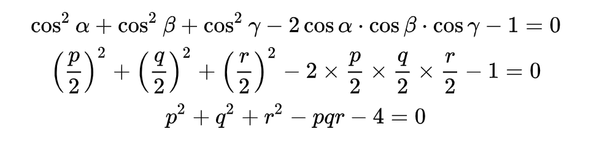
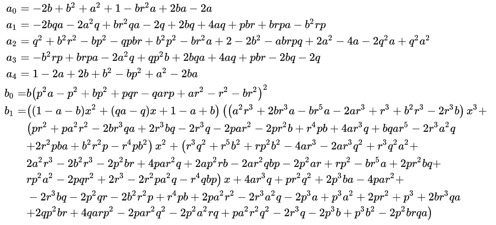
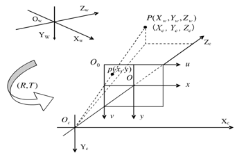

# P3P问题表述：已知世界坐标系中的三个点A、B、C的坐标和图像中对应的三个投影点a'、b'、c'的像素坐标，以及相机内参，求世界坐标系到相机坐标系的位姿变换R，t

**PnP的整体思想就是首先根据已知条件求出对应的相机坐标系下的3D点，然后通过ICP求出世界坐标系和相机坐标系之间的R、t**

## 从问题表述中，可以得到如下隐藏的已知条件

**已知条件1**：A、B、C三点之间的欧式距离，即BC、AC、AB的模长
设$A=(X_0, Y_0, Z_0), B=(X_1, Y_1, Z_1), C=(X_2, Y_2, Z_2)$， 则

$$
BC = \sqrt{(X_1-X_2)^2 + (Y_1 - Y_2)^2 + (Z_1 - Z_2)^2} \\
AC = \sqrt{(X_0-X_2)^2 + (Y_0 - Y_2)^2 + (Z_0 - Z_2)^2} \\
AB = \sqrt{(X_0-X_1)^2 + (Y_0 - Y_1)^2 + (Z_0 - Z_1)^2} 

$$

**已知条件2**：$\angle{BOC}(\alpha)、\angle{AOC}(\beta)、\angle{AOB}(\gamma)$，具体计算方法如下：

1.  根据相机投影模型，可将像素坐标（u，v）投影到归一化平面坐标（X/Z, Y/Z, 1）

$$
u = f_x * \frac{X}{Z} + c_x => \frac{X}{Z} = \frac{u - c_x}{f_x}    \\
v = f_y * \frac{Y}{Z} + c_y => \frac{Y}{Z} = \frac{v - c_y}{f_y}

$$

2.  设a'、b'、c'三点对应的归一化平面坐标为$a = (x_0, y_0, 1)、b=(x_1, y_1, 1)、c=(x_2, y_2, 1)$，相机中心o、三个点a、b、c都在相机坐标系中，相机中心的坐标为o=(0, 0, 0)，可知向量oa、ob、oc是已知的，根据向量内积定义，可计算夹角余弦值：

$$
\pmb{ob} * \pmb{oc} = |ob||oc|cos\alpha =>cos\alpha = \frac{\pmb{ob} * \pmb{oc}}{|ob||oc|} \\
同理可得 cos\beta 和cos\gamma

$$

**约束条件**：O、A、B、C三个点不能共面：

### 求解

根据余弦定理，有如下等式：**以下都是在相机坐标系中**

$$
OB^2 + OC^2 - 2OB*OC*cos\alpha = BC^2 \\
OA^2 + OC^2 - 2OA*OC*cos\beta = AC^2 \\
OA^2 + OB^2 - 2OA*OB*cos\gamma = AB^2

$$

为了简化，做如下的变量替换，均转化为OC相关的量，从而消元：

$$
OA=xOC, \ OB=yOC, \ AB^2 = vOC^2 \\
BC^2 = aAB^2 = avOC^2, \ AC^2 = bAB^2 = bvOC^2, \ (由于AB、BC、AC已知，所以a、b已知)\\
p = 2cos\alpha, \ q = 2cos\beta, \ r = 2cos\gamma

$$

将这些替换带入余弦定理的等式，得：

$$
x^2 + y^2 - xyr = v \\
y^2 + 1 - yp - av = 0 \\
x^2 + 1 - xq - bv = 0

$$

将v带入下面两个式子，得：

$$
(1-a)y^2 - ax^2 - yp + axyr + 1 = 0 \\
(1-b)x^2 - by^2 - xq + bxyr + 1 = 0 

$$

其中，p, q, r, a, b都是已知的，x, y是未知的。
根据吴消元法，建立如下等效方程：

$$
a_0x^4 + a_1x^3 + a_2x^2 + a_3x + a_4 = 0 \\ 
b_0y - b_1 = 0

$$

求出x、y值，带入v的等式，可以求出v的值，然后可以求出相机坐标系中OA、OB、OC的长度，根据下图中求解点P的坐标：

其中$O_0$平面是图像的像素平面，不是归一化平面。根据相似三角形，可以得到：

$$
\frac{\sqrt{x^2 + y^2 + f^2}}{O_cP} = \frac{x}{X_c} \\
=>X_c = \frac{x*O_cP}{\sqrt{x^2 + y^2 + f^2}} = \frac{\frac{x}{f_x}*O_cP}{\sqrt{(\frac{x}{f_x})^2 + (\frac{y}{f_y})^2 + 1}} \\
同理\ Y_c = \frac{\frac{y}{f_y}*O_cP}{\sqrt{(\frac{x}{f_x})^2 + (\frac{y}{f_y})^2 + 1}} \\
同理\ Z_c = \frac{1*O_cP}{\sqrt{(\frac{x}{f_x})^2 + (\frac{y}{f_y})^2 + 1}}

$$

用此方法可以求出相机坐标系中的$A_c, B_c, C_c$ 三个点。
此时已知相机坐标系和世界坐标系中三对匹配的点，可以用ICP方法求出相机坐标系和世界坐标系的位姿关系R、t
等效方程中x是4次方，所以会解出4个实根，会求出4个R、t。然后再用第四个点对，通过R、t进行投影，计算投影误差，选择投影误差最小的R、t