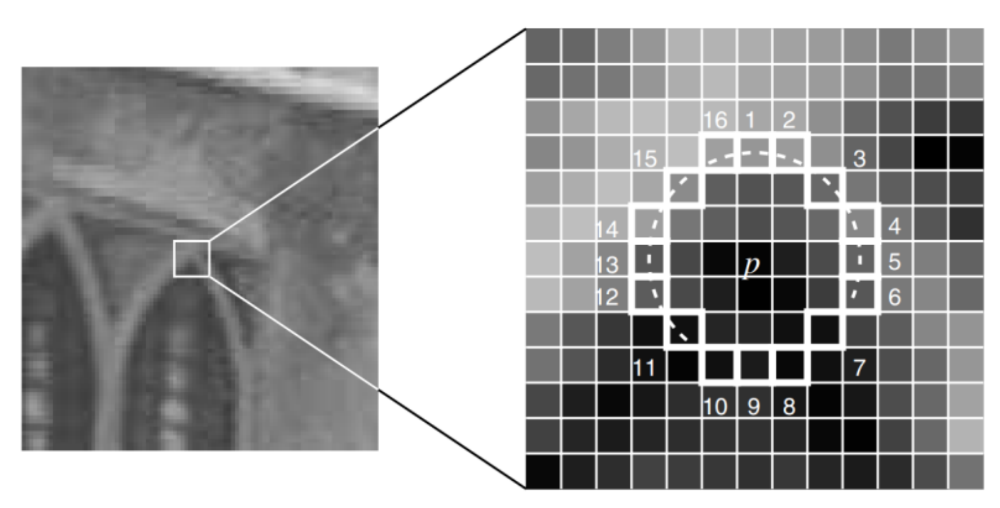
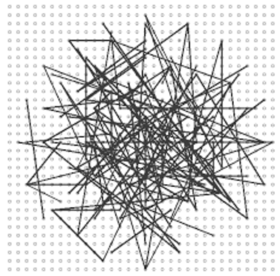
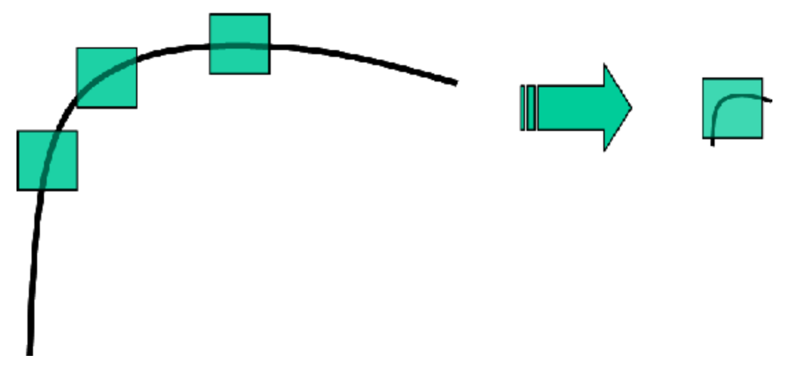
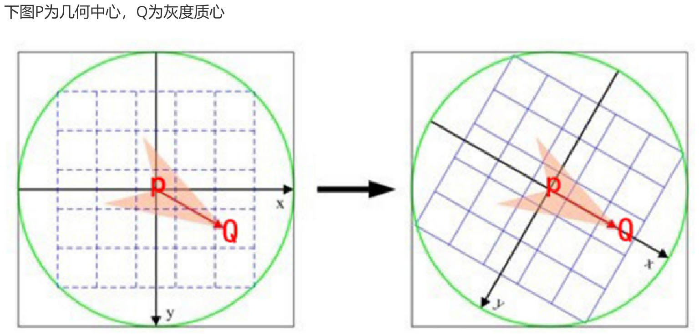
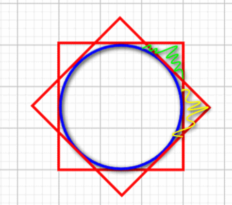
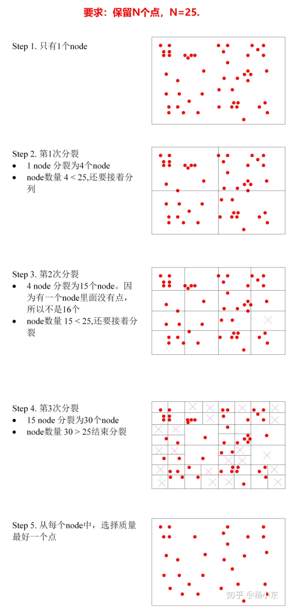

# 什么是ORB特征? ORB特征的旋转不变性是如何做的? BRIEF算子是怎么提取的?

## FAST角点

### 1\. 生成步骤

1.  选取像素p，假设其亮度为Ip
2.  设置阈值T（比如亮度Ip的20%）
3.  以像素p为中心，选取半径为3的圆上的16个像素点
4.  如果在这个圆上，有N个点的亮度大于Ip+T或者小于Ip-T，那么像素p可以被认为是角点
5.  循环上述步骤，对每一个像素执行相同操作。

N常取的值为9、11、12，得到的角点称为FAST-9、FAST-11、FAST-12

> **FAST-12中的加速策略:** 预筛选操作：对每个像素点，判断其邻域圆上的第1、5、9、13号的像素，只有当这4个点中同时有3个点满足大于Ip+T或者小于Ip-T，当前像素才有可能是角点，否则直接排除。

### 2\. FAST非极大值抑制

FAST角点容易出现“扎堆”的现象，所以对第一遍检测完后，在一定区域内，只保留相应极大（最显著）的角点，避免角点集中的现象

1.  计算角点的响应值，即角点与周围16个点的差值的绝对值之和
2.  在角点的邻域（3*3或5*5，或其他）内，如果有其他的角点，如果当前角点响应值最大，则保留，否则删除

### 3\. 角点的描述子brief

brief描述子采用二进制向量，一般为128-512维
brief的核心思想是在角点P的周围以一定模式选取N个点对，把这N个点对的比较结果组合起来作为描述子。采用的模式如下：对比直线两端像素值的大小，记录对应维度的0、1值，由于局部的图像对噪声比较敏感，因此在计算描述子之前，需要对图像进行高斯平滑。

### 4\. ORB特征点的改进

问题：

1.  FAST角点不具备尺度不变性：某些点在较小尺度下可能是角点，而在大尺度下，则变成了边缘，如下图：
    
2.  brief描述子不具备旋转不变性

ORB的解决方式：

1.  针对尺度不变性：ORB在提取特征点前，先对图像建立金字塔，在每一层提取特征点，实现尺度不变性
2.  针对旋转不变性：ORB通过**灰度质心法**计算特征点的方向

#### 灰度质心法步骤

1.  图像某个区域内的矩的定义：

$$
m_{pq} = \sum_{x,y}{x^py^qI(x,y)}, p,q=\{0,1\}

$$

p、q取0或1，I(x,y)表示坐标(x,y)处的灰度值；
在半径R的圆形区域内，沿两个坐标轴x，y方向的图像矩为：

$$
m_{10} = \sum_{x=-R}^R\sum_{y=-R}^R{xI(x,y)} 

$$

$$
m_{01} = \sum_{x=-R}^R\sum_{y=-R}^R{yI(x,y)} 

$$

圆形区域内所有像素之和为：

$$
m_{00} = \sum_{x=-R}^R\sum_{y=-R}^R{I(x,y)} 

$$

2.  图像的质心为：

$$
C= (c_x, c_y) = (\frac{m_{10}}{m_{00}},\frac{m_{01}}{m_{00}}) 

$$

3.  关键点的主方向：圆形的形心O指向质心C，关键点的旋转角度为：

$$
\theta = arctan2(c_y, c_x) = arctan2(m_{01}, m_{10}) 

$$

#### 具体执行

1.  在一个圆形区域内计算，而不是正方形，如下图：
    
    
    orb中是先旋转坐标，再从图像中采点提取，并不是先取那块图像再旋转，如果采用方形区域，则会导致绿色和黄色区域是不同的像素。

### orb-slam中金字塔每一层特征点的数量

1.  金字塔层数越高，对应层的图像越模糊，面积越小，所以能提取到的特征点数量越少，分配策略可以按照面积确定，将总的特征点数目按照面积比例均摊到每一层上
2.  设特征点的总数为W，金字塔共m层，第0层的宽为W，高为H，对应的面积为WH=C，金字塔的缩放因子为s，orbslam2中，m=8，s=1/1.2。则金字塔的总面积为：

$$
S = H*W*(s^2)^0 + H*W*(s^2)^1 + ... + H*W*(s^2)^{m-1} = HW\frac{1-(s^2)^m}{1-s^2} = C\frac{1-(s^2)^m}{1-s^2}

$$

所以，单位面积应该分配的特征点数量为：

$$
N_{avg} = \frac{N}{S} = \frac{N(1-s^2)}{C(1-(s^2)^m}

$$

第i层应该分配的特征点数量为：

$$
N_i = \frac{N(1-s^2)}{C(1-(s^2)^m)}*C*(s^2)^i = \frac{N(1-s^2)}{1-(s^2)^m} * (s^2)^i, i=0,1,2,...(m-1)

$$

orbslam2中不是按照面积均摊，而是按照面积的开方来均摊，计算时就是将上述的$s^2$换成s

### orbslam中提高特征点分布均匀性的方法

简单的方法是把图像划分成小格子，每个小格子中保留质量最好的n个特征点。存在的问题：当某些小格子中特征点数量不足n时，整幅图上提取的特征点总量就达不到想要的数量。
orbslam中的做法：

1.  对于金字塔的每一层，按照30x30的大小划分格子
2.  单独对每个格子提取FAST角点，如果提取不到，则降低FAST阈值，可以保证在纹理较弱的区域提取到一些FAST角点。这一步可以获得大量的FAST点
3.  基于四叉树，均匀的选取$N_a$个FAST点

**四叉树的步骤**

1.  如果图片的宽度比较宽，则先把图划分成w/h份。一般的640x480的图像，开始的时候只有一个node
2.  如果node中点的数量>1，则每个node分成4个node，如果node中没有特征点，则这个node就删掉
3.  新划分出来的node中点的数量>1，就再分裂成4个。如此类推
4.  终止条件：node的总数 > $N_a$，或者无法再分裂下去。
5.  从每个node中选择一个质量最好的FAST点。
6.  如下图所示：
    