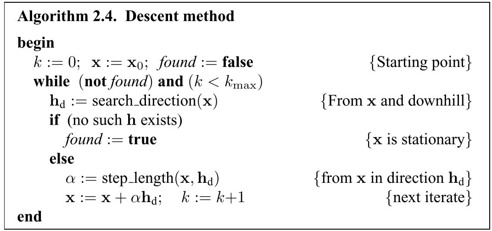
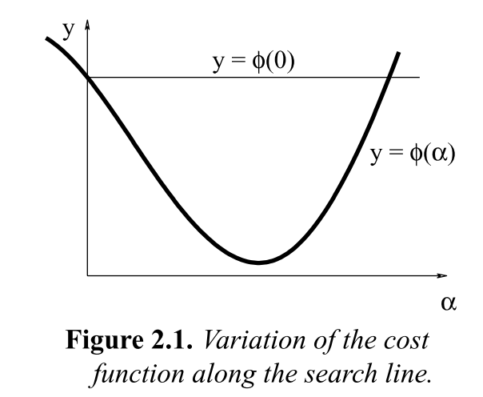
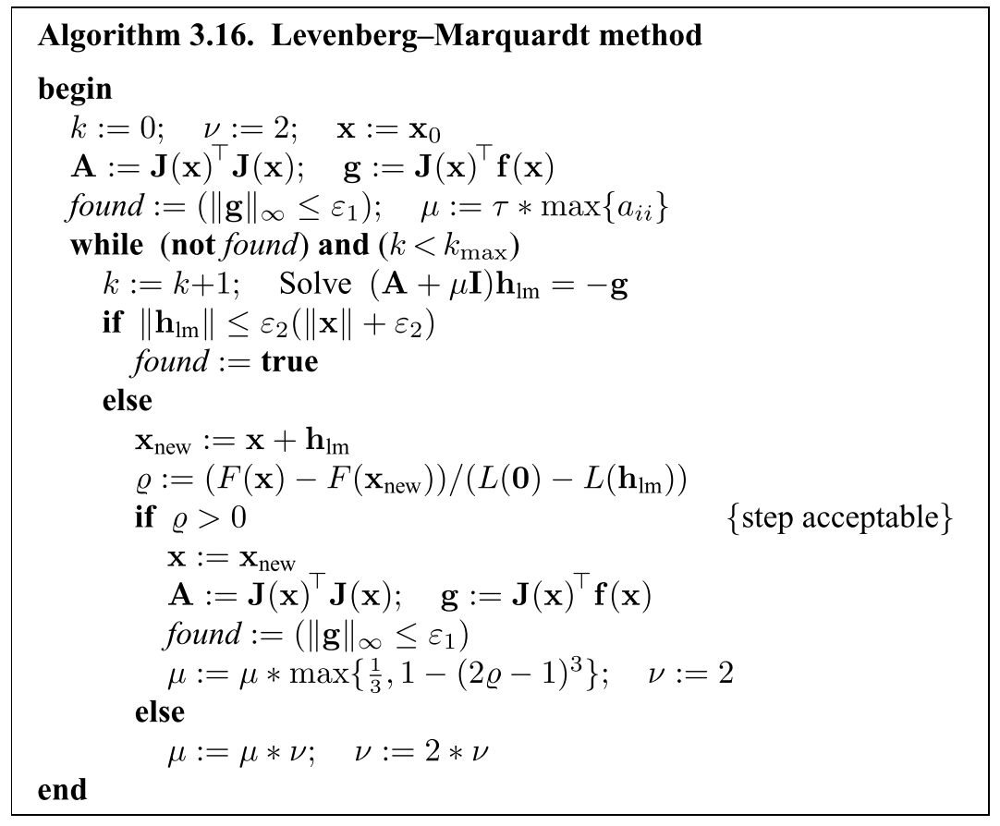

# slam面试-优化方法

## 最小二乘问题介绍和定义

### 1\. 最小二乘问题的定义：

> Find $x^*$, a local miniimizer for
> 
> $$
> F(x) = \frac{1}{2}\sum_{i=1}^m(f_i(x))^2
> 
> $$
> 
> where $f_i: R^n \mapsto R, i=1,...,m$ are given functions, and $m >= n$

对于一个更一般的问题：给定一个方程$F: R^n -> R$，找到F的一组参数使得F取得最小值。F称为目标函数或者代价函数。

> 全局最小值的定义：
> 
> $$
> Given F: R^n \mapsto R. \quad Find \\
> x^+ = argmin_x\{F(x)\}
> 
> $$

一般情况下，全局最优解很难找到。通常把问题转换为在某个小的区域内，找到F的局部最优解。

> 局部最小值：
> 
> $$
> Given F: R^n \mapsto R. \quad Find  \ x^* \ so \ that \\
> F(x^*) \leq F(x) \quad for  \quad ||x - x^*|| < \delta
> 
> $$

* * *

假设cost function F是可微的，有如下的泰勒展开：

$$
F(x+h) = F(x) + h^Tg + \frac{1}{2}h^THh + O(||h||^3)

$$

其中g是梯度，

$$
g\equiv F^\prime(x) = 
\left[
\begin{matrix}
\frac{\partial F}{\partial x_1}(x) \\
... \\
\frac{\partial F}{\partial x_n}(x)
\end{matrix}
\right]

$$

H是Hessian，

$$
H \equiv F^{\prime\prime}(x) = 
\left[
\begin{matrix}
\frac{\partial^2 F}{\partial x_i \partial x_j}(x) 
\end{matrix}
\right]

$$

如果$x^*$是局部最小值，而且||h||足够小，那么不会找到一个点$x^* + h$使得F的值更小。

> 局部最小值的**必要条件**：
> if $x^*$是局部最小值，则
> 
> $$
> g^* \equiv F^\prime(x^*)=0
> 
> $$
> 
> 这样的点$x^*$称为函数F的驻点。

> 局部最小值的**充分条件**：
> 假设$x^*$是驻点，且$F^{\prime\prime}(x^*)$是正定的，那么$x^*$是局部最小值。

* * *

## 下降方法

下降的条件：

$$
F(x_{k+1}) < F(x_k) \tag{2.1}

$$

每一步迭代由下面两点组成：

1.  找到下降的方向
2.  找到下降的步长，使得F的值有一个好的减少
    

考虑F-value在x处沿着方向h的变化，根据泰勒展开：

$$
F(x+\alpha h) = F(x) + \alpha h^TF^\prime(x) + O(\alpha^2)
\approx F(x) + \alpha h^TF^\prime(x) \quad for \  \alpha \ sufficiently \ small \tag{2.5}

$$

当$F(x+\alpha h)$在$\alpha=0$是关于$\alpha$的递减函数时，则说h是一个下降方向。引出如下下降方向的定义：

> Definition 2.6 Denscent direction:
> h is a descent direction for F at x if $h^TF^\prime(x) < 0$

如果不存在这样的h，即$F^\prime(x)=0$，表示x是驻点。

## 最速下降法

根据（2.5），当执行一步$\alpha h, \alpha>0$，则函数值的增益满足：

$$
\underset{\alpha \to 0}{lim}\frac{F(x) - F(x+\alpha h)}{\alpha ||h||} = -\frac{1}{||h||}h^TF^\prime = -||F^\prime (x)||cos\theta

$$

当$\theta=\pi$的时候增益最大。即当：

$$
h_{sd} = -F^\prime(x)

$$

时，增益最大。此方法称为最速下降法。
最速下降法在最后的收敛阶段是线性的，非常慢。但是在初始的迭代阶段有比较好的表现。

## 牛顿法

牛顿法假设迭代已经处于局部最小值$x^*$附近，满足$F^\prime(x^*)=0$，这是一个非线性系统方程，对其泰勒展开：

$$
F^\prime(x+h) = F^\prime(x) + F ^{\prime\prime}(x)h + O(||h||^2) \\
\approx F^\prime(x) + F^{\prime\prime}(x)h \quad for \ ||h|| \ sufficiently \ small.

$$

推导出牛顿方法：找到$h_n$作为下列问题的解：

$$
Hh_n = -F^\prime(x) \quad with \ H = F^{\prime\prime}(x) \tag{2.9a}

$$

然后，计算下次迭代：

$$
x:=x + h_n \tag{2.9b}

$$

证明：假设H是正定的且非奇异的，则对于所有非零u，$u^THu>0$。则（2.9a)两边乘以$h_n^T$的：

$$
0 < h_n^THh_n = -h_n^TF^\prime(x)

$$

上式满足Definition 2.6，所以$h_n$是下降方向。
牛顿法在最后的迭代阶段（x距离最小值$x^*$距离近的时候）表现比较好

## Line Search

给定一个点x和下降方向h，line search方法的目的就是找出应该从x点沿着下降方向h移动多远的距离：

$$
\varphi(\alpha) = F(x + \alpha h), \quad x \ and \ h \ fixed, \ \alpha >= 0

$$

h是下降方向，确保了：

$$
\varphi^\prime(0)=h^TF^\prime(x) < 0

$$

标明如果$\alpha$足够小，可以满足下降的条件(2.1)，等价于：

$$
\varphi(\alpha) < \varphi(0)

$$

对于牛顿法，通常会给$\alpha$一个初始的猜想值，比如1.

上图2.1表示了线搜索可能产生的三种情况：

1.  $\alpha$太小，导致目标函数的增益太小。这时需要增大$\alpha$
2.  $\alpha$太大，导致$\varphi(\alpha) >= \varphi(0)$，此时需要减小$\alpha$，使得满足下降条件(2.1)
3.  $\alpha$接近$\varphi(\alpha)$最小值，则接受这个$\alpha$

## Trust Region和Damped Methods

假设在x的邻域内，有一个模型L：

$$
F(x+h) \approx L(h) \equiv F(x) + h^Tc + \frac{1}{2}h^TBh \tag{2.14}

$$

模型成立的条件是h需要足够小
在**trust region**方法中，假设已知一个正数$\Delta$，使得模型在以$\Delta$为半径，x为中心的球内足够准确：

$$
h = h_{tr} \equiv argmin_{||h||\leq\Delta}\{L(h)\} \tag{2.15}

$$

在**damped method**方法中，步长定义为：

$$
h=h_{dm} \equiv argmin_h\{L(h) + \frac{1}{2}\mu h^Th\} \tag{2.16}

$$

其中$\mu\geq 0$是阻尼系数。$\frac{1}{2}\mu h^Th=\frac{1}{2}||h||^2$用于惩罚大的步长
在算法2.4中，用下列方法进行替换：

> 用(2.15)或(2.16)计算h
> if F(x+h) < F(x)
> x := x+h
> 更新$\Delta$或者$\mu$

### Trust Region和Damped method中，步长的调整方法**：

由于L(h)是F(x+h)当h足够小时的良好近似，所以当步长失败时，是由于h太大，应该减小；当步长被接受时，则在下一次迭代时应该使用更大的步长。
步长的评测效果使用如下增益率表示：

$$
\varrho = \frac{F(x) - F(x+h)}{L(0)-L(h)}

$$

**Trust Region方法中，使用下列策略进行更新**：

> if $\varrho < 0.25$
> $\Delta:=\Delta / 2$
> elseif $\varrho > 0.75$
> $\Delta:=max\{\Delta, 3*||h||\}$

**Damped method方法中，阻尼系数的更新**:
小的$\varrho$表示应该增大阻尼系数，即对大步长增大惩罚；大的$\varrho$表示L(h)是F(x+h)的良好近似，因此应该减小阻尼系数：

> if $\varrho < 0.25$
> $\mu := \mu * 2$
> elseif $\varrho > 0.75$
> $\mu := \mu / 3$

在Trust region和Damped方法中，阈值0.25和0.75的不连续，会导致收敛的震荡。对于更新的改进策略如下：

> if $\varrho > 0$
> $\mu := \mu * max\{\frac{1}{3}, 1-(2\varrho - 1)^3\}; \quad v:=2$
> elseif
> $\mu := \mu * v; \quad v:=2*v$

**Damped Method**中，下降方向的更新方法如下：

$$
\psi_\mu(h) = L(h) + \frac{1}{2}\mu h^Th = F(x) + h^Tc + \frac{1}{2}h^TBh + \frac{1}{2}\mu h^Th

$$

意味着：

$$
\psi_u^{\prime}(h) = L^{\prime}(h) + \mu h = 0 \\
\Rightarrow c + Bh + \mu h = 0 \\
\Rightarrow (B+\mu I)h_{dm} = -c

$$

**Trust Region**方法中，下降方向$h_tr$是下面有约束的优化问题的解：

$$
minimize L(h) \\
subject \ to \ h^Th \leq \Delta^2

$$

**Trust Region和Damped方法的联系：**
当无约束的最小值点在信任域之外时，等价于：

$$
Bh_{tr} + c = -\lambda h_{tr}

$$

这个形式与Damped method的形式一样。

## 非线性最小二乘问题

给定一个向量方程$f: R^n \mapsto R^m \ with m \geq n$。希望最小化$||f(x)||$或者等价的find：

$$
x^* = argmin_x\{F(x)\}, \\ 
where: F(x) = \frac{1}{2}\sum_{i=1}^m(f_i(x))^2 = \frac{1}{2}||f(x)||^2 = \frac{1}{2}f(x)^Tf(x) \tag{3.1}

$$

求解上面的问题需要得到目标函数F 偏导数的公式：首先假设函数f是二姐连续可微的，其泰勒展开式：

$$
f(x+h) = f(x) + J(x)h + O(||h||^2)

$$

其中$J \in R^{m \times n}$是雅可比矩阵：

$$
(J(x))_{ij} = \frac{\partial f_i}{\partial x_j}(x)

$$

考虑$F: R^n \mapsto R$，有如下公式：

$$
\frac{\partial F}{\partial x_j}(x) = \sum_{i=1}^m{f_i(x)\frac{\partial f_i}{\partial x_j}(x)}

$$

因此，F的梯度为：

$$
F^{\prime}(x) = J(x)^Tf(x) \tag{3.4a}

$$

F的Hessian矩阵为：

$$
F^{\prime\prime}(x) = J(x)^TJ(x) + \sum_{i=1}^m{f_i(x)f_i^{\prime\prime}(x)}

$$

### 高斯-牛顿方法

高斯-牛顿方法基于在x邻域对函数f的线性近似：对于small ||h||，泰勒展开：

$$
f(x+h) \approx l(h) \equiv f(x) + J(x)h

$$

带入到(3.1)有：

$$
F(x+h) \approx L(h) \equiv \frac{1}{2}l(h)^Tl(h) \\ 
=\frac{1}{2}f^Tf + h^TJ^Tf + \frac{1}{2}h^TJ^TJh \\
=F(x) + h^TJ^Tf + \frac{1}{2}h^TJ^TJh

$$

高斯-牛顿的步长$h_{gn}$为最小化$L(h): h_{gn} = argmin_h\{L(h)\}$
L的梯度和Hessian为：

$$
L^{\prime}(h) = J^Tf + J^TJh, \quad L^{\prime\prime}(h) = J^TJ

$$

与(3.4a)比较可以发现$L^\prime(0) = F^\prime(x)$，而且$L^{\prime\prime}(h)$是独立于h的，如果J是列满秩的，则$L^{\prime\prime}(h)$也是正定的。这标明$L(h)$有唯一的最小值，可以得到：

$$
(J^TJ)h_{gn} = -J^Tf

$$

这是F的下降方向，因为：

$$
h_{gn}^TF^\prime(x) = h_{gn}^T(J^Tf) = -h_{gn}^TJ^TJh_{gn} < 0

$$

所以可以用$h_{gn}$当做算法2.4中的$h_d$，步骤为：

> Solve $(J^TJ)h_{gn} = -J^Tf$
> $x := x + \alpha h_{gn}$

典型的高斯-牛顿方法使用$\alpha=1$

### LM算法

带阻尼的高斯-牛顿方法
步长$h_{lm}$定义如下：

$$
(J^TJ + \mu I)h_{lm} = -g, \quad with \  g = J^Tf \ and \ \mu \geq 0.

$$

阻尼系数$\mu$的几个作用：

1.  对于所有$\mu > 0$，系数矩阵都是正定的，保证了$h_{lm}$是下降方向
2.  如果$\mu$很大，有：

$$
		h_{lm} \approx -\frac{1}{\mu}g = -\frac{1}{\mu}F^\prime(x)

$$

即在最速下降方向上的一个小的步长，当当前迭代距离最终解较远时是比较好的
3\. 如果$\mu$很小，则$h_{lm} \approx h_{gn}$，则在迭代的最后阶段效果比较好。
$\mu$的初始值的选择与$A_0 = J(x_0)^TJ(x_0)$的大小有关：

$$
\mu_0 = \tau * max_i\{a_{ii}^{(0)}\}, \ \tau由用户指定

$$

迭代过程中，$\mu$的大小有增益率确定。
迭代终止条件：

1.  $F^\prime \leq \varepsilon_1$, $\varepsilon$是一个小的正数。
2.  x上的变化很小：$||x_{new} - x|| \leq \varepsilon_2(||x|| + \varepsilon_2)$
3.  迭代次数达到设置的值
    LM的算法流程：
    

### Dog Leg Method