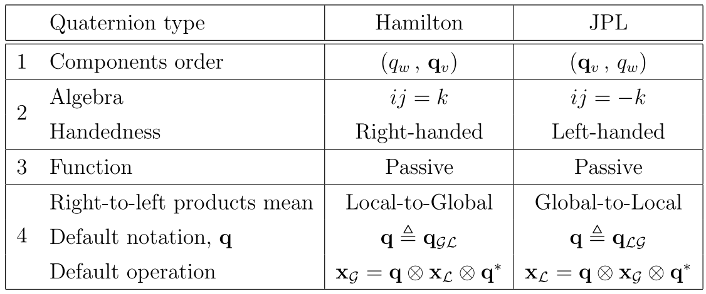

## 1\. 向量的反对称矩阵

$$
\pmb \omega = 
\left[
\begin{matrix}
\omega_x \\
\omega_y \\
\omega_z
\end{matrix}
\right] ,
[\pmb \omega]_\times =  {\pmb \omega}^\wedge =
\left[
\begin{matrix}
0, \quad -\omega_z \quad \omega_y \\
\omega_z \quad 0 \quad -\omega_x \\
-\omega_y \quad \omega_x \quad 0
\end{matrix}
\right] 

$$

$$
[a]_\times b = -[b]_\times a

$$

## 2\. 四元数$\pmb q = [q_w, q_x, q_y, q_z]^T$

左乘矩阵：$q_1 \otimes q_2=[q_1]_\times q_2$

$$
[\pmb q]_L = 
\left[
\begin{matrix}
q_w \quad -q_x \quad -q_y \quad -q_z \\
q_x \quad q_w \quad -q_z \quad q_y \\
q_y \quad q_z \quad q_w \quad -q_x \\
q_z \quad -q_y \quad q_x \quad q_w
\end{matrix}
\right] = q_wI + 
\left[
\begin{matrix}
0 \quad -\pmb q_v^T \\
\pmb q_v \quad [\pmb q_v]_\times
\end{matrix}
\right]

$$

右乘矩阵: $q_1 \otimes q_2=[q_2]_\times q_1$

$$
[\pmb q]_R = q_wI + 
\left[
\begin{matrix}
0 \quad -\pmb q_v^T \\
\pmb q_v \quad -[\pmb q_v]_\times
\end{matrix}
\right]

$$

## 3\. 角速度$\pmb \omega$对应的左乘矩阵和右乘矩阵：

$$
[\pmb \omega]_L = 
\left[
\begin{matrix}
0 \quad -\pmb \omega^T \\
\pmb \omega \quad [\pmb \omega]_\times
\end{matrix}
\right]

$$

$$
[\pmb \omega]_R = 
\left[
\begin{matrix}
0 \quad -\pmb \omega^T \\
\pmb \omega \quad -[\pmb \omega]_\times
\end{matrix}
\right]

$$

## 4\. BCH公式：李代数加法与李群乘积之间的关系

$$
已知：\vec\phi=\theta  \vec a, \quad \Delta\vec\phi 为小量

$$

**左乘的表示**：

$$
Exp(\vec\phi + \Delta \vec\phi)=Exp(J_l(\vec\phi) \Delta \vec\phi)Exp(\vec\phi)

$$

$$
J_l(\theta \pmb a) = \frac{sin\theta}{\theta}I + (1 - \frac{sin\theta}{\theta})\pmb a \pmb a^T + \frac{1 - cos\theta}{\theta}\pmb a^\wedge 

$$

$$
J_l^{-1}(\theta \pmb a) = \frac{\theta}{2}cot{\frac{\theta}{2}I} + (1 - \frac{\theta}{2}cot\frac{\theta}{2})\pmb a \pmb a^T - \frac{\theta}{2}\pmb a^\wedge 

$$

**右乘的表示**：

$$
Exp(\vec\phi + \Delta \vec\phi) = Exp(\vec\phi)Exp(J_r(\vec\phi) \Delta \vec\phi) 

$$

$$
Exp(\vec\phi)Exp(\Delta\vec\phi)=Exp(\vec\phi + J_r^{-1}(\vec\phi)\Delta\vec\phi)

$$

$$
\begin{cases}
J_r(\vec\phi) = \frac{sin\theta}{\theta}I - \frac{1 - cos\theta}{\theta}\pmb a^\wedge + (1 - \frac{sin\theta}{\theta})\pmb a \pmb a^T \\ \\
J_r^{-1}(\vec\phi) = I + \frac{\theta}{2}\pmb a^{\wedge} + (1 - \frac{(1+cos\theta)\theta}{2sin\theta})\pmb a\pmb a^T
\end{cases}

$$

或者

$$
\begin{cases}
J_r(\vec\phi) = I - \frac{1 - cos(||\vec\phi||)}{||\vec\phi||^2}\vec\phi^\wedge + (\frac{||\vec\phi|| - sin(||\vec\phi||)}{||\vec\phi||^3})(\vec\phi^\wedge)^2 \\ \\
J_r^{-1}(\vec\phi) = I + \frac{1}{2}\vec\phi^{\wedge} + (\frac{1}{||\vec\phi||^2} - \frac{(1+cos(||\vec\phi||)}{2||\vec\phi||sin(||\vec\phi||)})(\vec\phi^\wedge)^2
\end{cases}

$$

**左雅可比和右雅可比的关系**：

$$
J_r(\phi) = J_l(-\phi)

$$

## 5\. 李群上的伴随关系：

$$
Exp(\phi)R = RExp(R^T\phi)

$$

第4条说明了如何拆Exp，第5条说明如何交换Exp和R

## 6\. 当$\vec\phi$为小量时，

$$
Exp(\vec\phi) = exp(\vec\phi^\wedge) \approx I + \vec\phi^\wedge

$$

$$
J_r(\vec\phi) \approx I\\
J_r^{-1}(\vec\phi) \approx I

$$

## 7\. ESKF/预积分推导中用到的真实值、标称值、误差、噪声之间的关系

| magnitude | True | Nominal | Error | Composition | Measured | Noise |
| --- | --- | --- | --- | --- | --- | --- |
| full state | $x_t$ | $x$ | $\delta x$ | $x_t=x+\delta x$ |     |     |
| position | $p_t$ | $p$ | $\delta p$ | $p_t=p+\delta p$ |     |     |
| velocity | $v_t$ | $v$ | $\delta v$ | $v_t=v+\delta v$ |     |     |
| quaternion | $q_t$ | $q$ | $\delta q$ | $q_t=q\otimes\delta q$ |     |     |
| rotation matrix | $R_t$ | $R$ | $\delta R$ | $R_t=R\delta R$ |     |     |
| angle vector |     |     | $\delta \theta$ | $\delta q=e^{\delta\theta/2}$ $\delta R = e^{[\delta\theta]_\times}$ |     |     |
| acc bias | $a_{bt}$(B系) | $a_b$(B系) | $\delta a_b$ | $a_{bt}=a_b+\delta a_b$ |     | $a_w$ |
| gyr bias | $\omega_{bt}$ | $\omega_b$ | $\delta\omega_b$ | $\omega_{bt}=\omega_b+\delta\omega_b$ |     | $\omega_w$ |
| gravity | $g_t$ | $g$ | $\delta g$ | $g_t=g+\delta g$ |     |     |
| acc | $a_t$(G系) |     |     |     | $a_m$(B系) | $a_n$(B系) |
| angular rate | $\omega_t$ |     |     |     | $\omega_m$ | $\omega_n$ |

**测量值和真实值之间的关系**：
真实值是假设没有零偏和噪声的理想情况，实际能获取的数据是带噪声和零偏的测量值。所以公式推导中，最后都需要**把真实值用测量值、零偏、噪声表示**
角速度：

$$
\omega_m = \omega_t + \omega_{bt} + \omega_n \\
\Leftrightarrow \omega_t = \omega_m - \omega_{bt} - \omega_n

$$

加速度：
$R_t \triangleq R\{\pmb q_t\}$，表示从body($I$)系转到world($G$)系。

$$
a_m = R_t^T(a_t - g) + a_{bt} + a_n \\
\Leftrightarrow a_t = R_t(a_m - a_bt - a_n) + g

$$

## 8\. Hamilton形式和JPL形式、左乘和右乘、全局和局部的关系

### 8.1. Hamilton形式与JPL形式中误差量$\Delta\theta$（小量、扰动量）与旋转矩阵$\Delta R$之间的转换：

1.  Hamilton形式

$$
	\Delta R = I + [\Delta\theta]_\times

$$

2.  JPL形式

$$
	\Delta R = I - [\Delta\theta]_\times

$$

### 8.2 左乘与右乘

对于朝向误差的定义，旋转量是乘在旋转矩阵的左边还是右边

1.  对于Hamilton形式：

$$
\begin{cases}
左乘：R_{GL} \approx (I + [\Delta\theta]_\times) \hat R_{GL} \\
右乘：R_{GL} \approx \hat R_{GL} (I + [\Delta\theta]_\times)
\end{cases}

$$

2.  对于GPL形式：

$$
\begin{cases}
左乘：R_{LG} \approx (I - [\Delta\theta]_\times) \hat R_{LG} \\
右乘：R_{LG} \approx \hat R_{LG} (I - [\Delta\theta]_\times)
\end{cases}

$$

左乘与右乘的不同，本质上是对旋转误差$\Delta\theta$的坐标系定义不同。对于Hamilton形式，左乘相当于把$\Delta\theta$定义在$\{G\}$系中，是对$\{G\}$系进行扰动；右乘相当于把$\Delta\theta$定义在$\{L\}$系中，是对$\{L\}$系进行扰动。以Hamilton为例，在上图的表格中可以看出，右乘扰动表示为：$x_G = q\otimes\Delta q\otimes x_L \otimes \Delta q^* \otimes q^*$，$q$是从$\{L\}系到\{G\}系$，所以$\Delta q$在起作用的时候，仍然在$\{L\}$系中，所以右乘是对local系的扰动；而左乘扰动表示为：$x_G = \Delta q\otimes q\otimes x_L \otimes q^* \otimes \Delta q^*$，$\Delta q$在$x_L$转换到global系之后起作用，所以是对global系的扰动。
在进行状态递推和列写状态转移矩阵时，最关键的是需要**保证Jacobian推导和状态更新一致，都使用左乘或者都是用右乘，不能混用。**