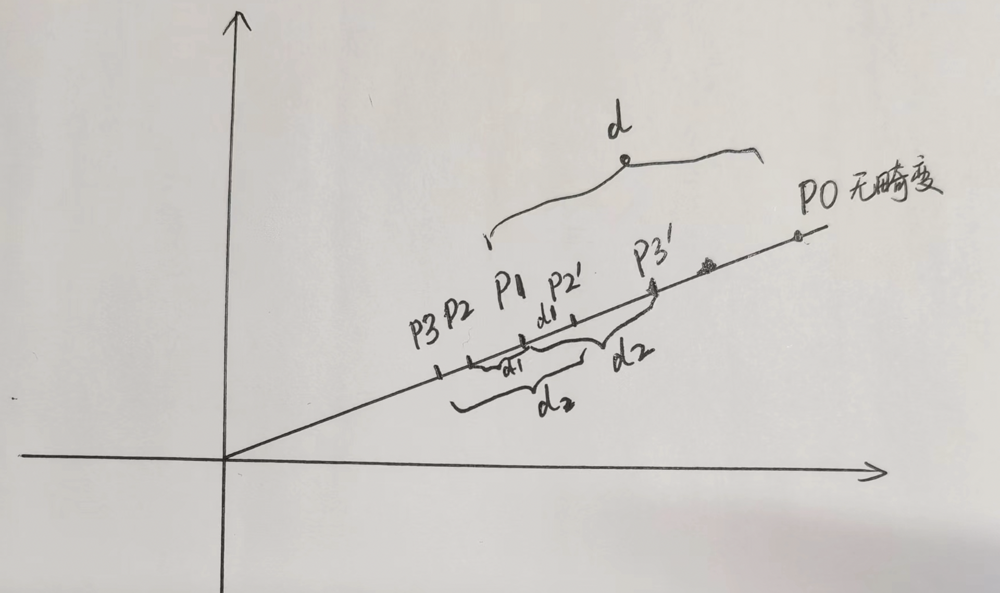

在投影模型和畸变模型中讨论了一种畸变形式，而且说明由于畸变模型是非线性的，无法通过直接反解来去畸变。这里来对比说明opencv和vins-mono中对像素点去畸变的方法。
参考链接：https://blog.csdn.net/qq_44047943/article/details/117484988

# 1\. opencv中的方法

opencv中函数undistortPoints()用于对图像点坐标进行去畸变，以下为该函数解释：

```
void undistortPoints(InputArray src, OutputArray dst, InputArray cameraMatrix, InputArray distCoeffs, InputArray R=noArray(), InputArray P=noArray())
```

src-原图像坐标；dst-输出图像坐标；cameraMatrix-相机内参矩阵；distCoeffs-畸变系数，有四种畸变模型，分别含有4，5，8个元素，通常使用具有4/5个参数的模型，如果该向量为NULL，那么设定该图像没有畸变；R-相机坐标系的矫正矩阵（即对相机坐标系的位姿调整，见stereoRectify函数中的Rl，Rr），如果矩阵为空，那么默认使用单位矩阵；P-新的相机矩阵（3x3）或者新的投影矩阵（3x4，包含相机坐标系相对世界坐标系的相对位姿，见stereoRectify函数中的Pl，Pr），如该矩阵为空的话，将设置该矩阵为单位阵。
源码

```
void cvUndistortPointsInternal( const CvMat* _src, CvMat* _dst, const CvMat* _cameraMatrix,
                   const CvMat* _distCoeffs,
                   const CvMat* matR, const CvMat* matP, cv::TermCriteria criteria)
{
    // 判断迭代条件是否有效
    CV_Assert(criteria.isValid());
    // 定义中间变量--A相机内参数组，和matA共享内存；RR-矫正变换数组，和_RR共享内存
    // k-畸变系数数组,对于径向和切向畸变模型，参数排列顺序k1,k2,p1,p2,k3，k4和之后的参数可以选择性忽略
    double A[3][3], RR[3][3], k[14]={0,0,0,0,0,0,0,0,0,0,0,0,0,0};
    CvMat matA=cvMat(3, 3, CV_64F, A), _Dk;
    CvMat _RR=cvMat(3, 3, CV_64F, RR);
    cv::Matx33d invMatTilt = cv::Matx33d::eye();
    cv::Matx33d matTilt = cv::Matx33d::eye();
    
    // 检查输入变量是否有效
    CV_Assert( CV_IS_MAT(_src) && CV_IS_MAT(_dst) &&
        (_src->rows == 1 || _src->cols == 1) &&
        (_dst->rows == 1 || _dst->cols == 1) &&
        _src->cols + _src->rows - 1 == _dst->rows + _dst->cols - 1 &&
        (CV_MAT_TYPE(_src->type) == CV_32FC2 || CV_MAT_TYPE(_src->type) == CV_64FC2) &&
        (CV_MAT_TYPE(_dst->type) == CV_32FC2 || CV_MAT_TYPE(_dst->type) == CV_64FC2));
 
    CV_Assert( CV_IS_MAT(_cameraMatrix) &&
        _cameraMatrix->rows == 3 && _cameraMatrix->cols == 3 );
 
    cvConvert( _cameraMatrix, &matA );// _cameraMatrix <--> matA / A
 
    // 判断输入的畸变系数是否有效
    if( _distCoeffs )
    {
        CV_Assert( CV_IS_MAT(_distCoeffs) &&
            (_distCoeffs->rows == 1 || _distCoeffs->cols == 1) &&
            (_distCoeffs->rows*_distCoeffs->cols == 4 ||
             _distCoeffs->rows*_distCoeffs->cols == 5 ||
             _distCoeffs->rows*_distCoeffs->cols == 8 ||
             _distCoeffs->rows*_distCoeffs->cols == 12 ||
             _distCoeffs->rows*_distCoeffs->cols == 14));
 
        _Dk = cvMat( _distCoeffs->rows, _distCoeffs->cols,
            CV_MAKETYPE(CV_64F,CV_MAT_CN(_distCoeffs->type)), k);// _Dk和数组k共享内存指针
 
        cvConvert( _distCoeffs, &_Dk );
        if (k[12] != 0 || k[13] != 0)
        {
            cv::detail::computeTiltProjectionMatrix<double>(k[12], k[13], NULL, NULL, NULL, &invMatTilt);
            cv::detail::computeTiltProjectionMatrix<double>(k[12], k[13], &matTilt, NULL, NULL);
        }
    }
 
    if( matR )
    {
        CV_Assert( CV_IS_MAT(matR) && matR->rows == 3 && matR->cols == 3 );
        cvConvert( matR, &_RR );// matR和_RR共享内存指针
    }
    else
        cvSetIdentity(&_RR);
 
    if( matP )
    {
        double PP[3][3];
        CvMat _P3x3, _PP=cvMat(3, 3, CV_64F, PP);
        CV_Assert( CV_IS_MAT(matP) && matP->rows == 3 && (matP->cols == 3 || matP->cols == 4));
        cvConvert( cvGetCols(matP, &_P3x3, 0, 3), &_PP );// _PP和数组PP共享内存指针
        cvMatMul( &_PP, &_RR, &_RR );// _RR=_PP*_RR 放在一起计算比较高效
    }
 
    const CvPoint2D32f* srcf = (const CvPoint2D32f*)_src->data.ptr;
    const CvPoint2D64f* srcd = (const CvPoint2D64f*)_src->data.ptr;
    CvPoint2D32f* dstf = (CvPoint2D32f*)_dst->data.ptr;
    CvPoint2D64f* dstd = (CvPoint2D64f*)_dst->data.ptr;
    int stype = CV_MAT_TYPE(_src->type);
    int dtype = CV_MAT_TYPE(_dst->type);
    int sstep = _src->rows == 1 ? 1 : _src->step/CV_ELEM_SIZE(stype);
    int dstep = _dst->rows == 1 ? 1 : _dst->step/CV_ELEM_SIZE(dtype);
 
    double fx = A[0][0];
    double fy = A[1][1];
    double ifx = 1./fx;
    double ify = 1./fy;
    double cx = A[0][2];
    double cy = A[1][2];
 
    int n = _src->rows + _src->cols - 1;
    // 开始对所有点开始遍历
    for( int i = 0; i < n; i++ )
    {
        double x, y, x0 = 0, y0 = 0, u, v;
        if( stype == CV_32FC2 )
        {
            x = srcf[i*sstep].x;
            y = srcf[i*sstep].y;
        }
        else
        {
            x = srcd[i*sstep].x;
            y = srcd[i*sstep].y;
        }
        // 从下面开始看
        u = x; v = y; // u,v是带畸变的像素坐标
        x = (x - cx)*ifx;//转换到归一化图像坐标系（含有畸变）
        y = (y - cy)*ify;
 
        //进行畸变矫正
        if( _distCoeffs ) {
            // compensate tilt distortion--该部分系数用来弥补沙氏镜头畸变？？
            // 如果不懂也没管，因为普通镜头中没有这些畸变系数
            cv::Vec3d vecUntilt = invMatTilt * cv::Vec3d(x, y, 1);
            double invProj = vecUntilt(2) ? 1./vecUntilt(2) : 1;
            x0 = x = invProj * vecUntilt(0);
            y0 = y = invProj * vecUntilt(1);
 
            double error = std::numeric_limits<double>::max();// error设定为系统最大值
            // compensate distortion iteratively
            // 迭代去除镜头畸变，迭代方式没看懂
            // 迭代公式    x′= (x−2p1 xy−p2 (r^2 + 2x^2))∕( 1 + k1*r^2 + k2*r^4 + k3*r^6)
            //            y′= (y−2p2 xy−p1 (r^2 + 2y^2))∕( 1 + k1*r^2 + k2*r^4 + k3*r^6)
 
            for( int j = 0; ; j++ )
            {
                if ((criteria.type & cv::TermCriteria::COUNT) && j >= criteria.maxCount)// 迭代最大次数为5次
                    break;
                if ((criteria.type & cv::TermCriteria::EPS) && error < criteria.epsilon)// 迭代误差阈值为0.01
                    break;
                double r2 = x*x + y*y;
                double icdist = (1 + ((k[7]*r2 + k[6])*r2 + k[5])*r2)/(1 + ((k[4]*r2 + k[1])*r2 + k[0])*r2);
                double deltaX = 2*k[2]*x*y + k[3]*(r2 + 2*x*x)+ k[8]*r2+k[9]*r2*r2;
                double deltaY = k[2]*(r2 + 2*y*y) + 2*k[3]*x*y+ k[10]*r2+k[11]*r2*r2;
                x = (x0 - deltaX)*icdist;
                y = (y0 - deltaY)*icdist;
 
                // 对当前迭代的坐标加畸变，计算误差error用于判断迭代条件
                if(criteria.type & cv::TermCriteria::EPS)
                {
                    double r4, r6, a1, a2, a3, cdist, icdist2;
                    double xd, yd, xd0, yd0;
                    cv::Vec3d vecTilt;
 
                    r2 = x*x + y*y;
                    r4 = r2*r2;
                    r6 = r4*r2;
                    a1 = 2*x*y;
                    a2 = r2 + 2*x*x;
                    a3 = r2 + 2*y*y;
                    cdist = 1 + k[0]*r2 + k[1]*r4 + k[4]*r6;
                    icdist2 = 1./(1 + k[5]*r2 + k[6]*r4 + k[7]*r6);
                    xd0 = x*cdist*icdist2 + k[2]*a1 + k[3]*a2 + k[8]*r2+k[9]*r4;
                    yd0 = y*cdist*icdist2 + k[2]*a3 + k[3]*a1 + k[10]*r2+k[11]*r4;
 
                    vecTilt = matTilt*cv::Vec3d(xd0, yd0, 1);
                    invProj = vecTilt(2) ? 1./vecTilt(2) : 1;
                    xd = invProj * vecTilt(0);
                    yd = invProj * vecTilt(1);
 
                    double x_proj = xd*fx + cx;
                    double y_proj = yd*fy + cy;
 
                    error = sqrt( pow(x_proj - u, 2) + pow(y_proj - v, 2) );
                }
            }
        }
        // 将坐标从归一化图像坐标系转换到成像平面坐标系
        double xx = RR[0][0]*x + RR[0][1]*y + RR[0][2];
        double yy = RR[1][0]*x + RR[1][1]*y + RR[1][2];
        double ww = 1./(RR[2][0]*x + RR[2][1]*y + RR[2][2]);
        x = xx*ww;
        y = yy*ww;
 
        if( dtype == CV_32FC2 )
        {
            dstf[i*dstep].x = (float)x;
            dstf[i*dstep].y = (float)y;
        }
        else
        {
            dstd[i*dstep].x = x;
            dstd[i*dstep].y = y;
        }
    }
}

```

总结起来就是下面的步骤：

1.  把带畸变的像素坐标反投影到归一化平面，得到带畸变的归一化坐标
2.  对归一化坐标进行一次迭代，得到迭代后的归一化坐标
3.  对迭代后的坐标进行投影，得到像素坐标
4.  与原始带畸变像素坐标计算误差，通过误差或者迭代次数判断是否完成去畸变。
5.  如果去畸变完成，则对去畸变的归一化坐标进行投影，得到去畸变的像素坐标。

# 2\. VINS-mono中的方法

**对于桶形畸变：越靠近中心，畸变前后的距离差越小。那么我们可以用这个关系来逼近真值求解问题**
源码

```
void PinholeCamera::liftProjective(const Eigen::Vector2d& p, Eigen::Vector3d& P) const
{
    double mx_d, my_d,mx2_d, mxy_d, my2_d, mx_u, my_u;
    double rho2_d, rho4_d, radDist_d, Dx_d, Dy_d, inv_denom_d;
    //double lambda;

    // Lift points to normalised plane
    // 投影到归一化相机坐标系
    mx_d = m_inv_K11 * p(0) + m_inv_K13;
    my_d = m_inv_K22 * p(1) + m_inv_K23;

    if (m_noDistortion)
    {
        mx_u = mx_d;
        my_u = my_d;
    }
    else
    {
        if (0)
        {
            double k1 = mParameters.k1();
            double k2 = mParameters.k2();
            double p1 = mParameters.p1();
            double p2 = mParameters.p2();

            // Apply inverse distortion model
            // proposed by Heikkila
            mx2_d = mx_d*mx_d;
            my2_d = my_d*my_d;
            mxy_d = mx_d*my_d;
            rho2_d = mx2_d+my2_d;
            rho4_d = rho2_d*rho2_d;
            radDist_d = k1*rho2_d+k2*rho4_d;
            Dx_d = mx_d*radDist_d + p2*(rho2_d+2*mx2_d) + 2*p1*mxy_d;
            Dy_d = my_d*radDist_d + p1*(rho2_d+2*my2_d) + 2*p2*mxy_d;
            inv_denom_d = 1/(1+4*k1*rho2_d+6*k2*rho4_d+8*p1*my_d+8*p2*mx_d);

            mx_u = mx_d - inv_denom_d*Dx_d;
            my_u = my_d - inv_denom_d*Dy_d;
        }
        else
        // 参考https://github.com/HKUST-Aerial-Robotics/VINS-Mono/issues/48
        {
            // Recursive distortion model
            int n = 8;
            Eigen::Vector2d d_u;
            // 这里mx_d + du = 畸变后
            distortion(Eigen::Vector2d(mx_d, my_d), d_u);
            // Approximate value
            mx_u = mx_d - d_u(0);
            my_u = my_d - d_u(1);

            for (int i = 1; i < n; ++i)
            {
                distortion(Eigen::Vector2d(mx_u, my_u), d_u);
                mx_u = mx_d - d_u(0);
                my_u = my_d - d_u(1);
            }
        }
    }

    // Obtain a projective ray
    P << mx_u, my_u, 1.0;
}

PinholeCamera::distortion(const Eigen::Vector2d& p_u, Eigen::Vector2d& d_u) const
{
    double k1 = mParameters.k1();
    double k2 = mParameters.k2();
    double p1 = mParameters.p1();
    double p2 = mParameters.p2();

    double mx2_u, my2_u, mxy_u, rho2_u, rad_dist_u;

    mx2_u = p_u(0) * p_u(0);
    my2_u = p_u(1) * p_u(1);
    mxy_u = p_u(0) * p_u(1);
    rho2_u = mx2_u + my2_u;
    rad_dist_u = k1 * rho2_u + k2 * rho2_u * rho2_u; // 注意：这里没有+1
    d_u << p_u(0) * rad_dist_u + 2.0 * p1 * mxy_u + p2 * (rho2_u + 2.0 * mx2_u),
           p_u(1) * rad_dist_u + 2.0 * p2 * mxy_u + p1 * (rho2_u + 2.0 * my2_u);
}
```

**对于桶形畸变，越靠近中心，畸变前后的距离差越小；
对于桶形畸变，同一个点，无畸变的坐标比有畸变的坐标距离中心更远，畸变导致内缩。**
比如，无畸变的坐标P0与第一次畸变的坐标P1的距离是P1 - P0 = -10，这个是实际上是不知道的。
对第一次畸变的坐标P1再进行畸变，得到第二次畸变坐标P2，因为P1相比P0靠近中心，所以畸变后，P1和P2的距离缩小： P2 - P1 = -2；需要按照这个向量的逆方向进行迭代（与最速下降法一样），P2‘ = P1 - (-2)，此时P2’的位置比P1靠外，且在P1和P0之间。
再对P2‘进行畸变操作，得到P3，P3 - P2’ = -3；P3‘ = P1 - (-3)，P3’比P2’靠外，且在P2‘和P0之间
重复上述迭代过程，就会逼近P0.
如下图：

python仿真实验
```
k1 = -2.917e-01
k2 = 8.228e-02
p1 = 5.333e-05
p2 = -1.578e-04

x = 0.6
y = 0.4
print("ori: ", x, y)

def dist(x, y):
    x2 = x * x
    y2 = y * y
    xy = x * y
    r2 = x2 + y2
    r4 = r2 * r2
    rad = k1 * r2 + k2 * r4

    u_d = x* rad + 2 *p1 * xy + p2 * (r2 + 2 * x2)
    v_d = y * rad + 2 * p2 * xy + p1 * (r2 + 2 * y2)
    print("u_d, v_d: ", u_d, v_d)
    return u_d, v_d

u_d, v_d = dist(x, y)
x_d = x + u_d
y_d = y + v_d

print("ori dist: x_d, y_d: ", x_d, y_d)

u_d, v_d = dist(x_d, y_d)
x_u = x_d - u_d
y_u = y_d - v_d
print("x_u, y_u: ", x_u, y_u)
print("\n")

for i in range(1, 8):
    u_d, v_d = dist(x_u, y_u)
    x_u = x_d - u_d
    y_u = y_d - v_d
    print("x_u, y_u: ", x_u, y_u)
    print("\n")
```
结果：
```
ori:  0.6 0.4
u_d, v_d:  -0.0778313664 -0.05180514200000001
ori dist: x_d, y_d:  0.5221686336 0.348194858
u_d, v_d:  -0.05346011082208676 -0.035586058976028435
x_u, y_u:  0.5756287444220868 0.38378091697602845

u_d, v_d:  -0.06967433004488505 -0.04637711148252363
x_u, y_u:  0.591842963644885 0.3945719694825236

u_d, v_d:  -0.07504917597970823 -0.04995383924830514
x_u, y_u:  0.5972178095797083 0.39814869724830515

u_d, v_d:  -0.07687659774118895 -0.05116984073718413
x_u, y_u:  0.5990452313411889 0.3993646987371841

u_d, v_d:  -0.07750304028179336 -0.05158667644924583
x_u, y_u:  0.5996716738817933 0.3997815344492458

u_d, v_d:  -0.07771838190024552 -0.051729963326310545
x_u, y_u:  0.5998870155002455 0.3999248213263105

u_d, v_d:  -0.07779247645023935 -0.0517792650883566
x_u, y_u:  0.5999611100502393 0.3999741230883566

u_d, v_d:  -0.07781797913019335 -0.051796234275531795
x_u, y_u:  0.5999866127301934 0.3999910922755318
```