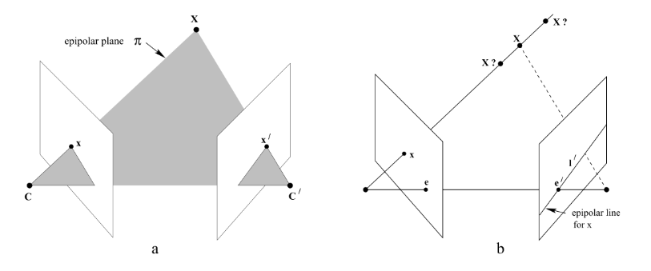
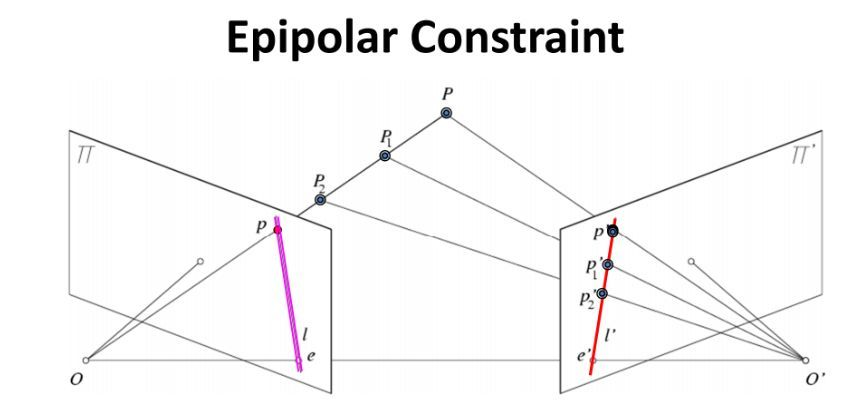
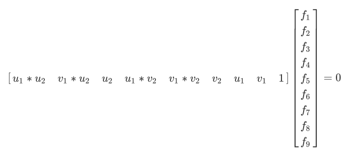
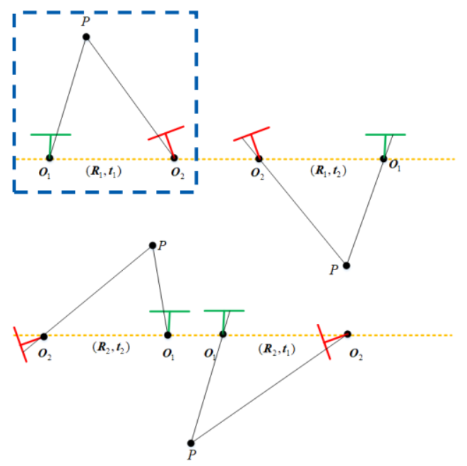
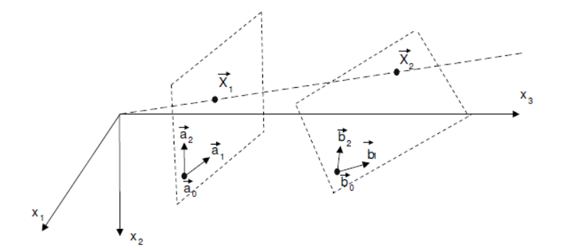
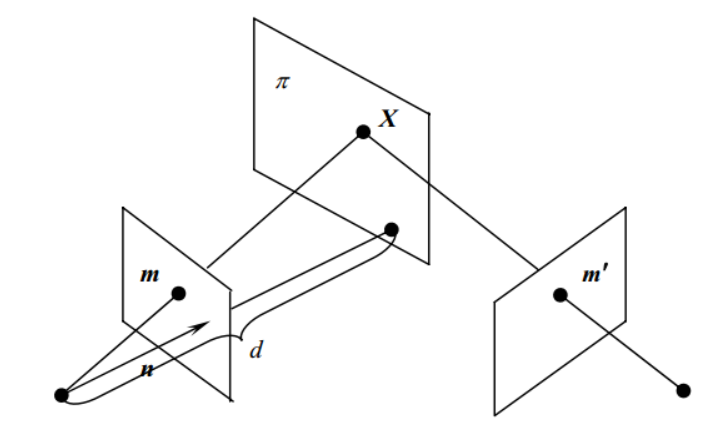
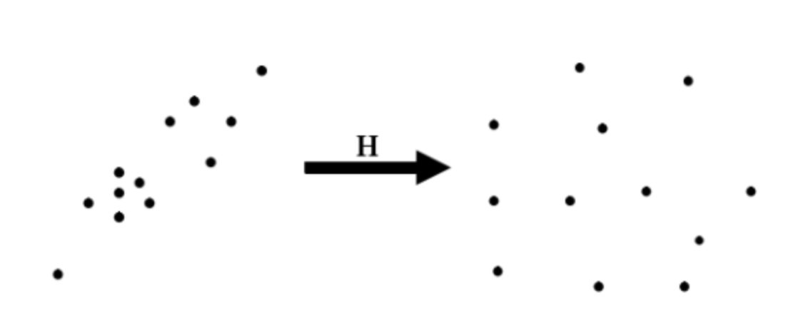

| 标题 | 链接 | 
| -- | -- |
|SLAM入门之视觉里程计(4)：基础矩阵的估计 | https://www.cnblogs.com/wangguchangqing/p/8214032.html | 
|SLAM入门之视觉里程计(5)：单应矩阵 | https://www.cnblogs.com/wangguchangqing/p/8287585.html| 
| SLAM入门之视觉里程计(6)：相机标定 张正友经典标定法详解| https://www.cnblogs.com/wangguchangqing/p/8335131.html |

# 1. 对极几何

对极几何描述的是两幅视图之间的内在射影关系，与**外部场景无关**，只依赖于摄像机内参和这两幅视图之间的相对位姿。

两幅视图的对极几何可以理解为图像平面与以基线为轴的平面束相交的几何关系。
1）**基线（baseline）**：两个相机中心的连线CC‘
2）**对极点（epipolar)**：e e'是对极点，是基线与两个成像平面的交点，也就是两个相机中心分别在另一个相机成像平面上的像点。
3）**对极平面（epipolar plane)**：过基线的平面都称为对极平面，其中两个相机的中心C和C'，三维点X，以及三维点在两个相机成像点x、x'这五点必定在同一对极平面上。当三维点X变化时，对极平面绕着基线旋转，形成对极平面束。
4）**对极线（epipolar line)**：是对极平面和成像平面的交线，图中的ex和e'x'所在直线。所有对极线都相交于对极点。
5）**对极约束**：指平面2上的p点在平面1上的对应点一定在对极线l’（e'x'）上。这说明对极约束是一个点到直线的射影映射关系。如下图所示：
根据对极约束可以引出**本质矩阵**和**基础矩阵**

# 2. 基础矩阵和本质矩阵

## 2.1. 基础矩阵的定义

在已知相机标定情况下，假设一个三维坐标点P(X, Y, Z)在两个视图上的投影点分别为p1、p2，以第一个相机中心为世界坐标系的原点，第二个相机相对第一个相机的旋转和平移为$R_{cw}(R_{21})、t_{cw}(t_{21})$，根据小孔成像模型有：

$$
p1 = KP, p2 = K(R_{21}P + t_{21}) \tag{1}

$$

其中，K是相机的内参。
从p1 = KP可得$P = K^{-1}p_1$，带入到第二个式子得：

$$
p_2 = K(R_{21}K^{-1}p_1 + t_{21}) \tag{2}

$$

两边同时乘以$K^{-1}$得到：

$$
K^{-1}p_2 = R_{21}K^{-1}p_1 + t_{21} \tag{3}

$$

令x1和x2分别为

$$
x_1 = K^{-1}p_1, x_2 =  K^{-1}p_2 \tag{4}

$$

则（3）转换为：$x_2 = R_{21}x_1 + t_{21}$，两边同时左乘向量t的反对称矩阵$[t_{21}]_\times$，由于$[t_{21}]_\times t_{21}=0$，消除t_{21}，得

$$
[t_{21}]_\times x_2 = [t_{21}]_\times R_{21}x_1 \tag{5}

$$

两边再同时左乘$x^T_2$得：

$$
x^T_2[t_{21}]_\times x_2 = x^T_2 [t_{21}]_\times R_{21}x_1 \tag{6}

$$

由于$[t]_\times x_2$是向量t和向量$x_2$的叉积，同时垂直于向量t和向量$x_2$，所以等式左边为0，得到：

$$
x^T_2 [t_{21}]_\times R_{21}x_1 = 0 \tag{7}

$$

将$x_1$和$x_2$替换回去，得到：

$$
p^T_2 K^{-T} [t_{21}]_\times R_{21}K^{-1}p_1 = 0 \tag{8}

$$

式8是对极约束的一种表示，仅包含像点、相机的旋转和平移，中间的矩阵就是**基础矩阵F**：

$$
F = K^{-T} [t_{21}]_\times R_{21}K^{-1}  \tag{9}

$$

当内参矩阵已知时，，提取中间的矩阵得到**本质矩阵E**，E矩阵同样表示的是对极约束关系，只不过不再涉及相机的内参，仅仅由两个视图之间的姿态关系决定：

$$
E = [t_{21}]_\times R_{21}

$$

## 2.2. 基础矩阵的三个性质

1.  是3x3矩阵，自由度为7
2.  kF为基础矩阵，相差一个尺度自由度。
3.  F矩阵的秩为2

## 2.3. 本质矩阵的三个性质

1.  3*3且自由度为5的矩阵，因为只包含R，t共有6个自由度，又因为尺度等价去掉一个自由度
2.  本质矩阵E的奇异值必定为$[\sigma, \sigma, 0]^T$的形式

## 2.4. 基础矩阵的求解方法

1.  直接线性变换法（8点法 + 最小二乘法）
2.  RANSACk估计基础矩阵（其实也是用直接线性变换法）

### 2.4.1. 8点法求基础矩阵

基础矩阵表示的是图像中的像点$p_1$到另一幅图像对极线$l_2$的映射，有如下公式：

$$
l_2 = Fp_1

$$

和$p_1$匹配的另一幅图像中的像点$p_2$一定在对极线$l_2$上，所以有：

$$
p_2^Tl_2 = p_2^TFp_1 = 0

$$

假设其次坐标$p_1 = (u_1, v_1, 1)、p_2 = (u_2, v_2, 1)$带入上式：

$$
[u_2, v_2, 1]
\left[
\begin{matrix}
f_1 \quad f_2 \quad f_3 \\
f_4 \quad f_5 \quad f_6 \\
f_7 \quad f_8 \quad f_9
\end{matrix}
\right]
\left[
\begin{matrix}
u_1 \\
v_1 \\
1
\end{matrix}
\right]
=0

$$

展开之后得

一对点提供一个约束方程，基础矩阵共9个元素，7个自由度，所以8对点提供8个约束就可以求解。

## 2.5. 从基础矩阵分解出R、t

首先通过基础矩阵F和本质矩阵E的关系，以及相机内参矩阵求出本质矩阵E，这里假设两个视图的相机内参不同，分别为K1和K2，则

$$
E = K^T_2 F K_1  

$$

$$
E = U diag(\sigma_1, \sigma_2, 0)V^T 

$$

$$
E = U diag(\frac{\sigma_1 + \sigma_2}{2}, \frac{\sigma_1 + \sigma_2}{2}, 0)V^T 

$$

$$
E = U \Sigma V^T, \Sigma = diag(\sigma, \sigma, 0) 

$$

$$
t_1 = U(:, 2),  R_1 = UR_Z(\frac{\pi}{2})V^T 

$$

$$
t_2 = -U(:, 2),  R_2 = UR^T_Z(\frac{\pi}{x})V^T 

$$

共有4中情况$(R_1, t_1), (R_1, t_2), (R_2, t_1), (R_2, t_2)$，只有下图中的第一种情况符合要求。

如果两个视图的相机中心相同，即只有旋转没有平移，t=0，这时对极几何的基础就不成立了，可知E、F均为0无法求解。这时需要使用平面间的单应性H矩阵恢复R和t

# 3. 单应性矩阵

单应性矩阵Homogeneous是射影几何中的术语，又称为射影变换，是数学概念，一般所说的单应矩阵是平面上的单应性矩阵，主要用来解决两个问题：
1）表述真实世界中一个平面与它对应图像的透视变换。
2）通过透视变换实现图像从一个视图变换到另一个视图的转换。
把一个射影平面上的点（三维齐次矢量）映射到另一个射影平面上，并且把直线射影为直线，具有保线性，总的来说**单应是关于三维齐次矢量**的一种线性变换，如下图所示，两个平面之间的关系可以用一个3x3的非奇异矩阵H表示$x_1 = Hx_2$，H表示单应矩阵，定义了八个自由度。这种关系定义为平面单应性。

假设已经取得了两图像之间的单应，则单应矩阵H可以将两幅图像关联起来：

$$
[u_1, v_1, 1]^T = H [u_2, v_2, 1]^T

$$

其中 $[u_1, v_1, 1]^T$是图1中的像点，$[u_2, v_2, 1]^T$是图2中的像点，也就是可以通过单应矩阵H将图2变换到图1。可以用于图像的校正、对齐、以及在slam中估计两个相机间的运动。并保持某些性质的不变性，显然具有保线性。
在slam中一般为同一相机在不同的位姿得到同一平面的图像有以下公式

$$
H = K(R + \pmb t \frac{1}{d}\pmb N^T)K^{-1}

$$

### 3.1. 公式的推导

假设同一相机在不同的位姿下拍摄了同一平面，如图：

上图表示场景中的平面$\pi$在两相机的成像，设平面$\pi$在第一个相机坐标系下的单位法向量为$\pmb n$，其到第一个相机中心（坐标原点）的距离为d，则平面$\pi$可表示为：

$$
\pmb n^T \pmb X_1 = d

$$

变换为

$$
\frac{1}{d} \pmb n^T \pmb X_1 = 1, \forall \pmb X_1 \in \pi

$$

其中，$X_1$是三维点P在第一相机坐标系下的坐标，其在第二个相机坐标系中的坐标为$X_2$，则

$$
\pmb X_2 = R \pmb X_1 + \pmb t

$$

两个式子相结合得到：

$$
X_2 = R \pmb X_1 + \pmb t \frac{1}{d} \pmb n^T X_1 = (R + \pmb t \frac{1}{d} \pmb n^T)X_1 = H X_1

$$

### 3.2. 单应矩阵的求解方法

1）直接线性变换法
2）使用RANSAC估计

### 3.2.1. 从单应矩阵分解出R、t

参考Motion and structure from motion in a piecewise planar environment.

# 4. 平面的单应矩阵和对极约束的F矩阵的区别

两图像间的对极约束和场景的结构无关，可以理解对极约束对于任意场景结构的两幅图像都是成立的，约束不能给出两幅图像上的像点的一一对应关系，但是可以给出对应的必要条件：另一幅图像上对应的像点位于对应的对极线上。
**基础矩阵**描述的实际是一种点和直线的映射关系，而不是点对点的约束，不能给出另一个点的确切位置。
**平面的单应矩阵**对场景的结构有要求，场景的点必须在**同一个平面上**，因此单应矩阵H也就能够对两图像上对应点提供更多约束，知道了某点在一幅图像的像点位置后，可以通过单应矩阵，求得其在另一幅图像中像点的确切位置。
**单应矩阵的应用场景**是相机只有旋转而无平移的时候，两视图的对极约束不成立，基础矩阵F为零矩阵，这时候需要使用单应矩阵H，场景中的点都在同一个平面上，可以使用单应矩阵计算像点的匹配点。**相机的平移距离相对于场景的深度较小的时候，也可以使用单应矩阵**

# 5. 计算H矩阵和F矩阵的时候的技巧

orbslam2中用到了两个技巧：

1.  使用RANSAC方法
2.  归一化操作

## 5.1. 归一化操作

对点进行归一化操作并不是orbslam首先提出来的，在MVG(edition 2th)的P218中就提到归一化可愿意提高结果的稳定性。
orbslam中任务利用8点法求基础矩阵不稳定的主要原始是$Ah=0$方程中的A矩阵是用原始图像坐标组成的，不够好，不好的原因是像点的齐次坐标各个分量的数量级相差太大。所以，在应用8点法之前需要对像点坐标进行归一化处理，即对原始图像坐标做同向性变换。

### 5.1.1. 归一化步骤

1.  对每幅图像中的坐标进行平移，使图像中匹配的点组成的点集的形心(Centriod)移动到原点
2.  对点进行缩放，使他们到原点的平均距离为$\sqrt2$
3.  对两幅图像独立进行上述变换，如下图
    
    上图左边是原始坐标，右边是归一化后的坐标。H是归一化的变换矩阵，记作如下形式：

$$
H=
S\left[
\begin{matrix}
1 \quad 0 \quad -\overline u \\
0 \quad 1 \quad -\overline v \\
0 \quad 0 \quad \frac{1}{S}
\end{matrix}
\right]

$$

其中，$\overline u，\overline v$是图像像点坐标两个分量的平均值
S表示为尺度，表达式为：

$$
S = \frac{\sqrt{2N}}{\sqrt{\sum_{i=1}^N((u_i - \overline u)^2 + (v_i - \overline v)^2)}}

$$

利用归一化后的8对点求基础矩阵$\hat F$，然后根据H变换到原始的尺度：$F=H_2^T\hat FH_1$