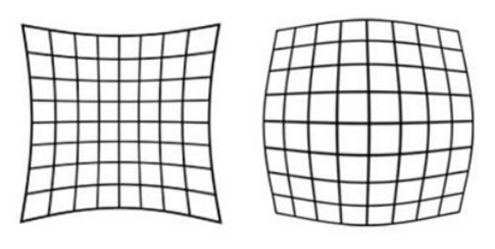
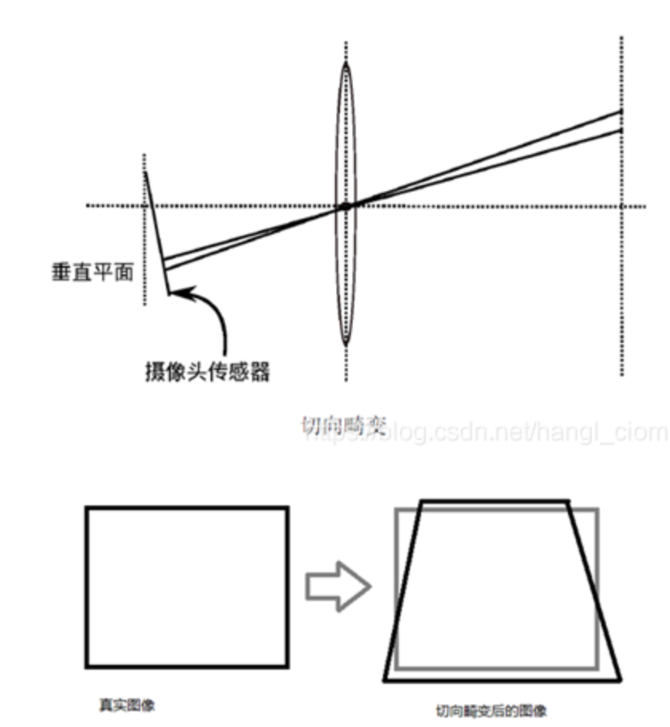

| 标题 | 链接|
|-- | -- |
|常用相机投影和畸变模型| https://blog.csdn.net/qq_28087491/article/details/107965151|

# slam面试-单目相机的投影模型、畸变模型

## 单目相机投影模型

# 1. 畸变模型
设相机坐标系中的3D点为P(X, Y, Z)，对应的图像的像素点为p(u, v)，相机的内参矩阵为K，则：

$$
\left[
\begin{matrix}
u \\
v \\
1
\end{matrix}
\right] = 
\frac{1}{Z}
\left[
\begin{matrix}
f_x \quad 0 \quad c_x \\
0 \quad f_y \quad c_y \\
0 \quad 0 \quad 1
\end{matrix}
\right]
\left[
\begin{matrix}
X \\
Y \\
Z
\end{matrix}
\right]
\triangleq \frac{1}{Z}KP

$$

## 畸变模型

畸变模型分为径向畸变和切向畸变

### 1\. 径向畸变

径向畸变是沿着透镜半径方向分布的畸变，产生的原因是**光线在远离透镜中心的地方比靠近中心的地方更加弯曲**，廉价镜头中更明显，主要包括枕形畸变和桶形畸变，广角镜头产生桶形畸变，长焦镜头产生枕形畸变。
示意图如下

$$
x_{distorted} = x(1 + k_1r^2 + k_2r^4 + k_3r^6) \\
y_{distorted} = y(1 + k_1r^2 + k_2r^4 + k_3r^6)
$$

### 2\. 切向畸变

切向畸变是由于透镜本身与相机传感器平面（像平面）或图像平面不平行而产生的，主要是由于透镜被粘贴到镜头模组上的安装偏差导致，如下图所示：

$$
x_{distorted} = x + 2p_1xy + p_2(r^2 + 2x^2) \\
y_{distorted} = y + p_1(r^2 + 2y^2) + 2p_2xy
$$

对于相机坐标系中的一点P，可以通过5个畸变系数（$k_1, k_2, k_3, p_1, p_2$）找到这个点在像素平面上的正确位置：
1. 将三维空间点投影到归一化图象平面，设它的归一化坐标为$[x, y]^T$
2. 对归一化平面上的点计算径向畸变和切向畸变
$$
x_{distorted} = x(1 + k_1r^2 + k_2r^4 + k_3r^6) + 2p_1xy + p_2(r^2 + 2x^2) \\
y_{distorted} = y(1 + k_1r^2 + k_2r^4 + k_3r^6) + p_1(r^2 + 2y^2) + 2p_2xy
$$
3. 将畸变后的点通过内参数矩阵投影到像素平面，得到该点在图像上的正确位置
$$
u = f_x x_{distorted} + c_x \\
v = f_y y_{distorted} + c_y
$$

**注意 ：上面的畸变模型是对归一化平面中的点进行操作，而不是对图像的像素进行操作。实际上，我们首先得到的是图像平面上带畸变的像素坐标$(u_d, v_d)$。如果需要不带畸变的像素坐标，首先根据内参矩阵把$(u_d, v_d)$反投影到归一化平面，得到带畸变的归一化坐标$(x_d, y_d,1)$；然后通过$(x_d, y_d,1)$和畸变模型反解出不带畸变的$(x, y,1)$，但是畸变模型非线性函数，无法直接求解。**
***
