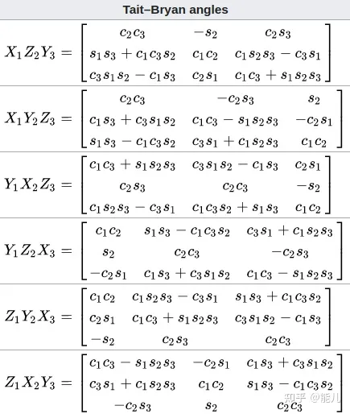

链接：https://zhuanlan.zhihu.com/p/85108850
yaw pitch roll : https://blog.csdn.net/beyondlwm/article/details/78183053

## 1\. 欧拉角简介

欧拉角是由Leonhard Euler 提出的概念,用来描述刚体/移动坐标系在一个固定坐标系中的姿态。简单的说是使用XYZ三个轴的旋转分量，来描述一个6自由度的旋转
欧拉角有两大类表示方法，每个大类都有 6 种旋转顺序：

1.  **Proper Euler angles**（只涉及两个转轴）：(z-x-z, x-y-x, y-z-y, z-y-z, x-z-x, y-x-y)
2.  **Tait-Bryan angles**（涉及三个转轴）：(x-y-z, y-z-x, z-x-y, x-z-y, z-y-x, y-x-z)
    SLAM中一般使用Tait-Byran angles。
    Tait-Byran angles也被称为：Cardan angles, nautical angles, (heading, elevation, and bank),(yaw, pitch, and roll). 我们接触的比较多的是yaw(偏航), pitch(俯仰), roll(横滚).三个变量一般对应(车体,飞行器的)z,y,x三个坐标轴.

右手定则下：旋转角度为正数表示：沿着坐标轴正向的角度看去，顺时针旋转。

## 2\. 欧拉角描述旋转（表示方法为：Tait–Bryan angles）

仅仅给出一组旋转角度，如绕x、y、z三个轴的转角分别为$(\alpha, \beta, \gamma)$是不能确定姿态的。如果要确定姿态，还需要两个属性：旋转顺序和内旋/外旋。
所以<span style="color: red;">用欧拉角表示姿态时，需要三个属性</span>：
1、旋转角度
2、旋转顺序
3、内旋还是外旋

### 2.1 旋转顺序

旋转顺序就是Tait–Bryan angles的 6 种(x-y-z, y-z-x, z-x-y, x-z-y, z-y-x, y-x-z)旋转顺序中的一种。
比如，我们指定绕X轴旋转$\alpha$，绕Y轴旋转$\beta$，不同的旋转顺序产生的姿态一般是不同的，比如：
1、先绕 X 轴旋转$\alpha$，再绕 Y 轴旋转$\beta$，得到姿态O1
2、先绕 Y 轴旋转$\beta$，再绕 X 轴旋转$\alpha$，得到姿态O2
一般情况下，O1和O2是不同的。所以需要明确旋转顺序。

### 2.2 内旋还是外旋

内旋(intrinsic rotations) = 旋转轴(rotated axis)
外旋(extrinsic rotations) = 固定轴(static/fixed axis)
内旋相当于每次都绕刚体自身的坐标系旋转；
外旋相当于每次都绕外部固定坐标系旋转。
**内旋和外旋的说明**：
假设世界坐标系XYZ 中存在一个物体，物体自身的坐标系为xyz。假设初始状态物体坐标系 xyz 相对世界坐标系XYZ的旋转为（0，0，0），即 xyz 和 XYZ 重合。
（这里的x,y,z与坐标系无关，只表示顺序）我们定义旋转顺序为 z->y->x，转动角度为$(\gamma, \beta, \alpha)$。先绕 z 轴旋转$\gamma$，旋转后，物体的x、y轴的坐标系发生了变化（方向变了），z 轴不变，假设得到的新的物体坐标系为$x_2y_2z$，此时的坐标轴$x_2, y_2$ 不再与世界坐标系的X轴和Y轴重合了。
**内旋和外旋的区别在于：**
在第二次旋转时（转$\beta$时）：
**内旋**按照旋转之后物体的坐标轴y轴（也就是$y_2$轴）旋转。
**外旋**仍然是按照世界坐标系的 Y轴进行旋转。
旋转最后一个角度$\alpha$时也是一样的。

综上所述，在描述欧拉角时，应该这样：
1、旋转角度：$(\alpha, \beta, \gamma)$，旋转顺序：(z->y->x)，外旋
或者
2、旋转角度：$(\alpha, \beta, \gamma)$，旋转顺序：(x->y->z)，内旋

## 3\. 欧拉角 -> 旋转矩阵

1.  **欧拉角**：旋转角度：$(\alpha, \beta, \gamma)$，旋转顺序：(z->y->x)，外旋
    **旋转矩阵**：(都是左乘)
    $R = X(\alpha)*Y(\beta)*Z(\gamma)$
2.  **欧拉角**：旋转角度：$(\alpha, \beta, \gamma)$，旋转顺序：(x->y->z)，内旋
    **旋转矩阵**：
    $R = X(\alpha)*Y(\beta)*Z(\gamma)$
    其中：

$$
X(\alpha) = \left[
\begin{matrix}
1 & 0 & 0 \\
0  & cos(\alpha) & -sin(\alpha) \\ 
0 & sin(\alpha) & cos(\alpha)
\end{matrix}
\right] 


$$

$$
Y(\beta) = \left[
\begin{matrix}
cos(\beta) & 0 & sin(\beta) \\
0  & 1 & 0 \\ 
-sin(\beta) & 0  & cos(\beta)
\end{matrix}
\right] 


$$

$$
Z(\gamma) = \left[
\begin{matrix}
cos(\gamma) & -sin(\gamma) & 0 \\
sin(\gamma) & cos(\gamma) & 0 \\
0  & 0 & 1
\end{matrix}
\right] 


$$

从上面可以看出：<span style="color: blue;">(z->y->x)外旋 == (x->y->z)内旋</span>。
<span style="color: red;">每种特定顺序的外旋 等价于 其相反顺序的内旋</span>

```python
## python tf库
from tf import transformations
import math
T = transformations.euler_matrix(x, y, z, "sxyz") 

## numpy
import numpy as np
Rz = np.mat([[c1,-s1, 0],
[s1, c1, 0],
[0,0,1]])

Ry = np.mat([[c2, 0, s2],
[0, 1, 0],
[-s2, 0, c2]])

Rx = np.mat([[1,0, 0],
[0, c3, -s3],
[0,s3,c3]])

print(np.dot(Rz ,np.dot(Ry ,Rx)))

## eigen
#include <Eigen/Core>
#include <Eigen/Geometry>
Eigen::Matrix3d R = Eigen::AngleAxisd(euler[2], Eigen::Vector3d::UnitZ()) *
                    Eigen::AngleAxisd(euler[1], Eigen::Vector3d::UnitY()) * 
                    Eigen::AngleAxisd(euler[0], Eigen::Vector3d::UnitX());
```

## 4\. 旋转矩阵 -> 欧拉角

wiki: https://en.wikipedia.org/wiki/Euler_angles


这张表描述了所有Tait-Bryan angles的旋转组合和转换。
以最后一行为例，可以把$Z_1X_2Y_3$ 看做 Z->X->Y内旋 或者 Y->X->Z外旋。
从矩阵的角度就是$Z*X*Y$.
这里的1,2,3可以认为是各个转轴上的旋转角度，后面的c1表示cos(绕Z轴转角)，s1表示sin(绕Z轴转角)。
旋转矩阵转欧拉角可以结合这张表中的公式。 比如对一个给定的旋转矩阵R，我们需要把R分解为$Z*X*Y$形式的欧拉角，我们就找到最后一行的$Z_1X_2Y_3$。我们记Z,X,Y对应的角度分别为yaw,roll,pitch。而
sin(yaw) = s1, cos(yaw) = c1.
sin(roll) = s2, cos(roll) = c2.
sin(pitch) = s3, cos(pitch) = c3.
我们的计算方式是**寻找每个角度对应的tan值**：
我们看到R\[0\]\[1\]/R\[1\]\[1\] = (-c2s1)/(c1c2) = -s1/c1 = -tan1.
则yaw = -atan2(R\[0\]\[1\]/R\[1\]\[1\]).
我们知道了yaw, 就能计算出c1, s1, 代入R\[1\]\[1\] = c1c2可以求出c2.
c2结合R\[2\]\[1\]=s2可计算出tan2, 得到roll.
同样的方法,得到tan3, 计算出pitch.
至此可得yaw,roll,pitch.
一般情况下可以如此计算，**不过在万向节思索状态下似乎会出现分母为0的情况**。

## 5\. 欧拉角 -> 四元数

可以借用旋转矩阵：欧拉角->旋转矩阵->四元数
当然, 也有直接转换的方法.

## 6\. 四元数 -> 欧拉角

可以借用旋转矩阵：四元数->旋转矩阵->欧拉角
当然, 也有直接转换的方法.

## 7\. 代码（使用python tf库）

```python
from tf import transformations
import math
import numpy a3s np

def euler_to_matrix_rad(x, y, z):
    T = transformations.euler_matrix(x, y, z, "sxyz")
    return T

def matrix_to_euler_rad(matrix):
    q = transformations.quaternion_from_matrix(matrix)
    eulers = transformations.euler_from_quaternion(q, axes='sxyz')
    return eulers

def matrix_to_quaternion(matrix):
    return transformations.quaternion_from_matrix(matrix)

#四元数是ijk3 也就是xyz的顺序
def quaternion_to_matrix(quat):
    return transformations.quaternion_matrix(quat)

def quaternion_to_euler_rad(quat):
    return transformations.euler_from_quaternion(quat, axes='sxyz')

def euler_to_quaternion_rad(x, y, z):
    return transformations.quaternion_from_euler(x, y, z, axes='sxyz')

def rad_to_degree(rad):
    return rad / math.pi * 180

def degree_to_euler(degree):
    return degree / 180 * math.pi

def inverse_matrix(matrix):
    return transformations.inverse_matrix(matrix)

#注意简单的a*b是按对应位置元素相乘
def dot_matrix(a, b):
  return np.dot(a, b)

```