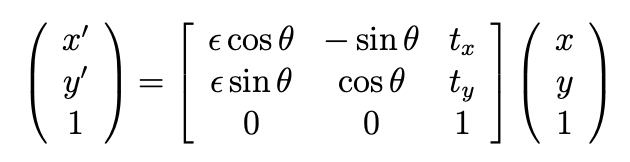
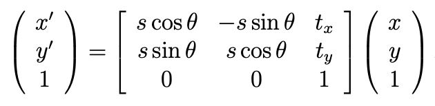
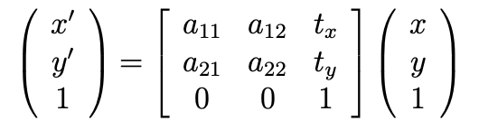
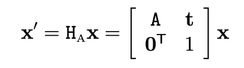
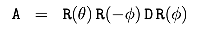
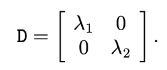
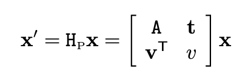

# 2D空间中的变换

1.  等距变换：

当ε为1时，是欧式变换；ε为-1时，会出现歧义情况 欧式变换有三个自由度：1个旋转，两个平移

2.  相似变换：

相似变换有4个自由度：1个旋转、1个尺度、2个平移

3.  仿射变换

 

仿射变换有6个自由度，对应了矩阵中的6个元素。
可以把A看做是两个基础变换的组合：旋转和非各向同性的缩放的组合

 

4.  射影变换
    

射影变换有8个自由度，两个平面的射影变换可以通过4对点计算，任意三个点不共线。

# 3D空间中的变换

1.  欧式变换：相当于是平移变换（t）和旋转变换（R）的复合，等距变换前后长度，面积，线线之间的角度都不变。自由度为6（3+3）
2.  相似变换：等距变换和均匀缩放（S）的一个复合，类似相似三角形，体积比不变。自由度为7（6+1）
3.  仿射变换：一个平移变换（t）和一个非均匀变换（A）的复合，A是可逆矩阵，并不要求是正交矩阵，仿射变换的不变量是:平行线，平行线的长度的比例，面积的比例。自由度为12（9+3）
4.  射影变换：当图像中的点的齐次坐标的一般非奇异线性变换，射影变换就是把理想点（平行直线在无穷远处相交）变换到图像上，射影变换的不变量是:重合关系、长度的交比。自由度为15（16-1）