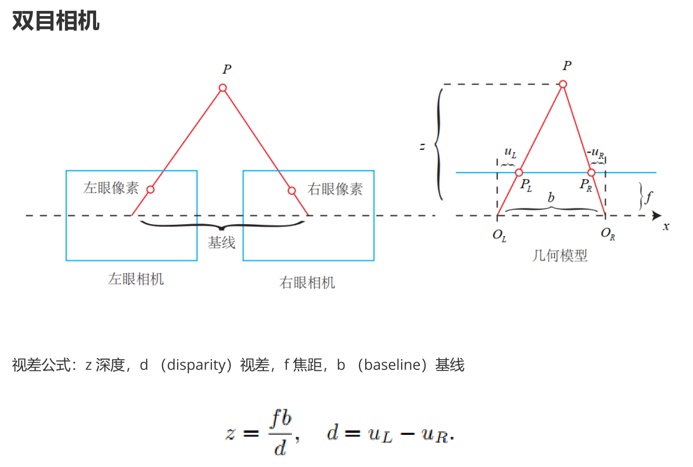
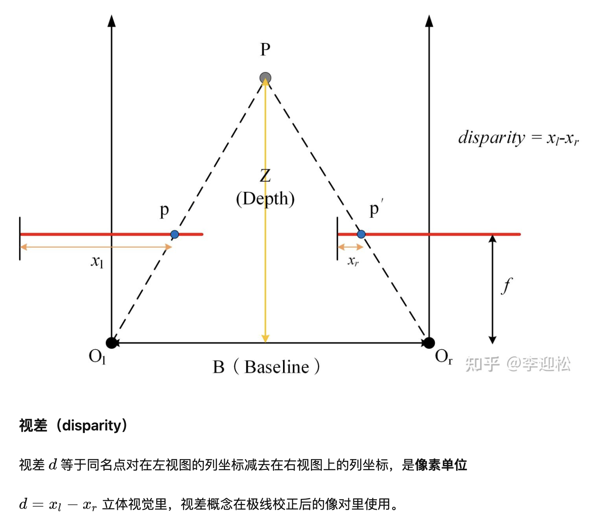

# slam面试-视差和深度

双目相机需要提前标定，并把成像平面对齐
如右图，两相机光心距离为baseline：$b=O_LO_R$，焦距为f，像点$P_L$的x坐标为$u_L$，像点$P_R$的x坐标为$-u_R$，求3D点P的深度z。
根据相似三角形，有：

$$
\frac{P_LP_R}{b} = \frac{z-f}{z} \\
=>zP_LP_R = zb - fb \\
=>fb = z(b - P_LP_R) \\
=>z = \frac{fb}{b-P_LP_R} = \frac{fb}{u_L - u_R}

$$

* * *

