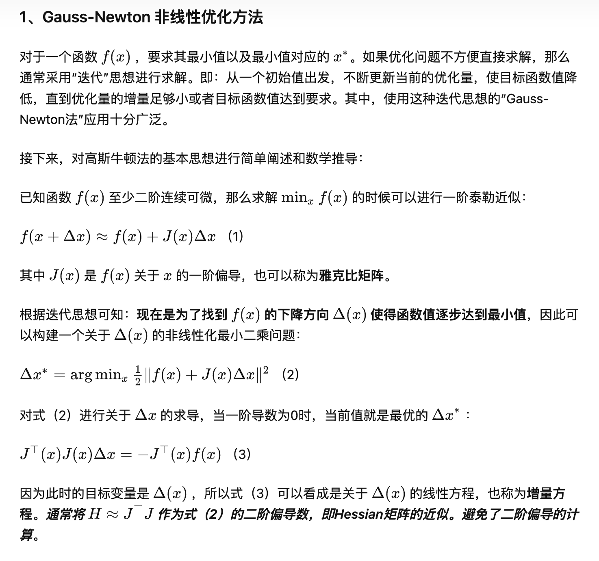
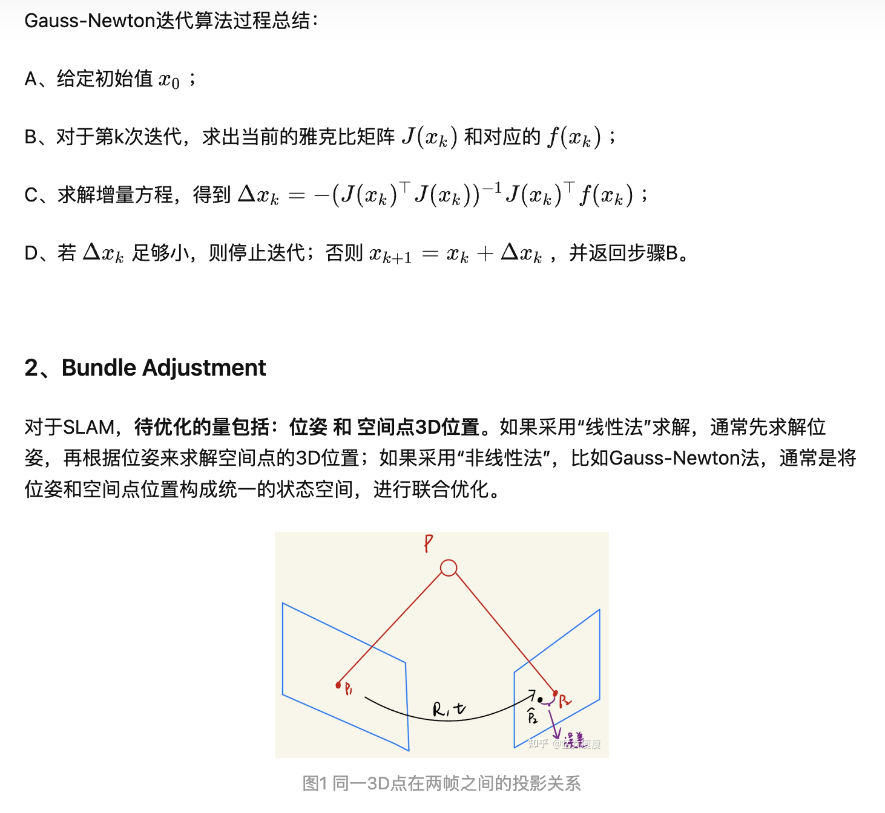
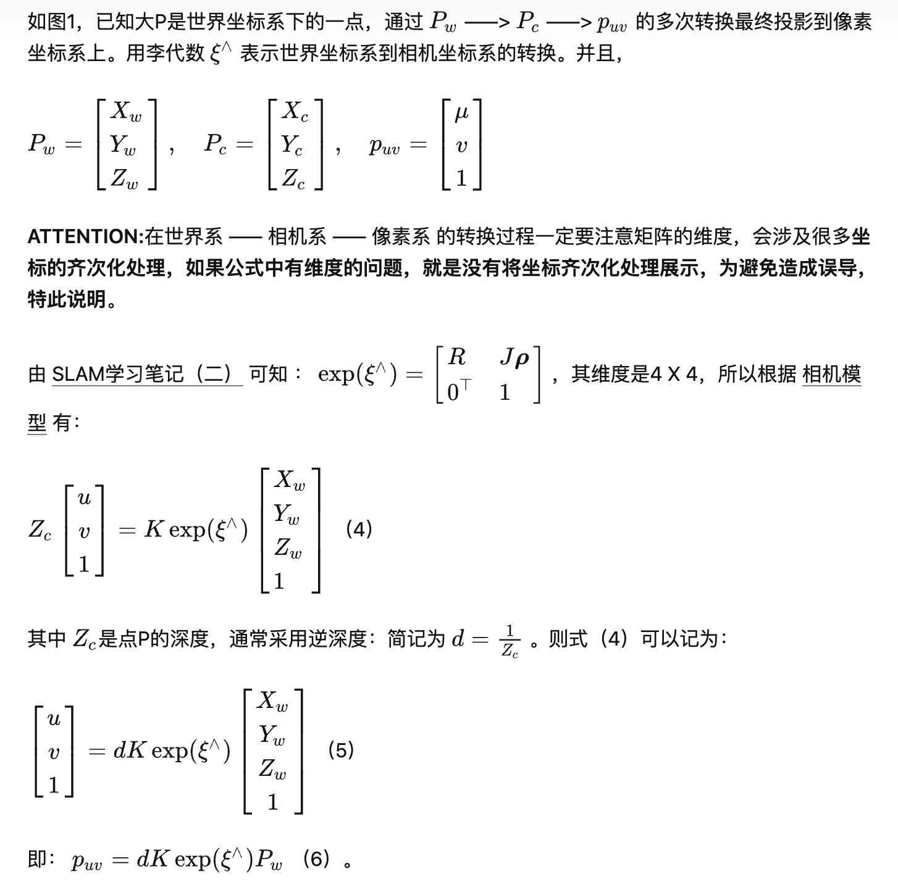
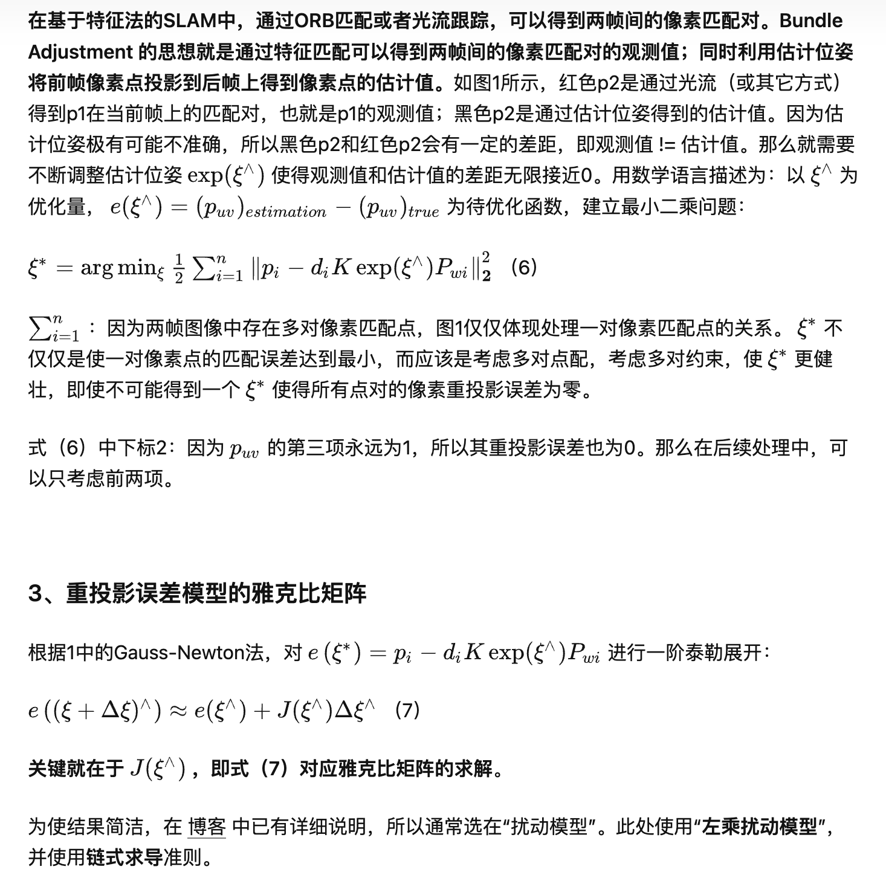
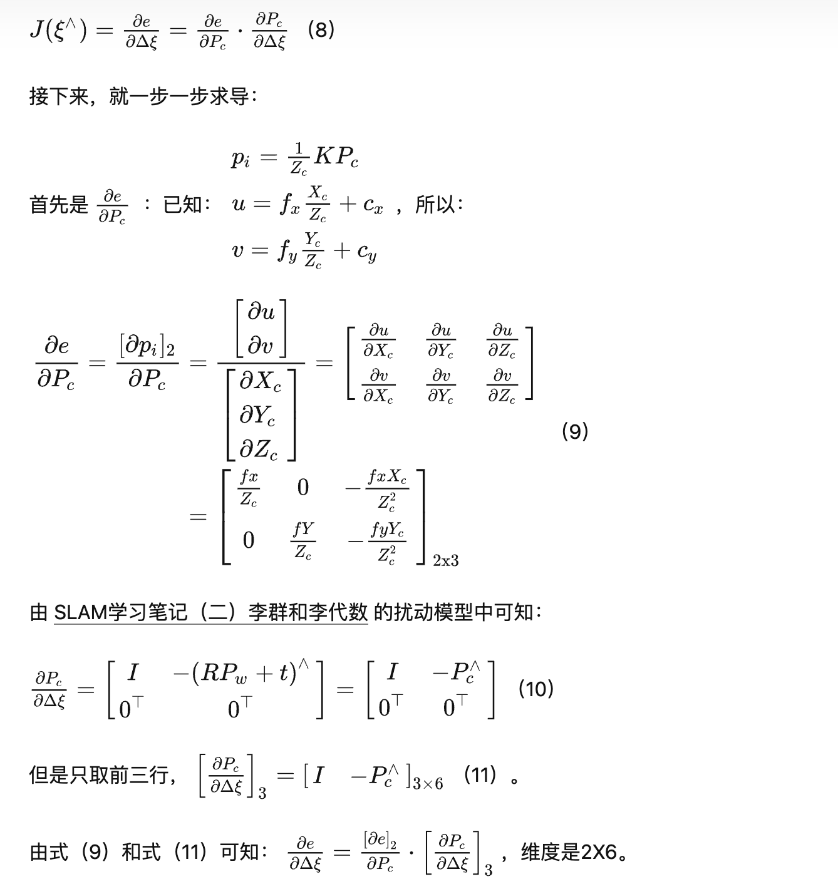
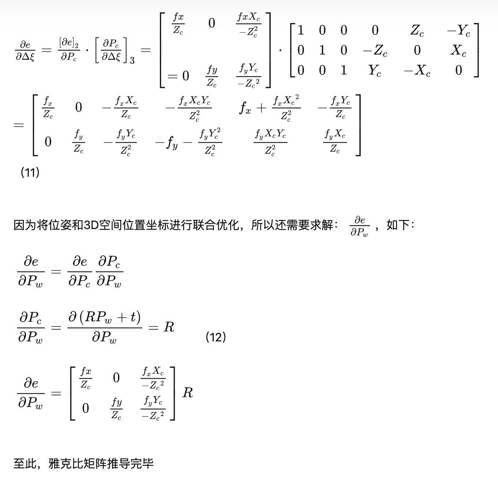

链接：
| 标题 | 说明 | 链接 | 
|-- | -- | -- |
| 视觉SLAM位姿优化时误差函数雅克比矩阵的计算 | 直接用流形上的扰动来对位姿求导 | https://blog.csdn.net/u011178262/article/details/85016981 | 
| SLAM优化位姿时，误差函数的雅可比矩阵的推导 | 先三维点先对SO3（李群）求导，然后SO3再对se3（李代数）求导，与matlab的toolbox_calib包一致 |https://blog.csdn.net/zhubaohua_bupt/article/details/74011005 | 
|SLAM学习笔记（四）Bundle Adjustment 重投影误差模型及相应雅克比公式推导 | 包含了GN优化的流程 |https://zhuanlan.zhihu.com/p/482540286 | 

 