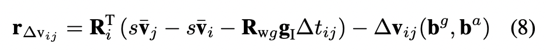
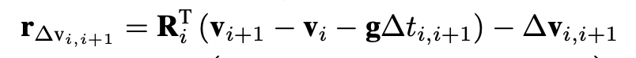

# IMU初始化

**IMU规格书中给定的噪声和随机游走，如果没有经过IMU频率的处理，需要手动处理，比如EuRoC数据集中的IMU的参数如下：**
```
#Default imu sensor yaml file
sensor_type: imu
comment: VI-Sensor IMU (ADIS16448)

# Sensor extrinsics wrt. the body-frame.
T_BS:
  cols: 4
  rows: 4
  data: [1.0, 0.0, 0.0, 0.0,
         0.0, 1.0, 0.0, 0.0,
         0.0, 0.0, 1.0, 0.0,
         0.0, 0.0, 0.0, 1.0]
rate_hz: 200

# inertial sensor noise model parameters (static)
gyroscope_noise_density: 1.6968e-04     # [ rad / s / sqrt(Hz) ]   ( gyro "white noise" )
gyroscope_random_walk: 1.9393e-05       # [ rad / s^2 / sqrt(Hz) ] ( gyro bias diffusion )
accelerometer_noise_density: 2.0000e-3  # [ m / s^2 / sqrt(Hz) ]   ( accel "white noise" )
accelerometer_random_walk: 3.0000e-3    # [ m / s^3 / sqrt(Hz) ].  ( accel bias diffusion )

```

最后的噪声和随机游走需要进行处理：
```
频率开方：sqrtFreq = sqrt(rate_hz)
噪声处理：gyrNoiseNew = gryNoise * sqrtFreq;
				 accNoiseNew = accNoise * sqrtFreq;
随机游走：gyrBiasW = gyrBiasDiffusion / sqrtFreq;
				 accBiasW = accBiasDiffusion / sqrtFreq;
```

---
---
根据orbslam3，通过IMU初始化应该获得：

1.  尺度s
2.  重力方向到世界系的变换$R_{WB}$
3.  加速度计和陀螺仪的零偏$\vec b = (\vec b_a, \vec b_w)$
4.  IMU的在每一帧时刻的速度$\vec v_{0:k}$
    惯导状态向量$Y = (s, R_{WB}, \vec b, \vec v_{0:k})$

把第0帧到第k帧之间的IMU测量数据积分起来，得到$I_{0:k} = (I_{01}, I_{12}, ..., I_{k-1k})$
根据上面的表示，构造一个最大后验估计问题：


根据IMU的读数：加速度a和角速度w进行递推积分

## 分别给需要估计的状态一个初始值：s, $R_{wg}$, $\vec b = (\vec b_a, \vec b_w)$, $\vec v_{0:k}$

orbslam3中
**1\. 尺度 s 的初始值是1.0.**
**2\. 零偏的初始值为0**
**3\. $R_{wg}$的初始值的计算：根据论文Inertial-Only Optimization for Visual-Inertial Initialization.pdf中的公式：**

与原始速度预积分残差公式：

的区别：重力加速度$\pmb g$用$\pmb R_{wg} \pmb g_I$来表示。$R_{wg}$把实际的重力向量转换到世界坐标系中(此时为相机第一帧表示的坐标系)。
根据(8)这个公式，把$s \bar v_j - s \bar v_i - R_{wg}g_I\Delta t_{ij}$从第 i 个IMU一直累减到第 j 个IMU，结果为：
$-(s \bar v_{i+1} - s \bar v_i - g\delta t) - (s \bar v_{i+2} - s \bar v_{i+1} - g\delta t)-(s \bar v_{i+3} - s \bar v_{i+2} - g\delta t) - ... -(s \bar v_j - s \bar v_{j-1} - g\delta t) = \bar v_i - \bar v_j + (j-i)g\delta t$
所以，最终得到的结果为第 i 时刻和第 j 时刻的差，再加上$(j-i)g\delta t$。可以认为$\bar v_i - \bar v_j + (j-i)g\delta t$ 中 $\bar v_i - \bar v_j$ 的贡献很小，主要作用为$(j-i)g\delta t$，所以可以用 $\bar v_i - \bar v_j + (j-i)g\delta t$ 表示的方向**近似**当做重力加速度在世界坐标系中的方向。$\pmb g_I$叉乘这个值，得到旋转轴，$\pmb g_I$点乘这个值，得到旋转角。通过角轴构造出$R_{wg}$。