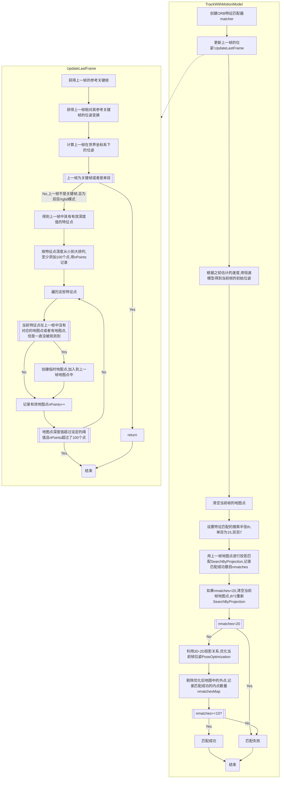
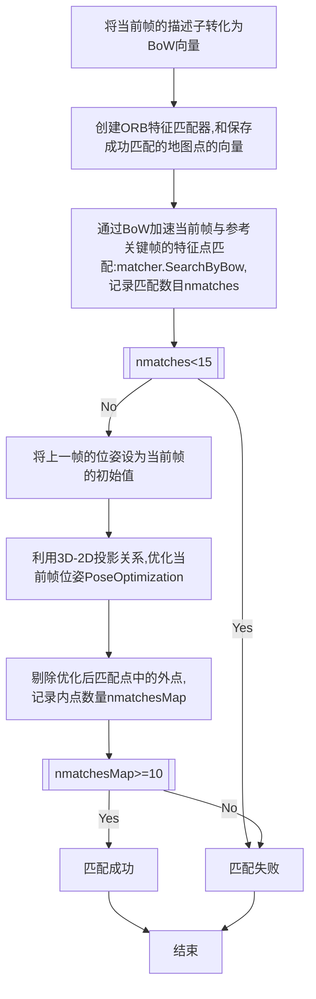
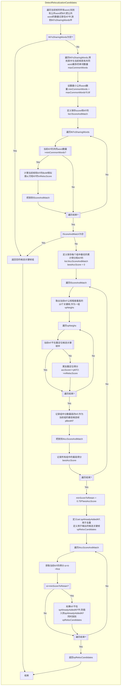
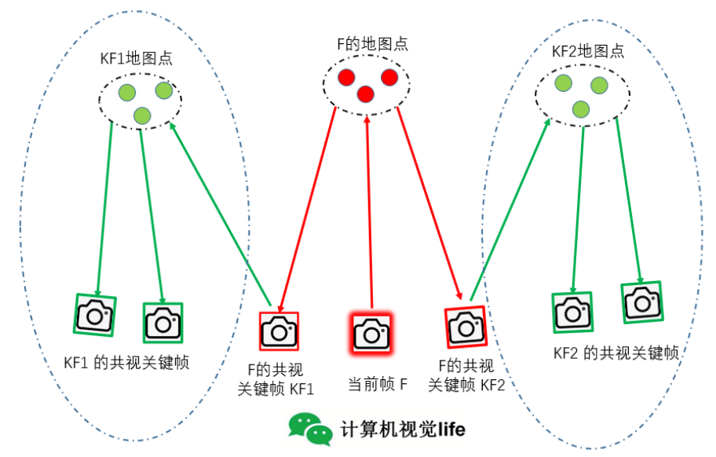
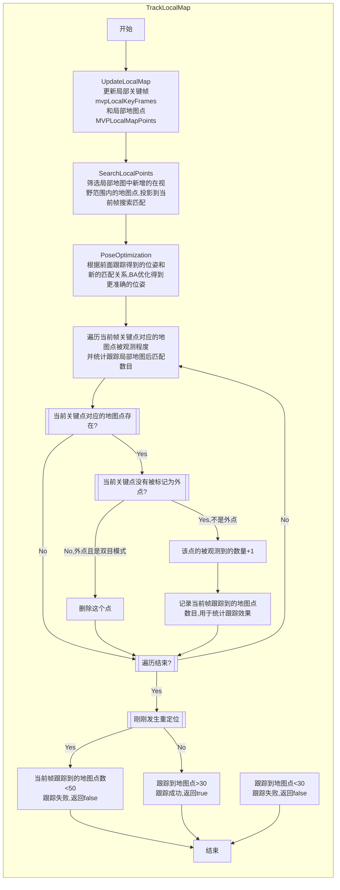
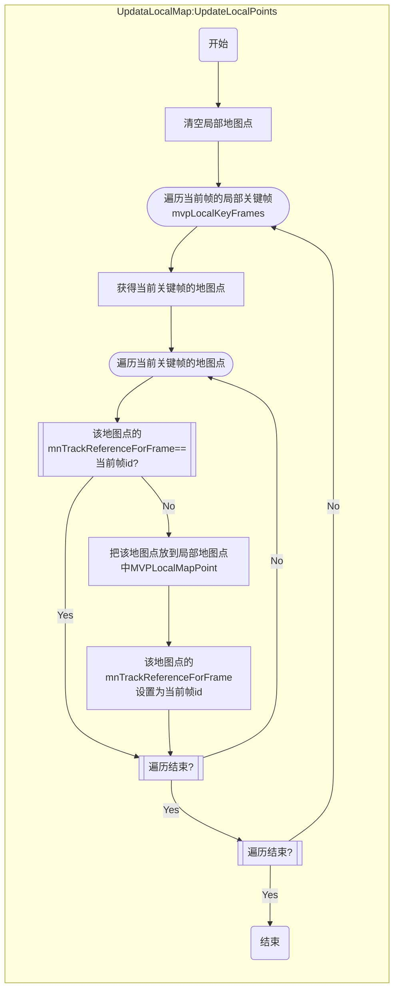
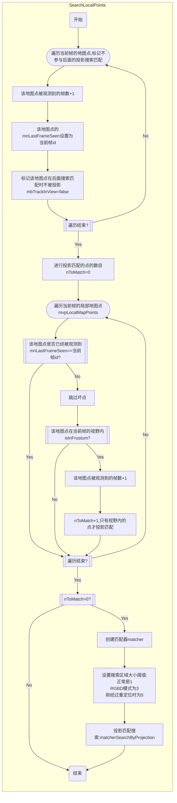

# ORB-SLAM2 跟踪过程

跟踪分为三种：恒速模型跟踪、关键帧跟踪、重定位跟踪
## 恒速模型跟踪：TrackWithMotionModel
**跟踪步骤**：
1. 更新上一帧的位姿；对于双目或rgbd相机，还会根据深度值生成临时地图点
2. 根据上一帧特征点对应地图点进行投影匹配
3. 优化当前帧位姿
4. 提出地图点中的外点
5. 如果匹配数大于10，认为跟踪成功，返回true
流程图：

## 关键帧跟踪：TrackReferenceKeyFrame
关键帧跟踪的步骤：
1. 将当前普通帧的描述子转化为BoW向量
2. 通过BoW加速当前帧与参考关键帧间的特征点匹配
3. 将上一帧的位姿作为当前帧位姿的初始值
4. 通过优化3D-2D的重投影误差来获得位姿
5. 剔除优化后匹配点中的外点
6. 如果匹配数量超过10，返回true

## 重定位跟踪：Relocalization
重定位跟踪步骤：
1. 计算当前帧特征点的BoW向量
2. 找到与当前帧相似的候选关键帧
3. 通过BoW进行匹配
4. 通过EPnP估计位姿
5. 通过PoseOptimization对位姿进行优化求解
6. 如果内点较少，则通过投影的方式对之前未匹配的点进行匹配，再进行优化求解。
流程图：

```mermaid
flowchart TB
	subgraph Relocalization
	direction TB
	1.1[计算当前帧特征点的BoW向量]-->
	1.2[DetectRelocalizationCandidates根据BoW向量,在关键帧Database中找到当前帧的所有候选关键帧,数量为nKFs]-->
	1.3[[候选关键帧数量nKFs为0?]]
	1.3-->|Yes|1.43
	1.3-->|No|1.4
	1.4[创建ORB匹配器matcher\n创建nKFs个PnP解算器vpPnPsolvers\n创建nKFs个保存特征匹配关系的vector:vvpMapPointMatches\n创建表示放弃关键帧标记的vbDiscarded\n有效候选关键帧数目nCandidates]-->
	1.5[遍历所有候选关键帧i]-->
	1.6[[关键帧i的标记是bad]]
	1.6-->|Yes|1.7
	1.6-->|No|1.8
	1.7[放弃当前关键帧,vbDiscarded.i=true]
	1.8[关键帧i与当前帧用BoW进行匹配:SearchByBoW,匹配结果记录在vvpMapPointMatches.i中,记录匹配数量nmatches]-->
	1.9[[nmatches<15]]
	1.9-->|No|1.11
	1.9-->|Yes|1.10
	1.10[放弃当前关键帧,vbDiscarded.i=true]
	1.11[用匹配结果初始化PnPsolver\n设置PnPsolver参数\n付给vpPnPsolvers.i]-->
	1.12[nCandidates++]
	1.13[[遍历结束?]]
	1.7 & 1.10 & 1.12 --> 1.13
	1.13-->|No|1.5
	1.13-->|Yes|1.14
	1.14[bMatch=false\n创建ORB匹配器matcher2]-->
	1.15[while循环nCandidates>0&&!bMatch]-->
	
	1.16[for遍历vbDiscarded为false的候选关键帧i]-->
	1.17[设置内点标记向量vbInliers\n内点个数nInliers\n是否达到RANSAC最大迭代次数的标记bNoMore]-->
	1.18[获取第i个PnP求解器pSolver\n迭代5次PnP,得到位姿Tcw]-->
	1.19[[如果bNoMore=true\nvbDiscarded.i=true\nnCandidates-1]]-->
	1.20[[Tcw不空?]]
	1.20-->|Yes,PnP算出了位姿,对内点进行BA优化|1.22
	1.20-->|No|1.21
	1.21[[for遍历结束?]]
	1.22[Tcw拷贝到mCurrentFrame.mTcw]-->
	1.23[设置PnP中RANSAC后内点的集合sFound]-->
	1.24[遍历所有内点,把vvpMapPointMatches.i中的内点放到当前帧的地图点和sFound中]-->
	1.25[PoseOptimization对位姿进行优化,输出内点数量nGood:只优化位姿,不优化地图点]-->
	1.26[[nGood<10]]
	1.26-->|Yes|1.21
	1.26-->|No|1.27
	1.27[把当前帧地图点中的外点设置为NULL]-->
	1.28[[nGood<50]]
	1.28-->|Yes|1.29
	1.28-->|No|1.37
	1.29>说明:BoW匹配的内点较少,需通过投影得到更多匹配点,再进行优化]-->
	1.30[matcher2.SearchByProjection\n通过投影将关键帧中未匹配的地图点投影到当前帧生成新的nadditional个匹配]-->
	1.31[[nadditional+nGood>=50]]
	1.31-->|Yes|1.32
	1.31-->|No|1.37
	1.32[根据投影匹配结果,再次采用3D-2D PnP BA优化位姿:PoseOptimization,得到新的内点数目nGood]-->
	1.33[[nGood>30 && nGood<50]]
	1.33-->|Yes|1.34
	1.33-->|No|1.37
	1.34[用BA优化后的位姿在更小窗口内投影搜索匹配nadditional]-->
	1.35[[nGood+nadditional>=50]]
	1.35-->|Yes|1.36
	1.36[再次BA优化位姿PoseOptimization,得到内点数量nGood]-->1.37
	1.35-->|No|1.37
	1.37[[nGood>=50]]
	1.37-->|Yes|1.38
	1.38[bMatch=true\nbreak]-->1.39
	1.37-->|No|1.21
	1.21-->|No|1.16
	1.21-->|Yes|1.39
	1.39[[nCandidates>0&&!bMatch]]
	1.39-->|Yes|1.15
	1.39-->|No|1.40
	1.40[[bMatch==false]]
	1.40-->|Yes|1.41
	1.40-->|No|1.42
	1.41[返回false]
	1.42[重定位成功,mnLastRelocFrameId = mCurrentFrame.mnId\n返回true]
	1.41 & 1.42 -->1.43[结束]
	end
```

重定位中候选关键帧组的选取策略：DetectRelocalizationCandidates
步骤：
1. 找出和当前帧具有公共word的所有关键帧
2. 只和具有公共word较多的关键帧进行相似度计算
3. 将与关键帧相连（权值最高）的前十个关键帧归为一组，计算累计得分
4. 只返回累计得分较高的组中分数最高的关键帧（在每个组中选得分最高的关键帧）。
流程图

## 局部地图跟踪
上面三种跟踪只会执行其中一种，获得当前帧比较粗糙的位姿。然后需要通过跟踪局部地图，得到更加精确的位姿。
**局部地图跟踪的步骤**:
1. 更新局部地图（UpdateLocalMap），包括更新局部关键帧和局部地图点
2. 在局部地图中查找与当前帧匹配的MapPoints，即对局部地图点进行跟踪
3. 更新局部所有MapPoint后，对位姿再次优化
4. 更新当前帧的MapPoint被观测程度，并统计跟踪局部地图的效果
5. 决定是否跟踪成功

**名词理解**:
1. 当前帧：mCurrentFrame，是普通帧
2. 参考关键帧：与当前帧共视程度最高的关键帧
3. 父关键帧：和当前关键帧共视程度最高的关键帧
4. 子关键帧：是上述父关键帧的子关键帧
5. 共视关键帧：一级共视和二级共视
	1. 一级共视关键帧：与当前帧有共同的地图点的关键帧
	2. 二级共视关键帧：与一级共视关键帧有共同地图点的关键帧称为当前帧的二级共视关键帧

所以，当前帧的局部关键帧包括：一级共视关键帧、二级共视关键帧、一级共视关键帧的父关键帧和子关键帧。

**流程图**

```mermaid
flowchart TB
	subgraph UpdataLocalMap:UpdateLocalKeyFrames
	direction TB
	1.1(开始)-->
	1.2[定义字典keyframeCounter:\n记录一级共视关键帧和共视程度]-->
	1.3([遍历当前帧的地图点])-->
	1.4[[此地图点是好点?]]
	1.4-->|No|1.5
	1.5[删除此点]-->1.10
	1.4-->|Yes|1.6
	1.6[获取能观测到该地图点的所有关键帧\n和此点在关键帧中的索引observations]-->
	1.7([遍历observations])-->
	1.8[把关键帧插入到map,并累加每个此关键帧的共视程度]-->
	1.9[[遍历结束?]]
	1.9-->|No|1.7
	1.9-->|Yes|1.10
	1.10[[遍历结束?]]
	1.10-->|No|1.3
	1.10-->|Yes|1.11
	1.11[[keyframeCounter为空?]]
	1.11-->|Yes|1.42
	1.11-->|No|1.12
	1.12[定义用于记录具有最大共视程度的关键帧pKFmax]-->
	1.13[清空局部关键帧向量mvpLocalKeyFrames]-->
	1.14([遍历一级共视关键帧keyframeCounter])-->
	1.15[把一级共视关键帧放入mvpLocalKeyFrames]-->
	1.16[用当前关键帧的mnTrackReferenceForFrame记录当前帧id\n表示已经是当前帧的局部关键帧了,防止重复添加]-->
	1.17[记录共视程度最大的关键帧pKFmax]-->
	1.18[[遍历结束?]]
	1.18-->|No|1.14
	1.18-->|Yes|1.19
	1.19([遍历一级共视关键帧mvpLocalKeyFrames\n找到更多局部关键帧])-->
	1.20[[mvpLocalKeyFrames.size>80?]]
	1.20-->|Yes|break跳出遍历-->1.42
	1.20-->|No|1.21
	1.21[获得最多10个与当前一级关键帧共视程度最高的关键帧vNeighs\n作为当前帧的二级共视关键帧]-->
	1.22([遍历二级共视关键帧vNeighs])
	1.23[[遍历结束]]
	1.22 --> 1.24
	1.24[[当前关键帧的mnTrackReferenceForFrame!=当前帧id?]]
	1.24-->|Yes|1.25
	1.25[把当前关键帧放入mvpLocalKeyFrames]-->
	1.26[当前关键帧的mnTrackReferenceForFrame记录当前帧id]-->
	1.27[break跳出循环]-->1.28
	1.24-->|No|1.23
	1.23-->|No|1.22
	1.23-->|Yes|1.28
	1.28[获得当前一级关键帧的子关键帧spChilds]-->
	1.29([遍历子关键帧])
	1.30[遍历结束?]
	1.29-->1.31
	1.31[[当前关键帧的mnTrackReferenceForFrame!=当前帧id?]]
	1.31-->|Yes|1.32
	1.32[把当前关键帧放入mvpLocalKeyFrames]-->
	1.33[当前关键帧的mnTrackReferenceForFrame记录当前帧id]-->
	1.34[break跳出循环]-->1.35
	1.31-->|No|1.30
	1.30-->|No|1.29
	1.30-->|Yes|1.35
	1.35[获得当前一级关键帧的父关键帧pParent]-->
	1.36[[pParent是否存在?]]
	1.36-->|Yes|1.37
	1.37[[父关键帧的mnTrackReferenceForFrame!=当前帧id?]]
	1.37-->|Yes|1.38
	1.38[把父关键帧放入mvpLocalKeyFrames]-->
	1.39[父关键帧的mnTrackReferenceForFrame记录当前帧id]
	1.36-->|No|1.40
	1.37-->|No|1.40
	1.39-->1.40
	1.40[[遍历结束?]]
	1.40-->|No|1.19
	1.40-->|Yes|1.41
	1.41[更新当前帧的参考关键帧为共视程度最高的关键帧]-->
	1.42(结束)
	end
```

