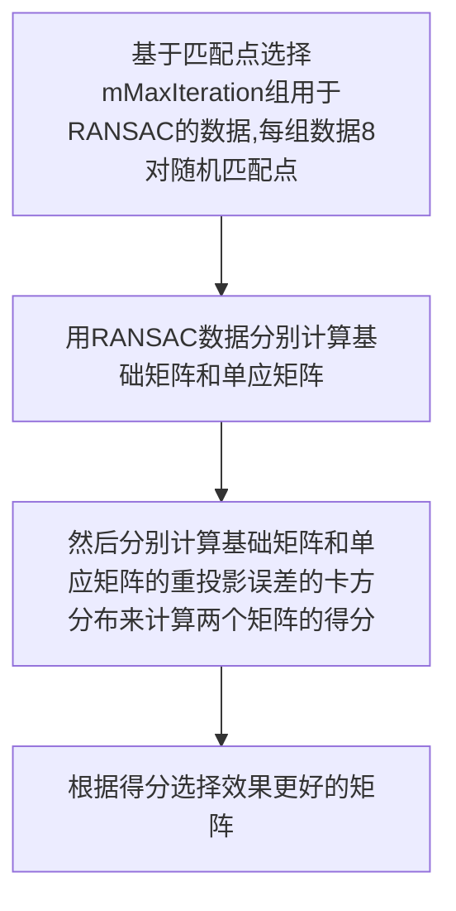
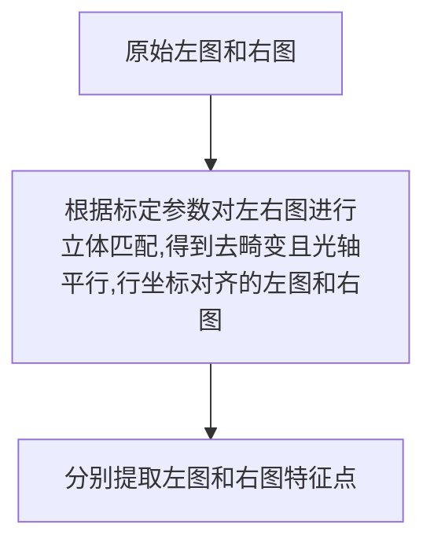
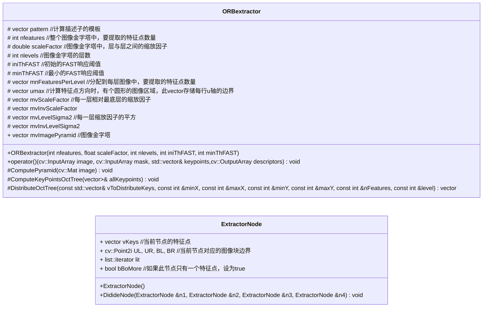
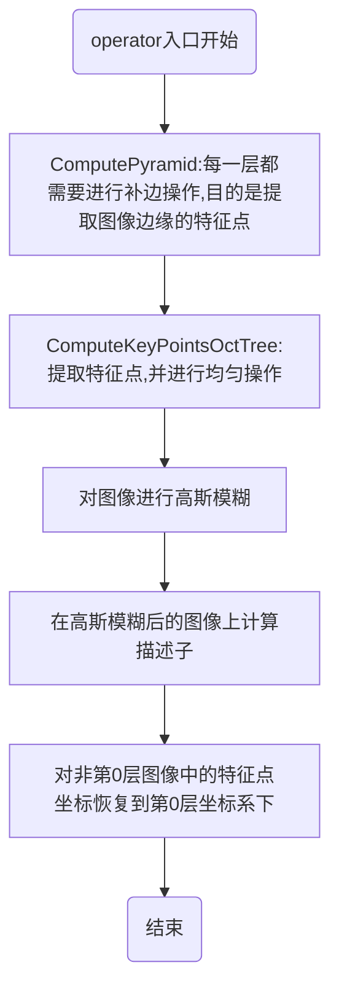
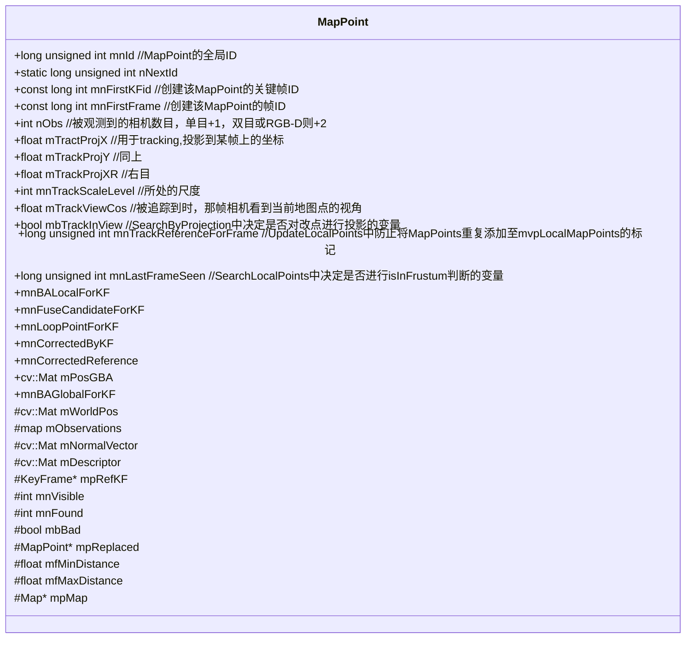

# ORB-SLAM2模块解析

## 1. 初始化模块
### 1.1 单目初始化
初始化的目的是恢复最开始两帧之间的相对位姿，以及对两帧之间匹配的关键点三角化得到初始地图点。**恢复相对位姿、三角化得到初始地图点**
初始化过程：

在计算单应矩阵和基础矩阵时，需要先分别对每幅图像的像点进行归一化。
**归一化的好处**：
1. 提高结果的精度
2. 归一化后的图像坐标对任何尺度缩放和坐标原点的选择不变，归一化步骤通过为测量数据选择有效的标准坐标系，预先消除了坐标系变换的影响。

具体步骤：
1. 对点进行平移使其形心位于原点：
$$
初始像点为：x_1, x_2, ..., x_N \\
像点求均值为：\overline u = \frac{\sum x_i}{N} \\
像点减去均值：u_i ^ \prime = x_i - \overline u
$$
2. 对点进行缩放使它们到原点的平均距离等于$\sqrt{2}$
$$
把减去均值的点求均值，得到偏离均值的程度：\overline u^\prime = \frac{\sum u_i^\prime}{N} \\
其倒数作为缩放因子：s = \frac{1}{\overline u^\prime} \\
缩放后的点为：x_i^\prime = s * u_i^\prime \\
注意这里x, u, s都是二维的，对应像素坐标的两个分量。
$$
3. 对两幅图像独立进行上述变换
$$
把上述平移、缩放写成矩阵形式：\\
T = \left[
\begin{matrix}
s_x \quad 0 \quad -x_{mean}*s_x \\
0 \quad s_y \quad -y_{mean}*s_y \\
0 \quad\quad\quad 0 \quad\quad\quad 1
\end{matrix}
\right]
$$

用归一化点计算的变换矩阵与实际的变换矩阵相差两个归一化变换:
$$
设两幅图像的初始点分别为：x、x^\prime,有x^\prime = Hx \\
归一化之后的对应点为：\overline x = Tx、\overline x^\prime=T^\prime x^\prime \\
则：T^{\prime-1}\overline x^\prime = HT^{-1}\overline x \Rightarrow \overline H = T^\prime H T^{-1} \\
\Rightarrow H = T^{\prime-1} \overline H T
$$

>关于归一化的详细说明，参考《多视几何》第二版的P78。

**单应矩阵和基础矩阵得分的计算**：
* 单应矩阵使用卡方分布的显著性值与**重投影点与原始像点的误差**的差作为得分
* 基础矩阵使用卡方分布的显著性值与**像点到对极线的距离**的差作为得分

### 1.2 双目初始化

## 特征提取 ORBextractor

特征提取的入口函数为重载的operator()，这是一个仿函数。

## MapPoint

