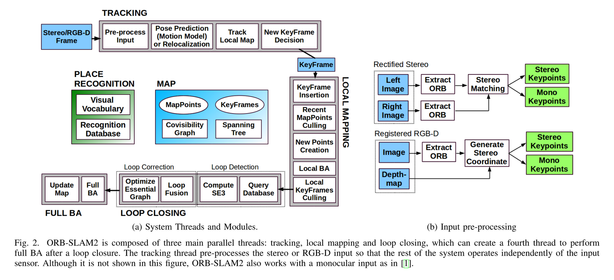
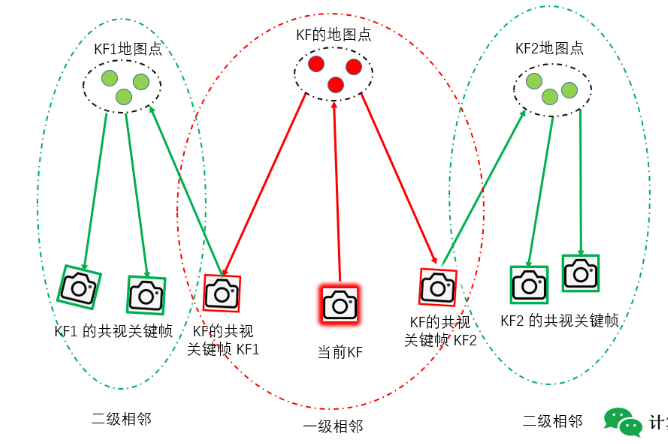
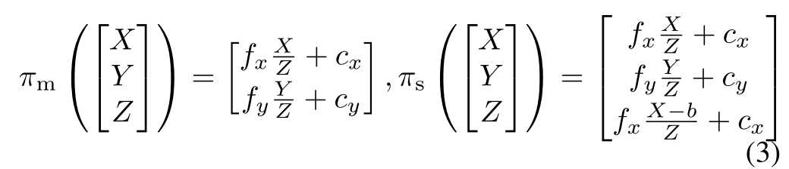
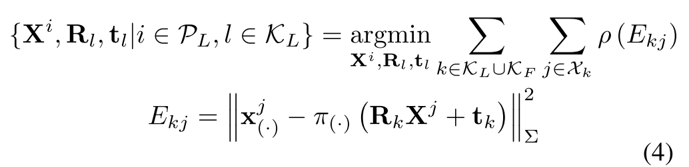

# 简介

## orbslam2优点

1.  全流程使用相同的特征（跟踪、建图、闭环、重定位），使得系统简单可靠、更高效
2.  ORB特征具有旋转、光照不变形，无需GPU可实时
3.  单目初始化和应用场景解耦，不管是平面、非平面都可以自动初始化，无需人工干预。
4.  引入共视图，使得跟踪和建图控制在局部区域，与全局地图大小无关，可以在大场景下运行
5.  在回环检测中引入Essential graph，优化位姿，耗时少，精度高。
6.  可以实时重定位，使得在跟踪丢失后，可以快速恢复位姿，增强地图可用性。
7.  地图点和关键帧的创建比较宽松，在大旋转、快速运动、纹理不足等恶劣条件下可以提高跟踪鲁棒性；后续会再进行严格筛选，提出冗余关键帧和误差大的地图点。
8.  相比直接法，可用于宽基线匹配，更适用于对深度精度要求高的三维重建。

## 共视图 Covisibility graph

共视图的**节点是关键帧，边是关键帧之间共同观测到的地图点数目**（至少15个）
共视图表示的是关键帧之间的关联程度，共视地图点越多，关联程度越高。会把一级和二级共视关系的地图点都投影到当前关键帧进行计算。

## 本质图 Essential graph

## 单目slam的问题

1.  深度无法观测，所以地图和轨迹的尺度无法获得
2.  由于无法从一张图进行三角化，所以系统初始化需要多个视角图片或者用融合的方法
3.  会出现尺度漂移，并且纯旋转时会失败。

## 贡献

1.  第一个可用于单目、双目、rgbd相机的开源slam系统，包含了回环、重定位和地图复用功能。
2.  rbgd上的效果表明，使用BA方法比ICP、photometric和depth error minimization的精度更高。
3.  通过使用close和far stereo points和单目观测，双目的精度达到了state-of-the-art。

## 系统构成

### 三个主要线程：

1.  跟踪模块(tracking)：通过在每一帧上检测特征，并与局部地图进行匹配，使用motion-only的BA最小化重投影误差来对相机位置进行定位
2.  局部建图（local mapping)：管理局部地图并进行优化，执行local BA。
3.  回环检测（loop closing)：检测大的回环，通过图优化来纠正累积漂移。这个线程会在图优化后，执行全局BA，来计算最有结构和motion solution。

### **DBoW2**作用：

1.  跟踪失败后的重定位
2.  在存在地图的场景中进行初始化
3.  回环检测

### 双目和RGBD的统一

双目关键点由三个坐标构成 $x_s=(u_L, v_L, u_R)$，对于双目相机，在两张图上提orb，对于左图上的每个点，在右图上搜索匹配点，然后生成stereo keypoint。对于RGBD相机，在RGB图像上提ORB，然后对于每个特征$(u_L, v_L)$，把其depth值d变换到虚拟的右图坐标系中：

$$
u_R=u_L-{f_xb \over d}

$$

其中fx是水平焦距，b是baseline between the structured light projector and the infrared camera。The uncertainty of the depth sensor is represented by the uncertainty of the virtual right coordinate。这样双目特征和RGBD特征在系统其他部分就相同对待了。
stereo keypoint分为**close**和**far**，如果depth小于40倍的baseline，则为close，否则为far。
close点因为其深度比较准确，所以可以被安全的三角化，同时提供尺度、平移和旋转信息。
far点提供精确的旋转信息，但是尺度和平移信息较弱，只有当多个视角都支持far points时，才进行三角化。

### BA with Monocular and Stereo Constrains

系统中包括三个BA：motion-only BA、local BA、full BA

1.  Motion-only BA：
    优化相机的方向、位置，最小化相对应的3D点和关键点：

$$
\{R, t\} = {\underset {R,t}{\operatorname {arg\,min} }}\,{\underset {i\in X}{\operatorname {\sum}}}\, \rho (||x_{(.)}^i - \pi_{(.)}(RX^i + t)||_{\sum}^2)

$$

其中，$\rho$是robust huber cost function, $\sum$是包含关键点scale的协方差矩阵，$\pi_{(.)}$表示投影方程：

2\. Local BA
用于优化a set of covisible keyframes $K_L$和这些keyframe看到的所有点$P_L$。其他不在$K_L$中的关键帧$K_F$观测到的$P_L$中的点作用与cost function中，但是在优化过程中保持固定。Defining $X_k$ as the set of matches between points in $P_L$ and keypoints in a keyframe k, the optimization problem is the following:

3\. Full BA
是local BA的特例，map中除了origin keyframe固定，其他的所有关键帧和点都会被优化。

### Loop closing and full BA

首先检测回环，然后用姿态图优化来矫正回环。
姿态图后会进行full BA。full BA很耗时，所以在一个单独的线程中进行，以便系统可以继续建图和检测回环。但是如果在full BA过程中，检测到了一个新回环，就会停止full BA的优化来处理回环，然后重新开始full BA。当full BA完成后，需要把BA优化的keyframes、points和未优化的进行合并。通过在span tree中传播correction完成keyframe的合并；未更新的points通过参考keyframe来矫正。

### keyframe insertion

首先频繁的增加keyframes，然后剔除多余的。
当很大一部分点都是far点时，如果跟踪到的close点的数量少于阈值$\tau_t$，并且当前帧可产生至少$\tau_c$个新的close点时，则插入keyframe。$\tau_t=100$，$\tau_c=70$。