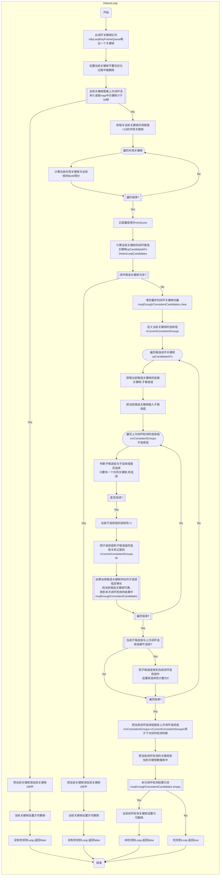

# ORB-SLAM2线程

子候选组：候选关键帧中，每个候选关键帧及其相连的关键帧构成一个子候选组
连续：不同组之间有相同关键帧，则两个组称为连续
连续性（consistency)：连续的长度，连续组链的长度
连续组：mvconsistentGroups存储了上次执行回环检测时，新的被检测出来具有连续性的多个组的集合。
子连续组：连续组的其中一个

## 闭环检测的策略 DetectLoop

1.  从闭环关键帧队列中取出关键帧
2.  闭环关键帧距离上次闭环至少过去了10个关键帧
3.  取出与此闭环关键帧**相连的所有关键帧**（>15个共视地图点），计算与此闭环关键帧的BoW得分，并得到最低得分minScore。
4.  找到与此闭环关键帧有相同BoW word，且与其不共视的关键帧，这些关键帧作为此闭环关键帧的**共word关键帧**。
5.  计算一级候选关键帧与此闭环关键帧的最大公共word数量，乘以0.8后得到最小公共word数量minCommonWords，当做阈值。
6.  从一级候选关键帧中选出公共单词数量大于minCommonWords，并且BoW单词相似度大于minScore的关键帧作为**精挑共word关键帧**
7.  遍历每个**精挑共word关键帧**，找到与其共视程度最高的10个关键帧作为一组，假设一共有M组。计算每一组中关键帧（必须在共word关键帧中）与闭环关键帧的BoW得分，记录每一组的总得分和得分最高的关键帧，共有M条数据。
8.  把最高得分×0.75作为阈值，把每个超过这个阈值的组中，分数最高的关键帧作为**一级候选关键帧**。
9.  把每个**一级候选关键帧**及其相连的关键帧作为**子候选组**.
10. 每一个**子候选组**与上一次闭环检测中的每一个**子连续组**进行比较是否**相连**，把**子连续组**放到本次闭环检测的**连续组**中，如果有足够多个**子连续组**与**子候选组**相连，则这个**一级候选关键帧**可以作为**闭环关键帧**

**关键点**:
在一次闭环检测中，不能只通过一个新的关键帧与旧关键帧形成环，就认为闭环检测成功。而是需要多个新关键帧的一级候选关键帧形成某种联系，才能确定形成闭环。
比如新关键帧KF1的找到的一级候选关键帧为cKF1s，此时不能确认闭环，把cKF1s的共视关键帧组作为连续组cKF1\_groups。第二个关键帧KF2找到的一级候选关键帧为cKF2s，比较cKF2s的子候选组与cKF1\_groups的子连续组有没有相同的关键帧，只要有一个相同关键帧，就说明连续，连续性+1。当某一个候选关键帧对应的子候选组的连续性大于等于3，则这个候选关键帧足够好，放到当前关键帧的闭环候选帧中。最后用当前关键帧和其闭环候选帧进行闭环优化。
从第二个关键帧KF2开始，其连续组是由其子候选组中与KF1的连续组有连续关系的那些组成的。

### 流程图

```mermaid
flowchart TB
    subgraph DetectLoop:DetectLoopCandidates
    direction TB
    0(开始)-->
    1[取出与当前关键帧相连<大于15个共视地图点>的所有关键帧spConnectedKeyFrames]-->
    2([遍历当前关键帧的word])
    3[[遍历结束?]]
    2-->4
    4([遍历包含该word的所有关键帧])
    5[[遍历结束?]]
    4-->6
    6[[该帧的mnLoopQuery!=当前关键帧的id?]]
    6-->|Yes|7
    6-->|No|11
    7[该帧的mnLooPWords=0]-->
    8[[该帧不在spConnectedKeyFrames中?\n即与当前关键帧不共视]]
    8-->|Yes|9
    9[该帧的mnLoopQuery设为当前关键帧id]-->
    10[把该帧放到共word关键帧组lKFsSharingWords中]-->
    11[该帧的mnLoopWords+1]-->5
    5-->|No|4
    5-->|Yes|3
    3-->|No|2
    3-->|Yes|12
    12[[共word关键帧组lKFsSharingWords为空?]]
    12-->|Yes|30
    12-->|No|13
    13([遍历共word关键帧组lKFsSharingWords\n得到最大公共单词数])-->
    14[最大公共单词数的0.8倍作为最小公共单词数minCommonWords]-->
    15([遍历共word关键帧组lKFSharingWords\n挑出公共单词数大于minCommonWords并且BoW得分大于等于minScore的关键帧\n放到lScoreAndMatch])-->
    16[[lScoreAndMatch为空?]]
    16-->|Yes|30
    16-->|No|17
    17([遍历lScoreAndMatch:精挑共word关键帧])
    18[[遍历结束?]]
    17-->19
    19[取出10个与该帧共视程度最高的关键帧vpNeighs作为一组]-->
    20([遍历vpNeighs])
    21[[遍历结束?]]
    20-->22
    22[[该共视帧在当前闭环关键帧的共word关键帧中,且共word数大于minCommonWords\npKF2->mnLoopQuery==pKF->mnId && pKF2->mnLoopWords>minCommonWords?]]
    22-->|No|21
    22-->|Yes|23
    23[该组累计得分加上该帧BoW得分mLoopScore]-->
    24[记录该组BoW分数最高的关键帧]-->21
    21-->|No|20
    21-->|Yes|25
    25[把该精挑共word关键帧的共视组的总得分和最好关键帧保存到lAccScoreAndMatch中]-->
    26[记录最高的总得分bestAccScore]-->18
    18-->|No|17
    18-->|Yes|27
    27[创建闭环候选关键帧向量vpLoopCandidates]-->
    28([遍历lAccScoreAndMatch,\n把其中组得分大于0.75倍bestAccScore的关键帧\n作为闭环候选关键帧放到vpLoopCandidates])-->
    29[找到闭环候选关键帧vpLoopCandidates,并返回]
    30[返回空向量]
    31(结束)
    29 & 30 --> 31
    end

```

