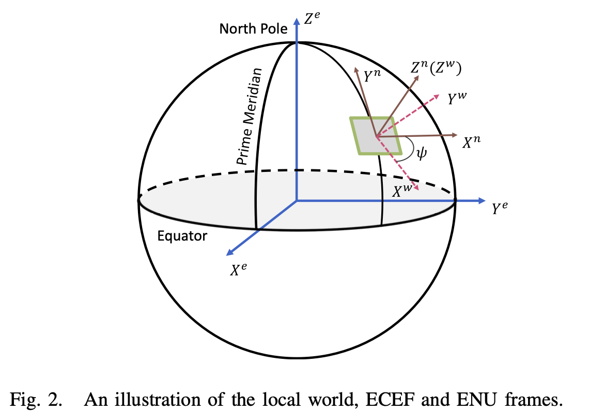

# GVINS：Tightly Coupled GNSS-Visual-Inertial Fusion for Smooth and Consistent State Estimation

本地论文：/Users/hanfuyong/Documents/papers/slam/GVINS.pdf
本地代码：/Users/hanfuyong/workspace/slam/GVINS
作者团队：港科大 沈邵劼组

## 读论文方法

### 论文的组成部分

1.  标题
2.  摘要
3.  介绍
4.  方法
5.  实验
6.  结论

### 第一遍：海选

标题+摘要+结论：通过这三部分，了解论文讲的是什么，与自己的相关性，了解一下论文中的图表，大致了解一下论文的方法、效果。决定是否是自己需要的论文。

### 第二遍：精选

按照论文的结构通读论文，不用太注意细节（公式、证明、很细节的部分等等），但是要知道每一个重要的图、表是在干什么：比如方法的流程图、实验的横纵坐标的含义、与其他方法的对比的方法和差距。这一遍之后，对论文的各个部分都有了一定的了解。可
以圈出一些相关的文献，比如某个方法是哪篇论文提出的，在哪篇论文的基础上改进的。决定是否需要精读，或者只需要了解大概用了什么方法，得到了什么效果等等。

### 第三遍：精读

精读：需要每一段是在干什么、每句话在做什么，需要想想如何实现文章的方法，实验是如何设计的，是否有改进的地方。

### 带着十个问题读论文

1.  论文试图解决什么问题？
2.  这是否是一个新问题
3.  这篇文章要验证一个什么科学假设
4.  有哪些相关研究院？如何归类？谁是这一课题在领域内值得关注的研究员？
5.  论文中提到的解决方案的关键是什么？
6.  论文中的实验是如何设计的？
7.  用于定量评估的数据集是什么？代码有没有开源？
8.  论文中的实验及结果有没有很好的支持需要验证的科学假设？
9.  这篇论文到底有什么贡献？
10. 下一步具体有什么工作可以深入？

### 论文的标记方法

**红色**：待解决的问题（当前行业待解决的问题、参考方法的待解决问题等）
**绿色**：本论文针对问题提出的方法
**黄色**：一般重要信息

* * *

## 论文十问

#### 1. 论文试图解决的问题

1.  试图解决VIO在长时间运行中，出现的漂移问题
2.  复杂的室内外环境下，GNSS信号间歇或完全中断的情况下的状态估计问题

#### 2. 是否为新问题

这不是新问题，这是VIO或GNSS通常会面临的问题

#### 3. 这篇文章要验证一个什么科学假设

基于紧耦合的GNSS+visual+inertial的非线性优化方法可以很大程度的解决上面的问题

#### 4. 有哪些相关研究院？如何归类？谁是这一课题在领域内值得关注的研究员？

。。。

#### 5. 论文中提到的解决方案的关键是什么？

## 2\. 论文通读

### 2.1 为什么用VIO+GNSS

1.  visual + inerial的配置的缺点：只能处理局部坐标系，而且有四个自由度不可观：x、y、z、yaw，所以在这四个自由度上容易产生漂移；
2.  GNSS的优点：
    1.  信号可以自由获取
    2.  只要能同时跟踪到4颗卫星，就可以获得全局地理坐标系下的唯一坐标

### 2.2 融合VIO和GNSS面临的挑战：

1.  从带噪声的GNSS测量值进行稳定的初始化不可或缺。
    VIO和GNSS两个系统的4-DOF的变换关系至关重要，目的是把局部和全局系统联系起来。不能使用类似相机和IMU的离线外参标定的方式，因为每次VIO系统启动时，这个变换关系都会变化。另外，只用一部分数据进行的一次对齐的效果不会很好，原因在GNSS中断时，带漂移的融合系统当的对齐是无效的。
    所以需要一个在线的初始化和标定系统来融合各种测量，以及处理复杂的室内外情况。
2.  GNSS和VIO系统的精度不匹配，GNSS信号传播中会存在各种各样的误差源。
    GNSS是能达到米级的精度，而VIO系统在短的时间段内，可以实现厘米级精度，所以，如果没有仔细的公式化，融合系统容易收到GNSS误差的影响。
3.  融合系统如何处理退化的场景
    1.  纯旋转的情况
    2.  卫星数量不满足
    3.  室内到室外场景的转换，卫星从全部无法获得到一个个重新获得，这个变化过程，系统应该如何实现。

#### 2.2.1上面三个问题的解决思路：

1.  局部坐标系到全局坐标系的4-DOF的转换首先在初始化过程中通过coarse-to-fine的方法计算，然后在后面的过程中优化
2.  GNSS原始数据的噪声问题：GNSS提供的约束通过概率因子图进行公式化，把所有状态统一优化
3.  对退化场景进行了讨论，并进行了仔细的处理

### 2.3 本文的贡献

1.  在线的coarse-to-fine的方法，来初始化GNSS-visual-inertial状态
2.  在概率论的框架下，通过基于优化和紧耦合的方法来融合VIO数据和GNSS数据
3.  复杂环境下的实时、drift-free 6-DoF的全局估计
4.  对本文方法在虚拟场景和真实场景的评估方法。

### 2.4 坐标系定义

1.  传感器坐标系Sensor Frame
    固连在传感器上的坐标系，包括相机坐标系$(·)^c$、IMU坐标系$(·)^i$。
    其中IMU坐标系作为Body坐标系$(·)^b$
2.  局部世界坐标系Local World Frame
    VIO系统运行在局部世界坐标系中，一般其原点是任意的，Z轴与重力方向对齐
3.  ECEF Frame（Earth-Centered, Earth-Fixed）
    以地心为原点，与地球固连的坐标系$(·)^e$
    x-y平面是地球赤道面，X轴指向本初子午线，Z轴与赤道面垂直指向地理北极，Y轴参考右手坐标系。本文使用WGS84规则
4.  ENU Frame：半全局坐标系
    X、Y、Z轴分别指向东、北、上。给定ECEF中的一个坐标，可以确定一个原点在此处的ENU坐标系。**注意：Z轴是与重力方向对齐的**
5.  ECI Frame（Earth-Centered Inertial (ECI) frame）
    地心为原点的惯性坐标系，三个轴指向以恒星为参考的固定方向。GNSS的信号在ECI中以直线传播，可以简化公式。本文中，当GNSS传播信号时，固定此刻的ECEF坐标系作为ECI坐标系。
	
### 2.5 符号
* $\pmb R_a^z、\pmb p_a^z$ 表示从坐标系a到坐标系z的转换关系。
* $\pmb q_a^z$ 是Hamilton方式的四元数。
* $\pmb R_{a_t}^z$ 表示时刻t时的运动坐标系a到坐标系z的旋转
* $\pmb g^w$ 表示局部世界坐标系下重力向量
* $c$ 表示光在真空中的速度
* $\omega_E$ 表示地球旋转角速度

### 2.6 待估计状态量
* 局部世界坐标系下，刚体坐标系的位置和方向：$\pmb p_b^w、\pmb q_b^w$
* 速度、加速度计偏置、陀螺仪偏置：$\pmb v_b^w、\pmb b_a、\pmb b_w$
* 特征点的逆深度：$\rho$
* 局部世界坐标系和ENU坐标系的yaw offset：$\psi$
接收器的时钟偏差和漂移：$\delta \pmb t、\delta \dot t$
本文支持全部四种定位系统：GPS、GLONASS、Galileo、BeiDou，所以需要分别估计时钟偏差。四种定位系统的时钟漂移是相同的。
* 本文采用滑窗来对状态进行优化，窗口内的状态$X$
$X = [\pmb x_0, \pmb x_1, ... \pmb x_n, \rho_0, \rho_1, ... \rho_m, \psi]$
$\pmb x_k = [\pmb p_{b_{t_k}}^w, \pmb v_{b_{t_k}}^w, \pmb q_{b_{t_k}}^w, \pmb b_a, \pmb b_w, \delta \pmb t, \delta \dot t], k \in [0, n]$
$\delta \pmb t = [\delta t_G, \delta t_R, \delta t_E, \delta t_C]$
其中， n是滑窗大小，m是滑窗内特征点的数量。$\delta \pmb t$的四个元素分别对应GPS、GLONASS、Galileo、BeiDou中的时钟偏置。