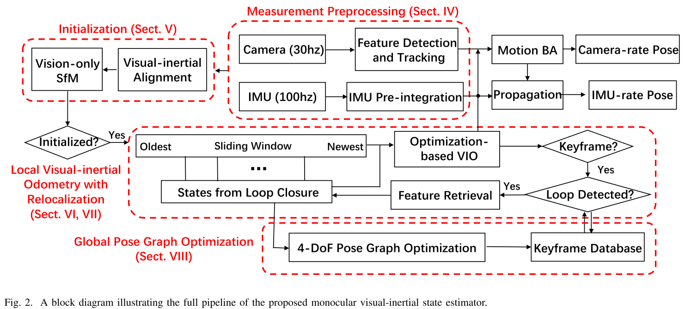

# 摘要
一个camer和一个IMU构成最小的配置，用来估计6自由度的状态。但是由于缺少直接的距离度量，对IMU的处理、估计的初始化、外参标定、非线性优化提出了新的挑战。
本文的工作包括：
1. 鲁邦的初始化和失败恢复
2. 通过融合IMU预积分和特征观测的紧耦合、非线性优化方法获得高精度视觉惯导里程计
3. 与紧耦合公式相结合的回环检测模块
4. 死自由度的姿态图优化，保证全局一致性。
# introduction
Monocular VINS需要解决的问题：
1. 加速度计需要需要随机运动来激励，从而观测尺度信息
2. visual-inertial系统是高度非线性的，所以estimator的初始化是重要的挑战
3. camera和IMU的标定
4. 在一个可接受的滑窗内消除long-term drift，需要包括visual-inertial odometry, loop detection, relocalization, global optimization的完整系统。
本文的解決方法的核心是基于紧耦合滑动窗口非线性优化方法的单目视觉惯导里程计。VIO会计算1）local pose，2）重力和方向估计，3）camera-IMU外参标定，4）IMU biases校正。
## **本文主要贡献**
1. 鲁邦的初始化流程，可以从未知的初始状态进行启动
2. 基于紧耦合和最优化的单目视觉里程计，包括camera-IMU外参标定和IMU bias估计
3. 在线回环检测和紧耦合的重定位
4. 4自由度的全局位姿图优化
# 系统流程
1. 测量数据的预处理：特征提取跟踪、相邻两帧图像之间的IMU数据的预积分
2. 初始化过程：会计算出所有必须的values：pose、velocity、gravity vector、gyroscope bias、3D feature location，用来启动后续的非线性优化VIO
3. 带重定位功能的VIO融合1）预积分后的IMU测量、2）特征观测和3）在回环中重新检测特征
4. 位姿图优化验证重定位结果，并执行全局优化，消除drift
5. VIO、重定位、位姿图优化为三个线程
## 测量预处理
### 前端视觉处理
1. 特征提取和跟踪：提取的特征是good feature to track，跟踪用KLT光流法。
2. 每张图会确保有100~300个特征点，通过设置两特征间隔的最小像素数，保证特征的均匀分布。
3. RANSAC提出离群点
4. 关键帧选择的标准：1）与上个关键帧的视差大于设定的阈值，认为是关键帧；2）跟踪质量，如果跟踪的特征小于阈值，则认为是关键帧
### IMU预积分
6. 